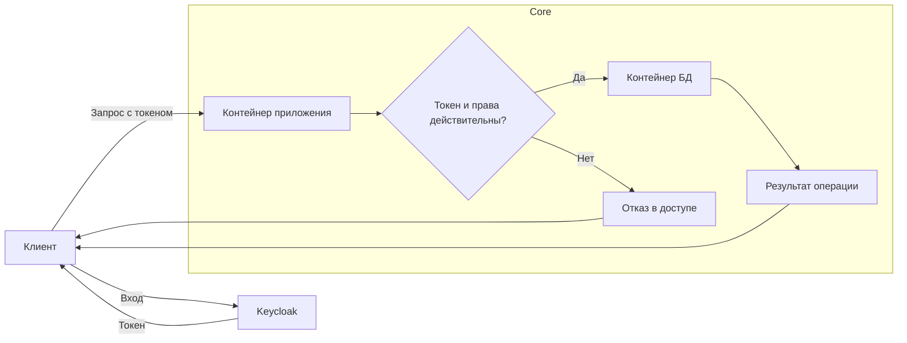
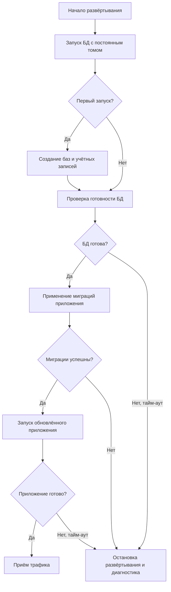
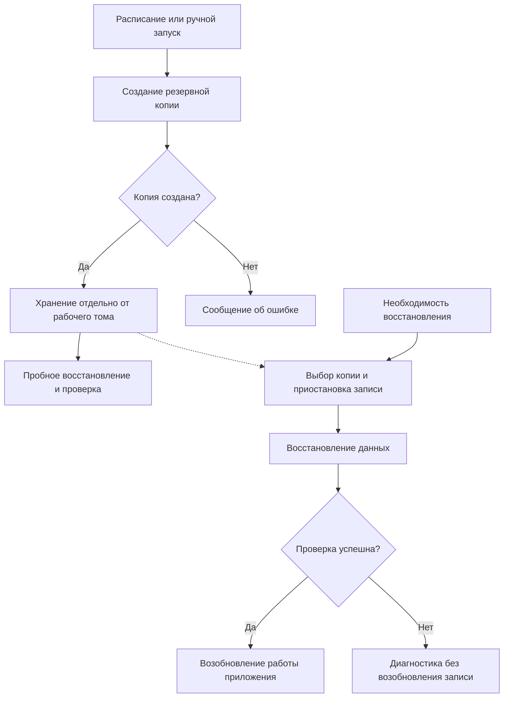

# Core

## Общее описание

Core — пара контейнеров: приложение и его база данных. Приложение обрабатывает запросы и работает с БД, которая обеспечивает постоянное хранение данных. Прикладная логика определяется командами подсистем; здесь описываются требования к запуску и сопровождению этой пары.

Для входа пользователей приложение интегрируется с [Keycloak](../keycloak/README.md), а [Infra](../infra/README.md) обеспечивает сборку, доставку и развёртывание. Keycloak, S3 и Kafka являются отдельными инфраструктурными компонентами и не входят в пару контейнеров Core.

Стек приложения, СУБД и состав прикладных API определяются отдельно.

## Функциональные требования

- Запускать приложение и БД в отдельных контейнерах с настроенным соединением между ними.
- Обрабатывать запросы приложения с проверкой токенов Keycloak и прав на действия и объекты.
- Хранить и изменять данные, применять миграции и разграничивать доступ к БД.
- Создавать резервные копии и восстанавливать данные из них.

## Нефункциональные требования

- Данные БД должны сохраняться при перезапуске и пересоздании контейнеров.
- Изменения должны сохранять целостность данных; связанные операции должны выполняться в транзакциях.
- Доступ должен предоставляться с минимально необходимыми правами, секреты не должны храниться в репозитории.
- Запуск пары должен быть воспроизводимым; готовность приложения и БД, а также ошибки должны быть доступны для диагностики.

Целевые показатели производительности, допустимой потери данных и времени восстановления согласуются после уточнения нагрузки и требований к стенду.

## Ключевые возможности

- Совместный запуск приложения и его хранилища данных.
- Интеграция приложения с общей системой входа и проверки прав.
- Управляемое обновление структуры данных вместе с версией приложения.
- Восстановление после сбоев с помощью резервных копий.

## Основные процессы

### Обработка запроса

Клиент получает токен через Keycloak и обращается к приложению Core. Приложение проверяет токен и права пользователя. Разрешённый запрос выполняет прикладную операцию с БД и возвращает результат; при недействительном токене или недостаточных правах доступ отклоняется.

### Развёртывание и обновление

Infra запускает БД с подключённым постоянным хранилищем. При первом запуске выполняется первоначальная настройка базы и учётных записей. После проверки готовности БД применяются миграции, подготовленные командой приложения. Успешное завершение миграций разрешает запуск обновлённого приложения. Трафик поступает после проверки его готовности; ошибка останавливает дальнейшее развёртывание и требует разбора.

### Резервное копирование и восстановление

По расписанию или вручную создаётся согласованная резервная копия. Она сохраняется отдельно от рабочего тома БД; результат копирования проверяется, возможность восстановления регулярно проверяется пробным восстановлением. При сбое команда инфраструктуры выбирает подходящую копию, приостанавливает запись и восстанавливает данные. Приложение возобновляет работу после проверки результата. Данные, появившиеся после выбранной копии, могут быть потеряны.

