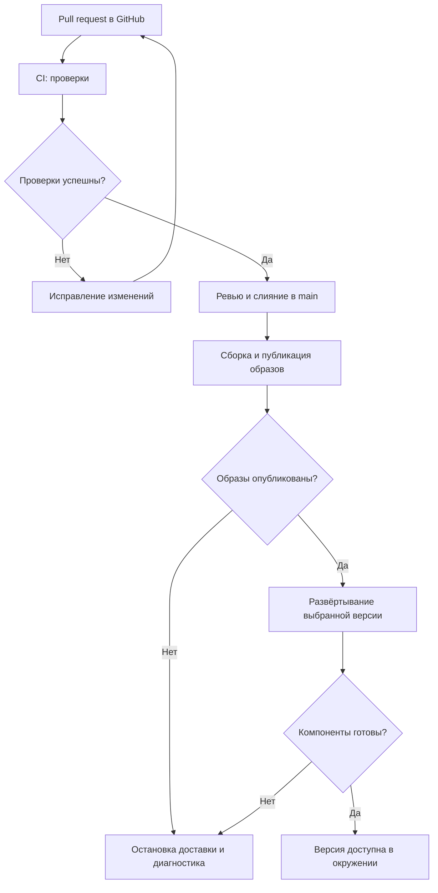
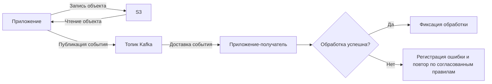

# Infra

## Общее описание

Infra — блок DevOps и архитектуры развёртывания проекта. Он охватывает GitHub, CI/CD, Kubernetes, S3 и Kafka и обеспечивает доставку и эксплуатацию [Core](../core/README.md) и [Keycloak](../keycloak/README.md).

GitHub хранит исходный код и конфигурацию; GitHub Actions выполняет проверки, сборку образов и развёртывание. Kubernetes управляет запуском компонентов и их ресурсами. S3 используется для объектного хранения, Kafka — для обмена событиями между приложениями. Команда инфраструктуры определяет связи компонентов, сети, доступы и порядок обновления системы.

Docker Compose сохраняется для совместного запуска компонентов, локальной разработки и развёртывания стенда. Конфигурация Kubernetes будет описывать развёртывание в кластере. Соответствие окружений этим способам запуска, реализация S3, размещение Kafka и реестр образов определяются отдельно.

## Функциональные требования

- Хранить конфигурацию в GitHub и проводить изменения через pull request.
- Выполнять проверки, собирать версионированные образы и развёртывать согласованную версию компонентов через CI/CD.
- Настраивать запуск, сеть, постоянные хранилища и проверки готовности компонентов в Kubernetes.
- Предоставлять приложениям доступ к S3 и Kafka с разграничением прав на объекты и топики.
- Поддерживать диагностику сбоев, восстановление данных и возврат к совместимой версии приложения.

## Нефункциональные требования

- Развёртывание должно быть воспроизводимым и связано с конкретным коммитом и версиями образов.
- Секреты должны передаваться отдельно от исходного кода; доступ к инфраструктуре предоставляется по принципу минимальных прав.
- Перезапуск компонентов не должен приводить к потере постоянных данных; восстановление должно проверяться на практике.
- Ошибки сборки, развёртывания, хранения и доставки событий должны быть доступны для диагностики.

Целевые доступность, нагрузка, сроки хранения объектов и событий, допустимая потеря данных и время восстановления согласуются отдельно.

## Ключевые возможности

- Единый процесс доставки изменений от pull request до работающего окружения.
- Управление контейнерами, сетями и хранилищами через конфигурацию.
- Общие сервисы объектного хранения и обмена событиями.
- Описание архитектуры и границ ответственности компонентов.

## Основные процессы

### Доставка изменений

Команда открывает pull request в GitHub. CI выполняет согласованные проверки; после их прохождения и принятия PR изменения попадают в основную ветку. Процесс доставки собирает и публикует образы, затем развёртывает выбранную версию в целевом окружении. Для Kubernetes обновляются ресурсы кластера, для Compose применяется общая конфигурация стенда. Миграции и запуск Core выполняются в порядке, описанном в его README. Развёртывание считается успешным после проверки готовности компонентов; при ошибке дальнейшие шаги останавливаются. Возврат к предыдущему образу допускается только при совместимости с текущей схемой данных.

### Хранение объектов и обмен событиями

Приложение обращается к S3 для записи или чтения объектов с предоставленными ему правами. Для асинхронного взаимодействия приложение публикует событие в согласованный топик Kafka, а приложение-получатель обрабатывает его и фиксирует успешное завершение. Получатель должен учитывать повторную доставку, чтобы повторное событие не приводило к повторному нежелательному действию. Состав объектов, форматы событий, правила повторных попыток и сроки хранения согласуются с командами приложений.

## Расположение конфигурации

- `/.github/workflows/` — CI/CD в GitHub Actions.
- `/compose.yaml` и `/compose.dev.yaml` — общий запуск и дополнения для разработки.
- `/.env.example` — образец переменных окружения без секретов.
- `/infra/` — конфигурация Kubernetes, S3, Kafka и описание архитектуры по мере реализации.

Сейчас в репозитории находятся описания и заготовки Compose и workflows. Конфигурация работающих сервисов и кластера ещё не добавлена.
