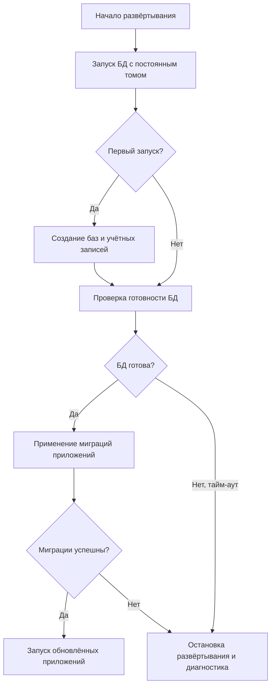
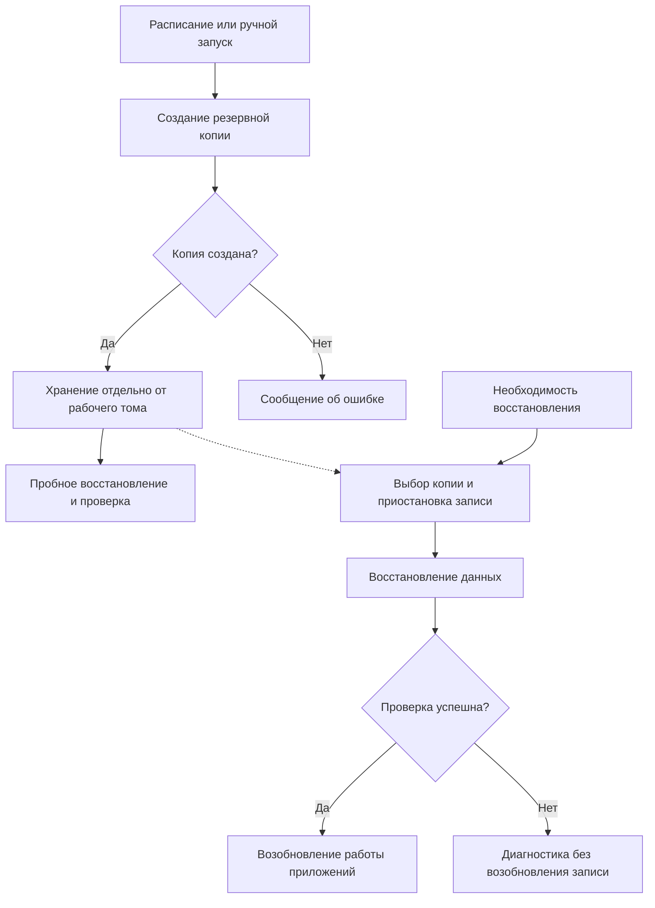

# Базы данных

## Общее описание

Подсистема баз данных обеспечивает постоянное хранение и доступ к данным трекера задач, планирования, справочников и отчётности. Команда инфраструктуры отвечает за развёртывание, доступность БД, управление доступом и восстановление данных. Команды приложений определяют структуру своих данных и подготавливают миграции.

Конкретная СУБД и схема разделения данных между подсистемами определяются отдельно.

## Функциональные требования

- Хранить данные подсистем и обеспечивать их чтение и изменение через подключения приложений.
- Создавать базы данных и служебные учётные записи, разграничивать права доступа.
- Поддерживать применение миграций при развёртывании приложений.
- Создавать резервные копии и восстанавливать данные из них.

## Нефункциональные требования

- Данные должны сохраняться при перезапуске и пересоздании контейнеров.
- Изменения должны сохранять целостность данных; связанные операции должны выполняться в транзакциях.
- Доступ должен предоставляться с минимально необходимыми правами, секреты не должны храниться в репозитории.
- Развёртывание через Docker Compose должно быть воспроизводимым, состояние БД и ошибки — доступными для диагностики.

Целевые показатели производительности, допустимой потери данных и времени восстановления согласуются после уточнения нагрузки и требований к стенду.

## Ключевые возможности

- Единый порядок подключения приложений к хранилищам данных.
- Управляемое обновление структуры данных вместе с версиями приложений.
- Восстановление после сбоев с помощью резервных копий.

## Основные процессы

### Развёртывание и обновление

Процесс развёртывания запускает БД через Docker Compose с подключённым постоянным томом. При первом запуске выполняется первоначальная настройка баз и учётных записей. После проверки готовности БД применяются миграции соответствующих приложений. Успешное завершение миграций разрешает запуск обновлённых приложений; ошибка останавливает дальнейшее развёртывание и требует разбора.

### Резервное копирование и восстановление

По расписанию или вручную создаётся согласованная резервная копия. Она сохраняется отдельно от рабочего тома БД; результат копирования проверяется, возможность восстановления регулярно проверяется пробным восстановлением. При сбое команда инфраструктуры выбирает подходящую копию, приостанавливает запись и восстанавливает данные. Приложения возобновляют работу после проверки результата. Данные, появившиеся после выбранной копии, могут быть потеряны.

