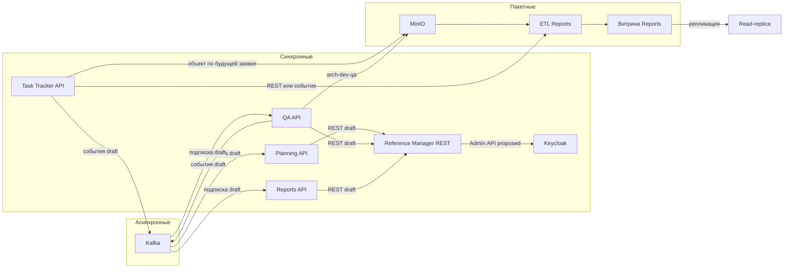

# 146. Логическая схема связей

Сплошная готовность на схеме не показана: рёбра с подписью draft не являются проверенной связью модулей. Эталонные Web API, Kafka, S3 и ETL проверяют механизм на своих ресурсах, а не эти рёбра.
