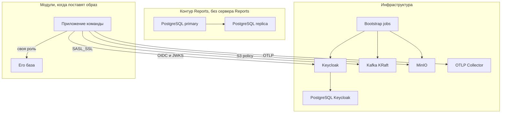

# 150. Компоненты

Диаграмма показывает ответственность и интерфейсы. Это не полная декомпозиция C4 Container каждого модуля: внутренние компоненты команд остаются в их документах.

| Компонент | Интерфейс | Не делает |
| --- | --- | --- |
| Keycloak | OIDC, JWKS, Admin REST | не хранит кадровый профиль |
| Kafka | топики и ACL | не владеет бизнес-схемой |
| MinIO | S3 API | не рассылает события сам |
| Collector | OTLP gRPC и HTTP | не архив |
| Replica | SQL только чтение | не источник данных Task Tracker |
| Шаблон app+db | env, миграция, readiness | не общий backend |
