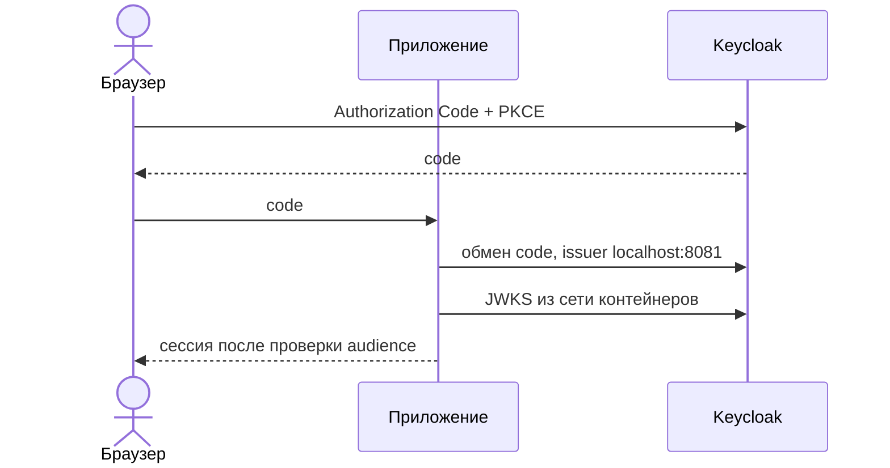
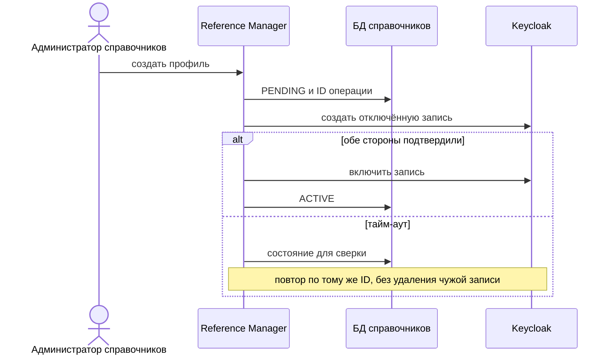
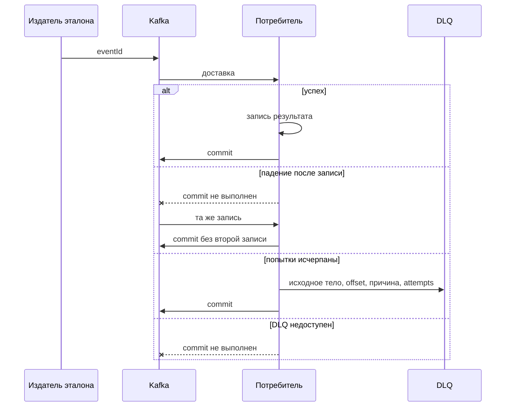
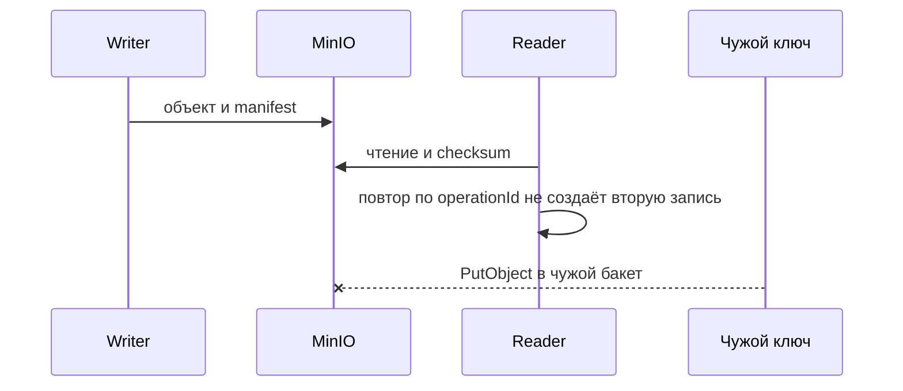
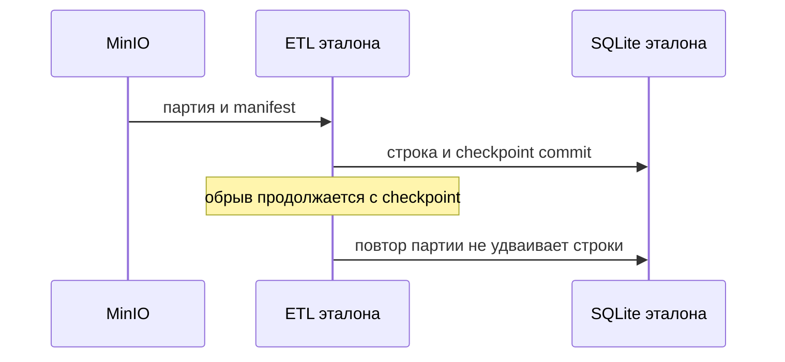

# 155. Диаграммы последовательностей

Участники с подписью «ещё нет» в репозитории не поставлены. Эталон показывает механизм на инфраструктурных ресурсах.

## Вход

Проверено эталоном: service account с чужим audience получает 401. Браузерный вход Task Tracker на общем стенде остаётся проверкой команды.

## Приём сотрудника

Координация на стороне Reference Manager. Инфраструктура даёт API. Сквозной сценарий не `verified`, пока нет их обработчика. Временный пароль не отправляется: вопрос 18 открыт.

## Событие и DLQ

Это проверенный эталон, не бизнес-подписка Planning.

## S3

## ETL и отчёт

Сервер отчётов и задержка доставки из Task Tracker в витрину здесь не показаны как выполненные: витрина содержит только демонстрационные идентификаторы, реплика PostgreSQL измеряется отдельно от лага источников.
