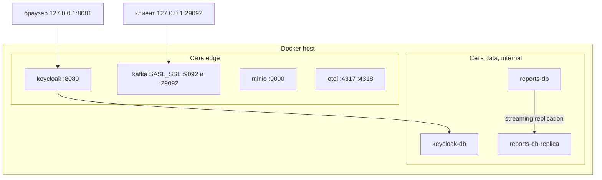
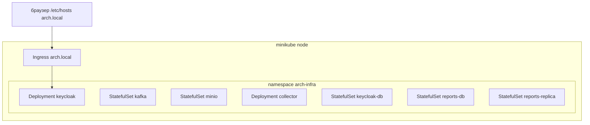

# 165. Развёртывание

Две схемы. Compose — то, что запускается локально. minikube — те же роли в манифестах; фактический кластер на этой машине не поднимался.

## Compose

| Сервис | Том | Публикация в compose.dev |
| --- | --- | --- |
| keycloak-db | `keycloak-db` | нет |
| keycloak | — | `127.0.0.1:8081` |
| kafka | `kafka-data`, сертификаты | `127.0.0.1:29092` |
| minio | `minio-data` | `127.0.0.1:9000` и `:9001` |
| otel-collector | `otel-data` | `127.0.0.1:4317` и `:4318` |
| reports-db | `reports-db` | нет |
| reports-db-replica | `reports-replica` | `127.0.0.1:5435` |

Локальные отличия от описания общего стенда: Keycloak `start-dev` и HTTP; realm `sslRequired=none`; сертификат Kafka самоподписанный и живёт в томе; контроллер Kafka — PLAINTEXT внутри сети. Общий стенд должен сменить это на `start`, внешний TLS и выданный сертификат. Пока площадки нет, подмена не сделана.

## minikube

Манифесты: `infra/k8s/base` и overlay `infra/k8s/overlays/minikube`. Секреты в Git не лежат: overlay ждёт Secret, который создаёт `infra/scripts/minikube-up.sh` из локального `.env`. PVC не удаляются обычным rerun. Удаление кластера — отдельная команда в runbook.

Порядок: том и StatefulSet хранилищ, затем Keycloak, Kafka, MinIO, коллектор, затем Job bootstrap, затем приложения команд по мере поставки. Два Job миграции одного модуля не должны идти параллельно; в шаблоне это один Job.
