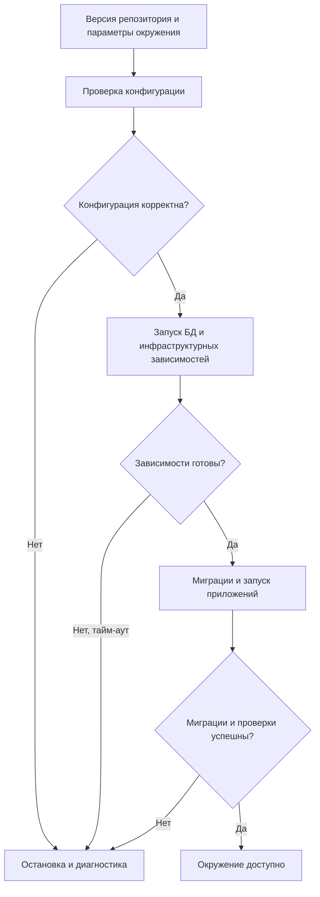
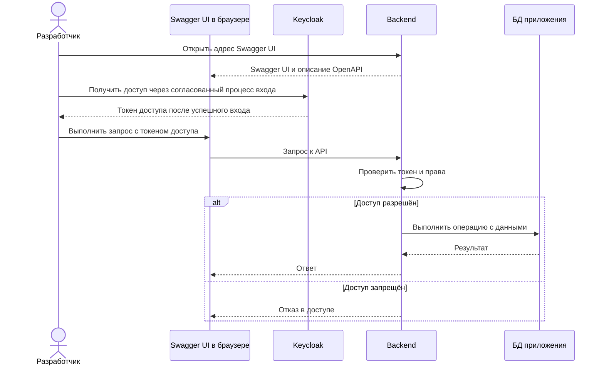
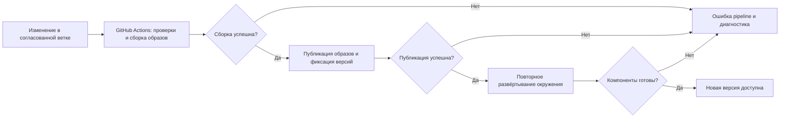
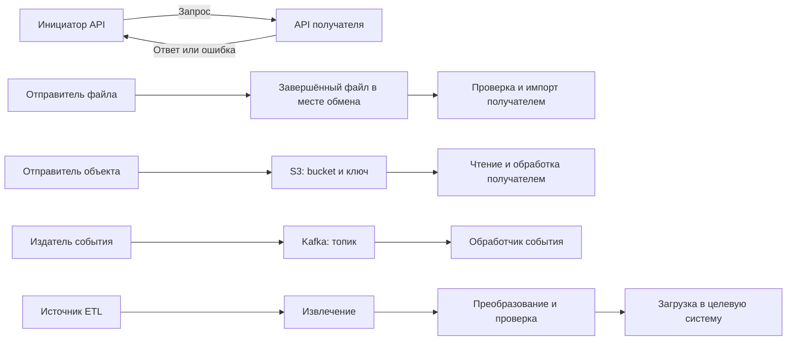

# Vision инфраструктуры системы управления проектами

Статус: черновик на согласование. Документ описывает целевую систему; наличие требования не означает, что оно уже реализовано.

## 1. Краткое описание и назначение

Инфраструктура обеспечивает общий способ запуска, обновления и взаимодействия подсистем управления проектами: трекера задач, планирования, справочников и отчётности. Команды приложений получают окружение, в котором можно развернуть свои сервисы, подключить вход через Keycloak, хранение данных и обмен с другими подсистемами.

Первая версия предназначена для локальной разработки и демонстрации на общем стенде. Основной способ совместного запуска — Docker Compose; дополнительно требуется упрощённая конфигурация Kubernetes. Цель — воспроизводимый запуск и проверяемая доставка изменений, а также демонстрация пяти способов интеграции.

Инфраструктура отвечает за упаковку и развёртывание, конфигурацию окружений, CI/CD, подключение хранилищ и транспорта сообщений. Команды приложений отвечают за бизнес-логику, схемы своих данных, миграции, API и обработчики интеграций. Передача данных между подсистемами должна соответствовать согласованным контрактам.

## 2. Состав и ключевые возможности

| Блок | Назначение и возможности |
| --- | --- |
| Keycloak | Отдельный контейнер провайдера идентификации: единый вход, пользователи, роли и выдача токенов. Проверка прав на конкретные действия и объекты выполняется приложениями. |
| Core | Два контейнера: backend-приложение и БД. Backend предоставляет API, описание OpenAPI и Swagger UI для просмотра и вызова методов. Отдельный frontend-контейнер не требуется. |
| Infra | Dockerfile и Compose-конфигурация, упрощённое развёртывание Kubernetes, CI/CD в GitHub Actions, версии образов и конфигурации, S3, Kafka и инфраструктура интеграций. |

Ключевые возможности:

- запуск приложений и инфраструктурных зависимостей из конфигурации репозитория;
- централизованный вход через Keycloak;
- просмотр документации API и выполнение запросов через Swagger UI, предоставляемый backend;
- автоматическая пересборка и повторное развёртывание после согласованного изменения кода;
- определение точных версий запущенных образов и применённой конфигурации;
- взаимодействие через API, обмен файлами, S3, Kafka и ETL;
- сохранение данных при пересоздании контейнеров и восстановление из резервных копий.

Исходный код и конфигурация всех подсистем хранятся в одном монорепозитории GitHub. Для CI/CD используется GitHub Actions; workflows хранятся в `.github/workflows/` и запускаются по событиям репозитория. Место размещения стенда и способ доступа к нему из GitHub Actions согласуются отдельно.

## 3. Ключевые процессы

### 3.1. Развёртывание окружения

Разработчик или DevOps получает согласованную версию репозитория, задаёт параметры окружения и секреты, проверяет конфигурацию. Затем запускаются БД, Keycloak и необходимые интеграционные сервисы. После готовности БД выполняются миграции приложения и запускается backend со Swagger UI. Окружение готово к работе после успешных проверок компонентов; Swagger UI и описание OpenAPI доступны по документированным адресам. Ошибка прекращает дальнейшие шаги и сохраняется в журнале.

Для локального запуска и Compose-стенда используется Compose. Для Kubernetes предоставляется отдельный упрощённый набор ресурсов с теми же версиями приложений и назначением настроек. Состав первой демонстрации в Kubernetes определяется при согласовании объёма.

### 3.2. Просмотр API и выполнение запроса через Swagger UI

Разработчик открывает Swagger UI, который отдаётся backend-приложением, и просматривает методы API из описания OpenAPI. Для вызова защищённого метода он получает токен доступа через Keycloak и использует его при отправке запроса из Swagger UI. Backend проверяет подлинность токена, срок действия, издателя и получателя, затем права на операцию и объект. Только после успешной проверки выполняется операция. Swagger UI показывает ответ или ошибку; серверные секреты в браузер не передаются. Способ получения токена и его передачи в Swagger UI описывается при настройке интеграции с Keycloak.

Собственный пользовательский frontend в объём инфраструктуры не входит. Это ограничение не относится к интерфейсам, которые разрабатывают команды прикладных подсистем.

### 3.3. Обновление через GitHub Actions

Изменения проходят ревью и попадают в согласованную ветку. Событие репозитория запускает workflow GitHub Actions: проверки, сборку Docker-образов, публикацию и развёртывание выбранной версии. Workflow записывает коммит исходного кода, версии образов и конфигурации. Неуспешная сборка не запускает развёртывание; неуспешное обновление не помечается как успешное. Возврат к предыдущей версии приложения допускается после проверки её совместимости с текущей схемой БД.

### 3.4. Интеграционные процессы

Каждый способ обмена должен иметь определённых отправителя, получателя, формат данных и наблюдаемый результат. Примеры бизнес-сценариев согласуются с командами; инфраструктура обеспечивает способ доставки, а приложения — смысл и обработку данных.

| Способ | Процесс |
| --- | --- |
| API | Инициатор отправляет запрос по согласованному контракту. Получатель проверяет доступ и данные, выполняет операцию и возвращает результат либо описанную ошибку. |
| Обмен файлами | Отправитель формирует файл и завершает его передачу в согласованное место обмена. Получатель проверяет формат и полноту, импортирует данные и фиксирует результат или причины отклонения. |
| S3 | Отправитель загружает объект в согласованный bucket. Получатель узнаёт о готовом объекте по согласованному механизму, читает его по ключу и выполняет обработку. |
| Kafka | Отправитель публикует событие в согласованный топик. Получатель обрабатывает событие и фиксирует завершение. Повторная доставка не должна повторно выполнять уже завершённую бизнес-операцию. |
| ETL | Процесс извлекает данные из согласованного источника, преобразует их по правилам и загружает в целевую систему. Для запуска фиксируются объём обработанных данных, ошибки и состояние завершения. |

ETL описывает обработку данных, а API, файлы, S3 и Kafka — способы взаимодействия. ETL может использовать их как источник или канал доставки; это не требует отдельной тяжёлой ETL-платформы.

## 4. Функциональные требования

| ID | Требование |
| --- | --- |
| FR-01 | Разворачивать Keycloak отдельным контейнером и предоставлять приложениям настройки подключения. |
| FR-02 | Предоставлять Dockerfile для backend-приложения Core со Swagger UI; запускать backend и БД в двух отдельных контейнерах. |
| FR-03 | Предоставлять Compose-файлы для совместного запуска приложения, БД и необходимых инфраструктурных компонентов. |
| FR-04 | Предоставлять упрощённую конфигурацию Kubernetes для согласованного демонстрационного состава компонентов. |
| FR-05 | Автоматически запускать проверки, пересборку и повторное развёртывание через GitHub Actions; хранить workflows в `.github/workflows/` монорепозитория. |
| FR-06 | Показывать версии компонентов, ссылки на образы, версии конфигурации и результат последнего развёртывания. |
| FR-07 | Предоставлять инфраструктуру и демонстрационный обмен для каждого из пяти видов интеграций. |
| FR-08 | Поддерживать первоначальную настройку БД, запуск миграций, резервное копирование и восстановление. |
| FR-09 | Предоставлять описание OpenAPI и Swagger UI по документированным адресам для просмотра методов и выполнения запросов, включая защищённые методы с токеном Keycloak. |

## 5. Нефункциональные требования

| ID | Требование и способ проверки |
| --- | --- |
| NFR-01 | Воспроизводимость: одна версия конфигурации и образов запускается по описанному порядку на подготовленном окружении. |
| NFR-02 | Сохранность: данные БД и необходимые настройки сохраняются при пересоздании контейнеров; резервная копия проверяется пробным восстановлением. |
| NFR-03 | Безопасность: секреты отсутствуют в Git и журналах; доступ ограничен необходимыми правами; внешние соединения стенда с учётными данными защищены TLS. |
| NFR-04 | Наблюдаемость: доступны состояние компонентов, результат pipeline и журналы ошибок с идентификатором операции или запуска. |
| NFR-05 | Предсказуемые сбои: ошибочная конфигурация или неготовый компонент не приводят к ложному успешному развёртыванию; ошибки интеграций фиксируются. |
| NFR-06 | Совместимость: конфигурации Docker и Kubernetes используют согласованные версии образов и сохраняют контракты подключений приложений. |

Численные требования к нагрузке, доступности, ресурсам стенда, допустимой потере данных и времени восстановления пока не заданы. Они должны быть согласованы до приёмки работающей инфраструктуры.

## 6. Требования к интеграциям

| ID | Интеграция | Минимальные требования |
| --- | --- | --- |
| INT-01 | API | Контракт OpenAPI: адреса, методы, форматы запросов и ответов, авторизация и ошибки; согласованные тайм-ауты. Контракт доступен через Swagger UI. Для повторяемых операций определить защиту от дублирования изменений. |
| INT-02 | Файлы | Согласованные формат, кодировка, схема, имя и место передачи; признак завершённой передачи; правила повторного импорта и отчёт об отклонённых данных. |
| INT-03 | S3 | Настройки endpoint, bucket и ключей объектов; отдельные права чтения и записи; механизм обнаружения готового объекта, сроки хранения и поведение при повторной обработке. |
| INT-04 | Kafka | Адрес подключения, топики, схема и версия события, идентификатор события; согласованные порядок обработки, повторные попытки и обработка неуспешных сообщений. |
| INT-05 | ETL | Источник и приёмник, правила преобразования, ручной или плановый запуск, правила полной или инкрементальной загрузки, повторный запуск без неконтролируемого дублирования данных. |
| INT-06 | Keycloak | Согласованные протокол входа, клиенты, адреса возврата, роли и параметры проверки токенов; пользовательский вход отделён от служебных учётных данных интеграций. |
| INT-07 | GitHub Actions и окружение | Событие запуска workflow, ветка, доступ к исходникам и реестру образов, параметры целевого окружения, способ доступа к стенду и запись результата развёртывания. |

Для каждой интеграции назначаются владельцы с обеих сторон. Прямое чтение чужой БД, в том числе для ETL, не подразумевается автоматически и требует отдельного согласования владельца данных.

## 7. Версии и конфигурации

Перед демонстрацией должен быть подготовлен перечень: компонент, версия продукта, полный адрес образа с фиксированным тегом или digest, коммит приложения и коммит конфигурации. Использование только `latest` не позволяет однозначно определить демонстрируемую версию.

Перечень охватывает backend со Swagger UI, БД, Keycloak, S3 и Kafka. Отдельно фиксируются версии Docker Engine, Docker Compose и Kubernetes, а также используемых actions и окружения выполнения GitHub Actions. Для Docker и Kubernetes показываются конфигурация запуска, параметры подключений без секретов, постоянные хранилища и проверки готовности.

Сейчас конкретные версии не выбраны: в репозитории есть описания и заготовки Compose и GitHub Actions, но нет реализованных сервисов и конфигурации Kubernetes. Vision задаёт требование к фиксации версий, а не выдаёт заготовки за работающий стенд.

## 8. Открытые решения

1. Место размещения общего стенда и способ доступа к нему из GitHub Actions.
2. Объём упрощённой конфигурации Kubernetes: какие компоненты требуется показать в кластере.
3. Участники и данные демонстрационных сценариев для пяти интеграций.
4. СУБД, реализация S3, реестр образов, конкретные версии компонентов и ресурсы стенда.
