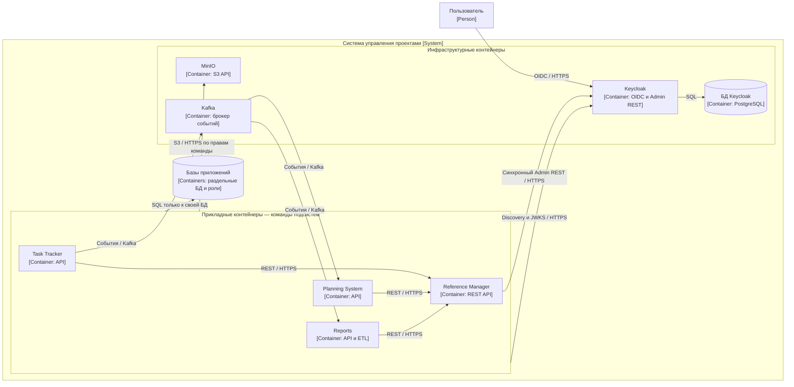
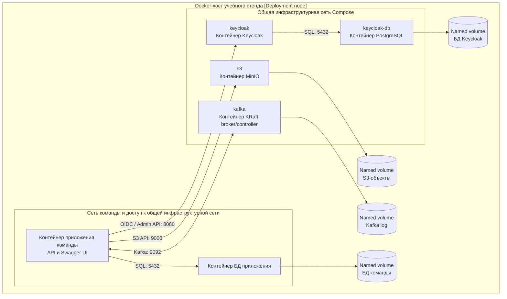
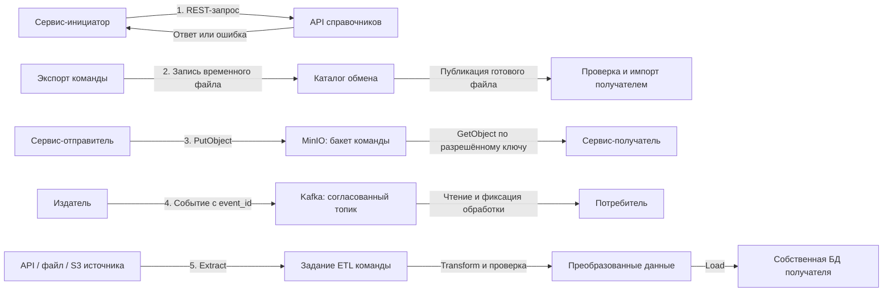
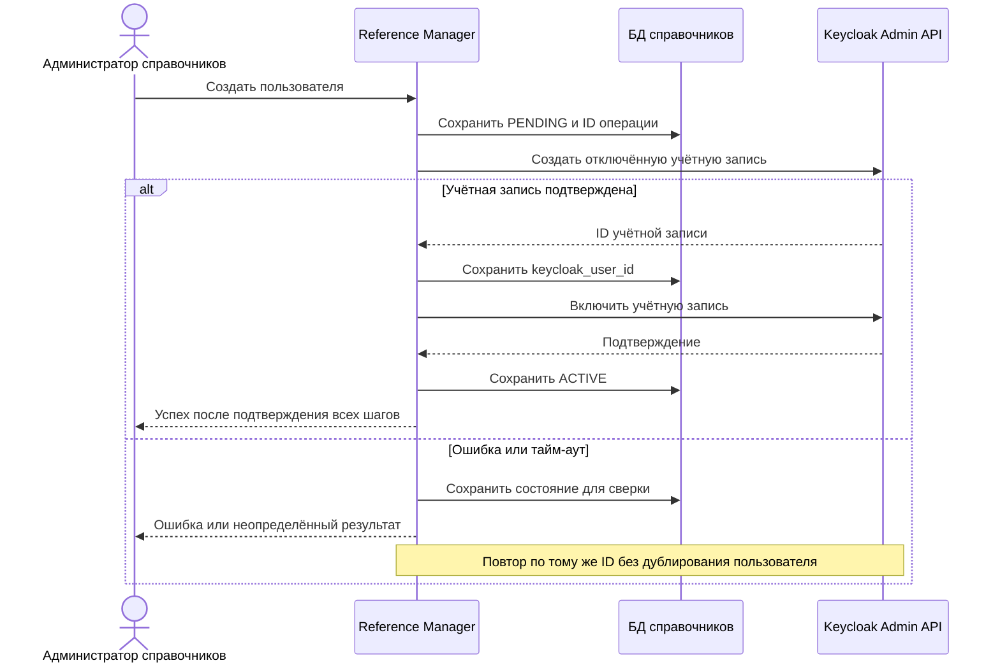
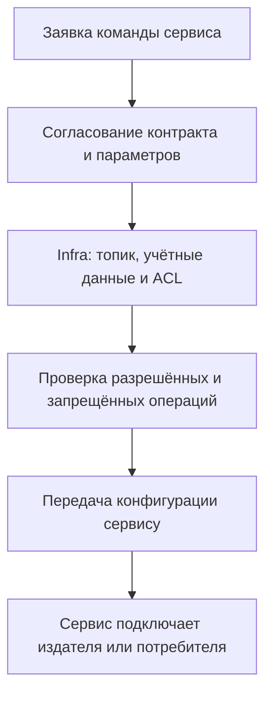
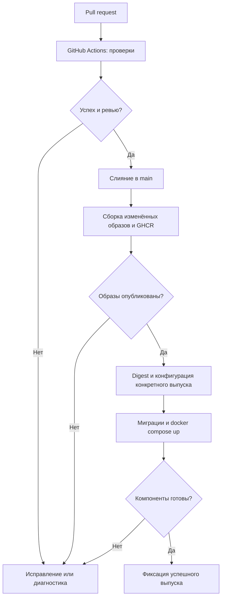

# Vision инфраструктуры

Актуализировано: 17 сентября 2026 года. Документ описывает целевую архитектуру учебного стенда и требования к её реализации. Диаграммы не означают, что компоненты уже развёрнуты. Это единый vision команды инфраструктуры; бизнес-требования остаются у команд подсистем.

## 1. Назначение и границы

Инфраструктура даёт командам Task Tracker, Planning System, Reference Manager и Reports общее окружение: вход через Keycloak, базы данных, объектное хранилище MinIO, Kafka, сборку и доставку через GitHub Actions. Основной способ запуска — Docker Compose; дополнительно готовится упрощённое представление для Kubernetes.

**Отдельный сервис авторизации и собственный frontend инфраструктуры не разрабатываются.** Keycloak уже предоставляет страницы входа, Admin Console, управление пользователями и Admin REST API. Сервисы команд проверяют токены и прикладные права. Swagger UI и OpenAPI публикуются командами для их API; наличие Swagger не требует создания инфраструктурного backend. [Возможности Keycloak](https://www.keycloak.org/getting-started/getting-started-docker), [Admin REST API](https://www.keycloak.org/docs-api/latest/rest-api/index.html).

Прежнее название Core обозначало схему «приложение + его БД», а не ещё один продукт. Каждая команда поставляет своё приложение, Dockerfile, миграции и проверки готовности; инфраструктура подключает их к окружению. Доступ к чужим БД запрещён. БД Keycloak принадлежит только Keycloak; даже при общем сервере PostgreSQL базы и роли приложений разделены.

Ключевые возможности: воспроизводимый запуск; единый вход; синхронное создание учётной записи из справочников; отдельные S3-бакеты команд; Kafka по заявкам сервисов; пять способов интеграции; фиксированные версии и контролируемое обновление.

## 2. Архитектура: logical view, deployment view и data flow

### 2.1. C4 Container: сервисы и связи

C4-представления записаны средствами Mermaid flowchart: у узлов указаны тип и технология, у связей — протокол. Граница показывает всю систему, включая сервисы других команд. Инфраструктурная команда владеет Keycloak, его БД, MinIO, Kafka и механизмами развёртывания. Прикладные сервисы показаны для описания связей; реализация их обработчиков в объём инфраструктуры не входит.

JWKS не требуется загружать на каждый запрос: приложения используют стандартные библиотеки проверки токенов и обновляют кэш ключей при необходимости. Kafka показана для сервисов, которым согласована событийная интеграция; это не навязывает публикацию событий Reference Manager.

### 2.2. C4 Deployment: Docker Compose

Один Docker-хост учебного стенда. Приложения представлены одним типовым экземпляром: при подключении команды добавляются её контейнер и хранилище. Постоянные данные находятся в отдельных named volumes; общий каталог файлового обмена выделяется только участникам соответствующей интеграции. TLS и адрес общего стенда настраиваются при выборе площадки.

### 2.3. Data flow: пять видов интеграций

Потоки ниже — типовые контракты стенда, а не утверждение о наличии обработчиков в сервисах. Реальные отправители, получатели и наборы данных согласуются с командами. Файловый обмен выделен отдельно от S3: первый использует завершённый файл в согласованном каталоге, второй — объект по bucket/key.

ETL — процесс извлечения, преобразования и загрузки. Он может использовать остальные способы обмена и не требует отдельной ETL-платформы. Код ETL принадлежит потребителю; инфраструктура предоставляет расписание, доступы и окружение запуска.

## 3. Keycloak и синхронное создание пользователей

### 3.1. Что предоставляем справочникам

Используем встроенный Keycloak Admin REST API без собственного прокси-сервиса. Инфраструктура создаёт realm `arch-info-system`, служебный confidential client `reference-manager-provisioner`, включает service account и выдаёт минимальные права на согласованные операции с пользователями этого realm. Права администрирования сервера и других realm не выдаются. Секрет клиента хранится на стороне backend справочников, а не в браузере или Git.

| Назначение | Контракт Keycloak |
| --- | --- |
| Получить служебный токен | `POST /realms/arch-info-system/protocol/openid-connect/token`, `grant_type=client_credentials` |
| Создать учётную запись | `POST /admin/realms/arch-info-system/users`; успешный результат — `201`, конфликт — `409` |
| Найти запись при повторе | `GET /admin/realms/arch-info-system/users?username={username}&exact=true` |
| Прочитать / изменить запись | `GET` / `PUT /admin/realms/arch-info-system/users/{id}` |
| Заблокировать вход | `PUT .../users/{id}` с `enabled=false`; политика завершения сессий согласуется отдельно |

Схемы запросов публикует сам Keycloak: [Admin REST API и OpenAPI](https://www.keycloak.org/docs-api/latest/rest-api/index.html). Точки входа и получения токенов описаны в [OIDC endpoints](https://www.keycloak.org/securing-apps/oidc-layers). Адрес, realm, client ID и доступ к секрету передаются команде справочников как конфигурация интеграции.

### 3.2. Процесс и граница согласованности

Создание начинается в справочниках — это согласовано с заказчиком. Справочники сохраняют профиль и устойчивый идентификатор операции в состоянии `PENDING`, затем в рамках того же запроса вызывают Keycloak. Сначала создаётся отключённая учётная запись с атрибутом связи с ID профиля; её `keycloak_user_id` сохраняется в БД справочников. Затем запись включается, а профиль переводится в `ACTIVE`. Успех возвращается только после подтверждения обеих сторон.

Это синхронный вызов, но не распределённая транзакция. При тайм-ауте результат считается неизвестным: профиль не объявляется успешно созданным, повтор использует тот же идентификатор и проверяет существующую запись. Совпадения одного email недостаточно для связывания учётных записей. Если запись создана только в Keycloak, она остаётся отключённой до восстановления связи. Если сбой произошёл после включения, но до финального сохранения профиля, состояние требует сверки и завершения либо отключения записи; автоматически удалять чужую или уже используемую запись нельзя. `PENDING` и ошибки видны оператору; сверка выполняется повтором операции или служебным заданием справочников.

Пароли и MFA ведёт Keycloak. Справочники хранят профиль и ID связи; они не хранят пароли. Изменение профиля или блокировка проходят тот же подтверждаемый обмен с учётом повторов. Уже выданный access token может действовать до истечения срока — блокировка не обещает мгновенный отзыв всех токенов.

Диаграмма показывает штатный путь; частичный сбой на любом шаге после создания обрабатывается по правилам выше. Инфраструктура настраивает API и доступ, а команда справочников реализует координацию вызовов внутри своего сервиса. В её текущем [vision](../reference-manager/docs/vision.md) исходящие интеграции ограничены проверкой токенов и телеметрией: синхронное создание пользователей — новое межкомандное требование, которое необходимо включить в её план. Документы и код справочников этим PR не изменяются.

## 4. S3: MinIO и бакеты команд

Для учебного стенда выбран MinIO с собственной сборкой образа из фиксированного релиза. Официальный репозиторий архивирован; последний опубликованный релиз `RELEASE.2025-10-15T17-29-55Z` предлагает сборку контейнера из исходников. Это осознанное ограничение учебного стенда, а не выбор для промышленной эксплуатации. [Релиз и инструкции сборки](https://github.com/minio/minio/releases/tag/RELEASE.2025-10-15T17-29-55Z).

Целевой перечень бакетов для dev-окружения:

| Команда | Бакет | Базовый доступ |
| --- | --- | --- |
| Task Tracker | `arch-dev-task-tracker` | Только своя сервисная учётная запись |
| Planning System | `arch-dev-planning-system` | Только своя сервисная учётная запись |
| Справочники | `arch-dev-reference-manager` | Только своя сервисная учётная запись |
| Отчёты | `arch-dev-reports` | Только своя сервисная учётная запись |
| Инфраструктура | `arch-dev-infra` | Служебные артефакты и резервные копии с отдельными правами |

Имена для других окружений используют другой префикс. Бакеты создаются повторяемой операцией первоначальной настройки; повтор не удаляет содержимое. Для каждой команды выдаются отдельные ключи и bucket policy, публичный доступ запрещён. Межкомандное чтение выдаётся по заявке на конкретный бакет или префикс; общие root-ключи приложениям не передаются. Необходимость удаления объектов, сроки хранения, квота и очистка незавершённых multipart-загрузок задаются в заявке.

Отправитель загружает объект, затем передаёт получателю bucket/key, контрольную сумму и версию формата через согласованный API, событие или manifest. Получатель проверяет объект и фиксирует результат. S3 сам по себе не уведомляет все сервисы и не обеспечивает «ровно одну» обработку. Повтор записи по одному ключу может заменить объект, поэтому повторяемые выгрузки используют устойчивый ID операции и согласованное правило перезаписи. Копия в MinIO на том же Docker-хосте не защищает от потери хоста; резервные копии выносятся на отдельный носитель или площадку.

## 5. Kafka: инфраструктура по заявкам сервисов

Инфраструктура поднимает Kafka в режиме KRaft, задаёт подключения, хранилище, аутентификацию и ACL. Для учебного стенда — один broker/controller с replication factor 1. Это не отказоустойчивый кластер. Сервисы поставляют издателей и потребителей; автоматическое создание произвольных топиков отключено.

Заявка оформляется issue или PR в монорепозитории и содержит: владельца, окружение, имя топика, издателей и потребителей, consumer group, ключ партиционирования, схему и версию события, число partitions, срок хранения, предел размера сообщения, ожидаемый объём, политику повторов и необходимость отдельного топика ошибок. Изменения схем и партиционирования согласуются с потребителями.

После согласования инфраструктура создаёт топик и ACL, передаёт `bootstrap.servers`, протокол безопасности, ссылки на секреты и проверяет доступ: разрешённый издатель пишет, потребитель читает, чужой сервис получает отказ. На общем стенде используется `SASL_SSL`; учётные данные Kafka отделены от токенов Keycloak. Имена рекомендуется задавать как `<env>.<domain>.<event>.v1`.

Базовый контракт доставки — at-least-once: offset подтверждается после успешной обработки, получатель устраняет дубли по `event_id`. Порядок гарантируется только внутри partition. Идемпотентный producer и `acks=all` не дают общей транзакции Kafka + БД и не компенсируют потерю единственного диска. [Гарантии доставки Kafka](https://kafka.apache.org/43/design/design/#message-delivery-semantics).

## 6. Матрица интеграций

| Тип | Протокол / транспорт | Гарантии и ограничения | Ответственность |
| --- | --- | --- | --- |
| API | HTTPS, REST/JSON, OpenAPI | Синхронный ответ; тайм-аут не доказывает невыполнение. Повторы изменяющих запросов — по устойчивому ID. Нет общей транзакции сервисов. | Команды — контракты и обработчики; Infra — доступ и TLS. |
| Пользователи справочников → Keycloak | HTTPS, Admin REST API; OAuth2 client credentials | Успех после подтверждения двух систем; частичные сбои и повторы сверяются. Не «exactly once». | Справочники — координация; Infra — realm, client и права. |
| Вход и доступ | HTTPS, OIDC; access token и JWKS | Проверка подписи, issuer, audience, срока и прав; блокировка учитывает срок уже выданного токена. | Keycloak и стандартные библиотеки сервисов. |
| Обмен файлами | CSV/JSON по договорённости; общий volume учебного стенда | Временный файл публикуется rename в пределах одной файловой системы либо manifest после завершения. Проверяются схема и checksum; повторный импорт отслеживается. | Отправитель/получатель — формат; Infra — каталог и права. |
| S3 | HTTPS, S3 API, Signature V4 | Завершение отдельной операции; нет общей транзакции с БД. Готовность объекта и устранение повторов определяет протокол обмена. | Infra — MinIO, бакеты, политики; команды — объекты. |
| События | Kafka protocol, SASL_SSL | At-least-once, порядок в partition, возможны дубли. RF=1 не защищает от потери узла. | Infra — брокер/топики/ACL; команды — схемы, обработчики, дедупликация. |
| ETL | API / файл / S3 → преобразование → собственная БД | Контроль полноты, watermark или ID набора, повтор без дублирования; checkpoint после успешной загрузки. | Команда-потребитель — ETL; Infra — Job/CronJob и доступы. |

Все контракты содержат владельцев, версию формата, идентификатор операции, тайм-ауты, повторы и способ диагностики. Бизнес-персональные данные передаются только необходимым получателям; пароли, токены и ключи в payload и журналы не включаются.

## 7. Матрица версий и портов

Срез публичных источников на **17.09.2026**. «Последний тег» означает последний проверенный стабильный релиз, а не плавающую ссылку `latest`. Это исходные кандидаты для сборки стенда; совместимость подтверждается проверкой запуска. В deployment фиксируется digest, конфигурация — коммитом Git. Внешние порты ниже предлагаются для локального стенда; общий стенд публикует только необходимые TLS-входы.

| Компонент | Образ | Последний проверенный тег / состояние | Порт контейнера → локальный хост |
| --- | --- | --- | --- |
| Keycloak | `quay.io/keycloak/keycloak` | `26.7.4` — [официальный контейнер](https://www.keycloak.org/getting-started/getting-started-docker) | `8080 → 127.0.0.1:8081`; management `9000` — только внутри |
| PostgreSQL для Keycloak | `postgres` | `18.6` — [релизы](https://www.postgresql.org/docs/release/), [тег образа](https://hub.docker.com/_/postgres/tags?name=18.6) | `5432`, без публикации на хост |
| MinIO | `ghcr.io/mephi-c22-501/minio` — планируемый собственный образ | `RELEASE.2025-10-15T17-29-55Z` — [исходный релиз](https://github.com/minio/minio/releases/tag/RELEASE.2025-10-15T17-29-55Z); образ ещё нужно собрать и опубликовать | API `9000 → 127.0.0.1:9000`; console `9001 → 127.0.0.1:9001` при явной настройке |
| Kafka | `apache/kafka` | `4.3.1` — [официальный релиз и образ](https://kafka.apache.org/community/downloads/) | internal `9092`; отдельный external listener `29092 → 127.0.0.1:29092`; controller `9093` — только внутри |
| Приложения команд | Образ из Dockerfile соответствующей команды | Выпуск по commit SHA; общего «последнего тега» нет | По контракту команды; порты не назначаются вслепую |

Keycloak поддерживает PostgreSQL 18; для него выделяются отдельные БД, роль и том. [Матрица поддерживаемых БД](https://www.keycloak.org/server/db). Версии БД приложений определяют их команды. Версии Docker Engine, Compose, Kubernetes и используемых GitHub Actions фиксируются в отчёте о демонстрации отдельно; actions закрепляются полным commit SHA.

## 8. Docker Compose и GitHub Actions

### 8.1. Состав конфигурации

| Сервис | Ключевая конфигурация | Состояние |
| --- | --- | --- |
| `keycloak-db` | `POSTGRES_DB=keycloak`, отдельная роль; пароль через secret; volume `/var/lib/postgresql` для PostgreSQL 18 | Healthcheck `pg_isready` |
| `keycloak` | `KC_DB=postgres`, `KC_DB_URL_HOST=keycloak-db`, БД/роль/секрет; hostname окружения; realm `arch-info-system` | Готовность после БД; health endpoints включены |
| `s3` | Собственный образ MinIO, `server /data --console-address :9001`; bootstrap-ключи отдельно от ключей команд; volume `/data` | Проверка готовности до настройки бакетов |
| `kafka` | KRaft node ID и стабильный cluster ID, listeners/advertised listeners, ACL и SASL; постоянный log directory | Проверка Kafka API, затем настройка топиков |
| Инициализация | Одноразовые операции создания realm/clients, бакетов/policies и топиков/ACL | Повтор не дублирует ресурсы и не стирает данные |
| Приложения команд | Образ, env, healthcheck, сеть и своя БД; миграции до переключения версии | Подключаются после предоставления контракта команды |

`compose.yaml` — общая точка запуска; `compose.dev.yaml` — локальные порты и dev-параметры. `start-dev` Keycloak допустим только локально; общий стенд использует `start` и настроенный HTTPS. При TLS termination на reverse proxy внутренний HTTP допускается только с корректным hostname и настройкой доверенного proxy. [Контейнер Keycloak](https://www.keycloak.org/server/containers).

`depends_on` дополняется `service_healthy` и, для одноразовых заданий, `service_completed_successfully`; сам порядок запуска не заменяет готовность. [Порядок запуска Compose](https://docs.docker.com/compose/how-tos/startup-order/). Обычное обновление не выполняет `down -v`. Проверка конфигурации — `docker compose config --quiet`; её полный вывод с подставленными секретами не публикуется.

### 8.2. Процесс доставки

Pull request запускает проверки затронутых конфигураций и сборок. После слияния в `main` GitHub Actions собирает образы изменившихся приложений, публикует их в GHCR с commit SHA и сохраняет digest. Официальные образы инфраструктуры используются из матрицы; MinIO собирается из зафиксированного исходного релиза отдельным воспроизводимым шагом. Изменение только документации не должно перезапускать стенд.

Deployment job получает конкретные digests и коммит конфигурации, выполняет миграции по контрактам команд, применяет Compose и проверяет готовность. На одно окружение допускается одно развёртывание одновременно; прерывать уже начавшуюся миграцию новым запуском нельзя. Непрошедшая сборка или проверка готовности не помечается как успешный выпуск. Возврат к старому образу разрешён только при совместимости со схемой данных; автоматический откат БД не обещается.

Место стенда пока не задано. Поэтому выбирается один из способов доставки: ограниченный SSH-доступ к серверу либо доверенный self-hosted runner с доступом к Docker-хосту. Нельзя считать `localhost` GitHub-hosted runner адресом локального компьютера разработчика. PR из недоверенного источника не получает секретов и не выполняется на runner развёртывания. Workflows команд не переписываются; общие правила находятся в `.github/workflows/` и учитывают пути монорепозитория.

## 9. Kubernetes: упрощённое представление

Цель — показать те же сервисы и связи на одновузловом учебном кластере, без обещаний высокой доступности. Правильное название ресурса для приложений с постоянным состоянием — **StatefulSet**. Он даёт устойчивые идентификаторы и связь с PVC, но сам по себе не создаёт репликацию БД. [Документация StatefulSet](https://kubernetes.io/docs/concepts/workloads/controllers/statefulset/).

| Ресурс | Что размещается и настраивается |
| --- | --- |
| `Namespace` | `arch-infra` для общих сервисов; `arch-task-tracker`, `arch-planning-system`, `arch-reference-manager`, `arch-reports` для команд |
| `ConfigMap` | Несекретные адреса, realm, client IDs, имена бакетов/топиков, log level; версии образов остаются в manifests |
| `Secret` | Пароли БД, client secrets, S3-ключи и Kafka credentials; создаются при развёртывании, не коммитятся; права чтения ограничены RBAC |
| `Deployment` | Keycloak и stateless-приложения команд, по одной replica; readiness/liveness, requests/limits |
| `StatefulSet` | PostgreSQL, MinIO и Kafka, по одной replica; отдельные PVC и устойчивые имена; MinIO и Kafka работают в одиночном учебном режиме |
| `Service` | ClusterIP для клиентов; headless Service для сетевой идентичности StatefulSet; порт controller Kafka не публикуется наружу |
| `PersistentVolumeClaim` | Постоянные данные, подходящий StorageClass; удаление pod не удаляет данные, политика удаления PVC оговаривается отдельно |
| `Job` / `CronJob` | Инициализация, миграции и резервное копирование; задания ETL команд по согласованному расписанию |
| `NetworkPolicy` | Разрешённые связи приложений с Keycloak, Kafka и S3; доступ к БД только владельцу. Требуется CNI, поддерживающий политики |

Сначала создаются namespaces, конфигурация и секреты, затем Services/PVC/StatefulSets. После готовности хранилищ запускаются Keycloak и задания первоначальной настройки, затем приложения команд. Для локальной демонстрации допустим `port-forward`; для общего стенда нужны отдельные настройки TLS-входа. Общий файловый volume Compose не переносится автоматически между Kubernetes-узлами: в упрощённом кластере используется одновузловый volume, а для нескольких узлов требуется отдельное решение обмена файлами.

Отчёт о запуске содержит namespace, image digests, результаты `kubectl rollout status`, состояние pod и PVC и результаты проверок доступа. Kubernetes-манифесты должны использовать те же версии и контракты, что Compose. Производственный кластер, операторы БД, service mesh и распределённая отказоустойчивость в учебный объём не входят.

## 10. Требования и проверка результата

### Функциональные требования

| ID | Требование | Критерий проверки |
| --- | --- | --- |
| FR-01 | Развернуть готовый Keycloak с постоянной БД | Вход и Admin API работают; пересоздание контейнера сохраняет пользователей |
| FR-02 | Предоставить справочникам API синхронного provisioning | Создание возвращает успех после обеих систем; повтор и тайм-аут не создают дубликат |
| FR-03 | Предоставить отдельный S3-бакет каждой команде | Свой объект читается/пишется, чужой бакет без отдельного разрешения недоступен |
| FR-04 | Поднять Kafka и настраивать интеграции по заявкам | Согласованный producer/consumer обмениваются событием; чужой principal получает отказ |
| FR-05 | Обеспечить API, файлы, S3, Kafka и ETL | По каждому виду показан согласованный пример, включая ошибку и повтор |
| FR-06 | Подключать образы и БД команд через Compose и GitHub Actions | Зафиксированный выпуск воспроизводимо разворачивается, ошибки останавливают доставку |
| FR-07 | Предоставить упрощённую конфигурацию Kubernetes | Подняты Deployment/StatefulSet, PVC сохраняет данные, службы доступны по назначенным адресам |
| FR-08 | Фиксировать версии, конфигурацию и резервные копии | По отчёту определяется выпуск; восстановление из копии продемонстрировано |

### Нефункциональные требования

| ID | Требование |
| --- | --- |
| NFR-01 | Воспроизводимость: фиксированные digests, коммит конфигурации, повторяемая инициализация без потери данных |
| NFR-02 | Безопасность: минимальные права, отдельные учётные записи команд, TLS общего стенда, секреты вне Git и журналов |
| NFR-03 | Сохранность: постоянные тома, согласованный срок хранения и проверенное восстановление на отдельном окружении |
| NFR-04 | Наблюдаемость: журналы, readiness, ID операции и результат выпуска; частичный provisioning виден оператору |
| NFR-05 | Изоляция: отдельные БД/роли, бакеты/policies и Kafka ACL; общая сеть не заменяет авторизацию |
| NFR-06 | Честные гарантии: одновузловой стенд не имеет HA; тайм-аут и повтор доставки не скрываются под обещанием exactly-once |

Нагрузка, квоты команд, сроки хранения, RPO/RTO и ресурсы хоста должны быть согласованы до запуска; численные SLA без замеров не задаются.

## 11. ADR: архитектурные решения

| ADR | Контекст и решение | Последствия / отвергнутая альтернатива |
| --- | --- | --- |
| ADR-001 | Готовый Keycloak покрывает IAM: используем штатные UI, OIDC и Admin API | Не создаём auth-сервис, хранение паролей или собственную выдачу JWT; приложения всё равно проверяют свои права |
| ADR-002 | Пользователь начинается в справочниках: синхронный вызов Keycloak и устойчивый ID связи | Нужна обработка частичных сбоев у справочников; Kafka не заменяет синхронное подтверждение, общей ACID-транзакции нет |
| ADR-003 | Для учебного S3 выбран MinIO из фиксированного исходного релиза | Собственная сборка и проверка уязвимостей; архивированный upstream ограничивает сопровождение. SeaweedFS рассматривался как поддерживаемая контейнерная альтернатива; перед промышленным запуском выбор пересматривается |
| ADR-004 | Каждой команде отдельный бакет и сервисная учётная запись | Межкомандное чтение выдаётся явно; общий бакет с общим root-ключом отвергнут |
| ADR-005 | Kafka обслуживает Infra, параметры задаются заявками сервисов | Нет бесконтрольного auto-create; бизнес-схемы и обработчики остаются у команд; базовый контракт at-least-once |
| ADR-006 | GitHub-монорепозиторий, GitHub Actions, Compose и фиксированные образы | Не разворачиваем Jenkins; приложение не должно собираться заново на каждом стенде |
| ADR-007 | Kubernetes — одновузловая демонстрация стандартных ресурсов | Deployment для stateless, StatefulSet/PVC для stateful; без отдельного оператора и без обещания HA |
| ADR-008 | Один инфраструктурный vision; Core — только шаблон размещения приложения и БД | Убрано дублирующее описание собственного backend. Старые README остаются указателями для ссылок других команд |

Решения фиксируют текущий учебный объём. Изменение решения оформляется PR к этому документу с причиной и последствиями.

## 12. Состояние репозитория и оставшиеся договорённости

В репозитории инфраструктуры пока есть заготовки Compose и отключённые задания общих workflows. Этот PR консолидирует vision и архитектурные требования: он не создаёт бакеты в работающем хранилище, не публикует MinIO-образ и не выдаёт доступы. Dockerfile приложений и их миграции остаются в папках команд; Keycloak запускается из готового образа.

До реализации остаётся определить площадку стенда и TLS-адреса, способ доступа GitHub Actions, ресурсы/квоты/сроки хранения и RPO/RTO. С командой справочников согласуются профиль пользователя, ID связи и состояния provisioning; с остальными командами — их первые интеграционные заявки. Прямые адреса API Keycloak и перечень бакетов выше уже задают основу этих контрактов.
