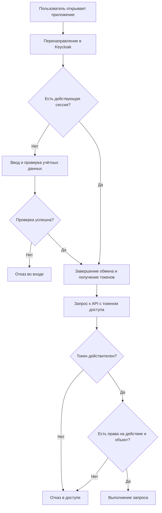
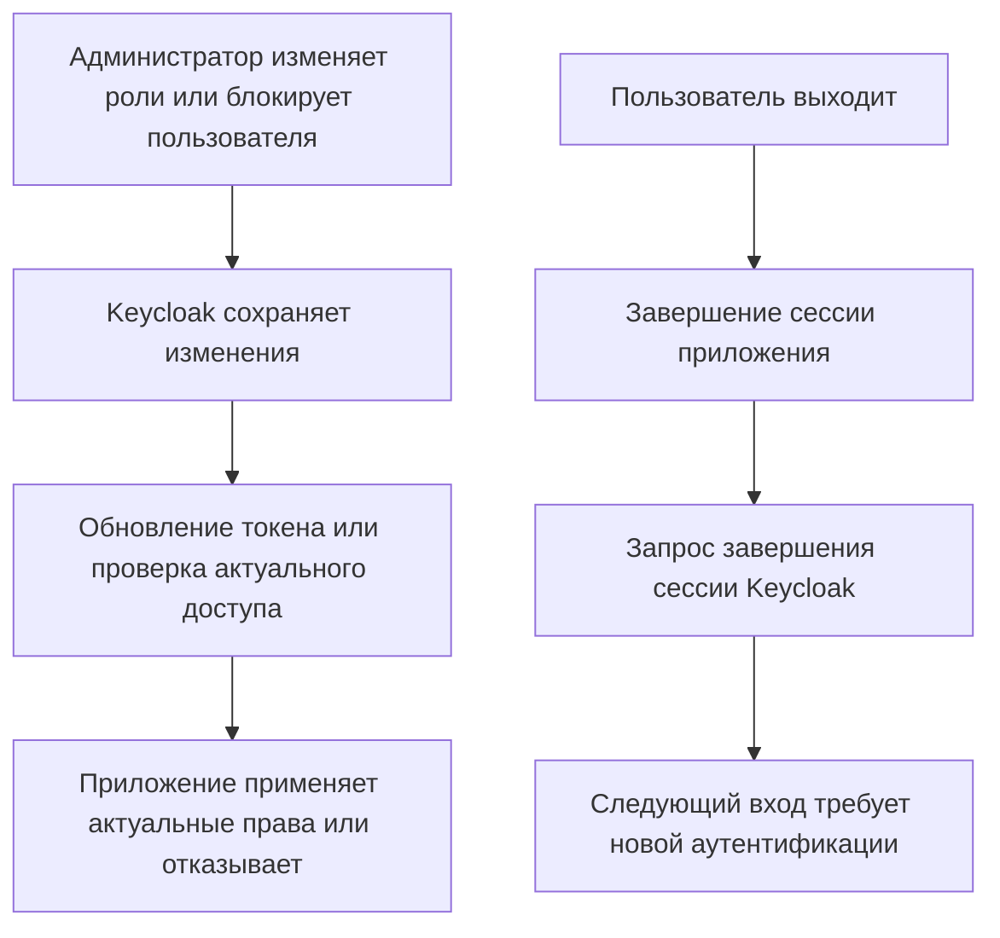

# Identity Provider — Keycloak

## Общее описание

В качестве Identity Provider используется Keycloak. Он обеспечивает централизованный вход пользователей в подсистемы проекта и предоставляет приложениям сведения о пользователе и его ролях. Keycloak подтверждает личность пользователя, а каждое приложение проверяет право на конкретное действие или объект.

Команда инфраструктуры отвечает за развёртывание Keycloak, настройку клиентов приложений и общих правил доступа. Команды подсистем реализуют интеграцию и проверку прав в своих сервисах. Состав ролей определяется отдельно.

Keycloak выделен в самостоятельный блок. Приложение [Core](../core/README.md) использует его для входа пользователей, а [Infra](../infra/README.md) обеспечивает доставку конфигурации и развёртывание.

## Функциональные требования

- Обеспечивать единый вход в подключённые приложения без повторного ввода учётных данных при действующей сессии провайдера.
- Поддерживать управление учётными записями, группами и ролями пользователей.
- Регистрировать приложения как клиентов провайдера и ограничивать разрешённые адреса возврата после входа.
- Выдавать токены, поддерживать обновление доступа и завершение сессии пользователя.

## Нефункциональные требования

- Использовать стандартные протоколы интеграции, например OpenID Connect, без собственной реализации протокола входа.
- Защищать передачу учётных данных и токенов через HTTPS на развёрнутом стенде; не хранить секреты в Git и не записывать их в журналы.
- При недействительных учётных данных или невозможности подтвердить права отказывать в доступе.
- Обеспечивать воспроизводимое развёртывание средствами Infra, сохранность настроек и учётных записей, журналирование событий входа и административных изменений.

Требования к доступности, времени жизни сессий и срокам хранения журналов согласуются отдельно.

## Ключевые возможности

- Общая точка входа для всех подсистем проекта.
- Централизованное управление пользователями и назначением ролей.
- Единый способ передачи подтверждённой личности пользователя приложениям.

## Основные процессы

### Вход и доступ к приложению

Пользователь открывает приложение и перенаправляется в Keycloak. Keycloak проверяет существующую сессию или запрашивает учётные данные. После успешного входа приложение завершает стандартный обмен с Keycloak и получает токены. При обращении к API сервис проверяет подлинность токена, его срок действия, издателя и получателя, затем проверяет права пользователя на запрошенное действие и объект. Недействительный токен или недостаточные права приводят к отказу.

### Изменение доступа и выход

Уполномоченный администратор изменяет роли или блокирует учётную запись в Keycloak. Приложения учитывают актуальные права при обновлении токенов или проверке доступа. При выходе завершается сессия приложения и инициируется завершение сессии Keycloak. Уже выданный токен может оставаться действительным до истечения срока: срок вступления блокировки в силу и механизм досрочного отзыва необходимо согласовать при настройке Keycloak и интеграции приложений.

