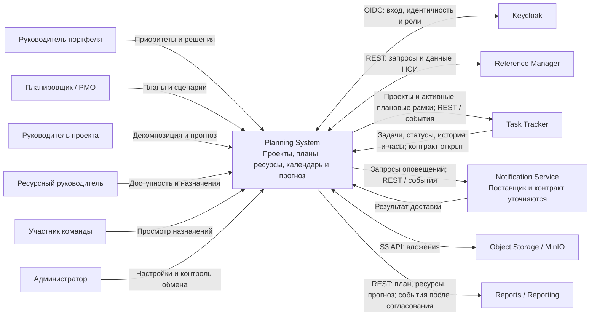

# 020 — Контекст и границы Planning System

**Блок A.** Редакция 1.1 от 24.09.2026, к ревью команды.
Основания: [Vision](vision.md), [ТЗ §4](technical-specification.md),
[архитектура](architecture.md), [ландшафт](system-landscape.md).

## 1. Назначение и граница

Planning System формирует реализуемый портфельный план: какие проекты выполнять,
когда и какими ресурсами. Модуль хранит проекты и плановые версии, сопоставляет их
с фактом исполнения и рассчитывает единый прогноз остатка и бюджетных корректировок.

| Внутри Planning System | За пределами модуля |
| --- | --- |
| Портфель, программы, проекты и их приоритеты | Операционные задачи, канбан, итерации и история задач — Task Tracker |
| Этапы, вехи, эпики, фичи и плановые зависимости | Первичный ввод фактических трудозатрат и комментариев — Task Tracker |
| Потребность по ролям/грейдам, доступность и назначения | Ведение общих классификаторов — Reference Manager |
| Годовые и скользящие планы, Гант, выявление конфликтов | Учётные записи, пароли и сессии — Keycloak; источник кадрового профиля уточняется |
| Сценарии, согласование, неизменяемые baseline и активация версий | Бухгалтерский учёт, расчёт зарплаты, платежи и кадровый документооборот |
| Локальные проекции задач, план-факт и единый прогноз | Витрина и межмодульные отчёты — Reports |
| Метаданные, связи и проверка доступа к вложениям | Файловые объекты — Object Storage; эксплуатация хранения — Infra |
| Причины оповещений, получатели, состояние запросов | Внешние каналы и доставка сообщений — Notification Service |
| Операционные представления сроков, загрузки и отклонений | Развёртывание Keycloak, Kafka, БД и MinIO — Infra |

Проекты не импортируются из Task Tracker. Файловый обмен задачами не заменяет
API/события, даже если сам Task Tracker поддерживает Excel. Общая инфраструктура
не даёт разрешения читать или изменять чужую БД.

## 2. Контекстная диаграмма

Уровень C4 Context: Planning System показана одним блоком без внутренних сервисов.
Стрелки отражают целевой обмен, а не готовность интеграции. Статус каждого обмена
указан ниже. Kafka — транспорт, поэтому не выделена самостоятельным бизнес-актором.

## 3. Внешние системы и интеграции

| ID актора | Система и роль | Planning System передаёт | Planning System получает | Тип интеграции и состояние |
| --- | --- | --- | --- | --- |
| S-01 | Keycloak — готовый поставщик идентичности | Стандартные запросы входа | Идентификатор, роли/группы, данные профиля в разрешённом объёме, ключи проверки токенов | OIDC/OAuth 2.0 по HTTPS, JWKS; предусмотрено ТЗ и Infra, параметры клиента настраиваются |
| S-02 | Reference Manager — НСИ | Запросы чтения по стабильным кодам; заявки на новые справочники организационно | Роли, грейды и согласованные классификаторы | REST `/api/reference-data/v1`; Kafka исключена текущими требованиями поставщика. Календари и кадровые данные — D-03 |
| S-03 | Task Tracker — мастер задач и факта | Проекты, декомпозицию, сроки, назначения, прогноз остатка, бюджетные корректировки | События создания/изменения задач, статусы, историю, комментарии, фактические часы | Целевые REST API и события; названия событий есть в архитектуре Planning System, двусторонний контракт и объём первой версии не подтверждены — D-01 |
| S-04 | Notification Service — доставка | Получателя, причину, шаблонные параметры, устойчивый ID запроса | Подтверждение доставки или ошибку | Целевые REST API / события; отдельного модуля и контракта в `main` нет — D-04 |
| S-05 | Object Storage — хранение файлов | Файлы по уникальным ключам, операции чтения/удаления | Файл и результат операции | S3-совместимый API по HTTPS; Infra планирует MinIO и бакет `arch-dev-planning-system`; работающий стенд этим не подтверждается |
| S-06 | Reports (в прежних материалах Reporting) — аналитический потребитель | Версии и baseline, декомпозицию, календарь, потребность, доступность, назначения, прогноз и отклонения | Запросы чтения/сверки с фильтрами и полномочиями | REST; события после согласования. Reports не изменяет план — D-05 |

При недоступности источника можно показывать последний сохранённый срез с датой
актуальности. Неполные данные не считаются нулевыми. Подтверждение доставки плана
или оповещения не подменяется фактом отправки запроса. Ошибка интеграции не изменяет
содержимое последней утверждённой версии.

## 4. Акторы

Люди: **H-01** руководитель портфеля — выбор и утверждение; **H-02** планировщик/PMO —
сборка и сравнение планов; **H-03** руководитель проекта — декомпозиция и прогноз;
**H-04** ресурсный руководитель — доступность и подтверждение назначений;
**H-05** участник команды — собственный календарь; **H-06** администратор — настройки
модуля и контроль интеграций. Полные цели и ограничения приведены в
[030](030.actors.md). Системные акторы S-01–S-06 перечислены в разделе 3.

Infra — команда-поставщик инфраструктуры, а не самостоятельный источник
плановых решений. Core в текущем репозитории — прежнее название схемы размещения
«приложение команды + БД», не дополнительная внешняя бизнес-система.

## 5. Владение данными и согласованность

| Данные | Источник истины | Что хранит Planning System |
| --- | --- | --- |
| Проект, программа, приоритет, план, сценарий, назначение | Planning System | Оригиналы и история версий |
| Задача, история, комментарий, запись трудозатрат | Task Tracker | Проекция по внешнему ID, версии источника и моменту актуальности |
| Общие роли, грейды, классификаторы | Reference Manager | Коды ссылок; значения/версии, использованные в утверждённом плане |
| Учётная запись, пароль, сессия | Keycloak | Внешний ID пользователя для авторства и доступа; пароли не хранятся |
| Сотрудник, организационная принадлежность, исходный календарь | Владелец ещё согласуется, D-03 | Внешний ID ресурса и локальная плановая доступность |
| Прогноз и предлагаемая бюджетная корректировка | Planning System | Неизменяемые снимки расчёта; формулы и предпосылки видимы |
| Содержимое вложения | Object Storage | Метаданные, объект-владелец, ключ файла и права |
| Витрина межмодульных отчётов | Reports | Собственные операционные представления и выдаваемые проекции |

Одна версия принадлежит одному проекту, как в исходной UML-модели. Портфельный
годовой план — набор явно выбранных версий проектов. Атомарное утверждение всего
портфеля исходными документами не определено и в этой модели не обещается.

## 6. Открытые договорённости

| ID | Наблюдение и источники | Принято в блоках A/B | Кто должен согласовать |
| --- | --- | --- | --- |
| D-01 | ТЗ Planning System §4.5 требует API/события Task Tracker. Его [актуальный контекст](../../task-tracker/docs/block-a-context-and-scope/020.system-context.md) содержит интеграции с тестированием, отчётностью и справочниками, но не Planning System; [каталог событий](../../task-tracker/docs/block-g-api-and-events/135.event-catalog.md) явно исключает внешнюю Kafka. Кроме того, Task Tracker ведёт собственные типы «Проект»/«Эпик» и допускает hard delete | Обмен остаётся целевым. Нужно согласовать владение проектами и эпиками, сопоставление ID, API приёма планов, получение факта, версии/повторы и сигнал удаления. Внутренние WorkItemCreated/WorkItemFieldsChanged не объявляются готовыми TaskCreated/TaskChanged внешней интеграции | Planning System + Task Tracker + Infra для транспорта |
| D-02 | `ReferenceItemChanged` есть в архитектуре Planning System; [требования Reference Manager §1.2, §5.1](../../reference-manager/docs/system-requirements.md) исключают Kafka | Базовый обмен справочниками — REST. Событие не является обязательным входом расчёта; после обновления REST-среза расчёт помечается устаревшим | Planning System + Reference Manager |
| D-03 | Planning System ожидает календари, роли и грейды; перечень НСИ подтверждает роли/грейды, но не контракт календарей. Infra описывает provisioning профиля через справочники, у которых бизнес-сущности исключены | `employeeId` и `calendarCode` — внешние ссылки без выдуманного кадрового API. Плановую доступность подтверждает ресурсный руководитель; источник исходных данных, связь employeeId с Keycloak sub и часовой пояс уточняются | Planning System + Reference Manager + Infra |
| D-04 | Оповещения входят в первую версию Planning System, но поставщик Notification Service отсутствует отдельным модулем | Сохраняются требование и отдельный внешний актор; готовность доставки не заявляется | Planning System + команда, назначенная на Notification Service |
| D-05 | [Reports §8](../../reports/docs/vision.md) требует планы, ресурсы и бюджет; формат и частота обмена остаются открытыми | Reports читает согласованные проекции по REST, события — опциональный будущий контракт; baseline и дата среза обязательны в выдаче | Planning System + Reports |
| D-06 | В Vision портфельный руководитель утверждает план, в sequence перепланирования действие показано у руководителя проекта | По умолчанию финальное решение принимает H-01; H-03 может утверждать только при явно делегированном праве в области проекта | Владелец продукта / команда Planning System |
| D-07 | ТЗ требует прогноз и бюджетную корректировку, но не задаёт тарифы, валюту, метод расчёта и порог существенности. [Глоссарий Task Tracker](../../task-tracker/docs/block-a-context-and-scope/010.glossary.md) определяет остаток как «актуальный план − факт», включая отрицательные значения | Разность Task Tracker хранится отдельно от оценки будущих часов; она не является готовым входом remainingHours. Нужна отдельная оценка планировщика или согласованный источник оценки до завершения. Без достаточных данных прогноз PARTIAL, денежное значение не выдумывается | Planning System + Task Tracker + Reports + владелец продукта |
| D-08 | ТЗ фиксирует неизменяемость версий и конфликты, но не полный маршрут согласования и правила снятия блокировок | В 050 предлагаются проверки перед утверждением, привязка решений к редакции и независимый статус публикации | Команда Planning System |

Этот реестр не отменяет требования собственного ТЗ. Он показывает, какие
межкомандные подтверждения нужны для их реализации. Наличие документа не является
подтверждением реализации или договорённости с внешним модулем.
