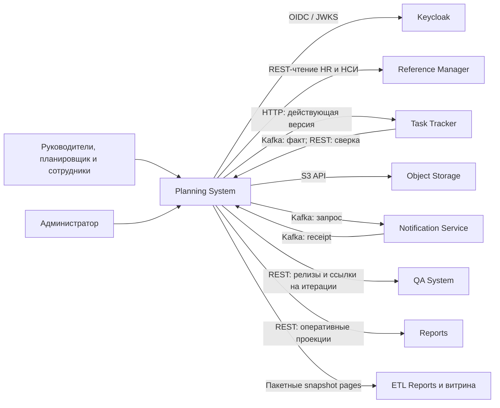

# 020 — Контекст и границы Planning System

Редакция 1.2, 05.10.2026, к ревью команды. База анализа — main 2d82b9e,
замечания [PR #102](https://github.com/MEPhI-C22-501/arch-info-system-monorepo/pull/102).
Reports — единое название подсистемы отчётности; QA System — подсистема тестирования
и качества. Параметры внешних контрактов в этом комплекте предложены для согласования.

## 1. Назначение и граница

Planning System владеет портфелями, проектами, версиями планов, декомпозицией,
релизными рамками, потребностью, плановой доступностью, назначениями и прогнозом.
Task Tracker владеет операционными задачами, итерациями, историей и фактом.
Reference Manager владеет HR-профилем (ФИО, должность, подразделение), окладами,
отсутствиями и НСИ; Keycloak — учётными записями, паролями и сессиями.
Кадровый документооборот, зарплата и платежи за границей Planning System.

QA получает релизы, вехи, эпики/фичи и явные ссылки на итерации TT. Проекция итерации
не делает Planning System её мастером. Reports владеет аналитической витриной и
ETL; Planning System предоставляет исходные срезы. Общая инфраструктура не даёт
права читать чужую БД. Все интеграции ниже — целевые, их фактическая готовность
подтверждается только тестами [095](095.requirements-check.md).

## 2. Контекстная диаграмма

```mermaid
flowchart LR
  H["Руководители, планировщик и сотрудники"] --> PS["Planning System"]
  A["Администратор"] --> PS
  PS -->|"OIDC / JWKS"| KC["Keycloak"]
  PS -->|"REST-чтение HR и НСИ"| RM["Reference Manager"]
  PS -->|"HTTP: действующая версия"| TT["Task Tracker"]
  TT -->|"Kafka: факт; REST: сверка"| PS
  PS -->|"S3 API"| S3["Object Storage"]
  PS -->|"Kafka: запрос"| NS["Notification Service"]
  NS -->|"Kafka: receipt"| PS
  PS -->|"REST: релизы и ссылки на итерации"| QA["QA System"]
  PS -->|"REST: оперативные проекции"| REP["Reports"]
  PS -->|"Пакетные snapshot pages"| ETL["ETL Reports и витрина"]
```

Kafka — транспорт Infra, не самостоятельный бизнес-актор. HTTP/Kafka приёмник TT
и Notification Service требуют отдельного межкомандного подтверждения.

## 3. Единая матрица обмена

Это единственная матрица направлений, данных и протоколов в комплекте. Другие
документы ссылаются сюда, а описывают только реализацию и критерии своей темы.

| Актор / требование | Система | Planning System передаёт | Planning System получает | Способ и статус |
| --- | --- | --- | --- | --- |
| S-01 / INT-01 | Keycloak | OIDC-запросы входа | Токен, sub, claims, JWKS | OIDC/OAuth2 HTTPS; готовый компонент Infra, параметры клиента настраиваются |
| S-02 / INT-02 | Reference Manager | Авторизованные запросы по resource name/фильтру/страницам | Проектные роли, грейды, валюты; employees, positions, org_units, assignments, salaries, absences, etag и состояния удаления | REST по [130 владельца](../../reference-manager/documents/130.api-contracts.md); событий НСИ нет. Документ HR есть, runtime проверяется отдельно |
| S-03 / INT-03 | Task Tracker | Проект и ACTIVE-структура, даты/назначения; ID прогнозов и разрешённые бюджетные корректировки | Абсолютные срезы задач/часов, комментарий как ID, sourceRevision, tombstone, receipt; итерации и их редакции для QA | HTTP-публикация/сверка + предложенная Kafka; D-01 остаётся до соглашения |
| S-04 / INT-04 | Notification Service | NotificationRequested: адресат, причина, шаблон и ID | NotificationDelivered с receipt | Kafka, at-least-once, retry/DLQ; поставщик и канал D-04 |
| S-05 / INT-06 | Object Storage | Байты и операции по приватному objectKey | Результат загрузки/удаления, разрешённый файл | S3 HTTPS; бакет arch-dev-planning-system предоставляет Infra |
| S-06 / INT-05 | Reports | План, baseline, структура, ресурсы, календарь, прогноз/качество/dataAsOf | Авторизованный запрос выбранной проекции | REST оперативного чтения; D-05 |
| S-06 / INT-08 | ETL Reports → аналитическая витрина | Неизменяемый batch: plan, demand, availability, allocation, forecast с бюджетной корректировкой при cost.read; manifest/counts/срок | Запрос создания партии и постраничного чтения | Пакетный REST snapshot; ETL и checkpoint у Reports, расписание/доступы Infra; D-05 |
| S-07 / INT-07 | QA System | Утверждённые релизные рамки, вехи, эпики, фичи; проекция итераций TT с source/ID/revision | Запрос projectId + planVersionId | REST release-context; событие PlanActivated — сигнал перечитать; D-09 |

API и примеры — [130](130.api-contracts.md). Поля сообщений/топики — [140](140.event-schema.md).
Недоступность источника показывает последний срез с датой и качеством, не нулевые
значения. Broker ack не означает доставку уведомления или применение плана.

## 4. Акторы

H-01 — руководитель портфеля; H-02 — планировщик; H-03 — руководитель проекта;
H-04 — ресурсный руководитель; H-05 — участник команды; H-06 — администратор.
Подробности и системные акторы S-01…S-07 — [030](030.actors.md), права — [070](070.role-matrix.md).
Infra предоставляет платформу/доступы, не принимает бизнес-решения плана.

## 5. Владение данными и согласованность

| Данные | Мастер и устойчивый ID | Локальное хранение / правило |
| --- | --- | --- |
| Проект, программа, приоритет, план, сценарий, релиз, назначение | Planning System; UUID, logicalItemId между версиями | Оригиналы, неизменяемые baseline и история |
| Задача, комментарий, история, факт, итерация | Task Tracker; externalTaskId/externalIterationId | Проекции с sourceRevision; первичный ввод у владельца |
| ФИО сотрудника, должность, подразделение, датированное назначение | Reference Manager; employees/…, positions/…, org_units/… | Кэш минимальных полей; значения/etag фиксируются в плановом срезе |
| Связь сотрудника с учётной записью | Reference Manager employees.account_user_id → Keycloak sub | employeeId не равен email/ФИО; при отсутствии/неоднозначности связи собственный календарь недоступен |
| Оклад, валюта, период оклада и отсутствие | Reference Manager salaries/absences; HR-права | Оклад не равен часовой ставке; исходные ревизии и методика отдельно |
| Норма дня, рабочие/выходные дни, IANA TZ, плановая доступность | Planning System, подтверждает H-04; календарный источник ещё D-03 | Версионные плановые предпосылки, не кадровый мастер; без нормы расчёт PARTIAL |
| Почасовая расчётная ставка и её методика | Planning System, cost.write уполномоченного лица; D-07 | Датированная предпосылка с автором/валютой; не подменяет оклад/зарплату |
| Учётная запись, пароль, сессия | Keycloak, sub | Только subject/claims для доступа; паролей нет |
| Прогноз и бюджетная корректировка | Planning System | Immutable snapshot входов и результата, ADR-011 |
| Файл | Object Storage, objectKey | Метаданные, владелец и права в Planning System |
| Витрина и checkpoint ETL | Reports, batchId | Planning System сохраняет immutable export до согласованного срока |

Основание определения HR-мастера: [Reference Manager §1, редакция 02.10](../../reference-manager/documents/system-requirements.md),
[HR API](../../reference-manager/documents/130.api-contracts.md). Утверждение, что
кадровый владелец неизвестен, снято на уровне документов. Не доказана готовность
реального HR API, календарных норм и денежной методики — они остаются в D-03/D-07.
Проект относится к одному портфелю; tenant-изоляция не выводится из portfolioId.

## 6. Открытые договорённости

| ID | Оставшийся вопрос | Проект решения / артефакт | Кто подтверждает |
| --- | --- | --- | --- |
| D-01 | TT владеет своими Project/Epic; внешняя Kafka и удаление требуют согласования | Mapping ID, приёмник 130, абсолютный факт/tombstone 140, REST-сверка; внутренние WorkItem* не выдаются за внешний контракт | Planning System + Task Tracker + Infra |
| D-02 | Фактическое покрытие справочников и ревизий REST API | Использовать контракт владельца, без обязательной ReferenceItemChanged; ADR-008 | Planning System + Reference Manager |
| D-03 | Подтверждённый календарь/нормы/TZ и работающий HR API | HR-мастер определён; account_user_id/sub по контракту; плановые нормы H-04; ADR-010 | Planning System + Reference Manager + ресурсный руководитель |
| D-04 | Кто поставщик уведомлений, каналы и receipt | NotificationRequested/Delivered, timeout/retry/DLQ 140 | Planning System + назначенная команда уведомлений + Infra |
| D-05 | Поля Reports, состав и срок хранения batch, расписание | REST + snapshot ETL; ADR-012, 130/162 | Planning System + Reports + Infra |
| D-06 | Делегирование финального решения H-03 | По умолчанию H-01, отдельное ограниченное делегирование 070 | Владелец продукта + Planning System |
| D-07 | Принятие ETC/стоимостной методики и порога отклонения | ADR-011 с численным примером; неизвестные входы дают PARTIAL | Planning System + Task Tracker + Reports + владелец продукта |
| D-08 | Обязательные согласующие, блокировки и актуальность | Раунд/редакция и проверки 050/070; ADR-003 | Владелец продукта + Planning System |
| D-09 | В замечаниях итерации ожидаются от PS, в QA Vision — от TT | PS отдаёт явную проекцию/ссылку TT рядом с релизами; мастер TT, ADR-012 | Planning System + Task Tracker + QA System |

Критерии снятия вопросов и сроки по этапам — [160](160.integration-plan.md).
Ни один внешний контракт не объявляется принятым без ссылки на решение владельцев.
Legacy Vision/ТЗ/architecture/system-landscape — пояснительные основания;
нумерованные документы фиксируют текущие уточнения по замечаниям.
