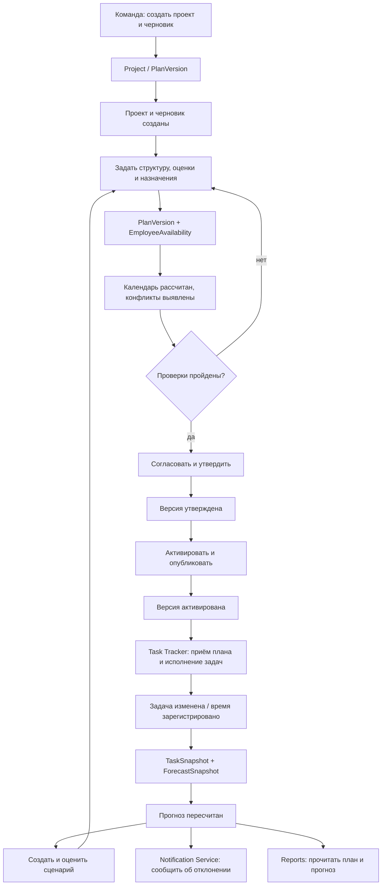

# 040 — Event Storming Planning System

**Блок B.** Редакция 1.1 от 24.09.2026, к ревью команды.
Основания: [Vision §4](vision.md#4-ключевые-процессы), [ТЗ §4.2–4.6](technical-specification.md),
[архитектура §6](architecture.md#6-интеграционные-события).

## 1. Условные обозначения и границы

**Команда** — намерение выполнить действие; **событие** — уже произошедший
бизнес-факт (названия в прошедшем времени); **агрегат** — граница проверки
инвариантов; **политика** — правило, запускающее следующий шаг.
Событие фиксируется только после успешного изменения состояния. Отказ в команде
не порождает событие успеха.

Карты ниже — проектное моделирование процессов, не протокол проведённой сессии
с командой и не готовый каталог Kafka. Имена событий, уже перечисленные в
архитектуре, сохранены. Новые имена уточняют доменную модель; назначать каждому
из них внешний топик не требуется. Агрегаты и проекции раскрыты в [050](050.entities.md),
акторы — в [030](030.actors.md).

В актуальном [каталоге Task Tracker](../../task-tracker/docs/block-g-api-and-events/135.event-catalog.md)
события внутренние, без внешней Kafka; создание и изменение представлены
`WorkItemCreated` и `WorkItemFieldsChanged`. Используемые ниже `TaskCreated` и
`TaskChanged` — целевые имена из архитектуры Planning System, а не уже доступный
контракт соседнего модуля. Их сопоставление, доставка и сигнал hard delete требуют D-01.

## 2. Годовое планирование и публикация

Шаги идут сверху вниз. Подготовка нескольких проектов повторяет шаги 2–11;
решения и активация принимаются по конкретной версии проекта. Подготовка
назначений может идти параллельно уточнению декомпозиции, но утверждение требует
единого проверенного среза.

| Шаг / событие | Инициатор → команда | Агрегат / объект | Доменное событие (past tense) | Политика / следующий шаг | Внешняя система, UC |
| --- | --- | --- | --- | --- | --- |
| 1 / E-01 | H-01/H-02 → сформировать портфель и программу | Portfolio / Program | `PortfolioConfigured` — состав портфеля задан | Задать приоритеты проектов | UC-01 |
| 2 / E-02 | H-02/H-03 → создать проект | Project | `ProjectCreated` — проект создан | Создать первый черновик версии | Task Tracker — будущий получатель; UC-01 |
| 3 / E-03 | H-01/H-02/H-03 → уточнить проект или приоритет | Project | `ProjectChanged` — проект изменён | Проверить влияние на план портфеля | UC-01 |
| 4 / E-04 | H-02 → открыть годовой горизонт и создать версию | PlanVersion | `PlanDraftCreated` — черновик создан | Задать декомпозицию и исходные данные | Reference Manager через REST; UC-02 |
| 5 / E-05 | H-02/H-03 → задать этапы, вехи, эпики, фичи, зависимости и оценки | PlanVersion: PlanItem, Dependency, ResourceDemand | `PlanStructureChanged` — структура и потребность изменены | Проверить дерево, календарь и единицы; пересчитать итоги | Reference Manager; UC-02 |
| 6 / E-06 | H-04 → подтвердить доступные часы сотрудника | EmployeeAvailability | `AvailabilityConfirmed` — доступность подтверждена | Пересчитать конфликты затронутых вариантов | Источник календаря открыт D-03; UC-03 |
| 7 / E-07 | H-02/H-04 → предложить или изменить назначение | PlanVersion: Allocation | `AllocationChanged` — назначение изменено | Сравнить часы с потребностью и доступностью | UC-03 |
| 8 / E-08 | Расчёт по команде H-02/H-04 → проверить ресурсы и календарь | PlanVersion, расчётное представление | `ResourceConflictDetected` — конфликт обнаружен | Показать дефицит/перегрузку, запросить изменение варианта; поставить оповещение | Notification Service; UC-04, UC-10 |
| 9 / E-09 | H-04 → подтвердить конкретные назначения | PlanVersion: Allocation | `AllocationConfirmed` — назначения подтверждены | Повторно проверить общую загрузку и полноту покрытия | UC-03 |
| 10 / E-10 | H-02 → построить календарь и Гант | PlanVersion | `PlanScheduleCalculated` — календарь рассчитан | При конфликте вернуться к шагам 5–9 или создать сценарий | UC-04, UC-05 |
| 11 / E-11 | H-02/H-03 → отправить редакцию на согласование | PlanVersion | `PlanSubmittedForReview` — версия отправлена на согласование | Зафиксировать редакцию и обязательных согласующих; запросить оповещение | Notification Service; UC-06 |
| 12а / E-12 | Согласующий → вернуть с обоснованием | PlanVersion: ApprovalDecision | `PlanReturnedForRevision` — версия возвращена на доработку | Перевести в DRAFT; следующая отправка начинает новый цикл решений | Notification Service; UC-06 |
| 12б / E-13 | Уполномоченный руководитель → утвердить | PlanVersion: ApprovalDecision | `PlanApproved` — версия утверждена | Зафиксировать неизменяемую baseline; активация — отдельный шаг | UC-06 |
| 13 / E-14 | H-01 либо делегированный H-03 → ввести версию в действие | Project + PlanVersion | `PlanActivated` — версия активирована | Прежнюю ACTIVE заменить на SUPERSEDED, создать Publication и запрос оповещения | Task Tracker, Reports, Notification Service; UC-07 |
| 14 / E-15 | Внутренняя политика → передать активные плановые рамки | Publication | `PlanPublicationRequested` — публикация запрошена | Отправить с устойчивым ключом projectId + planVersionId; ожидать подтверждение | Task Tracker; UC-07 |
| 15а / E-16 | Подтверждение Task Tracker → завершить публикацию | Publication | `PlanPublished` — план принят внешней системой | Отобразить успешную синхронизацию | Task Tracker; UC-07 |
| 15б / E-17 | Ошибка/тайм-аут → зафиксировать неуспешную попытку | Publication | `PlanPublicationFailed` — попытка публикации не подтверждена | Сохранить активный план; проверить неизвестный результат и повторить с тем же ключом | Task Tracker; UC-07, UC-12 |

События `ProjectCreated`, `ProjectChanged`, `AllocationChanged` сами по себе не
разрешают отправлять неутверждённые назначения как действующий план. Внешняя
публикация плановых рамок связана с `PlanActivated`; фильтрация внутренних событий
и контракт потребителя уточняются в блоке G.

## 3. Скользящий прогноз и сценарий перепланирования

| Шаг / событие | Инициатор → команда / вход | Агрегат / объект | Доменное событие (past tense) | Политика / следующий шаг | Внешняя система, UC |
| --- | --- | --- | --- | --- | --- |
| 1 / E-18 | S-03 → `TaskCreated`, `TaskChanged`, `TaskCommented` или `TimeLogged` | Входной факт из Task Tracker | Задача создана / изменена, комментарий добавлен или время зарегистрировано | Проверить ID события, проект, версию и схему; принять только новое допустимое состояние | Task Tracker; UC-08 |
| 2 / E-19 | Обработчик → обновить локальный срез задачи | TaskSnapshot (проекция) | `TaskSnapshotUpdated` — срез задачи обновлён | По изменениям часов/дат пересчитать прогноз; по комментарию — только оповещение, если расчётные поля не менялись | Task Tracker; UC-08, UC-10 |
| 3 / E-20 | Политика или H-03 → пересчитать единый прогноз | ForecastSnapshot | `ForecastCalculated` — прогноз рассчитан | Зафиксировать версию плана, входные данные и полноту результата | UC-08 |
| 4 / E-21 | Политика → сравнить новый результат с прежним | ForecastSnapshot | `RemainingForecastChanged` — прогноз остатка изменён | Обновить представления, сформировать выдачу потребителям | Task Tracker, Reports; UC-08, UC-11 |
| 5 / E-22 | Политика при наличии стоимостных данных → сравнить корректировку | ForecastSnapshot | `BudgetAdjustmentChanged` — бюджетная корректировка изменена | Передать согласованное значение с валютой и основанием расчёта | Task Tracker, Reports; UC-08, UC-11 |
| 6 / E-23 | Проверка порога → отметить существенное отклонение | ForecastSnapshot | `PlanDeviationDetected` — отклонение выявлено | Запросить оповещение H-02/H-03; автоматически план не менять | Notification Service; UC-10 |
| 7 / E-24 | H-02/H-03 → создать вариант «что если» | PlanVersion, kind=SCENARIO | `ScenarioCreated` — сценарий создан | Скопировать базу и сохранить baseVersionId; активный план остаётся прежним | UC-05 |
| 8 / E-25 | H-02/H-03 → изменить вариант и сравнить | PlanVersion + ForecastSnapshot | `ScenarioEvaluated` — сценарий оценён | Показать последствия по срокам, загрузке и бюджету на сопоставимых входах | UC-05 |
| 9 | H-02/H-03 → выбрать сценарий и отправить на согласование | PlanVersion | Повтор E-11–E-17 | Пройти те же подтверждения, утвердить, активировать и опубликовать новую версию | UC-06, UC-07 |

Дубликат входного события не повторяет E-19–E-23. Устаревшая версия задачи не
перезаписывает более новую. Неизвестный проект или несовместимая схема дают ошибку
сверки, а не автоматически созданный проект. Коррекция/удаление записи времени
обрабатываются по контракту источника, а не прибавлением любого повторного `TimeLogged`.

## 4. Вложения, оповещения и завершение работы

| Шаг / событие | Инициатор → команда | Агрегат / объект | Доменное событие (past tense) | Условие и результат | Внешняя система, UC |
| --- | --- | --- | --- | --- | --- |
| 1 / E-26 | H-02/H-03 → прикрепить файл | Attachment | `AttachmentAdded` — вложение прикреплено | Файл проверен и подтверждён хранилищем, метаданные привязаны ровно к одному владельцу | Object Storage; UC-09 |
| 2 / E-27 | Владелец права → удалить вложение | Attachment | `AttachmentDeleted` — вложение удалено | Отмечается после подтверждения удаления объекта; при сбое остаётся состояние повторной попытки | Object Storage; UC-09 |
| 3 / E-28 | Политика E-08/E-11/E-12/E-14/E-19/E-23 → запросить оповещение | Notification | `NotificationRequested` — оповещение запрошено | Уникальный ключ причины + получатель + канал; нет повторного запроса от дубликата события | Notification Service; UC-10 |
| 4 / E-29 | S-04 → подтвердить доставку | Notification | `NotificationDelivered` — оповещение доставлено | Только подтверждение для соответствующего запроса переводит его в DELIVERED | Notification Service; UC-10 |
| 5 / E-30 | H-02/H-03 → отменить черновик / H-01 → отменить утверждённый до активации | PlanVersion | `PlanArchived` — версия архивирована | Только переходы исходной модели 050; активная версия не архивируется напрямую | UC-02, UC-06 |
| 6 / E-31 | H-01/H-03 → завершить проект | Project | `ProjectCompleted` — проект завершён | После проверки выполнения работ; факт и версии сохраняются для анализа | UC-01 |

Чтение Ганта, скачивание разрешённого файла и просмотр отчёта не обязаны порождать
доменное событие: журнал доступа относится к аудиту.

## 5. Сквозная карта

## 6. Инварианты и точки обсуждения

- Утверждение фиксирует содержимое версии; новый факт создаёт новый прогноз,
  а новое плановое решение — новую версию. Отправка события не обходит согласование.
- Для активного плана одного проекта существует единственный указатель. При
  активации сценария ресурсная проверка заменяет старую версию этого проекта,
  а не складывает часы двух альтернатив.
- Суммы трудозатрат не удваиваются на родительских узлах декомпозиции и при
  повторной доставке сообщений.
- Уведомления и публикация имеют собственные состояния. Недоступность внешнего
  сервиса не откатывает baseline и не выдаётся за успешную доставку.
- Все «горячие точки» интеграций, кадрового источника, формулы прогноза и полномочий
  вынесены в [D-01–D-08](020.system-context.md#6-открытые-договорённости).
