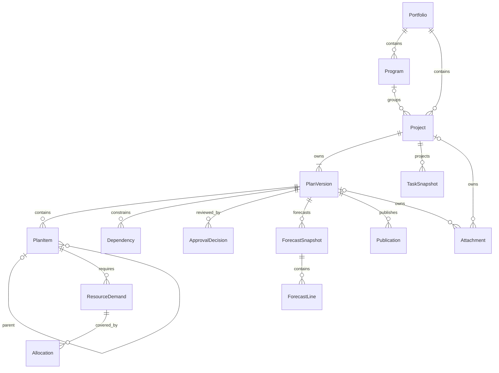
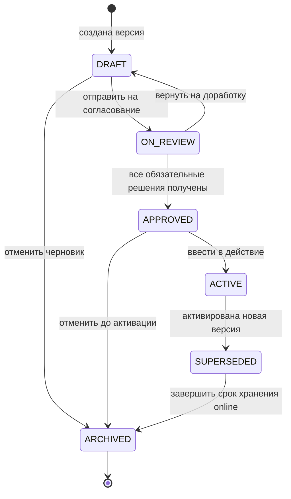
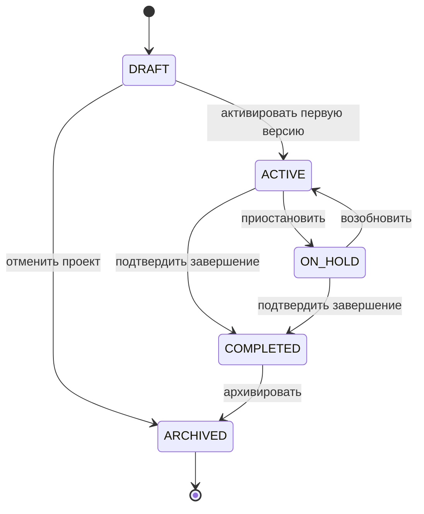
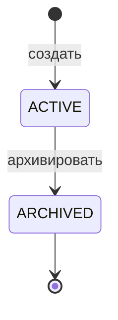
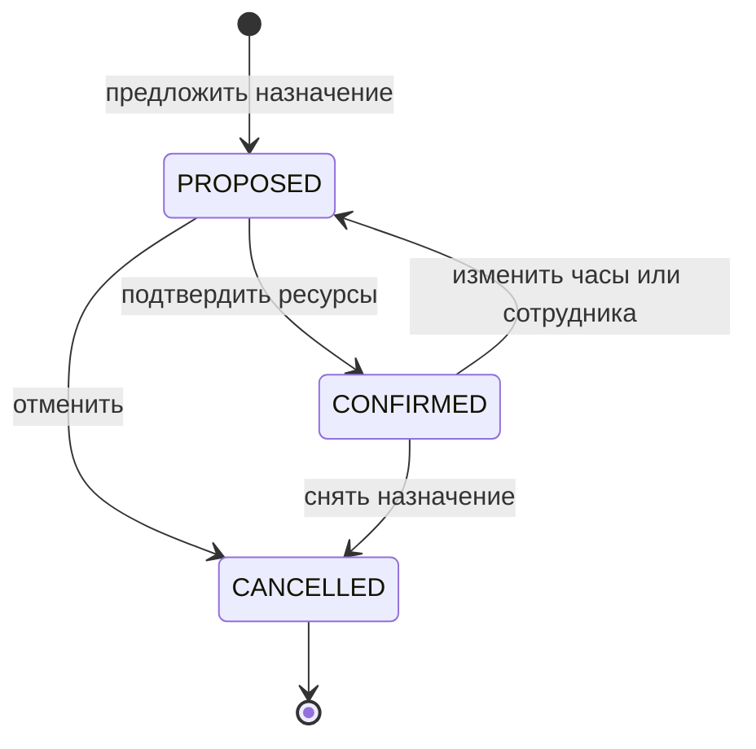
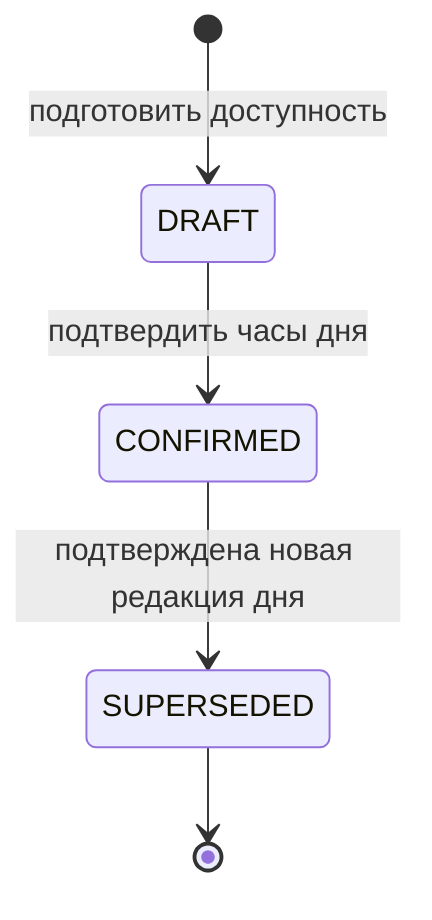
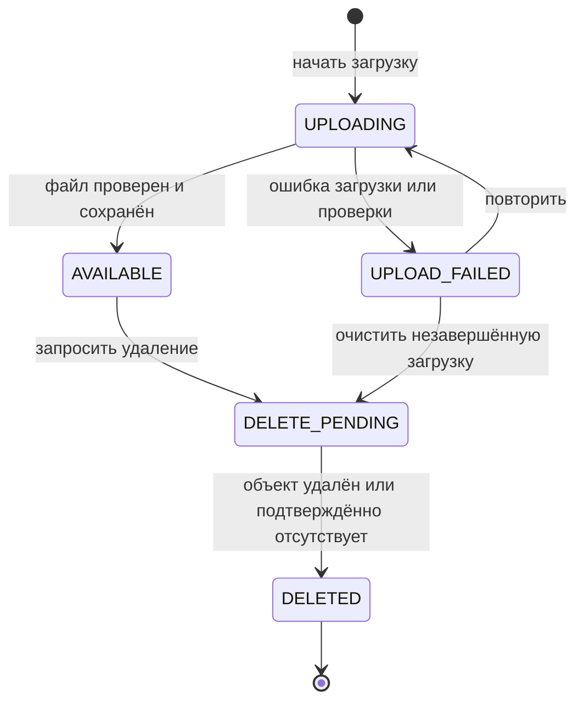
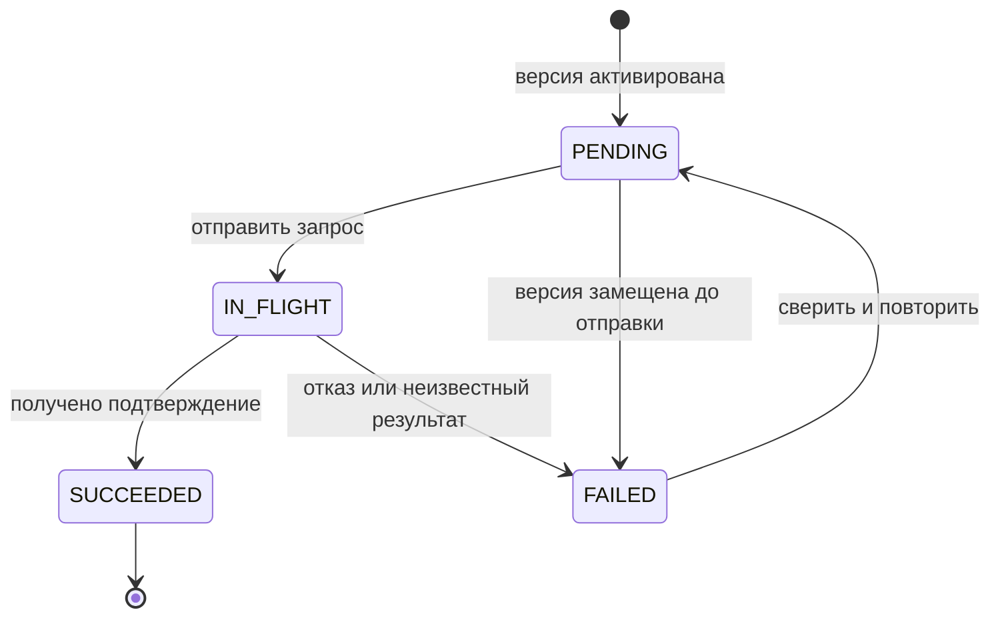
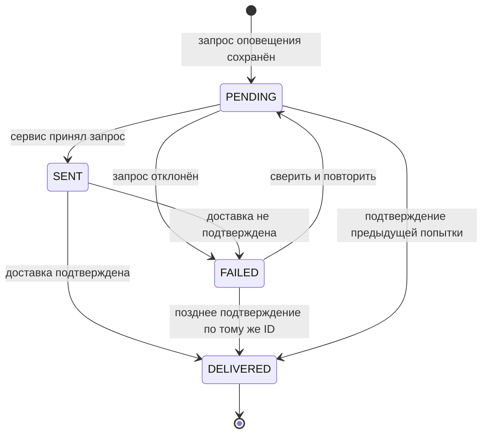

# 050 — Сущности и жизненные циклы Planning System

**Блок B.** Редакция 1.1 от 24.09.2026, к ревью команды.
Основания: [ТЗ §4.2–4.3](technical-specification.md),
[исходная UML-модель](diagrams/04-uml-domain-model.mmd),
[исходные состояния версии](diagrams/08-uml-plan-state.mmd).

## 1. Уровень модели и общие правила

Исходные сущности Project, PlanVersion, PlanItem, ResourceDemand, Allocation,
TaskSnapshot, ForecastSnapshot и Attachment сохранены. Portfolio, Program,
Dependency, EmployeeAvailability, ApprovalDecision, Publication и Notification
добавлены как **проектное уточнение** требований FR-01–FR-15. Поля и ограничения
ниже задают логическую модель, а не утверждённую физическую схему БД.

- `UUID` — локальный устойчивый идентификатор; `string` — текст; `date` — календарная
  дата; `instant` — момент UTC; `hours` — decimal(12,2), неотрицательные человеко-часы;
  `money` — decimal(18,2), всегда с валютой. Даты периода включительны.
- У всех хранимых объектов есть `id: UUID` (PK), `createdAt: instant`,
  `createdBy: string` (Keycloak subject либо ID сервисного актора). У изменяемых
  корней — `revision: int >= 1` для защиты от потери параллельных изменений.
- `?` обозначает nullable. Остальные поля обязательны, если в ограничении
  не указано условие. Локальная FK ссылается только на БД Planning System.
  Внешние ID и коды — логические ссылки через API, не межсервисные FK.
- Для портфельной области используется `portfolioId`. Поддержка нескольких
  арендаторов, claim арендатора и его отображение на область доступа согласуются
  отдельно; наличие `portfolioId` само по себе не реализует изоляцию арендаторов.
- После APPROVED содержимое версии, включая структуру, оценки, даты, назначения,
  использованные НСИ и стоимостные предпосылки, неизменно. Меняются только
  метаданные жизненного цикла; факт, прогноз, доставка и аудит хранятся отдельно.
- Архивация не означает физическое удаление. Исторические связи и baseline
  сохраняются. Исправление утверждённого плана создаёт новый PlanVersion.

## 2. Корни агрегатов и связи

| Корень / объект | Принадлежащие объекты | Граница согласованности |
| --- | --- | --- |
| Portfolio | Состав задаётся ссылками Project и Program | Уникальность кода портфеля, область доступа |
| Program | Проекты связаны через programId | Принадлежность одной программе/портфелю |
| Project | Указатель активной версии, жизненный цикл проекта | Одна ACTIVE-версия; версия и проект должны совпадать |
| PlanVersion | PlanItem, Dependency, ResourceDemand, Allocation, ApprovalDecision | Все плановые изменения и решения привязаны к одной редакции |
| EmployeeAvailability | Часы одного сотрудника на один день и редакция подтверждения | Единственное действующее подтверждение на сотрудника/день |
| TaskSnapshot | Локальная проекция задачи | Идемпотентное обновление из Task Tracker; не мастер задачи |
| ForecastSnapshot | ForecastLine — строки результата | Неизменяемый результат на определённой версии и входных данных |
| Attachment | Метаданные и связь с владельцем | Состояние объекта в S3 и доступ к вложению |
| Publication | Попытки передачи одной версии | Одна логическая публикация на версию и получателя |
| Notification | Запрос и подтверждения доставки | Один запрос на причину, получателя и канал |

EmployeeAvailability связана с Allocation логически по `employeeId + date`.
У Attachment из двух связей с владельцем заполнена ровно одна. Notification
ссылается на проект и событие-причину; внешние системы на ER-диаграмме опущены.

## 3. Атрибуты и ограничения

### 3.1. Portfolio, Program и Project

| Объект | Атрибут | Тип | Ограничение / смысл |
| --- | --- | --- | --- |
| Portfolio | code, name | string, string | Непустые; code уникален в согласованной области организации |
| Portfolio | ownerSubject | string | Внешняя ссылка на уполномоченного руководителя |
| Portfolio | status | enum | ACTIVE, ARCHIVED |
| Program | portfolioId | UUID, FK → Portfolio | Ровно один портфель |
| Program | code, name, goal | string, string, string | Непустые; UNIQUE(portfolioId, code) |
| Program | status | enum | ACTIVE, ARCHIVED |
| Project | portfolioId | UUID, FK → Portfolio | Ровно один портфель |
| Project | programId | UUID?, FK → Program | 0..1; программа того же портфеля |
| Project | code, name, goal | string, string, string | Непустые; UNIQUE(portfolioId, code) |
| Project | managerSubject | string | Внешний ID ответственного руководителя проекта |
| Project | priority | int | >= 1; меньшее число означает больший приоритет — предлагаемая шкала |
| Project | status | enum | DRAFT, ACTIVE, ON_HOLD, COMPLETED, ARCHIVED |
| Project | activePlanVersionId | UUID?, FK → PlanVersion | Версия этого проекта со статусом ACTIVE; до первой активации null |

Создание проекта и первого пустого DRAFT выполняется одной локальной операцией:
тем самым сохраняется исходная связь Project 1 → 1..* PlanVersion.
Программа и портфель не добавляют в план собственные человеко-часы поверх
проектов: их показатели агрегируются.

### 3.2. PlanVersion — версия плана и сценарий

| Атрибут | Тип | Ограничение / смысл |
| --- | --- | --- |
| projectId | UUID, FK → Project | UNIQUE(projectId, versionNumber) |
| versionNumber | int | >= 1, монотонно увеличивается в проекте, не переиспользуется |
| name | string | Непустое понятное название варианта |
| kind | enum | PLAN или SCENARIO; сценарий — тот же агрегат с изолированным содержимым |
| planningMode | enum | ANNUAL или ROLLING |
| horizonStart, horizonEnd | date, date | start <= end; у ANNUAL обе даты в выбранном календарном году |
| baseVersionId | UUID?, FK → PlanVersion | Для копии/сценария обязателен; тот же projectId; граф происхождения без циклов |
| status | enum | DRAFT, ON_REVIEW, APPROVED, ACTIVE, SUPERSEDED, ARCHIVED |
| dataAsOf | instant? | Дата среза данных последней проверки; до первого расчёта null |
| contentRevision | int | >= 1; растёт при изменении планового содержимого, а не при доставке событий |
| reviewRound | int | >= 0; растёт при каждой отправке на согласование |
| requiredReviewers | object[] | На цикл фиксируются subject, тип согласующего и область ресурсов; в ON_REVIEW список непустой |
| referenceSnapshot | object | Использованные коды/версии НСИ и календарные предпосылки; до заполнения может быть пустым |
| baselineBudget, currencyCode | money?, string? | Либо оба заданы, либо оба null; baselineBudget >= 0; валюта — внешняя НСИ |
| approvedAt, approvedBy | instant?, string? | Заполняются при APPROVED; сохраняются после замещения/архивации |
| activatedAt | instant? | Заполняется при первой активации |

Сценарий проходит тот же lifecycle. При его утверждении фиксируется собственная
baseline, при активации он становится действующей версией; `kind=SCENARIO`
сохраняет происхождение. Содержимое исходной версии не перезаписывается.
План за год и скользящий план отличаются горизонтом/режимом, но не источником факта.

### 3.3. Декомпозиция и зависимости

| Объект | Атрибут | Тип | Ограничение / смысл |
| --- | --- | --- | --- |
| PlanItem | planVersionId | UUID, FK → PlanVersion | Ровно одна версия |
| PlanItem | logicalItemId | UUID | Стабильная идентичность работы между копиями версий; UNIQUE(planVersionId, logicalItemId) |
| PlanItem | parentItemId | UUID?, FK → PlanItem | Родитель в той же версии; дерево без циклов, глубина конечна |
| PlanItem | type | enum | STAGE, MILESTONE, EPIC, FEATURE |
| PlanItem | name | string | Непустое |
| PlanItem | start, finish | date, date | start <= finish, внутри горизонта; даты дочерних работ внутри родителя |
| PlanItem | plannedHours | hours | Для листовой работы — сумма ResourceDemand; для родителя — сумма листьев поддерева |
| Dependency | planVersionId | UUID, FK → PlanVersion | Совпадает с версиями обоих концов |
| Dependency | predecessorId, successorId | UUID, FK → PlanItem | Разные узлы; UNIQUE(version, predecessor, successor); граф без циклов |
| Dependency | type, lagWorkingDays | enum, int | FS, лаг >= 0 рабочих дней; иные типы пока не определены |

Предлагаемая иерархия: этапы могут содержать этапы, эпики и вехи; эпики — фичи и
вехи; фичи и вехи — листья. Эпик/этап без детей может быть оценён как лист.
При его декомпозиции прежняя оценка распределяется по детям, прямые потребности
родителя снимаются. Веха имеет `start=finish`, `plannedHours=0`, без назначений.
Для FS в модели дат преемник начинается не раньше следующего рабочего дня после
окончания предшественника плюс лаг. Более точная внутридневная модель — отдельное
уточнение, не предположение скрытого алгоритма.

### 3.4. Потребность, доступность и назначения

| Объект | Атрибут | Тип | Ограничение / смысл |
| --- | --- | --- | --- |
| ResourceDemand | planItemId | UUID, FK → PlanItem | Только листовая работа, не веха |
| ResourceDemand | roleCode, gradeCode | string, string | Внешние стабильные коды НСИ; при новом выборе запись ACTIVE |
| ResourceDemand | periodStart, periodEnd | date, date | Внутри дат элемента; start <= end |
| ResourceDemand | hours | hours | > 0; UNIQUE(item, role, grade, periodStart, periodEnd) |
| EmployeeAvailability | employeeId | string | Внешний ID ресурса, не имя и не email; связь с Keycloak уточняется D-03 |
| EmployeeAvailability | date, calendarCode, timeZone | date, string, string | Календарь — внешняя ссылка; timeZone задаётся явно |
| EmployeeAvailability | nominalHours, absenceHours, availableHours | hours | availableHours = nominalHours − absenceHours; 0 <= absenceHours <= nominalHours <= 24 |
| EmployeeAvailability | status | enum | DRAFT, CONFIRMED, SUPERSEDED |
| EmployeeAvailability | confirmedBy, confirmedAt | string?, instant? | Обязательны для CONFIRMED и его исторического SUPERSEDED |
| Allocation | demandId | UUID, FK → ResourceDemand | Версия определяется через потребность; не межверсионная ссылка |
| Allocation | employeeId, date | string, date | День внутри периода потребности; UNIQUE(demandId, employeeId, date) |
| Allocation | hours | hours | > 0 и <= 24; совпадение role/grade ресурса подтверждает H-04 |
| Allocation | status | enum | PROPOSED, CONFIRMED, CANCELLED |
| Allocation | confirmedBy, confirmedAt | string?, instant? | Обязательны при CONFIRMED |

Назначения разбиты по дням, чтобы проверка пересечения периодов была однозначной.
Недельные/месячные показатели — суммы дневных значений. Отсутствие записи
доступности означает «неизвестно», а не 0 или 8 часов.

Для сотрудника и дня: `loadHours = sum(Allocation.hours)` по выбранным версиям без
CANCELLED; `overload = max(loadHours − availableHours, 0)`;
`idle = max(availableHours − loadHours, 0)`. Для потребности:
`deficit = max(demand.hours − sum(confirmed allocations.hours), 0)`.
Сравнение сценария заменяет активную версию его проекта, а не добавляет её повторно.
Прямое превышение суммы назначений над потребностью также требует исправления.

### 3.5. ApprovalDecision — решение по версии

| Атрибут | Тип | Ограничение / смысл |
| --- | --- | --- |
| planVersionId | UUID, FK → PlanVersion | Версия в ON_REVIEW на момент принятия решения |
| reviewRound, contentRevision | int, int | Точный цикл и редакция, к которым относится решение |
| reviewerSubject, reviewerRole | string, enum | Автор и тип RESOURCE_OWNER / FINAL_APPROVER |
| decision | enum | APPROVE или RETURN |
| comment, decidedAt | string?, instant | Для RETURN комментарий обязателен |

Решение — неизменяемая запись факта, а не изменяемый документ со своим lifecycle.
В одном цикле один согласующий принимает одно решение. После возврата начинается
новый цикл: старое APPROVE не применяется к изменённому содержимому.
Состав обязательных согласующих фиксируется при отправке (D-06/D-08).

### 3.6. TaskSnapshot — проекция внешней задачи

| Атрибут | Тип | Ограничение / смысл |
| --- | --- | --- |
| projectId | UUID, FK → Project | Проект уже существует локально |
| externalTaskId | string | UNIQUE(sourceSystem, externalTaskId); sourceSystem = TaskTracker |
| logicalItemId | UUID? | Логическая связь с работой того же проекта; null — несопоставленная задача, видимая как проблема качества |
| sourceRevision, sourceChangedAt | int, instant | Версия >= 1 и время источника; способ получения версии требует D-01 |
| lastEventId, receivedAt | string, instant | Идентификатор принятого события и момент обработки |
| taskStatus | string | Непрозрачный статус Task Tracker, не enum жизненного цикла PlanVersion |
| actualHours | hours | Абсолютная фактическая трудоёмкость среза |
| sourceRemainingHours | decimal(12,2)? | Арифметическое «актуальный план − факт» из Task Tracker; знак сохраняется, отрицательное значение допустимо |
| remainingHours | hours? | Отдельная оценка часов до завершения, только если её смысл и источник явно согласованы; иначе null, не копия sourceRemainingHours |
| isDeleted | bool | Признак удаления в источнике; история не уничтожается |

Проекция не имеет самостоятельного бизнес-жизненного цикла задачи: статусы и их
переходы принадлежат Task Tracker. Список обработанных `eventId` хранится отдельно
для дедупликации, одного `lastEventId` недостаточно. Если источник шлёт отдельные
записи времени, сначала нужна проекция по ID записи с поддержкой её коррекции и
удаления, затем абсолютный итог задачи. Суммировать повторные `TimeLogged` нельзя.
Полная история/комментарии читаются или проецируются по будущему контракту, без
переопределения владельца в Planning System.

Task Tracker допускает hard delete вместе с историей. Значение `isDeleted` нельзя
устанавливать по отсутствию задачи на одной странице ответа: необходим явный
сигнал удаления или полная авторизованная сверка. Правила удаления локальных
копий факта и пересчёта исторических показателей согласуются по D-01; до решения
система помечает данные как требующие сверки, а не молча обнуляет трудозатраты.

### 3.7. ForecastSnapshot и ForecastLine — единый прогноз

| Объект | Атрибут | Тип | Ограничение / смысл |
| --- | --- | --- | --- |
| ForecastSnapshot | planVersionId | UUID, FK → PlanVersion | Версия, относительно которой выполнен расчёт |
| ForecastSnapshot | calculatedAt, dataAsOf | instant, instant | Момент расчёта и граница входного среза; dataAsOf <= calculatedAt |
| ForecastSnapshot | inputRevisions | object | Версии задач, доступности, плана, НСИ и методики; позволяет объяснить результат |
| ForecastSnapshot | inputSnapshot | object | Использованные значения и предпосылки; ручная оценка непокрытой работы хранится с logicalItemId, часами, автором и временем, отдельно от baseline |
| ForecastSnapshot | quality | enum | COMPLETE или PARTIAL; отсутствие данных даёт PARTIAL |
| ForecastSnapshot | missingInputs | string[] | Причины PARTIAL; для COMPLETE пусто |
| ForecastSnapshot | remainingHours | hours? | Сумма остатка только при полном покрытии; частичная сумма маркируется в строках |
| ForecastSnapshot | forecastFinish, remainingDurationDays | date?, int? | Оба вычисляются из календаря/зависимостей; длительность >= 0 |
| ForecastSnapshot | estimatedTotalCost, budgetAdjustment, currencyCode | money?, money?, string? | Корректировка может быть отрицательной; валюта обязательна для денежных сумм |
| ForecastLine | forecastSnapshotId, planItemId | UUID, FK; UUID, FK | Элемент той же planVersionId; уникален внутри снимка |
| ForecastLine | actualHours, remainingHours, forecastFinish | hours?, hours?, date? | Листовая детализация; неизвестные значения остаются null |
| ForecastLine | estimateSource | enum | TASK_TRACKER, PLANNER_ESTIMATE, MISSING |

Предлагаемая методика D-07:

1. Остаток связанной работы берётся из явно согласованной оценки часов до завершения
   без дублирования родителей и детей. Текущее `sourceRemainingHours` Task Tracker
   является разностью плана и факта, поэтому само по себе такой оценкой не считается.
   Пока отдельного источника оценки нет, планировщик задаёт её явно, включая ещё
   не заведённые задачи и непокрытую часть работы. Отсутствие оценки даёт PARTIAL.
2. `actualHours + remainingHours` — прогноз полной трудоёмкости. Формула
   `max(plannedHours − actualHours, 0)` не считается достоверной оценкой остатка:
   перерасход не означает завершение работы.
3. Календарное завершение определяется размещением остатка на доступной мощности
   с зависимостями. Простое деление на 8 часов не заменяет календарный расчёт.
4. При известных ставках и валюте `estimatedTotalCost = actualCost + remainingCost`,
   `budgetAdjustment = estimatedTotalCost − baselineBudget`.
   Метод получения actualCost, ставок, конвертации и пороги отклонений ещё
   согласуются; без них денежные поля null, а не 0.

Снимок результата неизменяем. Новый факт создаёт новый снимок; прежний остаётся
доступным. Актуальность — сравнение `inputRevisions` с текущими входами, а не
жизненный цикл проекта. COMPLETE означает полноту по выбранной методике, а не
гарантию точности будущего результата.

### 3.8. Attachment, Publication и Notification

| Объект | Атрибут | Тип | Ограничение / смысл |
| --- | --- | --- | --- |
| Attachment | projectId, planVersionId | UUID?, FK; UUID?, FK | Ровно один владелец; сценарий адресуется через planVersionId |
| Attachment | objectKey, fileName, contentType | string, string, string | Ключ уникален; имя не используется как ключ объекта; тип проверяется |
| Attachment | sizeBytes, checksum | int64, string? | Размер > 0 и не больше настроенного лимита; контрольная сумма обязательна после загрузки |
| Attachment | uploadedBy, uploadedAt | string, instant? | Автор; момент подтверждённой загрузки обязателен для AVAILABLE |
| Attachment | status | enum | UPLOADING, AVAILABLE, UPLOAD_FAILED, DELETE_PENDING, DELETED |
| Publication | projectId, planVersionId | UUID, FK; UUID, FK | Версия принадлежит проекту |
| Publication | target, idempotencyKey | enum, string | Target = TASK_TRACKER; UNIQUE(target, planVersionId), ключ неизменен при повторе |
| Publication | status, attempts | enum, int | PENDING, IN_FLIGHT, SUCCEEDED, FAILED; attempts >= 0 |
| Publication | externalReceipt, lastError | string?, string? | Подтверждение при SUCCEEDED; причина и различие отказа/неизвестного результата при FAILED |
| Notification | projectId | UUID, FK → Project | Контекст ограничения доступа |
| Notification | causeEventId, recipientSubject, channel | string, string, string | UNIQUE(causeEventId, recipientSubject, channel) |
| Notification | templateCode, parameters | string, object | Только необходимые получателю данные, без содержимого недоступных ему объектов |
| Notification | status, deliveryReceipt | enum, string? | PENDING, SENT, DELIVERED, FAILED; подтверждение обязательно для DELIVERED |

Вложения утверждённой версии защищены вместе с её составом: новое обоснование
можно прикрепить к проекту либо к новому черновику. Изменение состояния доставки
не изменяет плановые данные. Секреты интеграции не входят в доменные атрибуты.

## 4. Жизненные циклы

### 4.1. PlanVersion — исходная статусная модель

| Статус | Значение и допустимые действия | Вход / триггер | Следующий переход |
| --- | --- | --- | --- |
| DRAFT | Редактируемый план или сценарий | Создание/копирование, возврат с замечаниями | ON_REVIEW после проверок; ARCHIVED по отмене |
| ON_REVIEW | Содержимое заморожено на цикл согласования | Отправка конкретной contentRevision | DRAFT при RETURN; APPROVED после всех APPROVE |
| APPROVED | Неизменяемая baseline, ещё не действующий план | Полный комплект решений для текущего reviewRound | ACTIVE по отдельной команде; ARCHIVED при отмене до активации |
| ACTIVE | Действующая версия проекта | Успешная активация | SUPERSEDED только при активации следующей версии |
| SUPERSEDED | Историческая версия, заменённая новой | Замещение активного указателя | ARCHIVED по политике хранения |
| ARCHIVED | Только чтение, история и ссылки сохранены | Отмена или архивирование замещённой версии | Терминальный статус; для новой работы создаётся копия |

Предлагаемые проверки D-08 перед ON_REVIEW: корректная декомпозиция и зависимости,
полная потребность и подтверждённые назначения, актуальная подтверждённая доступность,
отсутствие блокирующей перегрузки/дефицита, определены согласующие. Пока исключения
не согласованы, конфликт не может быть «молча принят» при утверждении.
Перед APPROVED и ACTIVE проверки актуальности повторяются. Если входы изменились,
решение блокируется до перепроверки; если требуется изменить утверждённое содержимое,
создаётся новая версия. APPROVED не возвращается в DRAFT.

Активация атомарно меняет `Project.activePlanVersionId`, переводит прежнюю ACTIVE
в SUPERSEDED и новую — в ACTIVE. Только одна конкурирующая команда активации
может завершиться для ожидаемой revision проекта. Намерение публикации фиксируется
в той же локальной операции; внешняя доставка выполняется отдельно.

### 4.2. Project — проектное уточнение

| Статус | Значение | Триггер входа и ограничение |
| --- | --- | --- |
| DRAFT | Проект готовится к запуску | Создание вместе с первым черновиком |
| ACTIVE | Идёт исполнение по действующему плану | Первая активация либо возобновление |
| ON_HOLD | Исполнение временно приостановлено | Решение руководителя с причиной; автоматически часы назначений не освобождаются |
| COMPLETED | Работы завершены | Проверены незавершённые работы и будущие назначения; оставшийся ресурс урегулирован новой версией до завершения |
| ARCHIVED | История доступна по правам, новых изменений нет | Отмена DRAFT или архивация COMPLETED |

Завершение проекта не переписывает baseline и не превращает Task Tracker в
источник статуса проекта. Возобновление завершённого проекта этой моделью не задано.

### 4.3. Portfolio / Program

ACTIVE — допускает включение проектов. ARCHIVED — только история; переход разрешён
после завершения/архивации или переноса входящих проектов и программ. Перенос
не должен нарушать область доступа и ссылки; его детальный UC вне первого набора.

### 4.4. Allocation и EmployeeAvailability

PROPOSED — предложение, CONFIRMED — подтверждённое назначение с автором/временем,
CANCELLED — исключено из загрузки с сохранением истории. Все переходы выполняются
только в DRAFT-версии; после отправки изменения требуют возврата, после утверждения
— новой версии. Новая копия плана получает новые назначения PROPOSED, даже если
числа скопированы: подтверждение для старой редакции не переносится автоматически.

DRAFT — непроверенные часы; CONFIRMED — текущие подтверждённые часы сотрудника на
дату; SUPERSEDED — историческая редакция. Коррекция создаёт новый DRAFT, его
подтверждение атомарно замещает прежний CONFIRMED. Изменение доступности запускает
проверку конфликтов, но не меняет утверждённые назначения задним числом.

### 4.5. Attachment

| Статус | Значение / триггер |
| --- | --- |
| UPLOADING | Созданы метаданные и начата загрузка, скачивание закрыто |
| AVAILABLE | Хранилище подтвердило объект и проверки пройдены; скачивание по правам |
| UPLOAD_FAILED | Ошибка не выдана за успех; возможен повтор либо очистка |
| DELETE_PENDING | Удаление запрошено; при сбое повтор с тем же ключом, доступ к скачиванию закрыт |
| DELETED | Подтверждено отсутствие объекта; метаданные остаются для истории |

### 4.6. Publication и Notification

PENDING — ожидает отправки; IN_FLIGHT — результат ещё не получен; SUCCEEDED —
получатель подтвердил именно эту версию; FAILED — известный отказ либо неопределённый
результат тайм-аута, причина хранится отдельно. Повтор сохраняет idempotencyKey.
Перед отправкой проверяется актуальность: устаревшая непереданная публикация
остаётся FAILED с причиной `SUPERSEDED_BEFORE_DELIVERY` и не повторяется. Получатель
должен отвергать более старую версию после новой; конкретный контракт — D-01.

PENDING — запрос сохранён; SENT — принят сервисом, но не обязательно доставлен;
DELIVERED — подтверждён каналом; FAILED — известная ошибка либо тайм-аут ожидания.
Повтор и позднее подтверждение сверяются по одному ID; повторное подтверждение
не создаёт новое оповещение. Точные каналы и время ожидания — D-04.

PlanItem, Dependency, ResourceDemand и ForecastLine не имеют самостоятельного
статуса: их доступность определяется версией/снимком-владельцем. ApprovalDecision
и ForecastSnapshot — неизменяемые факты. Статус задачи в TaskSnapshot принадлежит
внешнему lifecycle Task Tracker и здесь не переопределяется.

## 5. Связь с процессами и сценариями

| Группа сущностей | Event Storming | Use Cases |
| --- | --- | --- |
| Portfolio, Program, Project | E-01–E-04, E-31 | UC-01, UC-02 |
| PlanVersion и декомпозиция | E-04–E-05, E-10–E-14, E-24–E-25, E-30 | UC-02, UC-04–UC-07 |
| EmployeeAvailability, ResourceDemand, Allocation | E-06–E-10 | UC-03, UC-04 |
| TaskSnapshot, ForecastSnapshot | E-18–E-23 | UC-08, UC-11 |
| Publication | E-15–E-17 | UC-07, UC-12 |
| Attachment | E-26–E-27 | UC-09 |
| Notification | E-28–E-29 | UC-10 |

См. [карту событий](040.event-storming.md) и [спецификации UC](060.use-cases.md).
