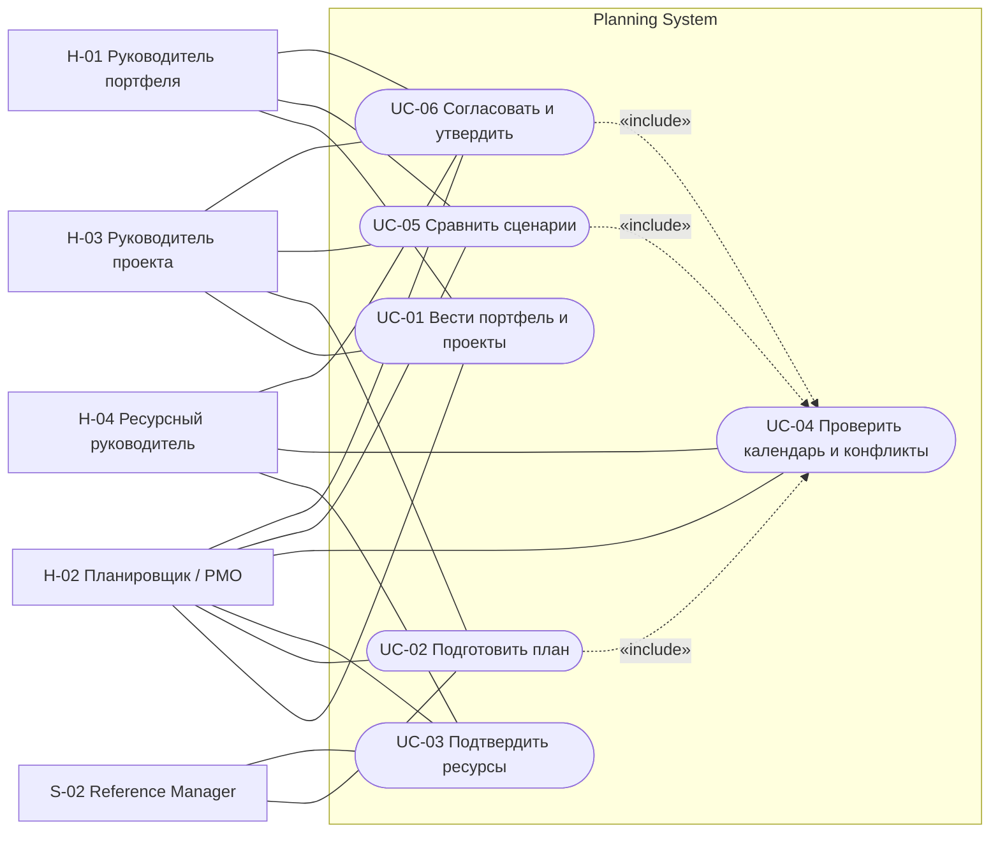
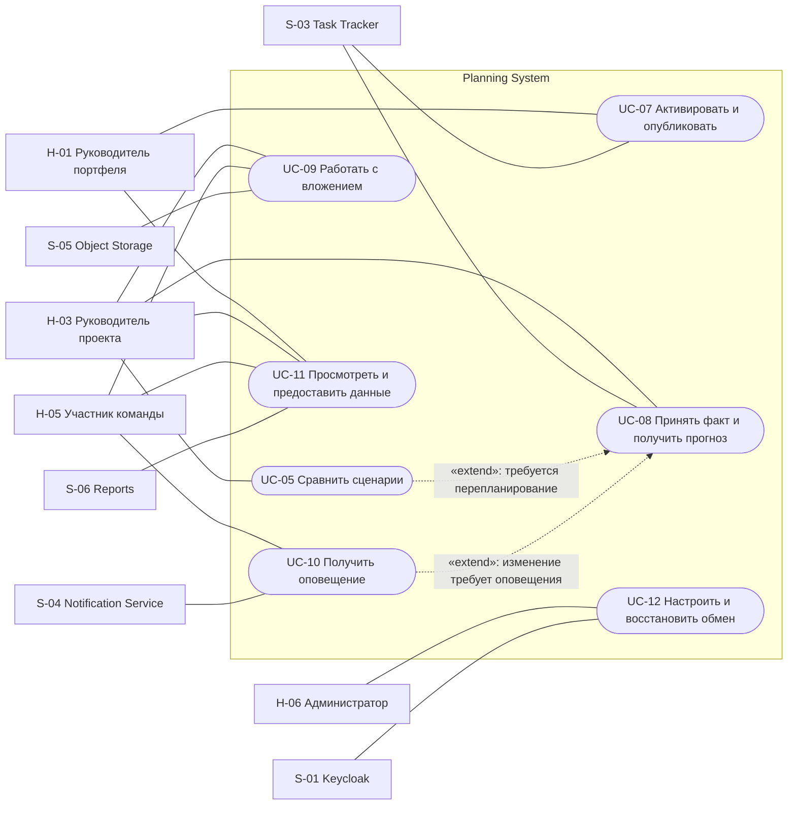

# 060 — Варианты использования Planning System

**Блок B.** Редакция 1.1 от 24.09.2026, к ревью команды.
Основания: [ТЗ FR-01–FR-15](technical-specification.md#42-функциональные-требования),
[акторы](030.actors.md), [сущности](050.entities.md), [Event Storming](040.event-storming.md).

## 1. Общие условия и обозначения

Для всех пользовательских сценариев требуется вход через Keycloak и проверка
права на действие и область проекта/ресурса. Для системных — проверенная сервисная
идентичность и разрешённый контракт. Ошибка доступа завершает сценарий до изменения
данных. Параллельное изменение той же редакции приводит к конфликту версии с
предложением перечитать данные; незаметная перезапись не допускается.

`include` — обязательное включение поведения другого UC; `extend` — условное
расширение базового UC в указанной точке. Стрелка include идёт от основного UC
к включаемому; extend — от расширения к базовому. Последовательность «после
утверждения опубликовать» сама по себе не является include.

Диаграммы используют Mermaid `flowchart` с овальными узлами, границей системы и
явными include/extend, как существующая [диаграмма проекта](diagrams/05-uml-use-cases.mmd).
Это переносимое представление UML Use Case для просмотра в репозитории.
Обозначение `usecaseDiagram` из задания не является выбранным синтаксисом:
[документация Mermaid](https://mermaid.js.org/syntax/usecase.html) задаёт для
специализированного типа `usecase-beta` начиная с версии 12. Для данного комплекта
использован совместимый с прежними рендерами `flowchart`.

## 2. Диаграммы вариантов использования

### 2.1. Подготовка и утверждение плана

### 2.2. Исполнение, обратная связь и сопровождение

Это обзорные диаграммы; полный круг участников и исключения для чтения/изменения
указаны в спецификациях. В частности, H-05 связан с UC-09 только для скачивания,
а H-03 активирует план только при явном делегировании.

## 3. Спецификации

### UC-01 — Вести портфель, программы и проекты

**Основные акторы:** H-01, H-02, H-03. **Сущности:** Portfolio, Program, Project.
**Предусловия:** доступна область портфеля; право создания/изменения подтверждено.
**Постусловия успеха:** проект и его принадлежность сохранены; при создании есть
первый DRAFT; при изменении сохранены автор и редакция. Существующий активный план
не заменён изменением карточки проекта.

**Основной поток:**

1. Актор открывает портфель, выбирает или создаёт программу при необходимости.
2. Задаёт код, название, цель, руководителя и приоритет проекта.
3. Система проверяет обязательные поля, уникальность кода и принадлежность программы
   тому же портфелю.
4. При создании сохраняет Project и первый пустой PlanVersion одной операцией;
   при изменении — новую редакцию карточки.
5. Показывает проект в портфельном списке и переход к UC-02.

**Альтернативы:**

- A1: программа не нужна — `programId=null`, проект остаётся в портфеле.
- A2: дублирующий код, неизвестный руководитель или недопустимый портфель —
  показать ошибку поля, ничего не сохранить частично.
- A3: H-01 меняет приоритет существующего проекта — сохранить ProjectChanged и
  предложить пересчитать затронутые варианты; утверждённые сроки автоматически не менять.
- A4: руководитель приостанавливает/возобновляет проект — требуется причина;
  будущие назначения не освобождаются автоматически.
- A5: проект завершён — после проверки незавершённых работ и будущих назначений
  перевести в COMPLETED; позднее допускается ARCHIVED. Для DRAFT доступна отмена.

**Связь:** FR-01; E-01–E-04, E-31. Статусы Project и критерии завершения —
проектное уточнение из 050.

### UC-02 — Подготовить годовой или скользящий план

**Основные акторы:** H-02, H-03. **Участвует:** S-02.
**Сущности:** PlanVersion, PlanItem, Dependency, ResourceDemand.
**Предусловия:** проект существует; редактируемая версия DRAFT; справочные коды
доступны через REST либо явно датированный локальный срез.
**Постусловия:** сохранён черновик с горизонтом, декомпозицией, оценками и
результатом проверки; утверждённая версия остаётся прежней.

**Основной поток:**

1. Актор выбирает годовой/скользящий режим и даты горизонта, создаёт новую версию
   либо открывает первый черновик.
2. Задаёт этапы, вехи, эпики и фичи; определяет даты и зависимости.
3. Выбирает роли/грейды по кодам НСИ и задаёт потребность в часах по листовым работам.
4. Система проверяет дерево, периоды и отсутствие циклов зависимостей; родительские
   суммы рассчитывает без двойного учёта.
5. Сохраняет новую contentRevision черновика.
6. Обязательно выполняет UC-04 и показывает календарь, Гант и обнаруженные проблемы.
   Подтверждение ресурсов выполняется отдельным UC-03.

**Альтернативы:**

- A1: копирование утверждённой версии — новая версия DRAFT с `baseVersionId`;
  сохранены logicalItemId, назначения становятся PROPOSED.
- A2: отсутствуют назначения/доступность — черновик можно сохранить и увидеть
  неполноту; отправить на согласование нельзя.
- A3: НСИ недоступна или значение DELETED — исторический план остаётся читаемым;
  выбор нового неподтверждённого значения блокируется, показывается причина.
- A4: циклическая зависимость, неверный горизонт или ненулевая трудоёмкость вехи —
  изменение отклоняется с указанием проблемных элементов.
- A5: актор отменяет ненужный черновик — DRAFT → ARCHIVED, исходная baseline сохраняется.

**Связь:** FR-02, FR-03, FR-04, FR-07, FR-09; E-04, E-05, E-10, E-30.

### UC-03 — Подтвердить доступность и распределить сотрудников

**Основные акторы:** H-04; H-02 предлагает назначения. **Участвует:** S-02.
**Сущности:** EmployeeAvailability, ResourceDemand, Allocation.
**Предусловия:** задана потребность в DRAFT; идентифицированы сотрудники, календарь,
роль и грейд. Источник и связь ID должны быть согласованы по D-03.
**Постусловия:** дневная доступность и назначения подтверждены либо сохранены
предложения с явными конфликтами; новые назначения не меняют активный план.

**Основной поток:**

1. Ресурсный руководитель проверяет календарную норму и отсутствия сотрудника.
2. Подтверждает дневную доступность с датой и автором.
3. Планировщик или ресурсный руководитель распределяет потребность по сотрудникам,
   дням и часам; система создаёт PROPOSED.
4. Система сопоставляет роль/грейд, период, потребность и общую загрузку в портфеле.
5. H-04 подтверждает подходящие назначения; записываются CONFIRMED, автор и время.
6. Система обновляет загрузку и показывает оставшийся дефицит/простой.

**Альтернативы:**

- A1: доступность неизвестна — показать «нет подтверждённых данных», не подставлять 8 часов.
- A2: превышение доступности или несовпадение роли/грейда — оставить предложение
  неподтверждённым; предложить замену, перенос или UC-05.
- A3: подтверждённое назначение изменено в DRAFT — вернуть его в PROPOSED и запросить
  новое подтверждение. В утверждённой версии сначала создаётся новая копия.
- A4: изменились отсутствия — создать новую редакцию доступности, повторно выявить
  конфликты, уведомить ответственных; сохранённую baseline не исправлять.
- A5: назначение снято в черновике — CANCELLED; историческая запись остаётся.

**Связь:** FR-04, FR-05, FR-06; E-06–E-09.

### UC-04 — Проверить календарь, зависимости и ресурсные конфликты

**Основные акторы:** H-02, H-03, H-04; вызывается из UC-02, UC-05, UC-06.
**Сущности:** PlanVersion с дочерними объектами, EmployeeAvailability.
**Предусловия:** выбран вариант и явный набор версий остальных проектов портфеля.
**Постусловия:** показаны Гант по проектам/людям и результат проверок на определённом
срезе. Конфликты сохранены как результаты расчёта; автоматического утверждения нет.

**Основной поток:**

1. Система фиксирует contentRevision и версии входных данных.
2. Проверяет даты, дерево и зависимости, рассчитывает календарные ограничения.
3. Суммирует дневные назначения сотрудника, заменяя вариант его проекта в портфеле.
4. Рассчитывает перегрузку, простой, дефицит и избыточное покрытие потребности.
5. Показывает Гант и список причин с сотрудником/ролью, датой, часами и работой.
6. Отмечает результат как актуальный для проверенной редакции.

**Альтернативы:**

- A1: неполные входы — показать список недостающих данных; «не проверено» не равно
  «конфликтов нет».
- A2: конфликт — пользователь меняет черновик либо создаёт сценарий; сама проверка
  не переносит сроки в утверждённой версии.
- A3: данные изменились во время расчёта — результат помечается устаревшим,
  предлагается повтор; при утверждении он не принимается.
- A4: превышено допустимое время расчёта/произошла ошибка — предыдущий результат
  остаётся с меткой актуальности, успешный новый результат не заявляется.

**Связь:** FR-06, FR-07; E-08, E-10.

### UC-05 — Создать и сравнить сценарии «что если»

**Основные акторы:** H-02, H-03; H-01 выбирает вариант.
**Сущности:** PlanVersion (SCENARIO), ForecastSnapshot.
**Предусловия:** выбрана исходная версия и доступны её данные; есть право создать
вариант. При расширении UC-08 точка входа — решение после просмотра отклонения.
**Постусловия:** сохранены изолированные варианты и сравнение последствий;
действующая версия не заменена.

**Основной поток:**

1. Актор создаёт сценарий с именем и baseVersionId.
2. Изменяет даты, объём, оценки либо состав/часы назначений в копии.
3. Система выполняет UC-04 и пересчёт прогноза на известном срезе факта.
4. Показывает различия с базой: завершение, загрузка, дефицит, остаток часов и
   денежная корректировка, если для неё достаточно данных.
5. Актор сравнивает варианты и выбирает один для отправки на согласование UC-06.

**Альтернативы:**

- A1: сравниваемые варианты используют разные срезы — явно показать различие либо
  пересчитать на общих входах; не выдавать изменение факта за эффект сценария.
- A2: ставки/валюта отсутствуют — сравнение сроков и часов доступно, денежные
  показатели имеют пометку «нет данных».
- A3: ни один вариант не выбран — активный план сохраняется, ненужный DRAFT можно архивировать.
- A4: исходная активная версия уже замещена — показать устаревшую основу; перед
  дальнейшим утверждением требуется повторная проверка текущего портфеля.

**Связь:** FR-08, FR-09, FR-10; E-24, E-25. Include UC-04; extend UC-08 по
условию «руководитель решил перепланировать».

### UC-06 — Согласовать и утвердить версию

**Основные акторы:** H-02/H-03 — отправитель; H-04 — ресурсный согласующий;
H-01 — финальный согласующий, либо H-03 с явно делегированным правом.
**Сущности:** PlanVersion, ApprovalDecision, Allocation.
**Предусловия:** версия DRAFT; определены обязательные согласующие; отправитель
не получает права утверждения автоматически.
**Постусловия успеха:** APPROVED и неизменяемая baseline с решениями, автором и
временем; версия ещё не активирована и не считается опубликованной.

**Основной поток:**

1. Отправитель запрашивает согласование конкретной contentRevision.
2. Система выполняет UC-04 и проверяет подтверждения назначений, актуальность
   доступности, отсутствие блокирующих конфликтов и наличие согласующих.
3. Фиксирует reviewRound, состав согласующих и ON_REVIEW; создаёт запрос оповещения.
4. Ресурсные согласующие проверяют закреплённую редакцию и записывают решения.
5. Финальный согласующий изучает календарь, риски и ресурсные подтверждения.
6. Система повторно проверяет актуальность входов; после всех необходимых APPROVE
   фиксирует APPROVED, approvedBy/approvedAt и неизменяемую baseline.
7. Отображает решение и доступную отдельную команду активации UC-07.

**Альтернативы:**

- A1: RETURN от согласующего — обязателен комментарий, ON_REVIEW → DRAFT; после
  изменения потребуется новый reviewRound, старые решения не переиспользуются.
- A2: нет обязательного согласующего/подтверждения или есть конфликт — отправка
  блокируется с конкретным списком причин.
- A3: данные ресурсов изменились на согласовании — повторить проверку; если нужно
  изменение содержания, вернуть версию в DRAFT.
- A4: попытка исправить APPROVED — создать новый DRAFT от неё; прямое редактирование запрещено.
- A5: уполномоченный руководитель отменяет APPROVED до активации — ARCHIVED с причиной.
- A6: сбой оповещения — решение сохраняется, запрос доставки видим как неуспешный.

**Связь:** FR-09, FR-14; E-11–E-13, E-28, E-30. Маршрут и блокирующие проверки —
проектное уточнение D-06/D-08.

### UC-07 — Активировать версию и опубликовать плановые рамки

**Основные акторы:** H-01 или делегированный H-03; H-02 наблюдает публикацию,
H-06 повторяет доставку. **Участвует:** S-03.
**Сущности:** Project, PlanVersion, Publication.
**Предусловия:** версия APPROVED, проект допускает исполнение, проверены актуальность
ресурсов и полномочия; контракт приёма Task Tracker согласован (D-01).
**Постусловия успеха:** версия ACTIVE, предыдущая SUPERSEDED, Task Tracker подтвердил
приём именно этой версии; статус публикации SUCCEEDED.
**Минимальная гарантия:** если внешний обмен не завершён, локальная активация и её
неопубликованное состояние видимы, история версий не повреждена.

**Основной поток:**

1. Актор выбирает утверждённую версию и вводит её в действие.
2. Система проверяет ожидаемую revision проекта и актуальность расчёта ресурсов.
3. Одной локальной операцией меняет активный указатель, статусы двух версий и
   сохраняет намерение публикации с устойчивым ключом.
4. Передаёт проект, ID версии, структуру, сроки и назначения через согласованный API/событие.
5. Task Tracker сопоставляет внешний projectId и версию, применяет допустимое
   обновление и подтверждает результат по тому же ключу.
6. Система фиксирует SUCCEEDED и показывает время/результат синхронизации.

**Альтернативы:**

- A1: другая активация опередила эту — вернуть конфликт редакции; не создать две ACTIVE.
- A2: отказ/тайм-аут — сохранить FAILED с различием «отказ»/«результат неизвестен»;
  при повторе сначала сверить состояние получателя, использовать прежний ключ.
- A3: повтор того же запроса — вернуть существующую публикацию, не дублировать проект/работы.
- A4: версия замещена до отправки — не отправлять её как текущую; опубликовать новую.
  Запоздалое старое сообщение не должно затереть новое состояние у получателя.
- A5: контракт S-03 ещё не согласован — сквозной успех не может быть продемонстрирован
  как готовая интеграция; открытая зависимость отображается по D-01.

**Связь:** FR-09, FR-11; E-14–E-17. Прогноз и бюджетная корректировка передаются
отдельным обновлением UC-08, не изменяя baseline.

### UC-08 — Принять факт исполнения и получить единый прогноз

**Основной системный актор:** S-03. **Пользователь результата:** H-03, H-02.
**Сущности:** TaskSnapshot, ForecastSnapshot, ForecastLine.
**Предусловия:** проект и связь задачи известны; есть версия для сравнения;
согласованы схема события, способ версионирования и сверки с источником (D-01).
**Постусловия:** новое допустимое состояние источника учтено один раз; создан
объяснимый прогноз с качеством и датой среза; плановое содержимое не изменено.

**Основной поток:**

1. Task Tracker передаёт TaskCreated/TaskChanged/TimeLogged или результат REST-сверки.
2. Система проверяет схему, внешний ID проекта/задачи, eventId и версию источника.
3. Обновляет локальную проекцию, фиксирует обработку события в одной локальной операции.
4. Формирует срез факта по листовым работам без двойного учёта связанных задач.
5. Рассчитывает остаток часов, календарное завершение и при достаточных данных
   бюджетную корректировку по правилам 050 §3.7.
6. Сохраняет ForecastSnapshot со ссылками на входные редакции, показывает план-факт.
7. При изменении показателей формирует согласованные обновления для Task Tracker/Reports.
   В точке «обнаружено значимое изменение» запускает UC-10; по решению руководителя
   «нужно перепланирование» может быть расширен UC-05.

**Альтернативы:**

- A1: дубликат — подтвердить уже выполненную обработку; не увеличивать часы и
  не отправлять повторное оповещение.
- A2: старая версия/нарушенный порядок — не затирать более новый срез; при разрыве
  последовательности запросить сверку через REST.
- A3: неизвестный projectId/logicalItemId — зафиксировать проблему сопоставления,
  не создавать проект автоматически и не считать неизвестную работу завершённой.
- A4: TaskCommented без изменения расчётных полей — обновить доступную информацию
  по контракту и инициировать оповещение; пересчёт чисел не обязателен.
- A5: отсутствует остаток, календарь или стоимость — PARTIAL и список недостающих
  входов; неизвестные значения не заменяются нулями.
- A6: ошибка источника/расчёта — оставить прежний результат с меткой актуальности,
  новое успешное вычисление не заявлять.
- A7: Task Tracker передал арифметический остаток «план − факт» — сохранить его
  отдельно с исходным знаком; для прогноза запросить оценку часов до завершения
  либо отметить PARTIAL. Перерасход не означает нулевую оставшуюся работу.
- A8: рабочий элемент жёстко удалён в источнике — применить только согласованный
  сигнал удаления/полную сверку; до согласования обработки локального факта
  показать проблему качества, не обнулять трудозатраты по неполному ответу API.

**Связь:** FR-10, FR-12, FR-14; E-18–E-23. Пороги существенности и стоимость — D-07.

### UC-09 — Загрузить, скачать или удалить вложение

**Основные акторы:** H-02/H-03 — изменение; H-01/H-04/H-05 — чтение по правам.
**Участвует:** S-05. **Сущность:** Attachment.
**Предусловия:** существует проект, версия или сценарий; право операции проверено.
Для изменения состава вложений версии она должна быть DRAFT.
**Постусловия:** файл доступен и связан ровно с одним владельцем либо подтверждённо
удалён; авторство и время сохранены. При скачивании данные не меняются.

**Основной поток загрузки:**

1. Актор выбирает владельца и файл.
2. Система проверяет права, размер, допустимый тип и состояние владельца.
3. Создаёт UPLOADING и уникальный objectKey, передаёт файл в Object Storage.
4. После подтверждения хранения и проверки контрольной суммы записывает AVAILABLE,
   uploadedAt/By и показывает вложение.

**Альтернативы:**

- A1: скачивание — повторно проверить доступ к владельцу и AVAILABLE, выдать файл
  или ограниченную по сроку ссылку без постоянного публичного доступа.
- A2: удаление — проверить право, перейти в DELETE_PENDING, после подтверждения
  отсутствия объекта в DELETED; ошибка остаётся видимой для повторной попытки.
- A3: недопустимый тип/размер — отказ до публикации вложения.
- A4: сбой загрузки — UPLOAD_FAILED; неполный объект не доступен для скачивания,
  повтор/очистка использует сохранённую операцию.
- A5: владелец уже утверждён — предложить вложение к проекту или новому черновику;
  состав baseline не менять.

**Связь:** FR-13; E-26, E-27.

### UC-10 — Сформировать и получить оповещение

**Инициатор:** политика изменения плана/задачи; **системный актор:** S-04;
**получатели:** H-01–H-05 в своей области доступа. **Сущность:** Notification.
**Предусловия:** зафиксировано событие-причина, определены разрешённые получатели
и шаблон. Канал доставки и подтверждение согласованы по D-04.
**Постусловия:** запрос видим в приложении, результат внешней доставки известен
или явно ожидается; одна причина не создала дубликаты для одного адресата/канала.

**Основной поток:**

1. Система определяет причину: связанная задача создана/изменена, ресурсный конфликт,
   решение по плану или существенное отклонение прогноза.
2. Выбирает получателей по проекту и правам; сохраняет запрос с уникальным ключом.
3. Показывает оповещение внутри приложения и отправляет шаблонные параметры в S-04.
4. Принятие запроса переводит его в SENT; подтверждение доставки — в DELIVERED.
5. Получатель открывает связанный объект, доступ повторно проверяется.

**Альтернативы:**

- A1: повтор события — вернуть существующий запрос; новое оповещение не создавать.
- A2: сервис/канал недоступен — FAILED либо ожидание согласно контракту, доступен
  повтор с тем же ID; само бизнес-изменение остаётся сохранённым.
- A3: права получателя изменились — объект не раскрывается при переходе;
  шаблон изначально содержит только необходимые разрешённые данные.
- A4: позднее/повторное подтверждение — сверить ID и обновить существующий запрос.

**Связь:** FR-14; E-28, E-29; условное расширение UC-08. Входящие события решений
UC-06 и активации UC-07 также могут инициировать этот UC.

### UC-11 — Просмотреть календарь, отчёты и предоставить данные Reports

**Основные акторы:** H-01–H-04; H-05 — собственные назначения; S-06 — сервисный потребитель.
**Сущности:** Project, PlanVersion, Allocation, EmployeeAvailability, ForecastSnapshot.
**Предусловия:** выбраны область, период и версия/baseline; право на персональные
и стоимостные данные проверено отдельно. Контракт выдачи Reports — D-05.
**Постусловия:** показаны или переданы согласованные данные с версией, датой среза,
качеством и ограничением области; план не изменён.

**Основной поток:**

1. Пользователь выбирает период, проекты/людей и представление: Гант, загрузка,
   дефицит или план-факт. Reports задаёт эквивалентные фильтры REST-запросом.
2. Система проверяет область доступа и определяет активную либо явно указанную версию.
3. Собирает плановые данные, факт и прогноз, сохраняя их исходные ID и дату актуальности.
4. Показывает показатели, причины конфликтов и ограничения данных либо возвращает
   согласованную проекцию Reports.
5. Пользователь может раскрыть показатель до работы/назначения; Reports строит
   свою витрину и межмодульный отчёт.

**Альтернативы:**

- A1: участник запрашивает личный календарь — только его разрешённые назначения;
  чужая занятость и бюджет не добавляются автоматически.
- A2: нет данных за период — пустое состояние с причиной; оно отличается от нулевой загрузки.
- A3: источник/прогноз устарел или PARTIAL — отображается дата среза и недостающие входы.
- A4: запрошена историческая версия — явно показать её идентификатор; не смешивать
  её план с другим baseline под тем же заголовком.

**Связь:** FR-05, FR-06, FR-07, FR-10, FR-15. Создание межмодульных отчётов
принадлежит Reports; Planning System предоставляет данные и оперативные представления.

### UC-12 — Настроить доступ и восстановить интеграционный обмен

**Основной актор:** H-06. **Участвуют:** S-01–S-06 и команда Infra как поставщик конфигурации.
**Объекты:** настройки модуля, Publication, Notification, журнал приёма событий.
**Предусловия:** есть административное право на соответствующую область;
секреты предоставлены средствами окружения, бизнес-контракт уже согласован.
**Постусловия:** настройки проверены, результат диагностики/повтора видим и аудирован;
бизнес-содержимое утверждённых планов не изменено.

**Основной поток:**

1. Администратор настраивает адреса/идентификаторы интеграций, привязку ролей
   и области доступа, ссылки на секреты, разрешённые типы/размеры вложений.
2. Проверяет вход через Keycloak, чтение согласованных НСИ и доступность остальных сервисов.
3. Открывает ошибки обмена: выбирает неуспешную публикацию, доставку или событие сверки.
4. Устраняет причину настройки, проверяет актуальность операции и инициирует повтор.
5. Система сохраняет прежние ключи идемпотентности, показывает фактический результат
   и записывает автора административного действия.

**Альтернативы:**

- A1: нет внешнего контракта или сервис ещё не предоставлен — показать зависимость
  D-01/D-04/D-05, тестовая заглушка не считается рабочей интеграцией.
- A2: ошибка доступа/секрета — понятная диагностика без вывода самого секрета.
- A3: исходная версия уже замещена — старую публикацию не повторять; работать с текущей.
- A4: нужно изменить НСИ/учётную запись — обращение к штатным средствам владельца;
  Planning System не заводит собственный реестр паролей или копию справочника-мастера.

**Связь:** ТЗ §4.4–4.5, поддержка FR-11–FR-14; правила восстановления E-17/E-29.

## 4. Покрытие функциональных требований

Таблица связывает сценарии с существующим ТЗ. Это навигация внутри блока B,
а не замена полной матрицы тестов и требований блока D.

| Требование ТЗ | Содержание | Use Cases |
| --- | --- | --- |
| FR-01 | Проекты, программы, приоритеты | UC-01 |
| FR-02 | Годовой и скользящий планы | UC-02, UC-05, UC-08 |
| FR-03 | Этапы, вехи, эпики, фичи | UC-02 |
| FR-04 | Часы, роли и грейды | UC-02, UC-03 |
| FR-05 | Доступность и назначения по периодам | UC-03, UC-11 |
| FR-06 | Перегрузка, простой и дефицит | UC-03, UC-04, UC-11 |
| FR-07 | Даты, зависимости и Гант | UC-02, UC-04, UC-11 |
| FR-08 | Сценарии и последствия сдвигов | UC-05 |
| FR-09 | Версии и неизменяемая baseline | UC-02, UC-05, UC-06, UC-07 |
| FR-10 | Единый прогноз остатка и бюджета | UC-05, UC-08, UC-11 |
| FR-11 | Передача проектов и плановых рамок в Task Tracker | UC-07 |
| FR-12 | Приём задач, истории и факта | UC-08 |
| FR-13 | Вложения | UC-09 |
| FR-14 | Оповещения | UC-06, UC-08, UC-10 |
| FR-15 | Отчёты по срокам, загрузке и отклонениям | UC-11 |

## 5. Связь с будущими user stories

Истории блока C теперь приведены в файлах `080.*-user-stories.md` по шести
акторам; ссылки на них собраны в [090 — Эпики](090.features-epics.md). Истории
сохраняют ID UC-01–UC-12 и акторов H-01–H-06, а критерии Given–When–Then включают
штатные и альтернативные потоки. Полная трассировка требований и тестовых
спецификаций приведена в [095](095.requirements-check.md).
