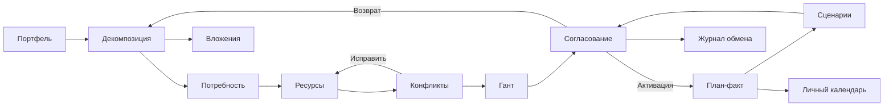

# 110 — Проектирование интерфейса

Редакция 1.0, 05.10.2026. [Кликабельный прототип](../ui/prototype/index.html),
[сценарии его проверки](115.live-prototype.md). Экраны спроектированы для
настольной работы; навигация и таблицы адаптируются к узкому экрану.

## Принципы и общие состояния

Единые названия/кнопки и постоянный контекст проекта/версии. Основное действие
одно на шаг; статус версии и свежесть данных рядом с заголовком. Сначала обзор,
затем детали. Ошибка сохранения не стирает введённые поля. Видимый фокус,
подписанные inputs, клавиатурная навигация, текст вместо одного цвета.
Подтверждение активации/архивации называет версию и последствия, «Отмена» безопасна.

Черновик: автосохранение валидного поля после завершения ввода; «Сохранение…» →
«Сохранено, revision N»; ошибка → «Не сохранено» с повтором. API If-Match не
позволяет молча затереть чужую редакцию: 412 показывает перечитать/сравнить.
В прототипе onChange сохраняет в localStorage; сервер и конфликт редакций не эмулируются.
Перед расчётом показываются входы, версия и неполные поля; готовый результат
не заменяет baseline. PARTIAL содержит причины, нулевое значение показывается как 0.

Для каждого экрана: loading — индикатор и недоступное повторное действие;
empty — объяснение и следующий разрешённый шаг; error — причина, сохранение
контекста и кнопка «Повторить». Устаревший срез получает dataAsOf и предупреждение.
Технические секреты/stack trace не выводятся. Прототип позволяет выбрать три
состояния экрана вручную; это иллюстрация, а не реальный сетевой отказ.

## Экраны, зоны и трассировка

| Экран | Структура и действия | Empty / error в предметной области | UC / истории |
| --- | --- | --- | --- |
| UI-01 Портфель и проекты | Фильтры/поиск, показатели, список с пагинацией, карточка проекта; создание, приоритет, архив | Нет проектов → создать; ошибка списка → повтор без пустого успеха | UC-01; US-PO-01, US-PM-01 |
| UI-02 Декомпозиция | Дерево этап/релиз/эпик/фича/веха, панель дат/оценок, revision | Пустая структура → первый элемент; цикл/даты подсвечиваются у поля | UC-02; US-PL-01, US-PM-01 |
| UI-03 Потребность | Таблица листов, роль/грейд, период и часы | Нет оценки → добавить; недоступная НСИ → старое значение читается | UC-02/03; US-PL-02, US-RM-02 |
| UI-04 Доступность и назначения | Дневная мощность, отсутствие, сотрудники, назначения и подтверждение | Нет календаря → неизвестно; перегрузка блокирует согласование | UC-03; US-RM-01/02, US-PL-02 |
| UI-05 Гант | Шкала времени, строки проекта/людей, FS-зависимости и вехи | Нет дат → заполнить; цикл → выделить связи | UC-04; US-PL-03 |
| UI-06 Конфликты | Список перегрузки/простоя/дефицита с числами и переходом к причине | Конфликтов нет — отдельный успех; сбой расчёта не означает отсутствие конфликтов | UC-04; US-PL-02, US-RM-02 |
| UI-07 Сценарии | Baseline и вариант рядом; разницы сроков/часов/стоимости и качества | Нет baseline → утвердить; несопоставимые входы → объяснение | UC-05; US-PL-04, US-PM-04, US-PO-02 |
| UI-08 Согласование | Статус, round/revision, список согласующих, замечания, решения, активация | Нет маршрута → настроить; устаревшая редакция → перечитать | UC-06/07; US-PO-02/03, US-PM-04 |
| UI-09 Личный календарь | Только свои активные назначения, дни, оповещения | Назначений нет; чужие ресурсы не показываются | UC-10/11; US-TM-01/02 |
| UI-10 Вложения | Владелец, список файлов, прогресс/статус, загрузить/скачать/удалить | Нет файлов; MIME/размер/сбой S3 объясняются до AVAILABLE | UC-09; US-PM-03, US-TM-01 |
| UI-11 План-факт/прогноз | Baseline, факт, ETC, даты, quality/missingInputs; деньги по cost.read | Нет факта/ETC → PARTIAL; не подменять неизвестное нулём | UC-08/11; US-PM-02, US-PO-04 |
| UI-12 Журнал обмена | Система, операция, время, status/retry/DLQ, correlationId; проверка/повтор | Нет операций; ошибка показывает код без секрета и содержимого плана | UC-12; US-AD-01/02/03/04 |

## Роль и контекст

[070](070.role-matrix.md) — источник прав. R-01 видит обзор/сравнение и решения;
R-02 — редактирование DRAFT/сценария и отправку; R-03 — то же в своих проектах,
без финального решения по умолчанию; R-04 — свои ресурсы и ресурсные подтверждения;
R-05 — свой календарь/оповещения и разрешённые вложения; R-06 — технический журнал
и настройки, без редактирования/утверждения плана. Кнопки без права скрываются,
временно недоступные по состоянию — disabled с объяснением. Сервер проверяет
всё заново. Смена роли в прототипе — инструмент демонстрации, не аутентификация.

## Карта переходов

Сквозные Activity/Sequence — [060](060.use-cases.md) и [155](155.sequence-diagrams.md).
Полный дизайн включает поиск, пагинацию, дерево, серверное сохранение и реальные
файлы; границы реализации HTML-демо явно перечислены в 115.
