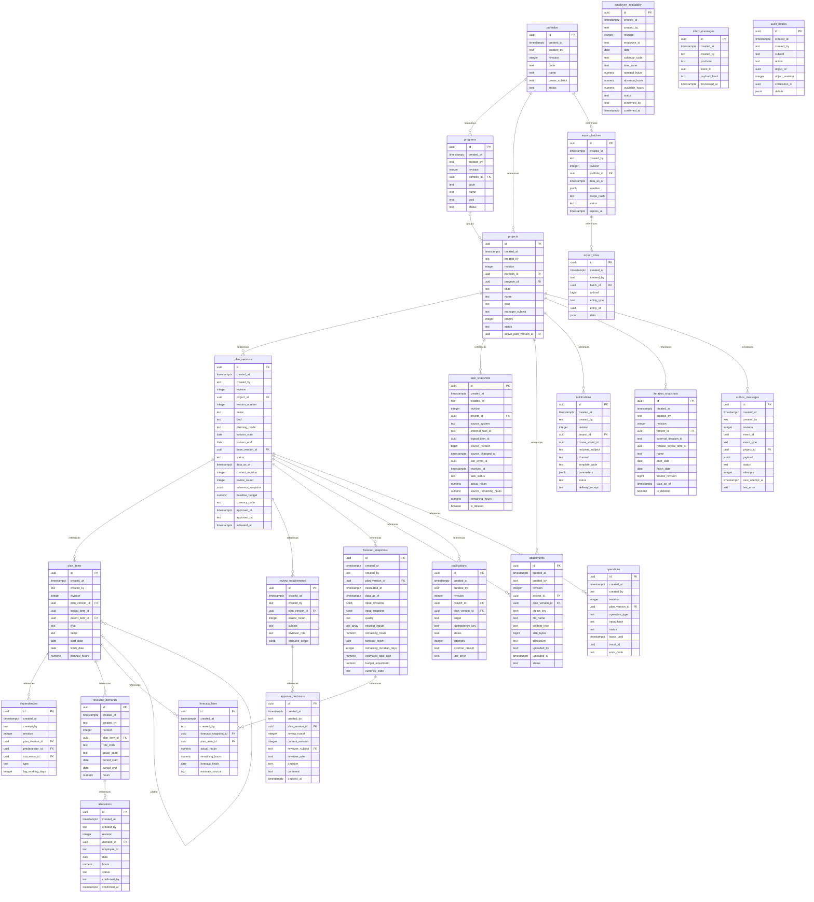

# 120 — Физическая модель данных

Редакция 1.0, 05.10.2026. Проект PostgreSQL, миграции ещё не реализованы.
Источник доменной семантики — [050](050.entities.md); решения — [145](145.architecture-decisions.md).
Генератор: [build-data-model.mjs](../scripts/build-data-model.mjs).

## Правила хранения

NN означает NOT NULL; NULL допускается только явно. PK каждой таблицы — id.
У всех строк created_at/created_by; revision есть только у изменяемых записей.
UUID задаёт приложение; decimal не float. UTC для моментов, date + IANA TZ для
календаря. Все FK локальные, ON DELETE RESTRICT по умолчанию. Полиморфные/внешние
ссылки проверяет сервис. Бизнес-объекты архивируются статусом, физического delete нет.
Удалять дочерние строки DRAFT можно только через доменную транзакцию с проверкой
ссылок; каскадного удаления исторических данных нет. Только export_rows допускает
ON DELETE CASCADE от EXPIRED export_batches при регламентной очистке.

JSONB не отменяет схему: referenceSnapshot и inputSnapshot сохраняют методику,
значения, source revisions и ручные оценки с автором; envelope определяется 140.
Изменение состояния после APPROVED не разрешает менять плановое содержимое.
Триггеры/сервисные транзакции проверяют это также для дочерних таблиц.

## ER-диаграмма

Связь Attachment с Project/PlanVersion — XOR: ровно один владелец.
Allocation и EmployeeAvailability соединяются логически по employeeId/date,
не FK на текущую строку; inputSnapshot фиксирует конкретную редакцию.
Inbox и audit самостоятельны и не удаляются каскадом.

## Таблицы и соответствие 050

### Portfolio → portfolios

| Столбец | PostgreSQL | Ограничения | Атрибут / семантика |
| --- | --- | --- | --- |
| id | uuid | PK, NN | id — устойчивый локальный ID |
| created_at | timestamptz | NN | createdAt — UTC создания |
| created_by | text | NN | createdBy — subject/service ID, не пароль |
| revision | integer | NN, CHECK >= 1 | revision — оптимистическая блокировка |
| code | text | NN, UNIQUE | code — код портфеля в единой организации |
| name | text | NN | name — название |
| owner_subject | text | NN | ownerSubject — владелец в Keycloak |
| status | text | NN, CHECK ACTIVE/ARCHIVED | status — жизненный цикл |

**Правила:** Коды не переиспользуются после архивации; CHECK btrim(code/name) <> пустая строка.

**Индексы сверх PK:** UNIQUE(code); INDEX(owner_subject) WHERE status = ACTIVE.

### Program → programs

| Столбец | PostgreSQL | Ограничения | Атрибут / семантика |
| --- | --- | --- | --- |
| id | uuid | PK, NN | id — устойчивый локальный ID |
| created_at | timestamptz | NN | createdAt — UTC создания |
| created_by | text | NN | createdBy — subject/service ID, не пароль |
| revision | integer | NN, CHECK >= 1 | revision — оптимистическая блокировка |
| portfolio_id | uuid | NN, FK portfolios | portfolioId |
| code | text | NN | code |
| name | text | NN | name |
| goal | text | NN | goal |
| status | text | NN, CHECK ACTIVE/ARCHIVED | status |

**Правила:** Непустые code/name/goal. UNIQUE(id, portfolio_id) — цель составной FK Project.

**Индексы сверх PK:** UNIQUE(portfolio_id, code); INDEX(portfolio_id) WHERE status = ACTIVE.

### Project → projects

| Столбец | PostgreSQL | Ограничения | Атрибут / семантика |
| --- | --- | --- | --- |
| id | uuid | PK, NN | id — устойчивый локальный ID |
| created_at | timestamptz | NN | createdAt — UTC создания |
| created_by | text | NN | createdBy — subject/service ID, не пароль |
| revision | integer | NN, CHECK >= 1 | revision — оптимистическая блокировка |
| portfolio_id | uuid | NN, FK portfolios | portfolioId |
| program_id | uuid | NULL, FK (program_id,portfolio_id) → programs(id,portfolio_id) | programId — программа того же портфеля |
| code | text | NN | code |
| name | text | NN | name |
| goal | text | NN | goal |
| manager_subject | text | NN | managerSubject |
| priority | integer | NN, CHECK >= 1 | priority |
| status | text | NN, CHECK DRAFT/ACTIVE/ON_HOLD/COMPLETED/ARCHIVED | status |
| active_plan_version_id | uuid | NULL, deferred FK (id,active_plan_version_id) → plan_versions(project_id,id) | activePlanVersionId |

**Правила:** Project и первый DRAFT создаются одной транзакцией. Указатель обязан вести на ACTIVE этого проекта; deferred trigger проверяет статус в конце транзакции.

**Индексы сверх PK:** UNIQUE(portfolio_id, code); INDEX(portfolio_id, priority, id) WHERE status <> ARCHIVED; INDEX(manager_subject).

### PlanVersion → plan_versions

| Столбец | PostgreSQL | Ограничения | Атрибут / семантика |
| --- | --- | --- | --- |
| id | uuid | PK, NN | id — устойчивый локальный ID |
| created_at | timestamptz | NN | createdAt — UTC создания |
| created_by | text | NN | createdBy — subject/service ID, не пароль |
| revision | integer | NN, CHECK >= 1 | revision — оптимистическая блокировка |
| project_id | uuid | NN, FK projects | projectId |
| version_number | integer | NN, CHECK >= 1 | versionNumber |
| name | text | NN | name |
| kind | text | NN, CHECK PLAN/SCENARIO | kind |
| planning_mode | text | NN, CHECK ANNUAL/ROLLING | planningMode |
| horizon_start | date | NN | horizonStart |
| horizon_end | date | NN | horizonEnd |
| base_version_id | uuid | NULL, composite FK (project_id,base_version_id) → plan_versions(project_id,id) | baseVersionId |
| status | text | NN, enum из 050 §4.1 | status |
| data_as_of | timestamptz | NULL | dataAsOf |
| content_revision | integer | NN, CHECK >= 1 | contentRevision |
| review_round | integer | NN, CHECK >= 0 | reviewRound |
| reference_snapshot | jsonb | NN, DEFAULT {} | referenceSnapshot — имена/ревизии НСИ и календарные предпосылки |
| baseline_budget | numeric(18,2) | NULL, CHECK >= 0 | baselineBudget |
| currency_code | text | NULL | currencyCode — внешний код |
| approved_at | timestamptz | NULL | approvedAt |
| approved_by | text | NULL | approvedBy |
| activated_at | timestamptz | NULL | activatedAt |

**Правила:** CHECK start <= end; ANNUAL в одном календарном году. budget/currency заполнены вместе. requiredReviewers нормализован в review_requirements. На SCENARIO base обязателен. Циклы base запрещены. Статусы после APPROVED требуют approvedAt/By.

**Индексы сверх PK:** UNIQUE(project_id, version_number); UNIQUE(project_id,id); UNIQUE(project_id) WHERE status = ACTIVE; INDEX(project_id,status,version_number).

### PlanItem → plan_items

| Столбец | PostgreSQL | Ограничения | Атрибут / семантика |
| --- | --- | --- | --- |
| id | uuid | PK, NN | id — устойчивый локальный ID |
| created_at | timestamptz | NN | createdAt — UTC создания |
| created_by | text | NN | createdBy — subject/service ID, не пароль |
| revision | integer | NN, CHECK >= 1 | revision — оптимистическая блокировка |
| plan_version_id | uuid | NN, FK plan_versions | planVersionId |
| logical_item_id | uuid | NN | logicalItemId — общий для копий версии |
| parent_item_id | uuid | NULL, composite FK (plan_version_id,parent_item_id) → plan_items(plan_version_id,id) | parentItemId |
| type | text | NN, CHECK STAGE/MILESTONE/EPIC/FEATURE/RELEASE | type — RELEASE добавлен для QA |
| name | text | NN | name |
| start_date | date | NN | start |
| finish_date | date | NN | finish |
| planned_hours | numeric(12,2) | NN, CHECK >= 0 | plannedHours — материализованный итог |

**Правила:** UNIQUE(plan_version_id,id). Дерево и даты внутри горизонта/родителя проверяются в транзакции. RELEASE — контейнер эпиков/фич/вех, не итерация TT. Часы родителей пересчитываются из листьев; MILESTONE start=finish и часы=0.

**Индексы сверх PK:** UNIQUE(plan_version_id,logical_item_id); INDEX(plan_version_id,parent_item_id); INDEX(plan_version_id,start_date,finish_date).

### Dependency → dependencies

| Столбец | PostgreSQL | Ограничения | Атрибут / семантика |
| --- | --- | --- | --- |
| id | uuid | PK, NN | id — устойчивый локальный ID |
| created_at | timestamptz | NN | createdAt — UTC создания |
| created_by | text | NN | createdBy — subject/service ID, не пароль |
| revision | integer | NN, CHECK >= 1 | revision — оптимистическая блокировка |
| plan_version_id | uuid | NN, FK plan_versions | planVersionId |
| predecessor_id | uuid | NN, composite FK → plan_items(plan_version_id,id) | predecessorId |
| successor_id | uuid | NN, composite FK → plan_items(plan_version_id,id) | successorId |
| type | text | NN, CHECK FS | type |
| lag_working_days | integer | NN, CHECK >= 0 | lagWorkingDays |

**Правила:** CHECK predecessor_id <> successor_id; цикл запрещён; FS проверяется по рабочим дням выбранного календаря.

**Индексы сверх PK:** UNIQUE(plan_version_id,predecessor_id,successor_id); INDEX(plan_version_id,successor_id).

### ResourceDemand → resource_demands

| Столбец | PostgreSQL | Ограничения | Атрибут / семантика |
| --- | --- | --- | --- |
| id | uuid | PK, NN | id — устойчивый локальный ID |
| created_at | timestamptz | NN | createdAt — UTC создания |
| created_by | text | NN | createdBy — subject/service ID, не пароль |
| revision | integer | NN, CHECK >= 1 | revision — оптимистическая блокировка |
| plan_item_id | uuid | NN, FK plan_items | planItemId |
| role_code | text | NN | roleCode — внешний код |
| grade_code | text | NN | gradeCode — внешний код |
| period_start | date | NN | periodStart |
| period_end | date | NN | periodEnd |
| hours | numeric(12,2) | NN, CHECK > 0 | hours |

**Правила:** Период внутри листа, start <= end; у MILESTONE и нелистового элемента потребность запрещена.

**Индексы сверх PK:** UNIQUE(plan_item_id,role_code,grade_code,period_start,period_end).

### EmployeeAvailability → employee_availability

| Столбец | PostgreSQL | Ограничения | Атрибут / семантика |
| --- | --- | --- | --- |
| id | uuid | PK, NN | id — устойчивый локальный ID |
| created_at | timestamptz | NN | createdAt — UTC создания |
| created_by | text | NN | createdBy — subject/service ID, не пароль |
| revision | integer | NN, CHECK >= 1 | revision — оптимистическая блокировка |
| employee_id | text | NN, logical external reference | employeeId — employees/… |
| date | date | NN | date |
| calendar_code | text | NN | calendarCode — плановый календарь |
| time_zone | text | NN | timeZone — IANA ID |
| nominal_hours | numeric(12,2) | NN, CHECK 0..24 | nominalHours |
| absence_hours | numeric(12,2) | NN, CHECK 0..nominal_hours | absenceHours |
| available_hours | numeric(12,2) | GENERATED nominal_hours - absence_hours | availableHours |
| status | text | NN, CHECK DRAFT/CONFIRMED/SUPERSEDED | status |
| confirmed_by | text | NULL | confirmedBy |
| confirmed_at | timestamptz | NULL | confirmedAt |

**Правила:** Подтверждённые/замещённые строки сохраняют автора/дату. Новое подтверждение атомарно замещает прежнее. Отсутствие строки — неизвестная доступность.

**Индексы сверх PK:** UNIQUE(employee_id,date) WHERE status = CONFIRMED; INDEX(employee_id,date,status).

### Allocation → allocations

| Столбец | PostgreSQL | Ограничения | Атрибут / семантика |
| --- | --- | --- | --- |
| id | uuid | PK, NN | id — устойчивый локальный ID |
| created_at | timestamptz | NN | createdAt — UTC создания |
| created_by | text | NN | createdBy — subject/service ID, не пароль |
| revision | integer | NN, CHECK >= 1 | revision — оптимистическая блокировка |
| demand_id | uuid | NN, FK resource_demands | demandId |
| employee_id | text | NN, external | employeeId |
| date | date | NN | date |
| hours | numeric(12,2) | NN, CHECK > 0 AND <= 24 | hours |
| status | text | NN, CHECK PROPOSED/CONFIRMED/CANCELLED | status |
| confirmed_by | text | NULL | confirmedBy |
| confirmed_at | timestamptz | NULL | confirmedAt |

**Правила:** День внутри demand; CONFIRMED требует автора/даты. Доступность не FK: нужна конкретная подтверждённая редакция из inputSnapshot. Суммы проверяются по выбранным версиям без двойного учёта сценария.

**Индексы сверх PK:** UNIQUE(demand_id,employee_id,date); INDEX(employee_id,date) WHERE status <> CANCELLED.

### PlanVersion.requiredReviewers → review_requirements

| Столбец | PostgreSQL | Ограничения | Атрибут / семантика |
| --- | --- | --- | --- |
| id | uuid | PK, NN | id — устойчивый локальный ID |
| created_at | timestamptz | NN | createdAt — UTC создания |
| created_by | text | NN | createdBy — subject/service ID, не пароль |
| plan_version_id | uuid | NN, FK plan_versions | версия |
| review_round | integer | NN, CHECK >= 1 | раунд |
| subject | text | NN | requiredReviewers.subject |
| reviewer_role | text | NN, CHECK RESOURCE_OWNER/FINAL_APPROVER | тип согласующего |
| resource_scope | jsonb | NN | список ресурсов/подразделений |

**Правила:** Состав неизменяем после отправки ON_REVIEW. В раунде есть FINAL_APPROVER.

**Индексы сверх PK:** UNIQUE(plan_version_id,review_round,subject).

### ApprovalDecision → approval_decisions

| Столбец | PostgreSQL | Ограничения | Атрибут / семантика |
| --- | --- | --- | --- |
| id | uuid | PK, NN | id — устойчивый локальный ID |
| created_at | timestamptz | NN | createdAt — UTC создания |
| created_by | text | NN | createdBy — subject/service ID, не пароль |
| plan_version_id | uuid | NN, FK plan_versions | planVersionId |
| review_round | integer | NN | reviewRound |
| content_revision | integer | NN | contentRevision |
| reviewer_subject | text | NN, composite FK → review_requirements(plan_version_id,review_round,subject) | reviewerSubject |
| reviewer_role | text | NN | reviewerRole |
| decision | text | NN, CHECK APPROVE/RETURN | decision |
| comment | text | NULL | comment |
| decided_at | timestamptz | NN | decidedAt |

**Правила:** RETURN требует непустого comment. Неизменяемый факт; роль и revision совпадают с замороженным раундом.

**Индексы сверх PK:** UNIQUE(plan_version_id,review_round,reviewer_subject).

### TaskSnapshot → task_snapshots

| Столбец | PostgreSQL | Ограничения | Атрибут / семантика |
| --- | --- | --- | --- |
| id | uuid | PK, NN | id — устойчивый локальный ID |
| created_at | timestamptz | NN | createdAt — UTC создания |
| created_by | text | NN | createdBy — subject/service ID, не пароль |
| revision | integer | NN, CHECK >= 1 | revision — оптимистическая блокировка |
| project_id | uuid | NN, FK projects | projectId |
| source_system | text | NN, CHECK TaskTracker | sourceSystem |
| external_task_id | text | NN | externalTaskId |
| logical_item_id | uuid | NULL, logical reference | logicalItemId в пределах проекта |
| source_revision | bigint | NN, CHECK >= 1 | sourceRevision |
| source_changed_at | timestamptz | NN | sourceChangedAt |
| last_event_id | uuid | NN | lastEventId |
| received_at | timestamptz | NN | receivedAt |
| task_status | text | NN | taskStatus — непрозрачный внешний статус |
| actual_hours | numeric(12,2) | NN, CHECK >= 0 | actualHours — абсолютная величина |
| source_remaining_hours | numeric(12,2) | NULL, signed | sourceRemainingHours — план минус факт |
| remaining_hours | numeric(12,2) | NULL, CHECK >= 0 | remainingHours — только согласованный ETC |
| is_deleted | boolean | NN, DEFAULT false | isDeleted — явный tombstone |

**Правила:** Обновление только для большего sourceRevision; одинаковая версия с иным payload — ошибка сверки. История/комментарии через TT, личный текст не копируется без отдельного контракта.

**Индексы сверх PK:** UNIQUE(source_system,external_task_id); INDEX(project_id,logical_item_id).

### ForecastSnapshot → forecast_snapshots

| Столбец | PostgreSQL | Ограничения | Атрибут / семантика |
| --- | --- | --- | --- |
| id | uuid | PK, NN | id — устойчивый локальный ID |
| created_at | timestamptz | NN | createdAt — UTC создания |
| created_by | text | NN | createdBy — subject/service ID, не пароль |
| plan_version_id | uuid | NN, FK plan_versions | planVersionId |
| calculated_at | timestamptz | NN | calculatedAt |
| data_as_of | timestamptz | NN | dataAsOf |
| input_revisions | jsonb | NN | inputRevisions |
| input_snapshot | jsonb | NN | inputSnapshot — значения, методика, автор ручного ETC |
| quality | text | NN, CHECK COMPLETE/PARTIAL | quality |
| missing_inputs | text[] | NN | missingInputs |
| remaining_hours | numeric(12,2) | NULL, CHECK >= 0 | remainingHours |
| forecast_finish | date | NULL | forecastFinish |
| remaining_duration_days | integer | NULL, CHECK >= 0 | remainingDurationDays |
| estimated_total_cost | numeric(18,2) | NULL, CHECK >= 0 | estimatedTotalCost |
| budget_adjustment | numeric(18,2) | NULL, signed | budgetAdjustment |
| currency_code | text | NULL | currencyCode |

**Правила:** dataAsOf <= calculatedAt. COMPLETE требует пустого missingInputs; PARTIAL — хотя бы одну причину. Деньги только с валютой и подтверждёнными стоимостными входами. Snapshot неизменяем.

**Индексы сверх PK:** INDEX(plan_version_id,calculated_at DESC).

### ForecastLine → forecast_lines

| Столбец | PostgreSQL | Ограничения | Атрибут / семантика |
| --- | --- | --- | --- |
| id | uuid | PK, NN | id — устойчивый локальный ID |
| created_at | timestamptz | NN | createdAt — UTC создания |
| created_by | text | NN | createdBy — subject/service ID, не пароль |
| forecast_snapshot_id | uuid | NN, FK forecast_snapshots | forecastSnapshotId |
| plan_item_id | uuid | NN, FK plan_items | planItemId |
| actual_hours | numeric(12,2) | NULL, CHECK >= 0 | actualHours |
| remaining_hours | numeric(12,2) | NULL, CHECK >= 0 | remainingHours |
| forecast_finish | date | NULL | forecastFinish |
| estimate_source | text | NN, CHECK TASK_TRACKER/PLANNER_ESTIMATE/MISSING | estimateSource |

**Правила:** Триггер проверяет принадлежность элемента версии snapshot. Только листья, чтобы не удвоить суммы.

**Индексы сверх PK:** UNIQUE(forecast_snapshot_id,plan_item_id).

### Attachment → attachments

| Столбец | PostgreSQL | Ограничения | Атрибут / семантика |
| --- | --- | --- | --- |
| id | uuid | PK, NN | id — устойчивый локальный ID |
| created_at | timestamptz | NN | createdAt — UTC создания |
| created_by | text | NN | createdBy — subject/service ID, не пароль |
| revision | integer | NN, CHECK >= 1 | revision — оптимистическая блокировка |
| project_id | uuid | NULL, FK projects | projectId |
| plan_version_id | uuid | NULL, FK plan_versions | planVersionId |
| object_key | text | NN, UNIQUE | objectKey |
| file_name | text | NN | fileName |
| content_type | text | NN | contentType |
| size_bytes | bigint | NN, CHECK > 0 | sizeBytes |
| checksum | text | NULL | checksum — SHA-256 |
| uploaded_by | text | NN | uploadedBy |
| uploaded_at | timestamptz | NULL | uploadedAt |
| status | text | NN, enum 050 §4 | status |

**Правила:** CHECK num_nonnulls(project_id,plan_version_id)=1. AVAILABLE требует checksum/uploadedAt и фактическую проверку файла. После APPROVED новые/удалённые вложения версии запрещены.

**Индексы сверх PK:** INDEX(project_id,status); INDEX(plan_version_id,status).

### Publication → publications

| Столбец | PostgreSQL | Ограничения | Атрибут / семантика |
| --- | --- | --- | --- |
| id | uuid | PK, NN | id — устойчивый локальный ID |
| created_at | timestamptz | NN | createdAt — UTC создания |
| created_by | text | NN | createdBy — subject/service ID, не пароль |
| revision | integer | NN, CHECK >= 1 | revision — оптимистическая блокировка |
| project_id | uuid | NN, FK projects | projectId |
| plan_version_id | uuid | NN, composite FK (project_id,plan_version_id) → plan_versions(project_id,id) | planVersionId |
| target | text | NN, CHECK TASK_TRACKER | target |
| idempotency_key | text | NN, UNIQUE | idempotencyKey |
| status | text | NN, CHECK PENDING/IN_FLIGHT/SUCCEEDED/FAILED | status |
| attempts | integer | NN, CHECK >= 0 | attempts |
| external_receipt | text | NULL | externalReceipt |
| last_error | text | NULL | lastError |

**Правила:** SUCCEEDED только с receipt. Ключ стабилен при повторе. Версия SUPERSEDED блокирует новую отправку, поздний receipt не активирует её.

**Индексы сверх PK:** UNIQUE(target,plan_version_id); INDEX(status,created_at) WHERE status <> SUCCEEDED.

### Notification → notifications

| Столбец | PostgreSQL | Ограничения | Атрибут / семантика |
| --- | --- | --- | --- |
| id | uuid | PK, NN | id — устойчивый локальный ID |
| created_at | timestamptz | NN | createdAt — UTC создания |
| created_by | text | NN | createdBy — subject/service ID, не пароль |
| revision | integer | NN, CHECK >= 1 | revision — оптимистическая блокировка |
| project_id | uuid | NN, FK projects | projectId |
| cause_event_id | uuid | NN | causeEventId |
| recipient_subject | text | NN | recipientSubject |
| channel | text | NN | channel |
| template_code | text | NN | templateCode |
| parameters | jsonb | NN | parameters — минимальный разрешённый набор |
| status | text | NN, CHECK PENDING/SENT/DELIVERED/FAILED | status |
| delivery_receipt | text | NULL | deliveryReceipt |

**Правила:** DELIVERED требует receipt, SENT означает только приём поставщиком.

**Индексы сверх PK:** UNIQUE(cause_event_id,recipient_subject,channel); INDEX(recipient_subject,status).

### IterationSnapshot (дополнение QA) → iteration_snapshots

| Столбец | PostgreSQL | Ограничения | Атрибут / семантика |
| --- | --- | --- | --- |
| id | uuid | PK, NN | id — устойчивый локальный ID |
| created_at | timestamptz | NN | createdAt — UTC создания |
| created_by | text | NN | createdBy — subject/service ID, не пароль |
| revision | integer | NN, CHECK >= 1 | revision — оптимистическая блокировка |
| project_id | uuid | NN, FK projects | проект |
| external_iteration_id | text | NN, external Task Tracker | устойчивый ID итерации TT |
| release_logical_item_id | uuid | NULL, logical reference | релиз этого проекта |
| name | text | NN | название |
| start_date | date | NN | начало |
| finish_date | date | NN | окончание |
| source_revision | bigint | NN, CHECK >= 1 | редакция TT |
| data_as_of | timestamptz | NN | актуальность |
| is_deleted | boolean | NN | явное удаление |

**Правила:** Кэш, не мастер итераций. Даты start <= finish. Связь с RELEASE проверяется в API. В исторический export входит копия полей, не ссылка на изменяемую строку.

**Индексы сверх PK:** UNIQUE(project_id,external_iteration_id).

### OutboxMessage (техническая) → outbox_messages

| Столбец | PostgreSQL | Ограничения | Атрибут / семантика |
| --- | --- | --- | --- |
| id | uuid | PK, NN | id — устойчивый локальный ID |
| created_at | timestamptz | NN | createdAt — UTC создания |
| created_by | text | NN | createdBy — subject/service ID, не пароль |
| revision | integer | NN, CHECK >= 1 | revision — оптимистическая блокировка |
| event_id | uuid | NN, UNIQUE | ID сообщения |
| event_type | text | NN | имя из 135 |
| project_id | uuid | NULL, FK projects | ключ проекта, если применим |
| payload | jsonb | NN | полный envelope 140 |
| status | text | NN, CHECK PENDING/SENT/FAILED | доставка в брокер |
| attempts | integer | NN, CHECK >= 0 | попытки |
| next_attempt_at | timestamptz | NULL | план повтора |
| last_error | text | NULL | диагностика без секрета |

**Правила:** В одной транзакции с бизнес-фактом; SENT только после broker ack, не после доставки потребителю.

**Индексы сверх PK:** INDEX(next_attempt_at,id) WHERE status = PENDING.

### InboxMessage (техническая) → inbox_messages

| Столбец | PostgreSQL | Ограничения | Атрибут / семантика |
| --- | --- | --- | --- |
| id | uuid | PK, NN | id — устойчивый локальный ID |
| created_at | timestamptz | NN | createdAt — UTC создания |
| created_by | text | NN | createdBy — subject/service ID, не пароль |
| producer | text | NN | издатель |
| event_id | uuid | NN | ID сообщения |
| payload_hash | text | NN | контроль повторного ID с иными данными |
| processed_at | timestamptz | NN | момент commit обработки |

**Правила:** Дедупликация атомарна с проекцией. Retention не короче окна replay; до согласования очистка ключей отключена.

**Индексы сверх PK:** UNIQUE(producer,event_id).

### AuditEntry (техническая) → audit_entries

| Столбец | PostgreSQL | Ограничения | Атрибут / семантика |
| --- | --- | --- | --- |
| id | uuid | PK, NN | id — устойчивый локальный ID |
| created_at | timestamptz | NN | createdAt — UTC создания |
| created_by | text | NN | createdBy — subject/service ID, не пароль |
| subject | text | NN | автор |
| action | text | NN | операция |
| object_id | uuid | NN | объект |
| object_revision | integer | NN | редакция |
| correlation_id | uuid | NN | трасса |
| details | jsonb | NN | изменённые поля без секретов |

**Правила:** Append-only; бизнес-изменение и аудит commit вместе; области проверяются при чтении.

**Индексы сверх PK:** INDEX(object_id,created_at); INDEX(correlation_id).

### ExportBatch (техническая) → export_batches

| Столбец | PostgreSQL | Ограничения | Атрибут / семантика |
| --- | --- | --- | --- |
| id | uuid | PK, NN | id — устойчивый локальный ID |
| created_at | timestamptz | NN | createdAt — UTC создания |
| created_by | text | NN | createdBy — subject/service ID, не пароль |
| revision | integer | NN, CHECK >= 1 | revision — оптимистическая блокировка |
| portfolio_id | uuid | NN, FK portfolios | область |
| data_as_of | timestamptz | NN | фиксированный срез |
| manifest | jsonb | NN | версии, число строк каждого типа и schemaVersion |
| scope_hash | text | NN | область и cost.read сервиса |
| status | text | NN, CHECK PENDING/READY/FAILED/EXPIRED | готовность |
| expires_at | timestamptz | NN | срок хранения из согласованной конфигурации |

**Правила:** REPEATABLE READ срез материализуется до READY; отзыв прав запрещает чтение даже старого batch.

**Индексы сверх PK:** INDEX(portfolio_id,created_at).

### ExportRow (техническая) → export_rows

| Столбец | PostgreSQL | Ограничения | Атрибут / семантика |
| --- | --- | --- | --- |
| id | uuid | PK, NN | id — устойчивый локальный ID |
| created_at | timestamptz | NN | createdAt — UTC создания |
| created_by | text | NN | createdBy — subject/service ID, не пароль |
| batch_id | uuid | NN, FK export_batches | партия |
| ordinal | bigint | NN, CHECK >= 1 | позиция страницы |
| entity_type | text | NN | тип доменной строки |
| entity_id | uuid | NN | ID оригинала |
| data | jsonb | NN | неизменяемая копия разрешённых полей |

**Правила:** Payload валидируется схемой конкретного entityType. Удаляется только вместе с EXPIRED batch по сроку хранения, не вместе с бизнес-объектом.

**Индексы сверх PK:** UNIQUE(batch_id,ordinal); UNIQUE(batch_id,entity_type,entity_id).

### Operation (техническая) → operations

| Столбец | PostgreSQL | Ограничения | Атрибут / семантика |
| --- | --- | --- | --- |
| id | uuid | PK, NN | id — устойчивый локальный ID |
| created_at | timestamptz | NN | createdAt — UTC создания |
| created_by | text | NN | createdBy — subject/service ID, не пароль |
| revision | integer | NN, CHECK >= 1 | revision — оптимистическая блокировка |
| plan_version_id | uuid | NULL, FK plan_versions | версия расчёта |
| operation_type | text | NN, CHECK FORECAST/EXPORT | тип |
| input_hash | text | NN | устойчивый хеш запроса/среза |
| status | text | NN, CHECK PENDING/RUNNING/SUCCEEDED/FAILED | состояние |
| lease_until | timestamptz | NULL | аренда worker |
| result_id | uuid | NULL | ID snapshot или batch |
| error_code | text | NULL | ошибка |

**Правила:** Один результат на неизменный набор входов; после lease timeout допустим повтор с тем же ключом.

**Индексы сверх PK:** UNIQUE(operation_type,input_hash); INDEX(status,lease_until).

## Границы целостности

Проверки одного поля/строки — CHECK; уникальность — UNIQUE; межтабличная
принадлежность — составные FK. Циклы дерева/FS, неизменяемость baseline,
актуальность входов review и суммы часов проверяются транзакционным сервисом
и защитными триггерами. Тесты T-FR-03/05/07/09 и T-NFR-05/14 должны пытаться
нарушить инварианты конкурентно. Для FK с составной целью создаётся показанный
UNIQUE даже если id уже PK. JSONB-предположения также версионируются.

Многие-ко-многим: demand ↔ employee реализует allocations; version ↔ reviewer —
review_requirements. RELEASE и IterationSnapshot — уточнение INT-07; остальные
доменные атрибуты 050 перечислены выше, requiredReviewers вынесен в таблицу.
