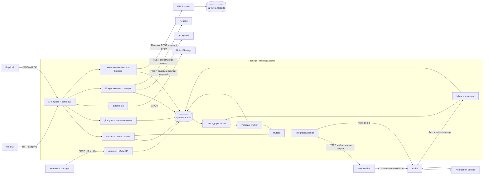

# 146 — Логическая схема

Редакция 1.0, 05.10.2026. Предлагаемая архитектура; [ADR](145.architecture-decisions.md).
Физические узлы вынесены в [165](165.deployment-diagram.md).

Команда пользователя синхронно проходит авторизацию и транзакцию. Длительный
расчёт возвращает operationId; UI читает статус и результат отдельно. Публикация
содержимого ACTIVE идёт через HTTP-адаптер, а Kafka PlanActivated только сообщает
о доступности версии. Это разные каналы одного факта, не два создания проекта.

Входное событие после проверки схемы меняет inbox и проекцию в одной транзакции,
затем ставит расчёт. Работник читает фиксированный срез и не меняет baseline.
Export batch фиксирует набор версий, доступности и прогнозов на один dataAsOf;
постраничное чтение не смешивает данные разных моментов. Преобразование и
загрузка аналитической витрины принадлежат Reports.

Потоки API описаны в [130](130.api-contracts.md), события — [135](135.event-catalog.md)
и [140](140.event-schema.md). Полный состав обмена и его владельцы существуют
только в [020 §3](020.system-context.md#3-единая-матрица-обмена).
