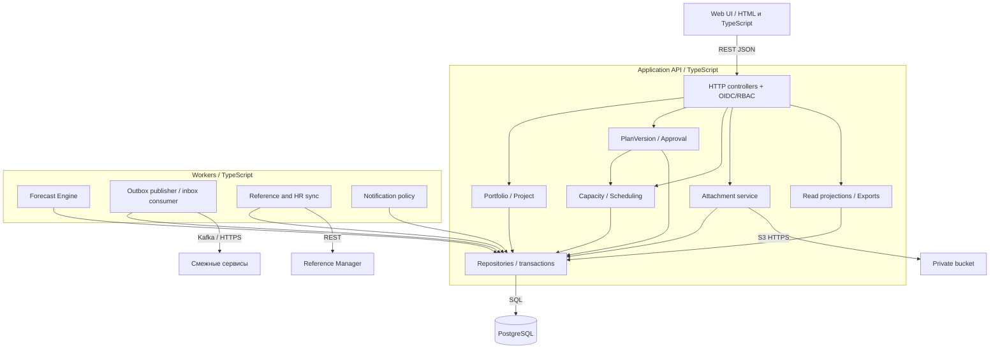

# 150 — Компоненты Planning System

Редакция 1.0, 05.10.2026. C4 Component, проектное решение ADR-013.
Схема раскрывает API и workers; самостоятельное развёртывание каждого доменного
компонента не требуется. [Логические потоки](146.logic-scheme.md),
[развёртывание](165.deployment-diagram.md).

| Компонент | Технология и интерфейс | Ответственность | ADR / NFR |
| --- | --- | --- | --- |
| Web UI | HTML/TypeScript, REST JSON | 12 экранов, формы, состояния, пагинация; HTML-прототип отдельно | 006; NFR-12 |
| Controllers + auth | TypeScript, HTTP/OIDC/JWKS | Валидация, RBAC/области/поля, If-Match, ключи повторов | 001/009; NFR-02/03/10 |
| Portfolio / Project | TypeScript, внутренние вызовы | Проекты, программы, приоритеты, архивирование | 003; FR-01 |
| PlanVersion / Approval | TypeScript, SQL transaction | Копирование, редакции, round, baseline, активация | 003; FR-02/09 |
| Capacity / Scheduling | TypeScript, чистые функции + repository | Дневные часы, FS-граф, цикл, перегрузка/дефицит | 002/010; FR-04–07 |
| Forecast Engine | TypeScript worker, задания PostgreSQL | Срез, ETC, даты, стоимость, качество и причины PARTIAL | 002/011; FR-08/10 |
| Read projections / Exports | TypeScript, REST | Гант, личный календарь, QA, Reports, устойчивые batch pages | 012; FR-15/INT-07/08 |
| Attachment service | TypeScript, S3 API | Проверка файла, права, повтор удаления | 007; FR-13 |
| Integration worker | TypeScript, Kafka/HTTP | Outbox/inbox, публикации, receipts, retry/DLQ, сверка | 004/008; FR-11/12 |
| Reference and HR sync | TypeScript, REST | Кэш по resource name/etag, employee/sub, полные страницы | 010; INT-02 |
| Notification policy | TypeScript, внутренние события → outbox | Причина, адресат, шаблон, delivery state | 004/008; FR-14 |
| Repositories / audit | PostgreSQL, SQL | FK, уникальность, неизменяемость, транзакции и аудит | 003/005; NFR-04/05/14 |

Unit-тесты обязательны для календаря, графа, ETC, стоимости, прав и переходов.
Контрактные тесты проверяют примеры [130](130.api-contracts.md)/[140](140.event-schema.md);
E2E — годовой план, конфликт, согласование, публикация → факт → перепланирование.
Проверки документации и прототипа не выдаются за эти будущие тесты приложения.
CI, seed, Compose, minikube и безопасность отражены как поставки в 165 и 095.
