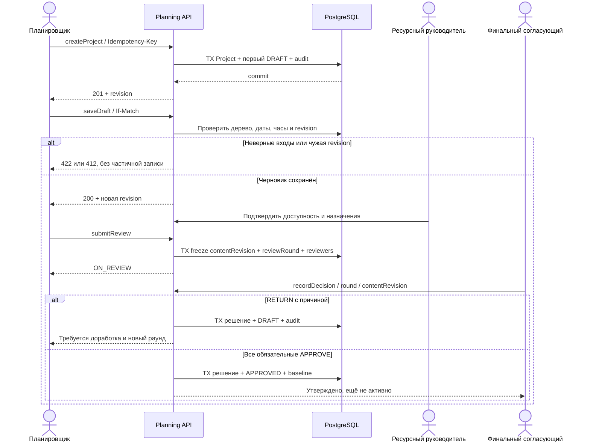
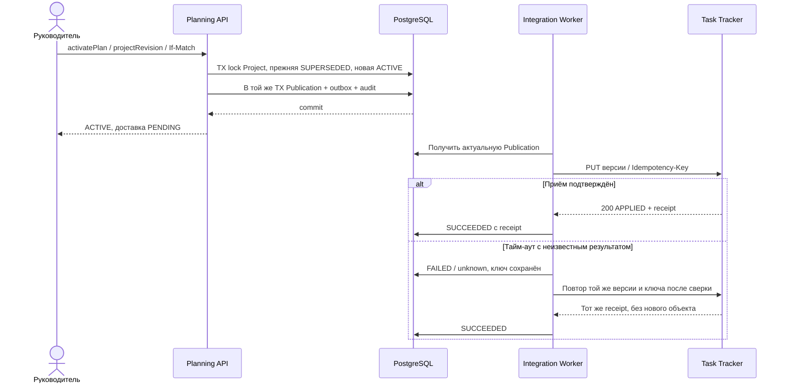
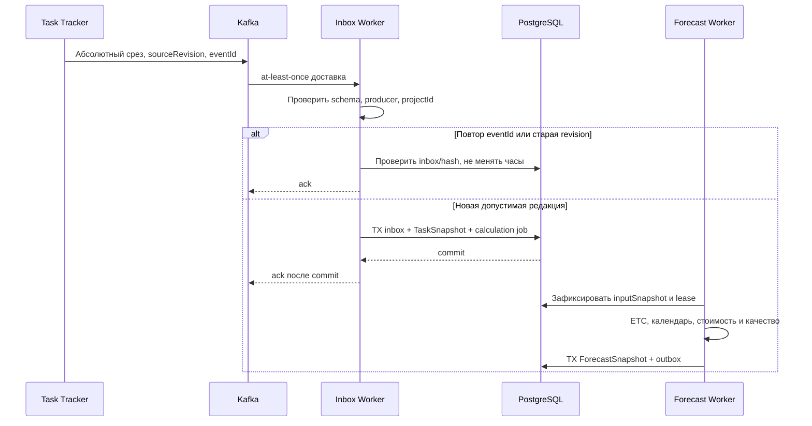
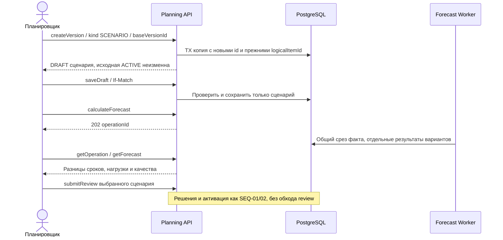
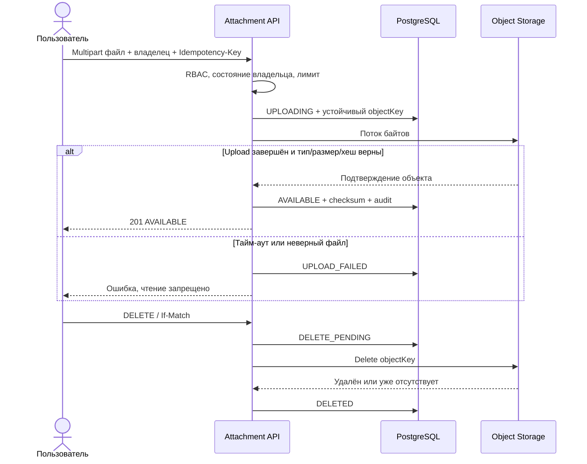
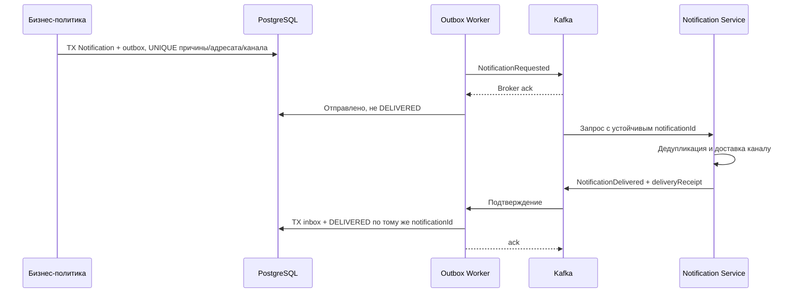

# 155 — Последовательности ключевых сценариев

Редакция 1.0, 05.10.2026. Проект взаимодействий. Методы и схемы —
[130](130.api-contracts.md), события — [135](135.event-catalog.md)/[140](140.event-schema.md).
HTTP connect/request timeout 3/10 с и retry 1/5/30/120/300 с — предложенные
настройки ADR-004, не измеренный SLA. Все ответы об ошибке сохраняют correlationId.

## SEQ-01 — Годовое планирование и утверждение

UC-01/02/03/06, US-PL-01/02, US-RM-01/02, US-PO-02.
Операции createProject, saveDraft, submitReview, recordDecision.

После HTTP timeout клиент перечитывает объект/повторяет с тем же ключом;
не создаёт новое решение. 412 требует сравнить изменения. Если внешние входы
устарели, submit/approve блокируется до проверки; сетевой сбой не отменяет baseline.

## SEQ-02 — Активация и подтверждение Task Tracker

UC-07/12, US-PO-03, US-AD-02. activatePlan, getPublication,
acceptPlanningVersion (предложение приёмника TT), publicationReceipt.

Перед каждой новой попыткой проверяется текущая ACTIVE; SUPERSEDED_BEFORE_DELIVERY
блокирует отправку старой версии. Поздний receipt старой публикации только закрывает
её запись доставки, не активирует старую версию. После исчерпания retry — разбор
R-06. План остаётся активным локально даже при недоступности TT.

## SEQ-03 — Факт и единый прогноз

UC-08/11, US-PM-02, US-PO-04. TaskCreated/Changed/TimeLogged/Deleted,
calculateForecast, getOperation, getForecast.

Неверная схема/неизвестный проект — DLQ; offset после durable DLQ ack. Сбой worker
до commit оставляет сообщение для повтора, после commit ловится inbox. Нет ставки
или ETC — PARTIAL, а не ноль. Сбой расчёта повторяет тот же inputHash; два работника
не сохраняют два результата. API расчёта возвращает 202, UI опрашивает operation.

## SEQ-04 — Перепланирование через сценарий

UC-05/06/07, US-PL-04, US-PM-04. createVersion, saveDraft,
calculateForecast, далее SEQ-01/02.

Timeout создания повторяется с тем же ключом. Сравнение разных dataAsOf помечается
несопоставимым, требуется новый расчёт. Параллельная активация другого сценария
вызывает 412/409, не перезапись выбранной baseline.

## SEQ-05 — Вложение

UC-09, US-PM-03. uploadAttachment, getAttachment,
downloadAttachment, deleteAttachment; ADR-007.

При обрыве upload повторная попытка использует прежний ключ после проверки
частичного объекта; статус 201 выставляется только после верификации. Повтор delete
безопасен, timeout оставляет DELETE_PENDING для worker. Для утверждённой версии
загрузка/удаление запрещены, обоснование прикладывается к проекту или новому DRAFT.

## SEQ-06 — Оповещение и подтверждение доставки

UC-10/12, US-TM-02, US-AD-02. NotificationRequested/Delivered по 140.

Предложенный timeout receipt — 60 с: FAILED с неизвестным результатом; сверка
перед повтором. Позднее подтверждение переводит ту же запись в DELIVERED.
Исчерпание retry — DLQ, ручной replay сохраняет ID. Поставщик ещё не назначен D-04;
диаграмма не доказывает существование внешнего канала.
