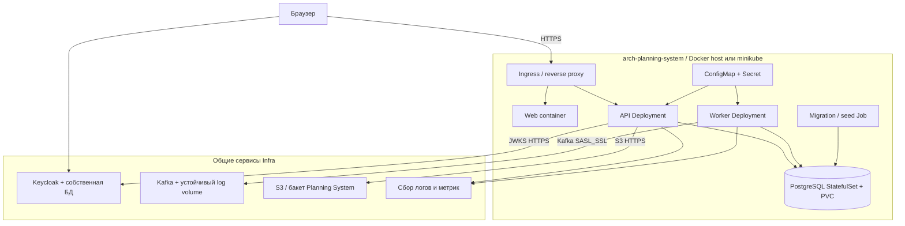

# 165 — Развёртывание и технические поставки

Редакция 1.0, 05.10.2026. **Целевая схема**, не инструкция запуска готового сервера.
В текущем изменении поставлены документы, схемы и HTML-прототип; приложение,
Dockerfile, Compose, миграции и Kubernetes-манифесты ещё требуют реализации.

## Окружения и размещение

| Среда | Узлы и доступ | Данные / условие |
| --- | --- | --- |
| dev | Docker Compose, web/API/worker/PostgreSQL; зависимости Infra либо явно включённые mock adapters | Синтетический demo seed; mock виден в UI и логах; без production-секретов |
| staging | Общий стенд Infra, реальные Keycloak/Kafka/S3 и соседи; TLS, отдельные service accounts | Контрактные/E2E/security/нагрузочные тесты, резервные копии |
| minikube | Локальный Kubernetes с namespace модуля, Ingress, API/worker Deployments, PostgreSQL StatefulSet/PVC | Финальная учебная демонстрация; данные переживают перезапуск pod |
| production | Эквивалент вне текущей учебной поставки | Нужны отдельные SLO, HA, резервирование и security review; staging не считается production |

Компоненты [150](150.component-diagram.md): Web UI → web; controllers, Portfolio,
PlanVersion, Capacity, Attachment, Read/Exports → API; Forecast, Integration,
HR sync, Notification policy → worker; repositories/audit → PostgreSQL.
Один образ API/worker допустим с разными entrypoint и service accounts.

Внутри сети: API → PostgreSQL 5432, worker → Kafka 9092, API → S3 API,
внешние REST/JWKS через HTTPS. БД, controller Kafka и S3 console наружу не публикуются.
Порты и адреса берутся из конфигурации Infra, не жёстко из бизнес-кода.
Readiness проверяет БД/миграции; сбой необязательного потребителя не останавливает
чтение baseline, но диагностируется как деградация. Liveness не проверяет соседей.

## Обязательный backlog реализации

| ID | Артефакт и критерий | Этап / ответственные |
| --- | --- | --- |
| TECH-01 | Dockerfile приложения и БД в Compose; на чистой машине после настройки .env одна команда `docker compose up --build` поднимает здоровые сервисы | Разработка; PS + Infra |
| TECH-02 | Workflow модуля с path filters: lint, unit, contracts, E2E, build image; после main — GHCR commit tag + digest, deploy только проверенного образа | Разработка/тестирование; PS + Infra |
| TECH-03 | CRUD + пагинация, RBAC, revision; unit-тесты часов/FS/ETC/активации и E2E основных сценариев | Разработка/тестирование; PS |
| TECH-04 | Security checklist и отчёт с фактическими результатами XSS, CSRF, SQL injection, IDOR, JWT, upload | Тестирование; PS + QA |
| TECH-05 | Deployment, Service, ConfigMap, Secret template без значений, PVC, StatefulSet БД, Ingress, migration Job; minikube smoke | Тестирование; PS + Infra |
| TECH-06 | Идемпотентный demo seed, проверка чистой установки и повторного запуска | Разработка; PS + Reference Manager для fixture IDs |

До этих поставок команды Docker/minikube не объявляются работающими. CI проверки
документов не заменяют workflow выпуска приложения. PR из fork не получает
секретов и не исполняется на production/self-hosted deploy runner.

## Seed для демонстрации

Отдельно от нагрузочного P1: портфель DEMO, проекты ERP-A и ERP-B, по ACTIVE и
DRAFT версии, этап/эпик/фича/веха/релиз, два вымышленных сотрудника employees/demo-1
и employees/demo-2, пять дней 05–09.10.2026 по 8 часов, отсутствие 4 часа у demo-1
в первый день. Назначить ему 6 часов → перегрузка 2 часа; перенести 2 часа на demo-2
→ конфликта нет. Подтверждённые назначения покрывают 6 часов потребности.
TaskSnapshot: факт 12 ч, ручной ETC 8 ч; ставка 1000 RUB/ч и baseline 18000 RUB
только как синтетические предпосылки → прогноз 20000 RUB. Есть отдельный пример
PARTIAL без ставки. Релиз связан с фиктивной итерацией TT и помечен как fixture.

Seed должен иметь стабильные UUID и manifest, не создавать реальных пользователей
или изменять чужой HR. Для реального интеграционного теста соседние команды
предоставляют отдельные fixture accounts; повтор seed не дублирует записи.
HTML-прототип [115](115.live-prototype.md) использует малую часть этих данных.

## Безопасность и эксплуатационные проверки

| Проверка | Действие | Ожидаемое доказательство |
| --- | --- | --- |
| XSS | Сохранить HTML/script в имя проекта и имя файла | Текст экранирован, CSP, скрипт не исполняется |
| CSRF | Чужой origin вызывает изменение; проверить режим cookie/token | Нет изменения; CORS allowlist; при cookie auth CSRF-token + SameSite, токены не в URL |
| Инъекции | SQL-подобные строки в фильтрах, sort и ID | Параметризованные запросы/allowlist, нет расширения выборки |
| IDOR/JWT | Чужой projectId/objectKey, изменённый/истёкший токен | 401/403/404 без раскрытия данных |
| Upload | Неверный MIME, +1 байт к лимиту, чужой ключ | AVAILABLE не выставлен, нет публичного файла |
| Restore | Восстановить БД/объекты на отдельном стенде | Замеры RPO/RTO, baseline и ключи проверены |
| Queue | Остановить потребителя, исчерпать retry, replay DLQ | Возраст/счётчики видимы, один бизнес-эффект |

Шаблон отчёта: commit/image digest, среда, тест, входы, ожидаемое, фактическое,
доказательства, verdict, дефект/исправление/повтор. **Пентест приложения ещё не
проводился**. Версии образов закрепляются digest при реализации; базу обновляют
миграциями, rollback приложения не должен откатывать уже принятый факт.
Связи: [075](075.nfr.md), [095](095.requirements-check.md),
[Infra](../../infra/vision.md), ADR-001/004/005/007/013.
