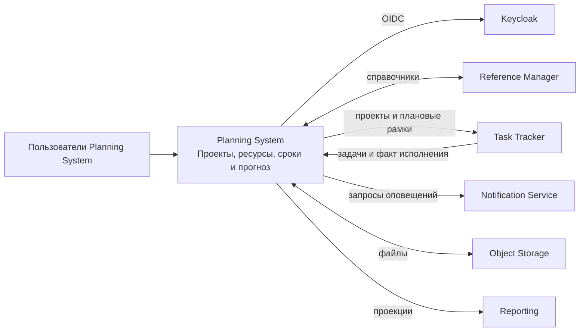
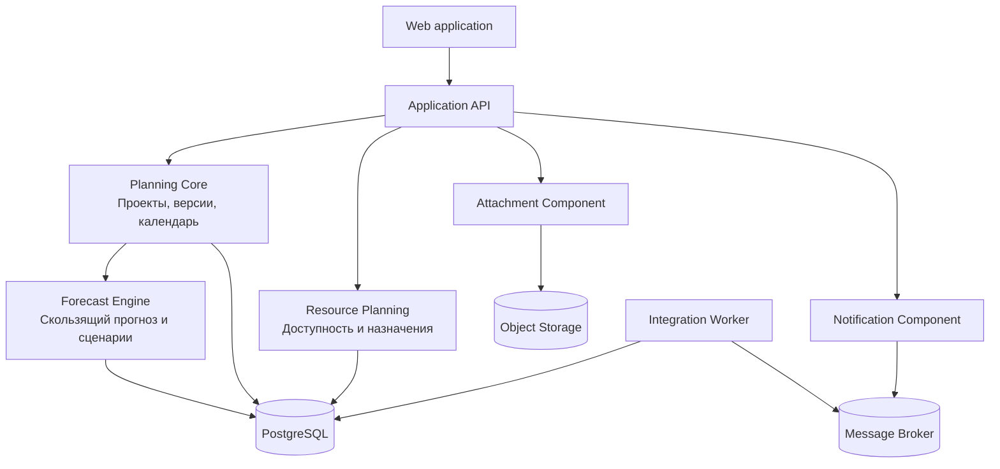
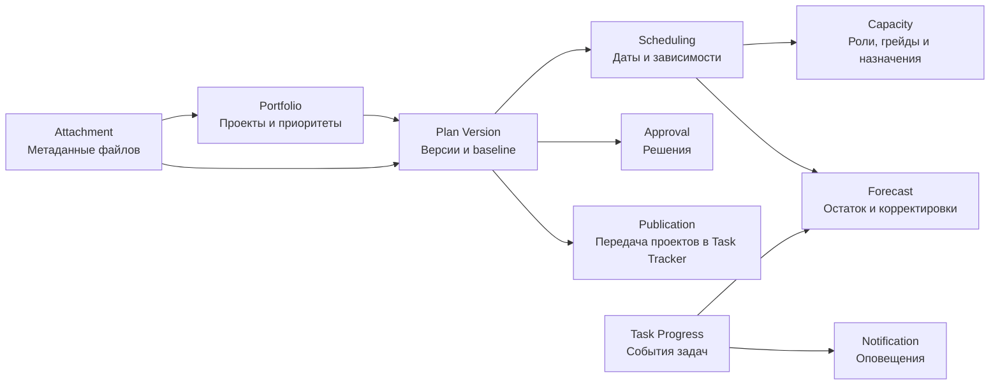
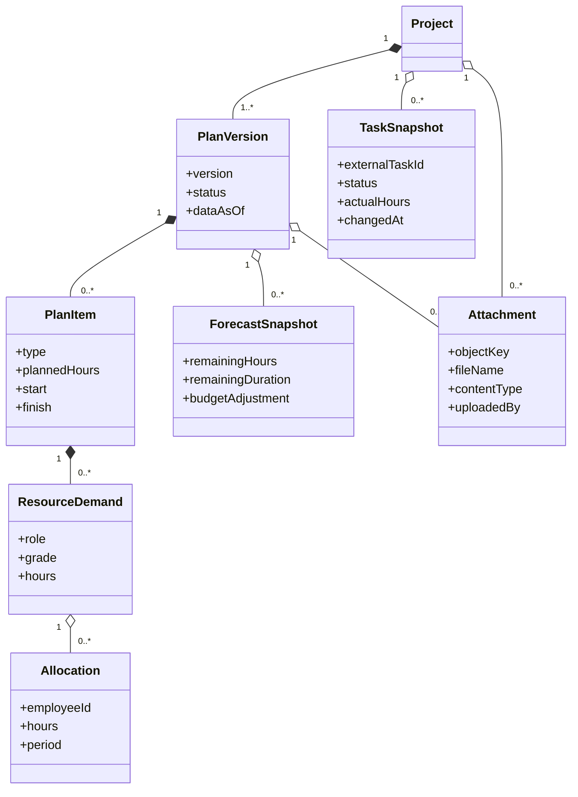

# Архитектура Planning System

## 1. Принципы

- Planning System является мастер-системой проектов и плановых версий.
- Task Tracker является мастер-системой задач и факта их исполнения.
- Keycloak используется как готовый компонент аутентификации; отдельный сервис входа
  не создается.
- Интеграции с авторизацией, справочниками, оповещениями, вложениями и Task Tracker
  входят в первую версию.
- Утвержденная версия плана неизменна.
- Обмен выполняется через версионированные API и идемпотентные события.

## 2. C4 Context

## 3. C4 Containers

## 4. Компоненты Planning Core

## 5. Доменная модель

## 6. Интеграционные события

Исходящие: `ProjectCreated`, `ProjectChanged`, `PlanActivated`,
`AllocationChanged`, `RemainingForecastChanged`, `BudgetAdjustmentChanged`,
`NotificationRequested`.

Входящие: `TaskCreated`, `TaskChanged`, `TaskCommented`, `TimeLogged`,
`NotificationDelivered`, `ReferenceItemChanged`.

Каждое событие содержит `eventId`, `eventType`, `occurredAt`, `producer`,
`schemaVersion`, `correlationId` и идентификатор проекта Planning System.

## 7. Развертывание

Система использует общую инфраструктуру проекта: Keycloak, PostgreSQL, брокер
сообщений, Object Storage, централизованные журналы, метрики и трассировку. Секреты
задаются средствами среды развертывания и не хранятся в репозитории.
