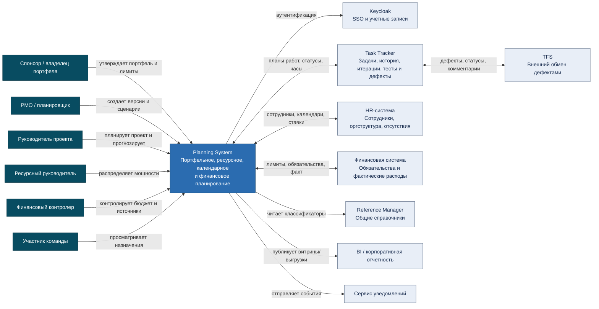
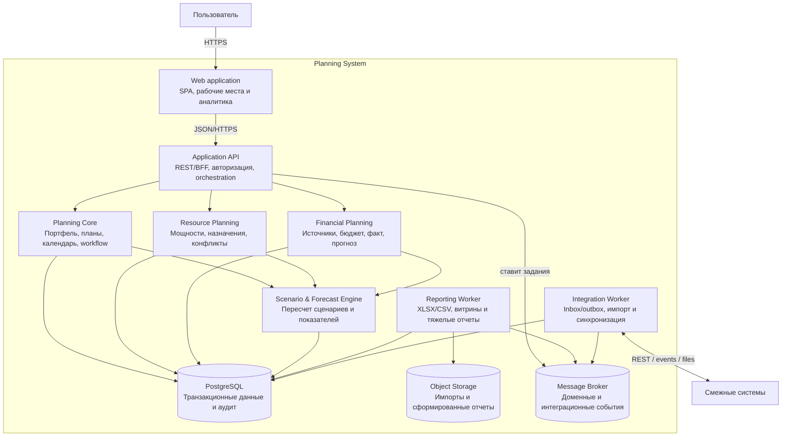
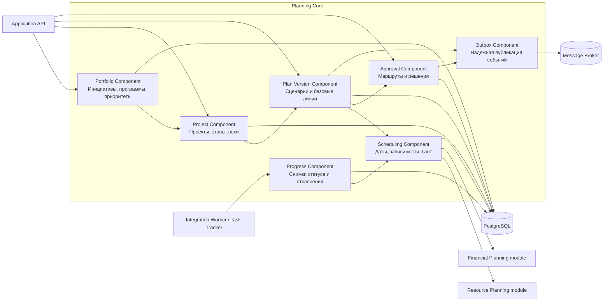
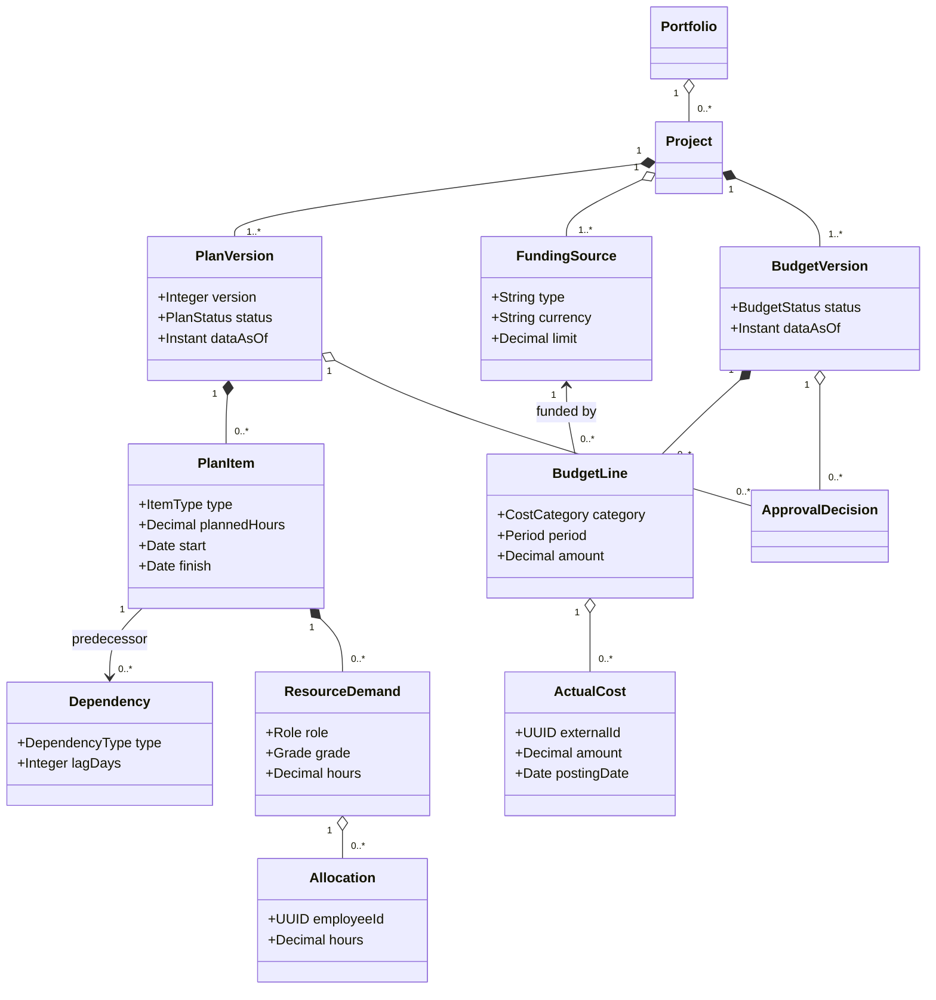
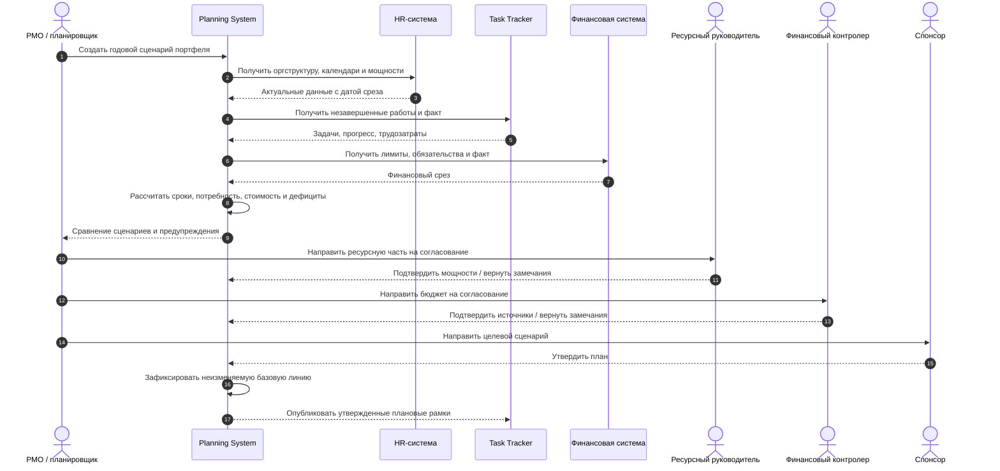
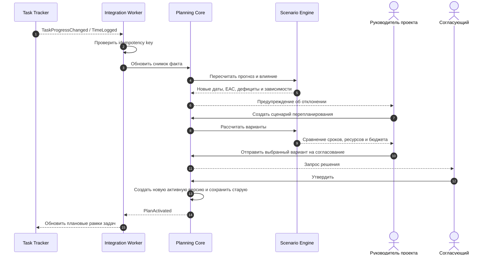
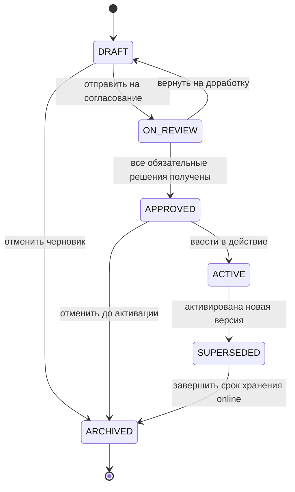

# Архитектура Planning System

## 1. Архитектурная идея

Planning System - система управленческого планирования, а не еще одна канбан-доска.
Она формирует утвержденные ограничения и прогнозы для портфеля, проектов, людей и
денег. Task Tracker остается системой оперативного исполнения и источником статусов,
затраченного времени и прогресса задач.

Для первой очереди предлагается модульный монолит: он снижает стоимость разработки
и сохраняет транзакционную согласованность версий плана, ресурсов и бюджета.
Интеграции и тяжелые отчеты выполняются отдельными workers. Если профиль нагрузки
это потребует, модули ресурсов, финансов или расчетов можно выделить в сервисы без
изменения доменных границ.

Ключевые свойства решения:

- неизменяемые утвержденные версии и базовые линии;
- единый расчет сроков, мощностей и стоимости;
- сценарии изолированы от активного плана;
- надежный обмен через inbox/outbox и идемпотентные сообщения;
- детализация агрегатов до исходной записи;
- явные владельцы данных и границы со смежными системами.

## 2. C4 Level 1 - System Context

Исходник: [`diagrams/01-c4-context.mmd`](diagrams/01-c4-context.mmd).

### Владение мастер-данными

| Данные | Система-источник | Что хранит Planning System |
|---|---|---|
| Пользователь и аутентификация | Keycloak | внешний ID, прикладные роли и область доступа |
| Сотрудник, подразделение, отсутствие | HR | версионируемый снимок для расчета мощности |
| Задача, статус, история, фактические часы, тесты и дефекты | Task Tracker | связь с плановым элементом и снимки факта |
| Валюта, единица, тип финансирования | Reference Manager | стабильный код и отображаемое имя снимка |
| Проводка, обязательство, фактический расход | Финансовая система | нормализованная запись, внешний ID и дата среза |
| Сценарий, версия плана, назначение, бюджет | Planning System | мастер-запись и история решений |

## 3. C4 Level 2 - Containers

Исходник: [`diagrams/02-c4-container.mmd`](diagrams/02-c4-container.mmd).

## 4. C4 Level 3 - Planning Core Components

Исходник:
[`diagrams/03-c4-component-planning-core.mmd`](diagrams/03-c4-component-planning-core.mmd).

## 5. UML - доменная модель

Это концептуальная модель, не физическая схема БД. Справочники, аудит и технические
таблицы опущены. Исходник:
[`diagrams/04-uml-domain-model.mmd`](diagrams/04-uml-domain-model.mmd).

## 6. UML - годовое планирование

Исходник:
[`diagrams/06-uml-sequence-annual-planning.mmd`](diagrams/06-uml-sequence-annual-planning.mmd).

## 7. UML - перепланирование по факту

Исходник:
[`diagrams/07-uml-sequence-replanning.mmd`](diagrams/07-uml-sequence-replanning.mmd).

## 8. UML - жизненный цикл версии плана

Исходник: [`diagrams/08-uml-plan-state.mmd`](diagrams/08-uml-plan-state.mmd).

## 9. Дополнительные представления

- [UML use cases](diagrams/05-uml-use-cases.mmd) - роли и основные варианты
  использования;
- [Deployment view](diagrams/09-deployment.mmd) - предварительная схема
  промышленного развертывания.

## 10. Модульные границы

| Модуль | Владеет | Не владеет |
|---|---|---|
| Portfolio | инициативы, программы, приоритеты, решения портфеля | задачи исполнения, кадровые карточки |
| Planning Core | проекты, версии, сценарии, плановые элементы, зависимости, baseline | фактические часы и проводки |
| Resource Planning | потребности, снимки мощности, назначения, конфликты | кадровая мастер-запись сотрудника |
| Financial Planning | источники финансирования, версии бюджета, строки плана, EAC | бухгалтерская мастер-проводка |
| Approval | экземпляры маршрутов и решения | корпоративные учетные записи |
| Integration | inbox/outbox, сопоставление ID, снимки и протоколы синхронизации | бизнес-правила источников |
| Reporting | проекции, выгрузки, отчеты | изменение бизнес-сущностей |

## 11. Интеграционные события первой очереди

- исходящие: `ProjectPlanned`, `PlanSubmitted`, `PlanApproved`, `PlanActivated`,
  `AllocationChanged`, `FundingLimitExceeded`, `BudgetForecastChanged`;
- входящие: `EmployeeChanged`, `AbsenceChanged`, `TaskChanged`, `TaskHistoryChanged`,
  `TimeLogged`, `TestRunChanged`, `DefectChanged`, `FinancialActualPosted`,
  `FundingLimitChanged`, `ReferenceItemChanged`.

Каждое сообщение должно иметь `eventId`, `eventType`, `occurredAt`, `producer`,
`schemaVersion`, `correlationId` и полезную нагрузку. Обработчик обязан хранить
результат обработки `eventId` для защиты от повторной доставки.

## 12. Основные риски архитектуры

| Риск | Мера |
|---|---|
| Несогласованные идентификаторы систем | таблица сопоставления, стабильные внешние ID, сверка импорта |
| Двойной учет часов или денег | четкое владение данными, idempotency, дата среза, детализация до источника |
| Медленный пересчет больших сценариев | фоновые задания, инкрементальный расчет, профилирование на нагрузочном прототипе |
| Неконтролируемое изменение истории | immutable approved versions, audit log, новая версия вместо правки |
| Избыточное раннее дробление на микросервисы | модульный монолит и контролируемые границы транзакций первой очереди |
| Разрыв между планом и задачами | события, мониторинг задержки синхронизации и отчет расхождений |
