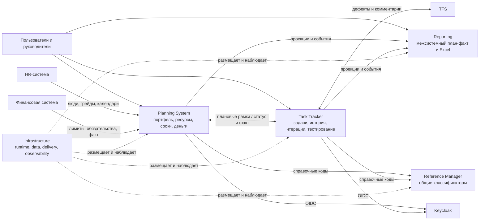

# Ландшафт всей архитектурной информационной системы

Документ фиксирует верхнеуровневое разделение подсистем из исходной таблицы. Он не
заменяет отдельные ТЗ команд, а определяет ответственность и основные потоки данных.

## 1. Подсистемы

### 1.1. Task Tracker

Операционный контур работы, близкий к Jira:

- backlog, баги, задачи, эпики и фичи;
- канбан-доски и итерации;
- статусы `New`, `Active`, `Waiting for Deploy`, `Resolved`, `Closed`;
- назначение исполнителя, необязательных developer и tester;
- приоритет, оценка, deadline, описание и фактическая трудоемкость;
- полная история полей, статусов и комментариев по задаче;
- планирование итераций и контроль их исполнения;
- тест-кейсы, тест-планы, прогоны, дефекты и синхронизация дефектов с TFS;
- импорт, time logs и оперативная отчетность;
- отображение переданного Planning System прогноза оставшейся длительности.

Task Tracker отвечает на вопрос «что команда делает сейчас?», но не принимает
портфельные и финансовые решения.

### 1.2. Planning System

Управленческий контур над Task Tracker:

- годовое и скользящее планирование портфеля;
- обоснование количества людей и часов;
- декомпозиция `портфель -> программа -> проект -> этап -> веха -> эпик`, связь с
  задачами Task Tracker;
- краткосрочное распределение ролей, грейдов и конкретных сотрудников;
- календари, зависимости, Гант по проектам и людям;
- версии, baseline, сценарии «что если» и расчет последствий сдвигов;
- источники финансирования, бюджеты, лимиты и план-факт-прогноз;
- контроль приоритетов, конфликтов и согласований.

Planning System отвечает на вопросы «что стоит делать?», «когда?», «какими людьми?»,
«за какие деньги?» и «что изменится, если сдвинуть решение?».

### 1.3. Reference Manager («Справочники»)

Единый источник общих классификаторов: валют, языков, единиц измерения, типов
финансирования, статей затрат, налоговых категорий, статусов и других reference data.
Значения имеют стабильные `id` и `code`, версионируются и деактивируются вместо
физического удаления. Бизнес-сущности проектов и задач в справочнике не хранятся.

### 1.4. Reporting

Общесистемный контур отчетности:

- единые Excel-отчеты по подсистемам;
- сводные план-факт отчеты;
- согласованные витрины и определения показателей;
- воспроизводимость отчета по версии данных и дате среза;
- сквозная детализация до источника.

Planning System готовит собственные проекции и выгрузки, а Reporting объединяет их с
данными Task Tracker, финансовой и других систем.

### 1.5. Infrastructure

Общий технический контур:

- среды разработки, тестирования и эксплуатации;
- сети, DNS, TLS, секреты и Keycloak;
- PostgreSQL, брокер сообщений и объектное хранилище;
- CI/CD, контейнерная платформа и registry;
- централизованные logs, metrics, traces и alerting;
- резервное копирование, восстановление и управление конфигурацией.

## 2. Карта взаимодействий

Исходник: [`diagrams/10-system-landscape.mmd`](diagrams/10-system-landscape.mmd).

## 3. Сквозной поток управления

1. Reference Manager публикует общие классификаторы.
2. HR и финансовая система передают людей, календари, лимиты и фактические данные.
3. Planning System формирует сценарий портфеля, проверяет ресурсы и финансирование,
   затем фиксирует утвержденную версию.
4. Утвержденные рамки проектов, эпиков, дат и назначений передаются в Task Tracker.
5. Task Tracker возвращает статусы, историю, фактические трудозатраты, итерации,
   дефекты и результаты тестирования.
6. Planning System пересчитывает прогноз и при существенном отклонении запускает
   сценарий перепланирования.
7. Обе подсистемы публикуют данные в Reporting для общесистемного план-факта.

## 4. Ключевое правило границ

Одна бизнес-запись имеет один мастер-источник. Реплика в другой подсистеме содержит
внешний идентификатор, дату актуальности и источник. Обмен не должен превращаться в
совместное редактирование одной таблицы или прямой доступ к чужой базе данных.
