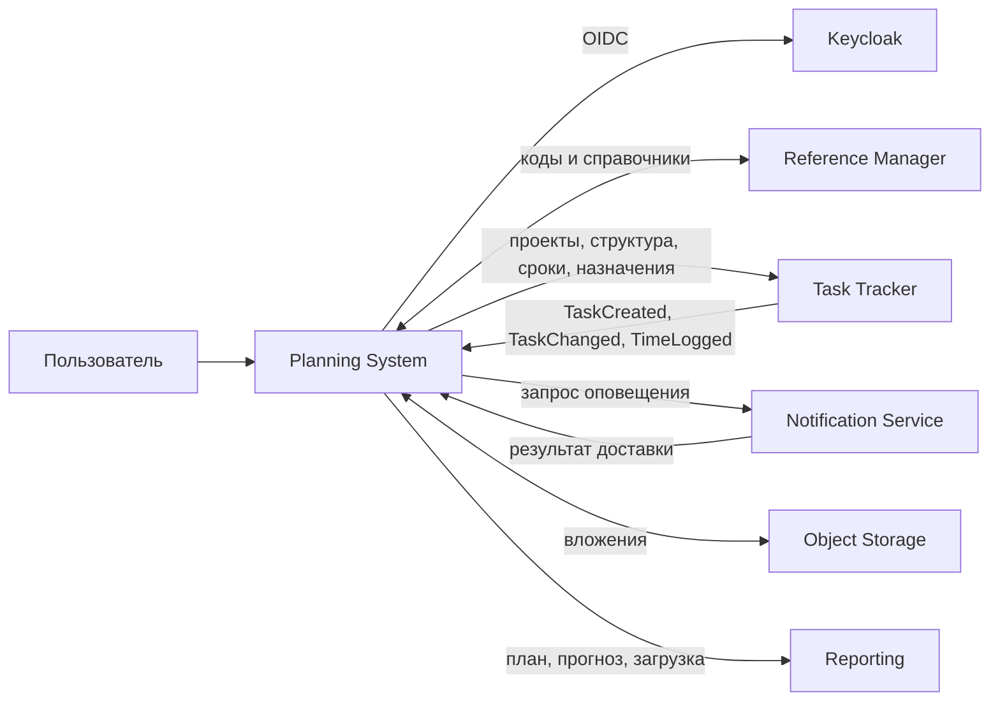

# Интеграционный ландшафт Planning System

## Владение данными

| Данные | Мастер-система |
|---|---|
| Проект, декомпозиция, версия плана, сценарий, назначение | Planning System |
| Задача, статус, история, комментарий, фактические часы | Task Tracker |
| Пользователь, пароль, сессия, группа | Keycloak |
| Роль, грейд, календарь и классификатор | Reference Manager |
| Файл вложения | Object Storage |

## Потоки

Проекты никогда не импортируются из Task Tracker. После публикации Task Tracker
хранит внешний идентификатор проекта Planning System. Данные задач передаются в
Planning System только через API и события.
