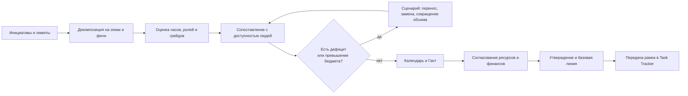
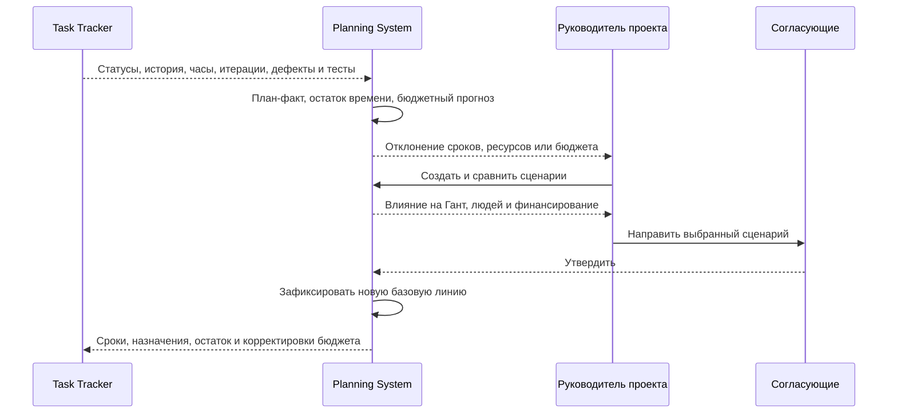

# Vision: Planning System

**Версия:** 0.2  
**Статус:** проект для согласования  
**Дата:** 15.09.2026

## 1. Видение

Planning System - подсистема годового и оперативного планирования проектов. Она
связывает портфель проектов, декомпозицию на эпики и фичи, потребность в людях,
доступность сотрудников, календарные сроки и финансирование.

В отличие от Jira-подобного Task Tracker, Planning System отвечает не за ежедневное
ведение задач, а за управленческие вопросы:

- какие проекты и фичи выполнять;
- сколько специалистов каких ролей и грейдов потребуется;
- кого и когда можно назначить;
- укладывается ли план в сроки и бюджет;
- что произойдет при переносе проекта, дефиците людей или изменении финансирования.

Целевой результат - единая согласованная версия плана, которую можно сравнить с
фактическим исполнением и безопасно пересчитать в сценарии «что если».

## 2. Пользователи

| Роль | Основная задача |
|---|---|
| Руководитель портфеля | выбирает проекты и утверждает целевой сценарий |
| Планировщик / PMO | формирует годовой план, сценарии и календарь |
| Руководитель проекта | декомпозирует проект и актуализирует прогноз |
| Ресурсный руководитель | подтверждает мощности и назначения людей |
| Финансовый контролер | проверяет источники финансирования и бюджет |
| Участник команды | просматривает свои проектные назначения |
| Администратор | управляет правами, справочниками и интеграциями |

Ролевая модель принимается в текущем согласованном виде и уточняется отдельной
матрицей доступа на этапе проектирования.

## 3. Ключевые возможности

1. Ежегодное и скользящее планирование портфеля крупными блоками.
2. Декомпозиция проекта на этапы, вехи, эпики и фичи со связью с задачами.
3. Оценка трудоемкости и потребности по ролям и грейдам.
4. Распределение конкретных сотрудников с учетом календарей и доступности.
5. Гант по проектам и людям, зависимости, сроки и последствия сдвигов.
6. Версии плана, базовая линия и сравнение сценариев «что если».
7. Источники финансирования, лимиты, бюджет и план-факт-прогноз.
8. Получение факта, истории исполнения и сигналов качества из Task Tracker.
9. Формирование единого прогноза оставшегося времени и бюджетных корректировок.
10. Отчеты по срокам, загрузке, дефициту людей и финансированию.

## 4. Границы системы

| Объект | Мастер-система |
|---|---|
| Портфель, сценарий, версия плана, потребность, назначение, бюджет | Planning System |
| Задача, ее статус и история, комментарии, фактические часы | Task Tracker |
| Тест-кейс, тест-план, прогон и дефект | Task Tracker / контур тестирования |
| Пользователь и аутентификация | Keycloak |
| Общие классификаторы | Reference Manager |
| Фактические финансовые операции | финансовая система либо согласованный импорт |

Task Tracker поддерживает backlog, канбан, итерации, приоритеты 1-5, поля
`developer` и `tester`, статусы `New`, `Active`, `Waiting for Deploy`, `Resolved`,
`Closed` и полную историю изменений. На первом этапе переход между любыми статусами
разрешен. Эти функции не реализуются повторно в Planning System.

Управление тест-кейсами, тест-планами, прогонами и дефектами также остается в
контуре Task Tracker. Интеграция Task Tracker с TFS является его ответственностью;
Planning System получает нормализованный результат через Task Tracker.

## 5. Ключевые процессы

### 5.1. Ежегодное планирование

1. PMO собирает инициативы, ограничения финансирования и доступную мощность.
2. Проекты декомпозируются на этапы, эпики и фичи.
3. Для эпиков и фич оцениваются часы и потребность в аналитиках, разработчиках,
   тестировщиках и других ролях по грейдам.
4. Система сопоставляет потребность с доступностью людей и показывает дефицит.
5. Формируется календарь и диаграммы Ганта по проектам и сотрудникам.
6. PMO сравнивает сценарии по срокам, людям, бюджету и рискам.
7. Ресурсный и финансовый руководители подтверждают свои части плана.
8. Руководитель портфеля утверждает сценарий; система фиксирует базовую линию.

### 5.2. Контроль исполнения и перепланирование

Task Tracker передает статусы, историю изменений, фактическую трудоемкость,
итерации, дефекты и результаты тестирования. Финансовый контур передает фактические
затраты. Planning System сравнивает факт с базовой линией, рассчитывает оставшееся
время и прогноз бюджета. При отклонении руководитель проекта создает сценарий,
оценивает последствия и после согласования вводит новую версию плана.

## 6. Функциональные требования

- **VF-01.** Вести инициативы, проекты, приоритеты и годовые версии портфеля.
- **VF-02.** Декомпозировать проекты на этапы, вехи, эпики и фичи.
- **VF-03.** Планировать часы и потребность по ролям и грейдам.
- **VF-04.** Вести доступность и назначения конкретных сотрудников по периодам.
- **VF-05.** Выявлять перегрузку, простой и дефицит ресурсов.
- **VF-06.** Управлять сроками, зависимостями и Гантом по проектам и людям.
- **VF-07.** Создавать версии и сценарии без изменения активного плана.
- **VF-08.** Показывать последствия сдвига для зависимостей, ресурсов и бюджета.
- **VF-09.** Вести источники финансирования, лимиты, план, факт, прогноз и остаток.
- **VF-10.** Получать из Task Tracker задачи, итерации, статусы, историю и факт.
- **VF-11.** Учитывать дефекты и результаты тестирования при прогнозе готовности.
- **VF-12.** Передавать в Task Tracker утвержденные рамки, назначения, прогноз
  оставшегося времени и согласованные бюджетные корректировки.
- **VF-13.** Версионировать утвержденные планы и сохранять журнал решений.
- **VF-14.** Формировать отчеты и экспорт по срокам, людям и финансированию.

## 7. Нефункциональные требования

- веб-интерфейс на русском языке;
- аутентификация через Keycloak по OIDC/OAuth 2.0;
- доступ по ролям и области ответственности пользователя;
- аудит изменений версий плана, назначений и бюджета;
- утвержденная версия неизменна; исправление создает новую версию;
- обмен со смежными системами идемпотентен и содержит внешний ID и дату среза;
- типовые страницы открываются не более чем за 3 секунды, пересчет обычного проекта -
  не более чем за 10 секунд при согласованном тестовом профиле;
- ошибки интеграции не должны повреждать последнюю утвержденную версию;
- система является учебной/демонстрационной, поэтому промышленный SLA не задается;
  требования к целевой производственной эксплуатации согласуются отдельно.

## 8. Требования к интеграциям

| Система | Planning System получает | Planning System передает | Способ |
|---|---|---|---|
| Keycloak | пользователя, группы, результат аутентификации | запрос аутентификации | OIDC/OAuth 2.0 |
| Reference Manager | роли, грейды, валюты, статьи затрат и иные справочники | запросы по кодам | REST API / события |
| Task Tracker | проекты и задачи, итерации, приоритеты, developer/tester, статусы, историю, комментарии, плановые и фактические часы | плановые рамки, назначения, прогноз остатка, бюджетные корректировки | REST API и события; CSV/XLSX для начального импорта |
| Контур тестирования Task Tracker | тест-планы, результаты прогонов, дефекты и их статусы | ссылки на проект, эпик, фичу и итерацию | через API Task Tracker |
| TFS | прямой обмен не требуется | прямой обмен не требуется | косвенно через Task Tracker |
| Финансовая система | лимиты, обязательства и фактические затраты | план и согласованные корректировки | REST API, события или регламентный импорт |
| Reporting | - | версии плана, план-факт, загрузка и бюджет | API, события, XLSX/CSV |

Обязательные атрибуты интеграционной записи: внешний идентификатор, система-источник,
время изменения, версия схемы и correlation ID. Повторная доставка не должна
создавать дубликаты.

## 9. Критерии успеха первой версии

На демонстрационном наборе проектов пользователь может сформировать годовой план,
декомпозировать проекты, рассчитать потребность, распределить людей, увидеть Гант и
конфликты, сравнить два сценария, проверить финансирование, утвердить базовую линию и
получить план-факт из Task Tracker без ручного сведения данных.

## 10. Вне первой версии

Автоматическая оптимизация портфеля, предиктивные ML-модели, собственное управление
задачами и тестированием, прямая интеграция Planning System с TFS и промышленный SLA.
