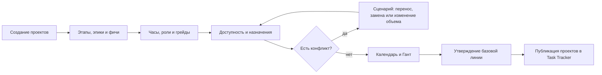
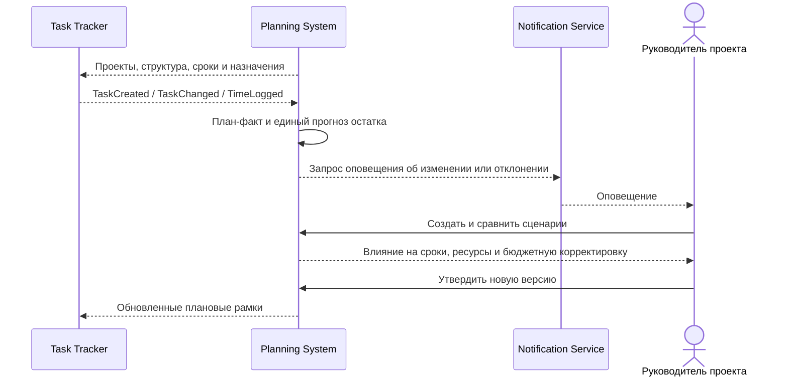

# Vision: Planning System

**Версия:** 1.0
**Статус:** финальная
**Дата:** 17.09.2026

## 1. Видение

Planning System формирует единый реализуемый план проектов с учетом приоритетов,
трудоемкости, доступности людей и календарных ограничений. Система отвечает на
вопросы: какие проекты выполнять, когда, каким составом и как изменится общий план
при отклонении факта.

Planning System хранит проекты. Task Tracker получает проекты и плановые рамки из
Planning System, ведет задачи и возвращает данные об исполнении.

## 2. Пользователи

| Роль | Ответственность |
|---|---|
| Руководитель портфеля | выбирает проекты и утверждает целевой план |
| Планировщик / PMO | формирует годовой и скользящий планы, сравнивает сценарии |
| Руководитель проекта | декомпозирует проект и актуализирует прогноз |
| Ресурсный руководитель | подтверждает доступность и назначения сотрудников |
| Участник команды | просматривает свои назначения и календарь |
| Администратор | настраивает роли, справочники и интеграции |

## 3. Ключевые возможности

1. Годовое и скользящее планирование портфеля проектов.
2. Декомпозиция проекта на этапы, вехи, эпики и фичи.
3. Оценка трудоемкости и потребности по ролям и грейдам.
4. Назначение сотрудников с учетом календарей и доступности.
5. Диаграммы Ганта по проектам и людям.
6. Версии плана, базовые линии и сценарии «что если».
7. Расчет влияния переносов на зависимости и загрузку.
8. Единый прогноз оставшегося времени и бюджетных корректировок.
9. Вложения к проектам, версиям планов и сценариям.
10. Оповещения о создании и изменении связанных задач, конфликтах и решениях.
11. Отчеты по срокам, загрузке, дефициту и отклонениям.

## 4. Ключевые процессы

### 4.1. Формирование плана

Планировщик создает проекты, декомпозирует их, задает оценки по ролям и грейдам.
Система сопоставляет потребность с доступностью людей, строит календарь и выявляет
конфликты. Пользователь сравнивает сценарии, выбирает вариант и утверждает базовую
линию. После утверждения проекты и плановые рамки публикуются в Task Tracker.

### 4.2. Скользящее перепланирование

Task Tracker передает события создания и изменения задач, статусы, историю и
фактическую трудоемкость. Planning System сравнивает факт с базовой линией,
формирует единый прогноз оставшегося времени и бюджетных корректировок. При
существенном отклонении руководитель проекта создает сценарий, оценивает последствия
и после согласования вводит новую версию плана.

## 5. Критерий готовности

Пользователь может создать проекты, сформировать годовой план, перейти к скользящему
планированию, распределить людей, увидеть Гант и конфликты, сравнить сценарии,
утвердить версию, опубликовать проекты в Task Tracker и получить обратно факт для
единого прогноза. Keycloak, справочники, вложения и оповещения работают в составе
первой версии.
