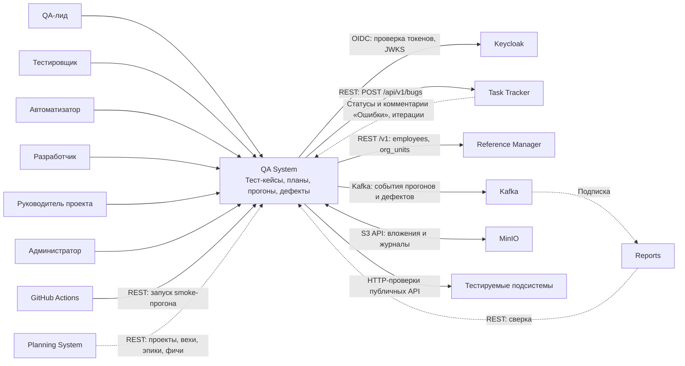

# 020 — System Context

> Формат — см. [состав документов](documents-composition.md), документ 020.
> Источник — [vision, разделы 1.2–1.4, 8, 10](vision.md). Термины — [010](010.glossary.md), акторы — [030](030.actors.md).

## 1. Назначение и граница

QA System хранит тест-кейсы, собирает их в планы, проводит ручные и автоматические прогоны и заводит дефекты по провалам. Вторая задача модуля — реальная проверка соседних подсистем стартовым набором из 25 кейсов.

| Внутри QA System | За пределами модуля |
| --- | --- |
| Тест-кейсы, шаги, версии, шаблоны, импорт и экспорт | Задачи, итерации, канбан — Task Tracker |
| Наборы и тест-планы, их привязка к итерации и вехе | Проекты, вехи, эпики, фичи — Planning System |
| Прогоны, результаты кейсов и шагов, повторные прогоны | Сотрудники, подразделения — Reference Manager |
| Исполнитель автотестов и стартовый набор автотестов | Учётные записи, пароли, роли — Keycloak |
| Дефекты, их QA-поля, история и перепроверка | Задача «Ошибка» и статусы разработки — Task Tracker |
| Классификаторы серьёзности, приоритета, типов кейсов, окружений | Отчёты о качестве и межмодульные показатели — Reports |
| Метаданные вложений и права на них | Файловые объекты — MinIO; брокер событий — Kafka; развёртывание — Infra |
| Сводки плана и прогона | Нагрузочное тестирование и проверки через браузер — вне первой версии |

QA System не читает и не изменяет чужие базы данных. Единственная запись в чужие данные — создание задачи «Ошибка» через API Task Tracker.

## 2. Контекстная диаграмма

Уровень C4 Context: QA System показана одним блоком. Сплошная стрелка — обмен, для которого у соседа есть опубликованный контракт; пунктирная — обмен, который ещё согласуется (раздел 5).

## 3. Внешние системы

| ID | Система | Роль | Что передаём | Что получаем | Тип интеграции | Состояние |
| --- | --- | --- | --- | --- | --- | --- |
| S-01 | Keycloak | Поставщик идентичности | Запросы ключей и служебных токенов | Токены пользователей и сервисов, роли, JWKS | OIDC / OAuth 2.0, HTTPS | Предусмотрено [vision Infra](../../infra/vision.md); клиенты QA нужно заявить — Q-06 |
| S-02 | Task Tracker | Владелец задачи «Ошибка», итераций | Создание «Ошибки» | Идентификатор и ссылку на задачу; статусы, комментарии, итерации — после согласования | REST `POST /api/v1/bugs`, идемпотентно по `(externalSource, externalDefectId)` | Создание описано в [контракте](../../task-tracker/docs/block-g-api-and-events/130.api-contracts.md); обратный поток — Q-01, итерации — Q-03 |
| S-03 | Planning System | Владелец проектов, вех, эпиков и фич | — | Справочные данные для группировки кейсов и привязки планов | REST, чтение | API не опубликован — Q-04 |
| S-04 | Reference Manager | Владелец сотрудников и подразделений | — | `employees`, `org_units` | REST `/v1`, роль `reference-reader`, кэш у нас | Описано в [контракте](../../reference-manager/documents/130.api-contracts.md) и [плане интеграций, I-12](../../reference-manager/documents/160.integration-plan.md); коллекции ещё не реализованы |
| S-05 | Reports | Потребитель данных тестирования | Планы, прогоны, результаты, дефекты | Запросы сверки | Kafka (события), REST read-only | Наше предложение; ждёт согласия Reports — Q-05 |
| S-06 | GitHub Actions | Запуск smoke-прогона после развёртывания | Итоговый статус прогона | Команду запуска набора | REST, служебный клиент `qa-ci` | Workflows Infra отключены — Q-08 |
| S-07 | MinIO (Object Storage) | Хранение файлов | Вложения, журналы автотестов | Файл по ключу | S3 API, бакет `arch-dev-qa` | Бакета нет в перечне Infra — Q-06 |
| S-08 | Kafka | Транспорт событий | События QA System | — | Kafka, `SASL_SSL`, at-least-once | Топики создаются по заявке — Q-06 |
| S-09 | Тестируемые подсистемы | Объект проверки автотестами | HTTP-запросы и тестовые данные с префиксом | Ответы | REST под служебной записью `qa-executor` | Доступен только каркас Reference Manager; окружение — Q-07 |

При недоступности Task Tracker дефект сохраняется у нас с отметкой незавершённой синхронизации и досылается позже. При недоступности источника справочных данных работа продолжается на кэше с датой актуальности. Недоступность тестируемой подсистемы даёт результат «Провален» или «Заблокирован» с причиной.

## 4. Акторы

Люди: **H-01** QA-лид, **H-02** тестировщик, **H-03** автоматизатор, **H-04** разработчик, **H-05** руководитель проекта, **H-06** администратор. Системы: **S-01…S-09** из раздела 3. Цели и действия каждого — в [030](030.actors.md), права — в [070](070.role-matrix.md).

Infra — команда-поставщик окружения, а не самостоятельный бизнес-актор.

## 5. Открытые договорённости

Реестр показывает, какие межкомандные подтверждения нужны для реализации. Колонка «Принято в комплекте» — рабочее допущение, на котором построены документы 040–165; оно не является договорённостью.

| ID | Наблюдение и источник | Принято в комплекте | Кто согласует |
| --- | --- | --- | --- |
| Q-01 | Vision 4.4 и FR-DEF-06 требуют двустороннего обмена статусами и комментариями дефекта. Task Tracker даёт только `POST /api/v1/bugs` и [не публикует события](../../task-tracker/docs/block-g-api-and-events/135.event-catalog.md) во внешнюю Kafka | Создание «Ошибки» — по опубликованному контракту. Статусы разработки («Open», «In Progress», «Fixed») до появления контракта вносит QA-лид или тестировщик; приёмник входящих изменений спроектирован и отключён. Комментарии наружу не передаются | QA + Task Tracker |
| Q-02 | У нас пять значений серьёзности, в API Task Tracker — `low / medium / high / critical`, которые он превращает в приоритет. Reference Manager [подтвердил](../../reference-manager/documents/160.integration-plan.md), что серьёзность ведёт QA System | Blocker и Critical → `critical`, Major → `high`, Minor → `medium`, Trivial → `low`. Исходная серьёзность дублируется в описании «Ошибки» и остаётся в QA System | QA + Task Tracker + Reports |
| Q-03 | Планы привязываются к итерации Task Tracker, но чтение итераций у него описано только для сервиса отчётности (`/api/v1/reports/iterations`) | Идентификатор итерации хранится как внешняя ссылка и вводится вручную; проверка существования и выбор из списка появятся с доступом на чтение | QA + Task Tracker |
| Q-04 | Planning System не опубликовал API; в его документах QA System не упомянута | Проект, веха, эпик и фича — внешние ссылки без проверки; кэш наполняется после публикации API | QA + Planning System |
| Q-05 | Reports ждёт контракт системы тестирования (его открытый вопрос 3) | Четыре события из [135](135.event-catalog.md) и read-only API из [130](130.api-contracts.md) | QA + Reports |
| Q-06 | В [vision Infra](../../infra/vision.md) нет бакета, топиков, клиентов Keycloak, БД и пространства имён для QA | Нужны: бакет `arch-dev-qa`; топики `dev.qa.test-run.v1` и `dev.qa.defect.v1`; клиенты `qa-system`, `qa-executor`, `qa-ci`; отдельная БД; пространство имён `arch-qa` | QA + Infra |
| Q-07 | Не решено, выделяется ли автотестам отдельное окружение (vision, вопрос 6) | Автотесты работают на общем dev-стенде, создают данные с уникальным префиксом и убирают их за собой | QA + Infra + команды подсистем |
| Q-08 | Не решено, какой набор запускает CI и останавливает ли красный smoke выпуск (vision, вопрос 7) | CI запускает набор «Smoke» и получает итог; блокировка выпуска — настройка workflow, по умолчанию выключена | QA + Infra |
| Q-09 | В требованиях заказчика роль трекера дефектов отведена TFS (vision, вопрос 8) | Роль TFS полностью выполняет Task Tracker; интеграции с TFS / Azure DevOps нет | Заказчик + QA |
| Q-10 | Нет общего понятия «релиз» (vision, вопрос 1; Reports, вопрос 7) | План привязывается к итерации и (или) вехе; область «релиз» хранится строкой без владельца | Заказчик + QA + Planning System + Reports |
| Q-11 | Стек и формат автотестов не утверждены (vision, вопрос 5) | Предложение в [ADR-001 и ADR-005](145.architecture-decisions.md) | Команда QA |

## 6. Расхождения vision с документами и кодом соседей

Vision не менялся; расхождения учтены в комплекте и должны быть внесены в vision при следующей редакции.

| ID | Что в vision | Что у соседа | Как учтено |
| --- | --- | --- | --- |
| K-01 | TC-RM-01 обращается к `/livez` и `/readyz` | В коде Reference Manager — `/v1/health/livez` и `/v1/health/readyz` | Автотест пишется по [спецификации](../../reference-manager/api/openapi/v1/health/openapi.yaml) |
| K-02 | TC-RM-02…04: «версия 1», «код записи» | Контракт по Google AIP: имя `currencies/PLN`, `etag`, ревизии, `:undelete`, `409 ALREADY_EXISTS` | Формулировки кейсов сверяются с контрактом перед автоматизацией |
| K-03 | Классификаторы серьёзности, окружений и типов кейсов «по заявке» из Reference Manager | Reference Manager их не ведёт; вопрос 21 его плана закреплён за командой QA | Классификаторы ведёт QA System — [ADR-009](145.architecture-decisions.md) |
| K-04 | События из Task Tracker о статусах дефектов | Task Tracker события наружу не публикует | Q-01 |
| K-05 | Бакет `arch-dev-qa` «нужна заявка» | В перечне Infra бакета нет, QA нет на диаграммах | Q-06 |
| K-06 | TC-PS-04, TC-PS-05, TC-REP-02 — межсистемные | Обмен Planning System ↔ Task Tracker сам не согласован (D-01 у Planning System) | Кейсы остаются ручными и помечены зависимостью в [160](160.integration-plan.md) |
