# 040 — Event Storming

> Формат — см. [состав документов](documents-composition.md), документ 040.
> Источник — [vision, раздел 4](vision.md#4-основные-процессы). Основа для [050 — Entities](050.entities.md); события, публикуемые наружу, — в [135](135.event-catalog.md).

События записаны в прошедшем времени и упорядочены по ходу процесса. Колонка «Политика / реакция» показывает, что система делает после события сама.

## 1. Тест-кейсы

| Актор | Команда | Агрегат | Доменное событие | Политика / реакция |
| --- | --- | --- | --- | --- |
| Тестировщик | Создать кейс (с нуля или из шаблона) | ТестКейс | КейсСоздан | Создаётся версия 1 в статусе «Черновик» |
| Тестировщик | Сохранить изменения кейса | ТестКейс | ВерсияКейсаСоздана | Номер версии увеличивается; прежние версии не меняются |
| Тестировщик | Скопировать кейс или группу кейсов | ТестКейс | КейсСкопирован | Копия получает новый ключ, статус «Черновик» и ссылку на исходный кейс |
| Тестировщик | Отметить кейс готовым | ТестКейс | КейсАктуализирован | Проверяется наличие названия и хотя бы одного шага с ожидаемым результатом |
| Тестировщик | Отметить кейс устаревшим | ТестКейс | КейсОтправленНаДоработку | Кейс остаётся в планах, но помечен |
| Тестировщик | Архивировать кейс | ТестКейс | КейсАрхивирован | В новые планы и наборы кейс не попадает; старые прогоны не меняются |
| Тестировщик | Вернуть кейс из архива | ТестКейс | КейсВозвращёнВРаботу | Статус «Актуален» |
| Автоматизатор | Указать ключ автотеста | ТестКейс | АвтотестСвязан | Создаётся версия; ключ сверяется со списком автотестов |
| Тестировщик | Прикрепить файл к кейсу или шагу | Вложение | ФайлПрикреплён | Объект записан в S3, метаданные — в БД |
| Тестировщик | Импортировать файл | ПакетИмпорта | ИмпортПроверен, ИмпортПрименён | При ошибках проверки ничего не записывается, выдаётся отчёт |
| Администратор | Создать или изменить шаблон | Шаблон | ШаблонИзменён | Уже созданные из шаблона кейсы не меняются |

## 2. Планы и наборы

| Актор | Команда | Агрегат | Доменное событие | Политика / реакция |
| --- | --- | --- | --- | --- |
| QA-лид | Создать план | ТестПлан | ПланСоздан | Статус «Черновик» |
| QA-лид | Добавить кейсы вручную или фильтром | ТестПлан | СоставПланаИзменён | Архивные кейсы отклоняются |
| QA-лид | Сохранить фильтр как набор | Набор | НаборСохранён | Набор по фильтру вычисляется в момент создания прогона |
| QA-лид | Привязать план к итерации или вехе | ТестПлан | ПланПривязан | Хранится внешняя ссылка |
| QA-лид | Запустить план | ТестПлан | ПланАктивирован | Разрешено создание прогонов |
| QA-лид | Завершить план | ТестПлан | ПланЗавершён | Требуется, чтобы все прогоны плана были завершены или прерваны |
| QA-лид | Отменить план | ТестПлан | ПланОтменён | Незавершённые прогоны прерываются |

## 3. Прогоны и исполнитель

| Актор | Команда | Агрегат | Доменное событие | Политика / реакция |
| --- | --- | --- | --- | --- |
| QA-лид, тестировщик, CI, расписание | Создать прогон из плана или набора | Прогон | ПрогонСоздан | Фиксируются текущие версии кейсов; создаются результаты «Не выполнен» |
| QA-лид | Назначить тестировщиков | Прогон | ТестировщикНазначен | — |
| QA-лид, тестировщик, CI, расписание | Запустить прогон | Прогон | ПрогонЗапущен | Публикуется `TestRunStarted`; для автоматизированных кейсов создаётся задание |
| Система | Поставить задание в очередь | Задание | ЗаданиеПоставлено | Второе задание того же набора на том же окружении отклоняется |
| Исполнитель | Взять задание | Задание | ЗаданиеВзято | Фиксируются commit SHA автотестов и версии подсистем |
| Исполнитель | Записать результат автотеста | Результат | РезультатЗаписан | Журнал прикладывается; публикуется `TestResultRecorded` |
| Исполнитель | Зафиксировать тайм-аут | Результат | ТаймАутЗафиксирован | Результат «Провален» с причиной |
| Тестировщик | Записать результат шага или кейса | Результат | РезультатЗаписан | Публикуется `TestResultRecorded` |
| Тестировщик | Массово изменить статусы | Прогон | РезультатыИзмененыМассово | По событию на каждый изменённый результат |
| Система | Обнаружить провал | Результат | КейсПровален | Политика автодефекта — раздел 4 |
| Система, QA-лид | Завершить прогон | Прогон | ПрогонЗавершён | Результаты становятся неизменяемыми; публикуется `TestRunCompleted` |
| QA-лид | Прервать прогон | Прогон | ПрогонПрерван | Невыполненные кейсы остаются «Не выполнен» |
| QA-лид, тестировщик | Создать повторный прогон | Прогон | ПовторныйПрогонСоздан | В него попадают только «Провален» и «Заблокирован»; исходный прогон не меняется |

## 4. Дефекты

| Актор | Команда | Агрегат | Доменное событие | Политика / реакция |
| --- | --- | --- | --- | --- |
| Система | Завести дефект по провалу | Дефект | ДефектСоздан | Только если по кейсу нет незакрытого автодефекта; поля заполняются из версии кейса и результата |
| Система | Добавить провал к существующему дефекту | Дефект | ПрогонСвязанСДефектом | Добавляются ссылка на прогон и комментарий с фактическим результатом |
| Тестировщик | Завести дефект вручную | Дефект | ДефектСоздан | Источник — кейс, шаг или прогон |
| Система | Создать «Ошибку» в Task Tracker | Дефект | ДефектОпубликованВТрекере | Сохраняются идентификатор и ссылка; при сбое — повтор по расписанию |
| Task Tracker или QA-лид | Принять в работу, начать исправление, отметить исправленным | Дефект | СтатусДефектаИзменён | Источник изменения записывается в историю |
| Тестировщик, QA-лид | Отметить «Ready for Test» | Дефект | ДефектГотовКПерепроверке | Кейс попадает в кандидаты повторного прогона |
| Тестировщик или система по результату перепроверки | Закрыть | Дефект | ДефектЗакрыт | Публикуется `DefectChanged` |
| Тестировщик или система по результату перепроверки | Открыть заново | Дефект | ДефектПереоткрыт | Публикуется `DefectChanged`; счётчик переоткрытий растёт |
| Любой участник | Оставить комментарий | Дефект | КомментарийДобавлен | — |
| Система | Записать изменение поля | Дефект | ИсторияДефектаДополнена | В одной транзакции с изменением |

## 5. Справочные данные и администрирование

| Актор | Команда | Агрегат | Доменное событие | Политика / реакция |
| --- | --- | --- | --- | --- |
| Расписание, администратор | Обновить кэш сотрудников и подразделений | КэшСправочника | СправочныеДанныеОбновлены | При ошибке остаётся прежний срез с датой актуальности |
| Администратор | Изменить классификатор или окружение | Классификатор, Окружение | КлассификаторИзменён | Отключённое значение недоступно для новых записей, в старых сохраняется |
| Администратор | Настроить расписание запуска | Расписание | РасписаниеИзменено | — |

## 6. Сквозной поток

```mermaid
flowchart LR
    A["КейсСоздан"] --> B["КейсАктуализирован"]
    B --> C["СоставПланаИзменён"]
    C --> D["ПланАктивирован"]
    D --> E["ПрогонСоздан"]
    E --> F["ПрогонЗапущен"]
    F --> G["РезультатЗаписан"]
    G --> H{"Провал?"}
    H -->|"нет"| K["ПрогонЗавершён"]
    H -->|"да"| I["ДефектСоздан"]
    I --> J["ДефектОпубликованВТрекере"]
    J --> K
    K --> L["ДефектГотовКПерепроверке"]
    L --> M["ПовторныйПрогонСоздан"]
    M --> N{"Кейс прошёл?"}
    N -->|"да"| O["ДефектЗакрыт"]
    N -->|"нет"| P["ДефектПереоткрыт"]
    style I fill:#fee2e2,stroke:#b91c1c
    style O fill:#dcfce7,stroke:#166534
```

