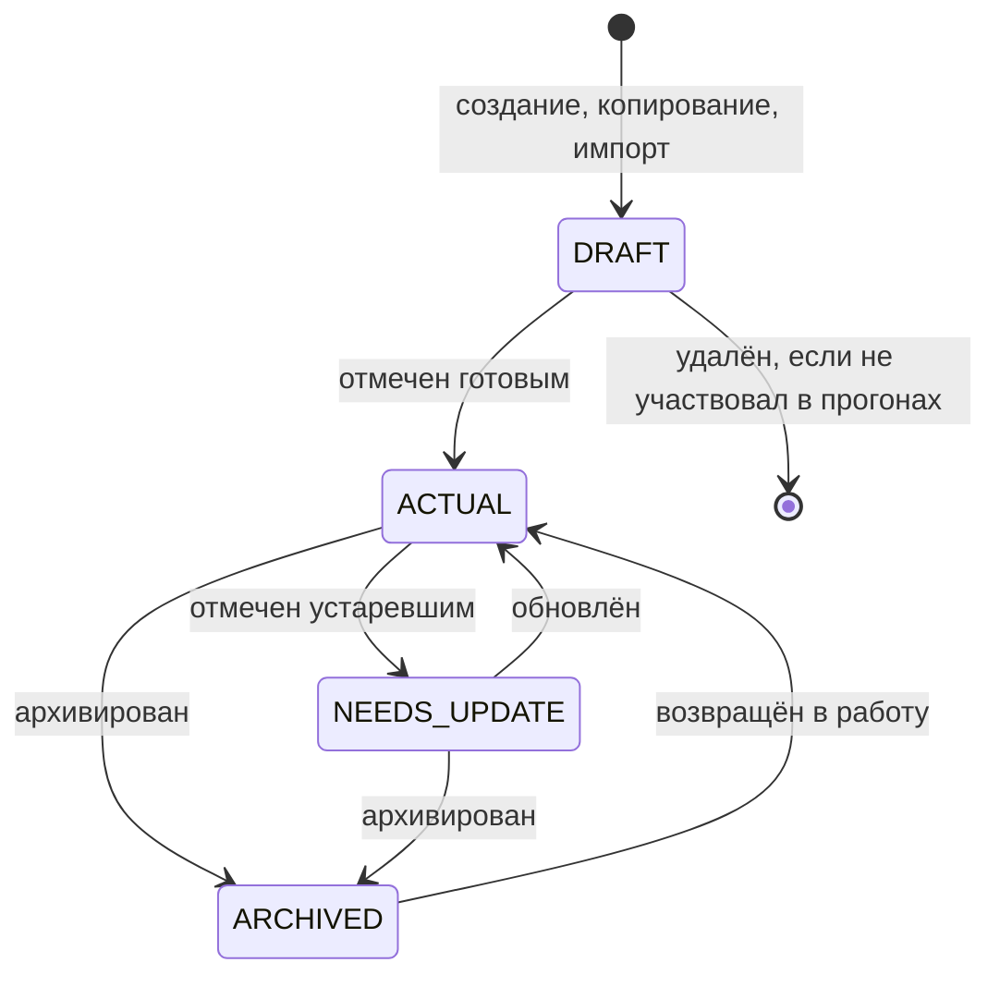
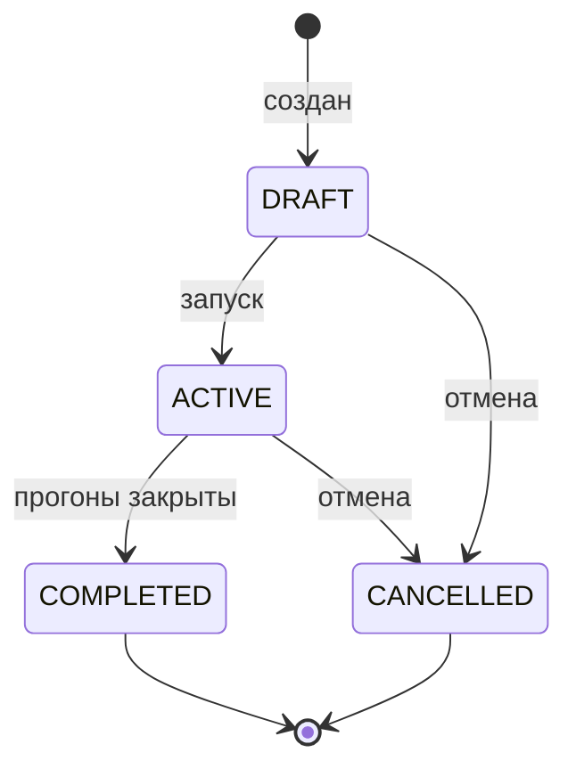
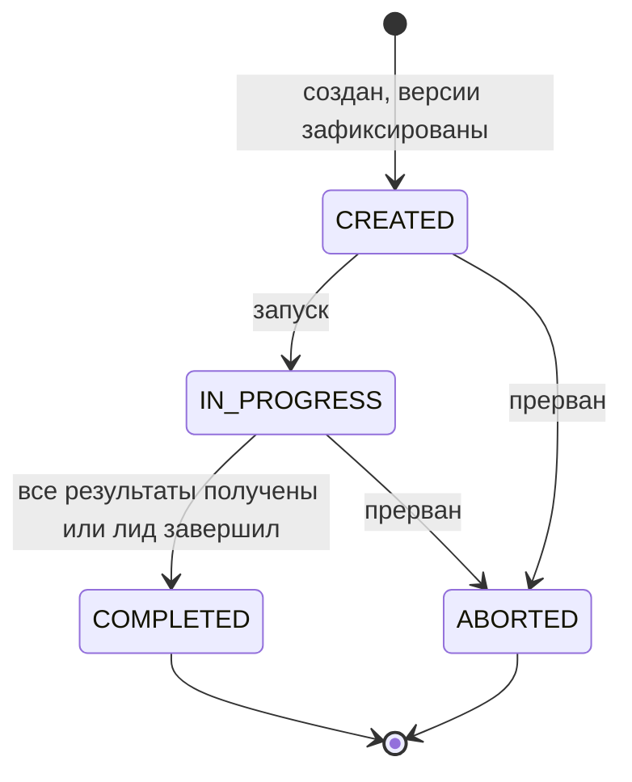
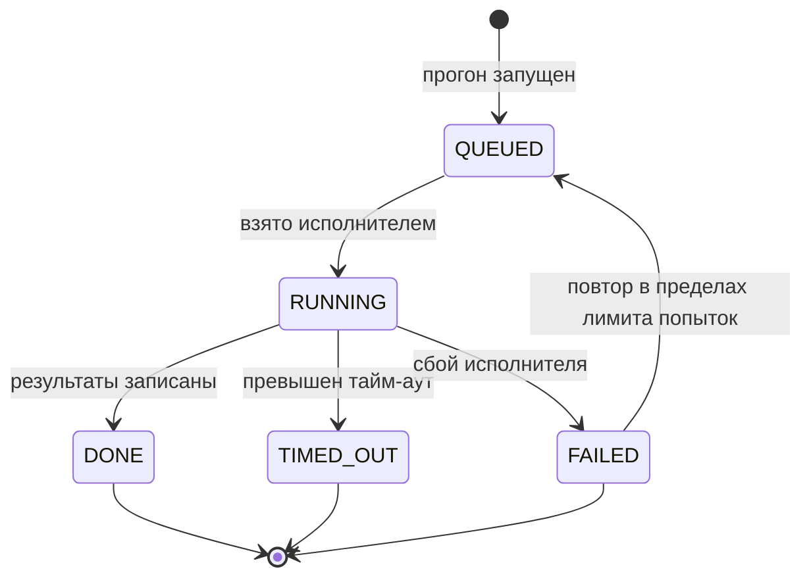
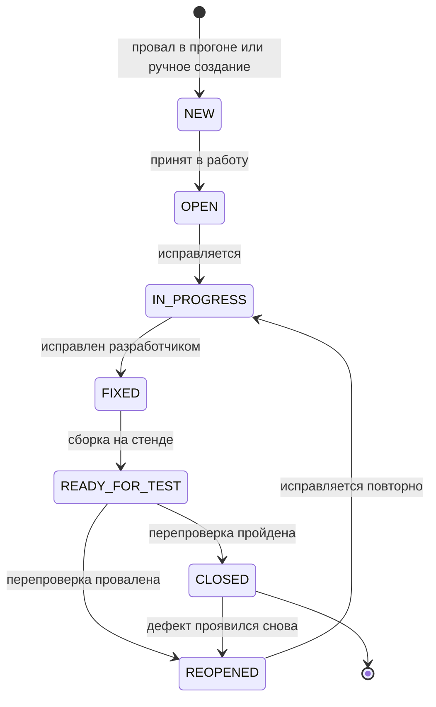
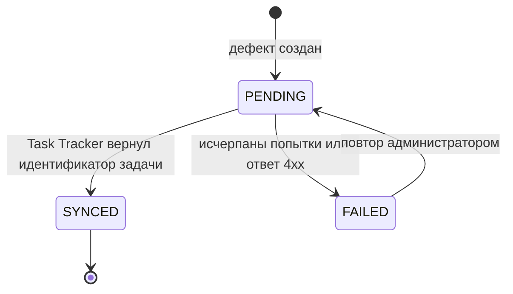

# 050 — Entities + Lifecycle

> Формат — см. [состав документов](documents-composition.md), документ 050.
> Источник — [vision, раздел 4](vision.md#4-основные-процессы). Продолжение [040 — Event Storming](040.event-storming.md); физическая модель — в [120](120.data-model.md).

## 1. Агрегаты и сущности

| Агрегат / сущность | Атрибуты (тип, ограничения) | Связи |
| --- | --- | --- |
| **ТестКейс** (корень) | `id` UUID; `key` строка, уникальна, неизменяема (`TC-RM-03`); `status` enum; `current_version` целое ≥ 1; `module` строка; `feature_ref`, `epic_ref`, `requirement_ref` — внешние ссылки, необязательны; `copied_from_id`; `created_by`; `created_at`, `updated_at` | 1:N к ВерсииКейса; N:0..1 к самому себе (исходный кейс копии); N:0..1 к Шаблону; M:N к ТестПлану и Набору; 1:N к Вложению |
| ВерсияКейса | `version` целое; `title` обязательно; `description`; `preconditions`; `priority`, `severity`, `type` — коды классификаторов; `automated` булево; `autotest_key` обязателен при `automated = true`; `changed_fields`; `author`; `created_at`. Неизменяема | N:1 к ТестКейсу; 1:N к Шагу |
| Шаг | `position` целое ≥ 1, уникально в версии; `action` обязательно; `expected_result` обязательно | N:1 к ВерсииКейса; 1:N к Вложению |
| **Шаблон** | `id`; `name` уникально; `description`; `body` — поля и шаги по умолчанию; `is_active` | 1:N к ТестКейсу (происхождение) |
| **Набор** | `id`; `name` уникально; `kind` enum: `MANUAL`, `FILTER`; `filter` — условие отбора, обязательно для `FILTER`; `owner` | M:N к ТестКейсу (для `MANUAL`); 1:N к Прогону |
| **ТестПлан** (корень) | `id`; `key` (`TP-12`); `name`; `scope_kind` enum: `RELEASE`, `ITERATION`, `PROJECT`, `MODULE`; `scope_ref`; `status` enum; `owner`; `team_ref`; `start_date` ≤ `end_date`; `tracker_iteration_id`, `planning_milestone_id` — внешние ссылки | M:N к ТестКейсу; 1:N к Прогону |
| **Прогон** (корень) | `id`; `key` (`RUN-87`); источник — ровно одно из `plan_id`, `suite_id`; `parent_run_id` для повторного; `environment`; `status` enum; `trigger` enum: `MANUAL`, `SCHEDULE`, `CI`; `started_by`; `autotests_commit_sha`; `sut_versions`; `started_at`, `finished_at`, `duration_ms` | N:0..1 к ТестПлану и Набору; 1:N к Результату; 0..1:N к самому себе; 1:0..1 к Заданию |
| Результат | `status` enum; `case_version` — зафиксированная версия; `assignee`; `actual_result`; `comment`; `failure_reason`; `failed_step`; `started_at`, `finished_at`, `duration_ms`; `executed_by`. Уникален в паре (прогон, кейс) | N:1 к Прогону и ВерсииКейса; 1:N к РезультатуШага и Вложению; M:N к Дефекту |
| РезультатШага | `status` enum как у результата; `actual_result`; `comment` | N:1 к Результату и Шагу |
| **Задание** | `id`; `status` enum; `timeout_s`; `attempts`; `claimed_by`; `claimed_at`; `finished_at`; `error` | 1:1 к Прогону |
| **Дефект** (корень) | `id`; `key` (`DEF-45`); `origin` enum: `AUTO`, `MANUAL`; `title`; `description`; `repro_steps`; `expected_result`; `actual_result`; `severity`; `priority`; `status` enum; `environment`; `build_version`; `author`; `requirement_ref`, `epic_ref`; `tracker_work_item_id`, `tracker_work_item_url`; `tracker_sync_state` enum: `PENDING`, `SYNCED`, `FAILED`; `reopen_count` целое ≥ 0 | N:0..1 к ТестКейсу, ВерсииКейса и Шагу; M:N к Прогону через связь с комментарием; 1:N к ЗаписиИстории, Комментарию, Вложению |
| ЗаписьИсторииДефекта | `author`; `source` enum: `QA`, `TRACKER`, `SYSTEM`; `field`; `old_value`; `new_value`; `occurred_at`. Неизменяема | N:1 к Дефекту |
| КомментарийДефекта | `author`; `source`; `body`; `external_comment_id`; `created_at` | N:1 к Дефекту |
| **Вложение** | `id`; владелец: вид и идентификатор; `file_name`; `content_type`; `size_bytes`; `object_key` уникален; `checksum`; `uploaded_by`; `uploaded_at`; `deleted_at` | N:1 к кейсу, шагу, результату или дефекту |
| **Окружение** | `code` уникален; `name`; `base_urls` — адреса подсистем; `is_active` | 1:N к Прогону |
| Классификатор | `kind` enum: `SEVERITY`, `PRIORITY`, `CASE_TYPE`; `code`; `name`; `sort_order`; `is_active` | Используется кейсом и дефектом по коду |
| **Расписание** | `suite`; `environment`; `cron`; `is_active`; `created_by` | N:1 к Набору и Окружению |
| КэшСотрудника | внешнее имя (`employees/1024`); отображаемое имя; подразделение; `account_user_id`; активность; время синхронизации | Источник для полей «ответственный», «тестировщик» |

Инварианты:

- Кейс, участвовавший в прогоне, физически не удаляется (FR-TC-01).
- Версия кейса, результат завершённого прогона и запись истории не изменяются (NFR-05).
- У кейса не более одного незакрытого автодефекта (FR-DEF-03).
- Один набор не исполняется дважды одновременно на одном окружении (FR-RUN-10).
- Идентификаторы итераций, вех, эпиков, задач и сотрудников — внешние ссылки без копии данных владельца (FR-DAT-02).

## 2. Жизненный цикл тест-кейса

| Статус | Описание | Триггер перехода |
| --- | --- | --- |
| `DRAFT` «Черновик» | Кейс пишется; в планы и наборы не добавляется | Создание, копирование, импорт |
| `ACTUAL` «Актуален» | Кейс готов к использованию | Тестировщик отметил готовым; нужны название и хотя бы один шаг с ожидаемым результатом |
| `NEEDS_UPDATE` «На доработке» | Кейс устарел, но остаётся в планах | Тестировщик отметил устаревшим |
| `ARCHIVED` «В архиве» | Кейс не попадает в новые планы и наборы; в старых прогонах сохраняется | Тестировщик архивировал |

Статус меняет сам тестировщик: ревью и согласования в системе нет.

## 3. Жизненный цикл тест-плана

| Статус | Описание | Триггер перехода |
| --- | --- | --- |
| `DRAFT` «Черновик» | Состав и сроки редактируются; прогоны создавать нельзя | Создание |
| `ACTIVE` «Активен» | Можно создавать прогоны; состав можно дополнять | QA-лид запустил план с хотя бы одним кейсом |
| `COMPLETED` «Завершён» | План закрыт, изменения запрещены | QA-лид завершил план; все прогоны завершены или прерваны |
| `CANCELLED` «Отменён» | План снят | QA-лид отменил; незавершённые прогоны прерываются |

## 4. Жизненный цикл прогона и результата

| Статус прогона | Описание | Триггер перехода |
| --- | --- | --- |
| `CREATED` «Создан» | Версии зафиксированы, идёт назначение тестировщиков | Создание из плана или набора |
| `IN_PROGRESS` «Выполняется» | Записываются результаты; автоматизированные кейсы переданы исполнителю | Запуск человеком, CI или расписанием |
| `COMPLETED` «Завершён» | Результаты неизменяемы | Последний кейс получил результат либо QA-лид завершил прогон |
| `ABORTED` «Прерван» | Прогон остановлен; полученные результаты сохранены | QA-лид прервал прогон или отменил план |

| Статус результата | Описание | Кто ставит |
| --- | --- | --- |
| `NOT_RUN` «Не выполнен» | Начальное значение | Система при создании прогона |
| `PASSED` «Пройден» | Все шаги дали ожидаемый результат | Тестировщик, исполнитель |
| `FAILED` «Провален» | Шаг или кейс дал расхождение, либо истёк тайм-аут | Тестировщик, исполнитель |
| `BLOCKED` «Заблокирован» | Кейс нельзя выполнить из-за внешней причины | Тестировщик; исполнитель — при недоступной подсистеме |
| `SKIPPED` «Пропущен» | Кейс сознательно не выполняется в этом прогоне | Тестировщик, QA-лид |

Результат можно менять, пока прогон в статусе `IN_PROGRESS`.

## 5. Жизненный цикл задания на запуск

`TIMED_OUT` переводит невыполненные кейсы задания в «Провален» с причиной «тайм-аут» (FR-RUN-09). Окончательный `FAILED` — в «Заблокирован» с причиной сбоя, чтобы прогон не завис (NFR-03).

## 6. Жизненный цикл дефекта

| Статус | Описание | Триггер перехода | Кто управляет |
| --- | --- | --- | --- |
| `NEW` | Дефект зафиксирован, «Ошибка» создаётся в Task Tracker | Провал шага или кейса; ручное создание | QA System |
| `OPEN` | Дефект принят командой разработки | Изменение в Task Tracker; до согласования Q-01 — QA-лид | Task Tracker |
| `IN_PROGRESS` | Идёт исправление | То же | Task Tracker |
| `FIXED` | Разработчик считает дефект исправленным | То же | Task Tracker |
| `READY_FOR_TEST` | Исправление развёрнуто на стенде | Тестировщик или QA-лид отметил готовность | QA System |
| `CLOSED` | Перепроверка пройдена | Кейс прошёл в прогоне либо тестировщик закрыл вручную | QA System |
| `REOPENED` | Дефект проявился снова | Кейс провален при перепроверке либо после закрытия | QA System |

Недопустимые переходы отклоняются (FR-DEF-05). Если дефект в `READY_FOR_TEST` и связанный кейс получил результат в новом прогоне, система сама закрывает или переоткрывает дефект от имени запустившего прогон. Каждое изменение статуса и поля пишется в историю с источником (FR-DEF-07).

## 7. Жизненный цикл синхронизации с Task Tracker

Состояние синхронизации не влияет на статус дефекта: дефект виден и ведётся в QA System независимо от доступности Task Tracker.
