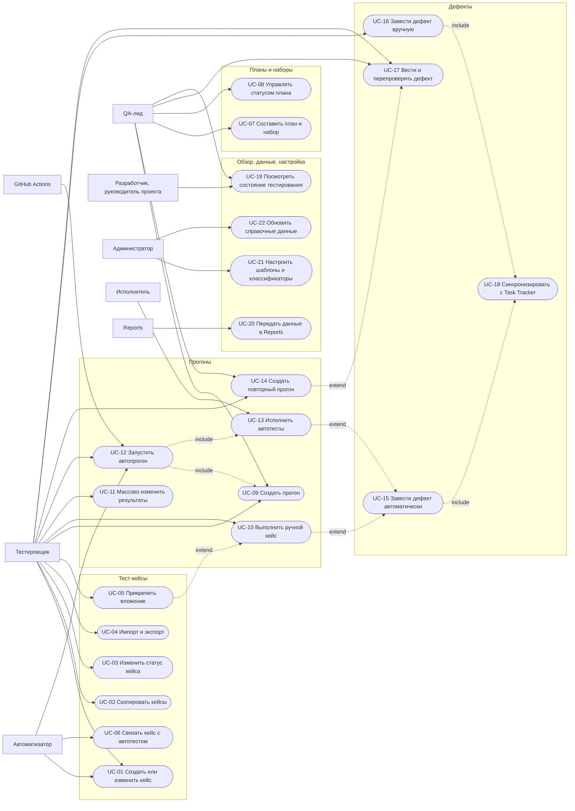

# 060 — Use Cases

> Формат — см. [состав документов](documents-composition.md), документ 060.
> Источник — [vision, разделы 4 и 5](vision.md#4-основные-процессы). Акторы — [030](030.actors.md), сущности — [050](050.entities.md), истории — [080](080.tester-user-stories.md) и соседние файлы.
> Диаграмма использует `flowchart` вместо `usecaseDiagram`, чтобы гарантированно отображаться в GitHub.

## 1. Диаграмма

## 2. Спецификации

### UC-01. Создать или изменить тест-кейс

- **Актор:** тестировщик, автоматизатор.
- **Предусловия:** действительный токен, роль R-02 или R-03.
- **Постусловия:** создана новая версия кейса; прежние версии не изменены.
- **Основной поток:**
  1. Актор открывает форму нового кейса или существующий кейс.
  2. Заполняет название, описание, предусловия, шаги с ожидаемым результатом, приоритет, серьёзность, тип, группировку.
  3. Система проверяет поля и сохраняет версию: для нового кейса — версию 1 и статус «Черновик».
  4. Система показывает кейс с номером версии.
- **Альтернативы:**
  - 1а. Создание из шаблона: поля и шаги подставляются из шаблона, дальше с шага 2.
  - 3а. Поля некорректны: ничего не сохраняется, ответ перечисляет поля и причины.
  - 3б. Кейс в архиве: изменение отклоняется, предлагается вернуть кейс в работу.
  - 3в. Изменений нет: новая версия не создаётся.

### UC-02. Скопировать тест-кейсы

- **Актор:** тестировщик.
- **Предусловия:** выбраны один или несколько кейсов.
- **Постусловия:** у каждой копии новый ключ, статус «Черновик», версия 1 и ссылка на исходный кейс.
- **Основной поток:** актор выбирает кейсы и команду копирования → система создаёт копии последней версии каждого кейса вместе с шагами → показывает список созданных ключей.
- **Альтернативы:** вложения не копируются, копия ссылается на исходный кейс; при ошибке на одном кейсе вся операция откатывается.

### UC-03. Изменить статус кейса, архивировать

- **Актор:** тестировщик.
- **Постусловия:** статус изменён по правилам из [050, раздел 2](050.entities.md#2-жизненный-цикл-тест-кейса).
- **Основной поток:** актор выбирает новый статус → система проверяет допустимость перехода → сохраняет.
- **Альтернативы:** перевод в «Актуален» без названия или без шага с ожидаемым результатом отклоняется; удаление разрешено только для черновика, не участвовавшего в прогонах.

### UC-04. Импортировать и экспортировать кейсы

- **Актор:** тестировщик.
- **Постусловия:** экспорт — файл `.csv` или `.xlsx`; импорт — созданные и обновлённые кейсы и отчёт.
- **Основной поток (экспорт):** актор задаёт фильтр и формат → система формирует файл с ключами, полями и шагами.
- **Основной поток (импорт):**
  1. Актор загружает файл.
  2. Система проверяет структуру и значения, ничего не записывая, и показывает отчёт: будет создано, обновлено, отклонено.
  3. Актор подтверждает.
  4. Система применяет файл одной транзакцией: строки с существующим ключом создают новую версию, без ключа — новый черновик.
- **Альтернативы:** при любой ошибке проверки запись не выполняется; неизменённый экспорт при импорте даёт «0 создано, 0 обновлено».

### UC-05. Прикрепить вложение

- **Актор:** тестировщик, автоматизатор.
- **Постусловия:** файл лежит в бакете, метаданные — в БД, владелец — кейс, шаг, результат или дефект.
- **Основной поток:** актор выбирает файл → система проверяет размер и тип, записывает объект, сохраняет метаданные → файл доступен по ссылке с ограниченным сроком.
- **Альтернативы:** хранилище недоступно — операция отклоняется, остальные данные формы сохраняются; вложение к результату завершённого прогона не добавляется.

### UC-06. Связать кейс с автотестом и проверить ключи

- **Актор:** автоматизатор.
- **Постусловия:** кейс помечен автоматизированным и содержит ключ автотеста.
- **Основной поток:** актор указывает ключ в кейсе → система сохраняет новую версию → сверяет ключ со списком автотестов последнего известного коммита.
- **Альтернативы:** ключ не найден — кейс сохраняется и попадает в список несвязанных; один ключ у двух кейсов — предупреждение.

### UC-07. Составить тест-план и набор

- **Актор:** QA-лид.
- **Предусловия:** роль R-04.
- **Постусловия:** план в статусе «Черновик» с составом, ответственным, сроками и привязками.
- **Основной поток:**
  1. Лид создаёт план, указывает область (релиз, итерация, проект, модуль), ответственного, команду и даты.
  2. Добавляет кейсы вручную или фильтром.
  3. При необходимости сохраняет фильтр как набор.
  4. Указывает итерацию Task Tracker и (или) веху Planning System.
- **Альтернативы:** архивные кейсы и черновики не добавляются; дата окончания раньше начала отклоняется; при недоступном источнике ссылка вводится вручную и помечается непроверенной.

### UC-08. Управлять статусом плана

- **Актор:** QA-лид.
- **Основной поток:** лид запускает, завершает или отменяет план → система проверяет переход по [050, раздел 3](050.entities.md#3-жизненный-цикл-тест-плана).
- **Альтернативы:** запуск пустого плана отклоняется; завершение при незакрытых прогонах отклоняется с их перечнем; отмена прерывает незавершённые прогоны.

### UC-09. Создать прогон

- **Актор:** QA-лид, тестировщик.
- **Предусловия:** план «Активен» либо выбран набор; выбрано активное окружение.
- **Постусловия:** прогон в статусе «Создан»; по каждому кейсу — результат «Не выполнен» со ссылкой на зафиксированную версию.
- **Основной поток:** актор выбирает источник и окружение → система вычисляет состав, фиксирует версии, создаёт результаты → лид назначает тестировщиков на прогон или отдельные кейсы.
- **Альтернативы:** состав пуст — прогон не создаётся; кейсы «В архиве» в состав не попадают.

### UC-10. Выполнить ручной кейс

- **Актор:** тестировщик.
- **Предусловия:** прогон «Выполняется», кейс назначен актору или не назначен никому.
- **Постусловия:** результат кейса и шагов сохранён с временем начала, окончания и длительностью.
- **Основной поток:**
  1. Тестировщик открывает кейс в прогоне и видит шаги зафиксированной версии.
  2. По каждому шагу отмечает статус и при расхождении записывает фактический результат.
  3. Добавляет комментарий и вложения.
  4. Система сохраняет результат и публикует событие.
- **Альтернативы:**
  - 2а. Шаг провален: результат кейса «Провален», выполняется UC-15.
  - 2б. Выполнить нельзя: результат «Заблокирован» с причиной.
  - 4а. Прогон уже завершён: изменение отклоняется.

### UC-11. Массово изменить результаты

- **Актор:** тестировщик, QA-лид.
- **Основной поток:** актор выбирает кейсы прогона, статус и комментарий → система применяет изменение ко всем выбранным одной транзакцией.
- **Альтернативы:** массовый перевод в «Провален» дефекты не создаёт автоматически: система предлагает завести их по одному; чужие назначенные кейсы тестировщик менять не может.

### UC-12. Запустить автоматический прогон

- **Актор:** тестировщик, автоматизатор, QA-лид, GitHub Actions, расписание.
- **Предусловия:** в составе есть автоматизированные кейсы; выбрано окружение.
- **Постусловия:** прогон «Выполняется», задание в очереди.
- **Основной поток:** актор нажимает «Запустить» или вызывает API → выполняется UC-09 → система ставит задание → возвращает идентификатор прогона → актор отслеживает статус.
- **Альтернативы:** тот же набор уже исполняется на этом окружении — отказ со ссылкой на идущий прогон; ручные кейсы состава остаются «Не выполнен» и ждут тестировщика.

### UC-13. Исполнить автотесты

- **Актор:** исполнитель.
- **Предусловия:** в очереди есть задание.
- **Постусловия:** по каждому автоматизированному кейсу записаны статус, длительность, журнал; задание завершено.
- **Основной поток:**
  1. Исполнитель берёт задание и фиксирует commit SHA автотестов и версии подсистем.
  2. Получает служебный токен Keycloak.
  3. Запускает автотесты по ключам кейсов против адресов окружения.
  4. Разбирает отчёт JUnit XML и записывает результат и журнал каждого кейса.
  5. Завершает задание; если ручных кейсов нет, прогон завершается.
- **Альтернативы:**
  - 3а. Ключ не найден: результат «Заблокирован», причина «автотест не найден».
  - 3б. Подсистема недоступна: результат «Заблокирован» с причиной.
  - 3в. Тайм-аут: результат «Провален», причина «тайм-аут».
  - 4а. Провал: выполняется UC-15.
  - 5а. Сбой исполнителя: задание повторяется в пределах лимита, уже записанные результаты не дублируются.

### UC-14. Создать повторный прогон

- **Актор:** QA-лид, тестировщик.
- **Предусловия:** исходный прогон завершён или прерван.
- **Постусловия:** новый прогон со ссылкой на исходный, в составе — только «Провален» и «Заблокирован».
- **Основной поток:** актор выбирает «Повторить упавшие» → система создаёт прогон на тех же зафиксированных версиях → дальше UC-10 или UC-12.
- **Альтернативы:** упавших нет — прогон не создаётся; по желанию актора берутся текущие версии кейсов вместо зафиксированных.

### UC-15. Автоматически завести дефект

- **Актор:** система (после UC-10 или UC-13).
- **Предусловия:** результат кейса «Провален».
- **Постусловия:** у кейса есть незакрытый дефект, связанный с этим прогоном.
- **Основной поток:**
  1. Система ищет незакрытый автодефект по кейсу.
  2. Не найден: создаёт дефект `NEW`, заполняя поля по [vision 4.4](vision.md#44-жизненный-цикл-дефекта): заголовок, шаги до упавшего включительно, ожидаемый и фактический результат, серьёзность и приоритет кейса, окружение, версии, вложения, связи.
  3. Выполняет UC-18.
- **Альтернативы:**
  - 1а. Найден: добавляет ссылку на прогон и комментарий с фактическим результатом; новый дефект не создаётся.
  - 1б. Найден в статусе `READY_FOR_TEST`: дефект переходит в `REOPENED`.

### UC-16. Завести дефект вручную

- **Актор:** тестировщик.
- **Основной поток:** актор открывает форму из кейса, шага или результата → система подставляет известные поля → актор дополняет и сохраняет → UC-18.
- **Альтернативы:** обязательны заголовок, фактический результат и серьёзность; при существующем незакрытом дефекте по кейсу система показывает его и предлагает добавить комментарий вместо создания.

### UC-17. Вести и перепроверять дефект

- **Актор:** тестировщик, QA-лид.
- **Постусловия:** статус изменён по [050, раздел 6](050.entities.md#6-жизненный-цикл-дефекта); изменение записано в историю.
- **Основной поток:**
  1. Дефект получает статус `FIXED`.
  2. Тестировщик отмечает `READY_FOR_TEST`, когда исправление на стенде.
  3. Кейс выполняется повторно (UC-14).
  4. Кейс пройден — дефект `CLOSED`; провален — `REOPENED`.
- **Альтернативы:** недопустимый переход отклоняется с перечнем допустимых; закрытый дефект переоткрывается при новом провале кейса; до согласования Q-01 шаг 1 выполняет QA-лид вручную.

### UC-18. Синхронизировать дефект с Task Tracker

- **Актор:** система.
- **Предусловия:** дефект создан, состояние синхронизации `PENDING`.
- **Постусловия:** у дефекта есть идентификатор и ссылка задачи «Ошибка».
- **Основной поток:** система вызывает `POST /api/v1/bugs` с `externalSource = qa-system` и ключом дефекта → получает `201` или `200` → сохраняет идентификатор и ссылку, состояние `SYNCED`.
- **Альтернативы:** тайм-аут или `5xx` — повтор с нарастающей задержкой, повтор безопасен благодаря идемпотентности; `4xx` — состояние `FAILED`, причина видна администратору; входящие изменения из Task Tracker обрабатываются идемпотентно по идентификатору события — после согласования Q-01.

### UC-19. Посмотреть состояние тестирования

- **Актор:** QA-лид, руководитель проекта, разработчик.
- **Основной поток:** актор открывает план, прогон или итерацию → система показывает счётчики результатов по статусам, упавшие кейсы, открытые дефекты по серьёзности и ссылки на задачи в Task Tracker.
- **Альтернативы:** данных нет — явное сообщение; справочные данные устарели — показана дата актуальности.

### UC-20. Передать данные в Reports

- **Актор:** Reports.
- **Основной поток:** QA System публикует события при запуске и завершении прогона, записи результата и изменении дефекта → Reports применяет их идемпотентно → по расписанию сверяет витрину запросами `/api/v1/reports/*` с отбором по времени изменения.
- **Альтернативы:** Kafka недоступна — события копятся в таблице исходящих и публикуются позже; токен без роли R-07 — `403`.

### UC-21. Настроить шаблоны, классификаторы, окружения

- **Актор:** администратор.
- **Основной поток:** актор создаёт или изменяет шаблон, значение классификатора, окружение или расписание → система сохраняет.
- **Альтернативы:** значение, которое уже используется, не удаляется, а отключается; код значения неизменяем.

### UC-22. Обновить справочные данные

- **Актор:** расписание, администратор.
- **Основной поток:** система постранично читает `employees` и `org_units` из Reference Manager → обновляет кэш и время синхронизации.
- **Альтернативы:** источник недоступен — остаётся прежний срез, ошибка видна администратору; сотрудник стал неактивным — сохраняется в старых записях, недоступен для новых назначений.

## 3. Покрытие требований

| Use case | Требования vision | Истории |
| --- | --- | --- |
| UC-01 | FR-TC-01, FR-TC-02, FR-TC-04, FR-TC-06, FR-TC-07 | US-TS-01, US-TS-02 |
| UC-02 | FR-TC-03 | US-TS-03 |
| UC-03 | FR-TC-01, FR-TC-02 | US-TS-04 |
| UC-04 | FR-TC-08 | US-TS-05 |
| UC-05 | FR-TC-05, FR-RUN-04 | US-TS-06 |
| UC-06 | FR-TC-09 | US-AU-01, US-AU-02 |
| UC-07 | FR-TP-01, FR-TP-02, FR-TP-03, FR-TP-05 | US-QL-01, US-QL-02 |
| UC-08 | FR-TP-04 | US-QL-03 |
| UC-09 | FR-RUN-01, FR-RUN-02 | US-QL-04 |
| UC-10 | FR-RUN-03, FR-RUN-04, FR-RUN-06 | US-TS-07 |
| UC-11 | FR-RUN-05 | US-TS-08 |
| UC-12 | FR-RUN-08, FR-RUN-10 | US-AU-03, US-CI-01 |
| UC-13 | FR-RUN-09, FR-SEC-02 | US-AU-04, US-EX-01 |
| UC-14 | FR-RUN-07 | US-QL-05 |
| UC-15 | FR-DEF-02, FR-DEF-03, FR-DEF-04 | US-TS-09 |
| UC-16 | FR-DEF-01, FR-DEF-04 | US-TS-10 |
| UC-17 | FR-DEF-05, FR-DEF-07 | US-TS-11, US-QL-06 |
| UC-18 | FR-DEF-06 | US-DV-01, US-TT-01 |
| UC-19 | FR-DEF-08 | US-QL-07, US-PM-01, US-DV-02 |
| UC-20 | Vision 8.3 | US-RP-01 |
| UC-21 | FR-TC-06 | US-AD-01, US-AD-02 |
| UC-22 | FR-DAT-02 | US-AD-03 |
