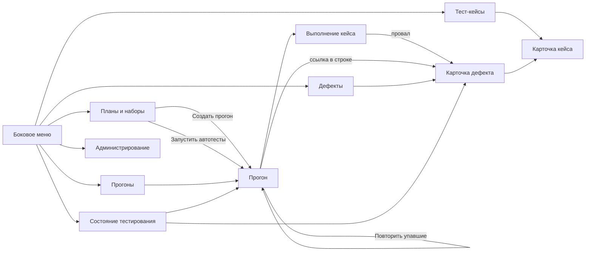

# 110 — UI/UX прототип

> Формат — см. [состав документов](documents-composition.md), документ 110.
> Источник — [vision, разделы 2–4](vision.md#2-ключевые-возможности). Экраны привязаны к [use cases](060.use-cases.md) и историям 080; интерактивная версия — [115](115.live-prototype.md).

## 1. Принципы

| Принцип | Как применяется |
| --- | --- |
| Консистентность | Все списки устроены одинаково: фильтры сверху, таблица, переход в карточку по строке. Статус везде показан одной и той же цветной меткой с текстом |
| Обратная связь | Каждое действие завершается сообщением: что сохранено, какой дефект заведён или связан, почему операция отклонена. Текст ошибки содержит код и причину с сервера |
| Предсказуемость | Доступны только переходы, допустимые для текущего статуса и роли; недопустимых кнопок нет. Завершённый прогон открывается в режиме чтения |
| Минимальная когнитивная нагрузка | Тестировщик в прогоне видит только шаги зафиксированной версии и поле фактического результата. Дефект при провале заполняется сам |
| Accessibility | Цвет дублируется текстом метки; управление доступно с клавиатуры: строки таблиц фокусируются и открываются по Enter; у полей и флажков есть подписи; контраст текста не ниже 4,5:1 |

## 2. Ключевые экраны

| Экран | Структура | Функциональные элементы | Состояния |
| --- | --- | --- | --- |
| Тест-кейсы | Панель фильтров; таблица: ключ, название, тип, серьёзность, вид, версия, статус | Фильтры по модулю, статусу, типу, эпику, признаку автоматизации; создание кейса, в том числе из шаблона; массовое копирование; импорт и экспорт | loading — скелетон строк; empty — «По фильтру кейсов нет»; error — не удалось загрузить; импорт отклонён — отчёт по строкам |
| Карточка кейса | Шапка: ключ, название, статус; поля; таблица шагов; вложения; история версий | Редактирование полей и шагов; «Сохранить версию»; смена статуса; копирование; ключ автотеста; просмотр любой версии | loading; error проверки — подсветка поля и причина; архивный кейс — только чтение с предложением вернуть в работу; без изменений — «версия не создана» |
| Планы и наборы | Таблица планов: ключ, область, итерация или веха, сроки, число кейсов, статус; таблица наборов | Создание плана; добавление кейсов вручную и фильтром; сохранение фильтра набором; запуск, завершение, отмена; «Создать прогон»; «Запустить автотесты» у набора | empty — нет планов; warning — ссылка на итерацию «не проверена»; error — завершение отклонено, перечислены незакрытые прогоны |
| Прогоны | Таблица: ключ, источник, окружение, источник запуска, счётчики, статус | Переход в прогон; отметка повторного прогона и ссылки на исходный | empty — «Прогонов пока нет» с подсказкой |
| Прогон | Счётчики по статусам; панель действий; таблица результатов с флажками | Запуск; «Запустить автотесты»; запись результата кейса и шага; массовая смена статуса; назначение тестировщика; завершение, прерывание; «Повторить упавшие»; ссылка на дефект в строке | loading; выполняется — счётчики обновляются; завершён — только чтение; error — набор уже исполняется, прогон завершён |
| Выполнение кейса | Шаги зафиксированной версии, по каждому — статус и фактический результат; комментарий; вложения | Отметка шага; поле фактического результата у проваленного шага; «Сохранить результат» | error проверки — у проваленного шага нужен фактический результат; после сохранения — сообщение о заведённом или связанном дефекте |
| Дефекты | Фильтры; таблица: ключ, заголовок, серьёзность, кейс, прогоны, задача Task Tracker, статус | Фильтры по проекту, итерации, автору, статусу, серьёзности; создание вручную | empty — «Дефектов нет»; метка `PENDING` или `FAILED` вместо номера задачи при незавершённой синхронизации |
| Карточка дефекта | Шапка: ключ, статус, серьёзность; шаги воспроизведения, ожидаемый и фактический результат; связи; история; комментарии | Кнопки допустимых переходов; изменение серьёзности и приоритета; комментарий; переход к кейсу, прогону и «Ошибке»; повтор синхронизации | error — недопустимый переход с перечнем допустимых; для роли без прав — «переходов нет» |
| Состояние тестирования | Выбор итерации или плана; счётчики последнего результата по кейсам; открытые дефекты по серьёзности | Переход к плану, прогону, дефекту | empty — «По плану ещё нет прогонов» или «К итерации не привязан план»; warning — справочные данные устарели, показана дата |
| Администрирование | Вкладки: шаблоны, классификаторы, окружения, расписания, состояние интеграций | Создание и отключение значений; расписание набора; обновление кэша; число неотправленных сообщений; повтор синхронизации | error — источник недоступен, показано время последней успешной синхронизации; warning — значение используется и может быть только отключено |

## 3. Навигация

Вход — перенаправление на страницу Keycloak; после входа открывается экран, соответствующий роли: тестировщику — его кейсы в выполняющихся прогонах, QA-лиду — состояние тестирования, остальным — список кейсов.

## 4. Контекстное управление по ролям

| Элемент интерфейса | `qa-viewer` | `qa-tester` | `qa-automation` | `qa-lead` | `qa-admin` |
| --- | --- | --- | --- | --- | --- |
| Создание и правка кейса, копирование, статус | скрыто | видно | видно | видно | скрыто |
| Поле «ключ автотеста», список несвязанных ключей | скрыто | только чтение | видно | видно | только чтение |
| Создание и статусы плана | скрыто | скрыто | скрыто | видно | скрыто |
| «Создать прогон», «Запустить автотесты», «Повторить упавшие» | скрыто | видно | видно | видно | скрыто |
| Запись результата, массовая смена статуса | скрыто | свои и неназначенные | скрыто | видно | скрыто |
| «Завершить» и «Прервать» прогон, назначение тестировщиков | скрыто | скрыто | скрыто | видно | скрыто |
| Переходы дефекта `READY_FOR_TEST`, `CLOSED`, `REOPENED` | скрыто | видно | скрыто | видно | скрыто |
| Переходы дефекта `OPEN`, `IN_PROGRESS`, `FIXED` | скрыто | скрыто | скрыто | видно до согласования Q-01 | скрыто |
| Комментарий к дефекту | видно | видно | видно | видно | скрыто |
| Раздел «Администрирование» | скрыт | скрыт | скрыт | состояние интеграций, расписания | весь |

Скрытие элемента — удобство, а не защита: каждое действие сервер проверяет заново по [070](070.role-matrix.md) (FR-SEC-01).

## 5. UX-особенности

- **Автосохранение.** Незаписанный результат кейса и черновик текста кейса хранятся локально в браузере и восстанавливаются после перезагрузки; на сервер уходит только явное сохранение, чтобы не плодить версии.
- **Предпросмотр.** Изображения во вложениях открываются в интерфейсе; журнал автотеста показывается текстом с поиском. При импорте сначала показывается отчёт проверки и только затем запрашивается подтверждение.
- **Подтверждение действий.** Подтверждаются необратимые операции: завершение и прерывание прогона, отмена плана, архивирование кейса, удаление черновика, применение импорта.
- **Сообщение о дефекте.** После провала система сообщает, заведён новый дефект или связан существующий, и даёт ссылку.
- **Видимость неизменяемости.** В прогоне рядом с кейсом показан номер зафиксированной версии; если текущая версия кейса новее, показана отметка «в прогоне версия N».
- **Актуальность внешних данных.** У списков сотрудников и у ссылок на итерацию показано время последней синхронизации или отметка «не проверена».

## 6. Привязка к историям и use cases

| Экран | User stories | Use cases |
| --- | --- | --- |
| Тест-кейсы | US-TS-03, US-TS-05, US-AU-02 | UC-02, UC-04, UC-06 |
| Карточка кейса | US-TS-01, US-TS-02, US-TS-04, US-TS-06, US-AU-01 | UC-01, UC-03, UC-05, UC-06 |
| Планы и наборы | US-QL-01, US-QL-02, US-QL-03, US-AU-03 | UC-07, UC-08, UC-12 |
| Прогоны, Прогон | US-QL-04, US-QL-05, US-QL-07, US-TS-08, US-AU-03, US-AU-04 | UC-09, UC-11, UC-12, UC-14 |
| Выполнение кейса | US-TS-07, US-TS-09, US-TS-06 | UC-10, UC-15, UC-05 |
| Дефекты | US-QL-06, US-TS-10 | UC-16, UC-19 |
| Карточка дефекта | US-TS-11, US-DV-02, US-PM-02 | UC-17, UC-18 |
| Состояние тестирования | US-PM-01, US-PM-02, US-QL-07 | UC-19 |
| Администрирование | US-AD-01, US-AD-02, US-AD-03 | UC-21, UC-22, UC-18 |
