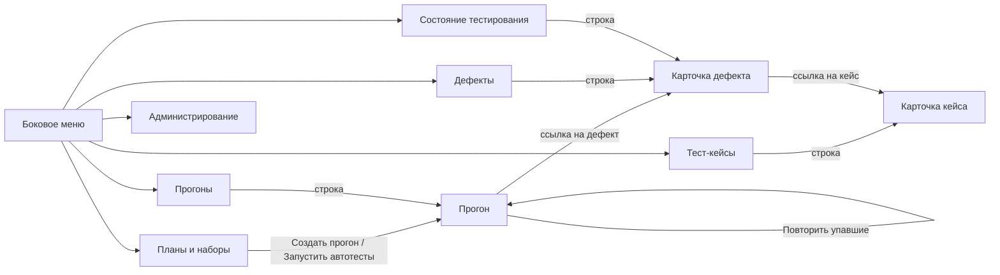

# 115 — Live-прототип

> Формат — см. [состав документов](documents-composition.md), документ 115.
> Экраны и принципы — [110](110.ui-ux.md).

Интерактивный прототип — один файл [`../prototype/index.html`](../prototype/index.html) с навигацией по экранам. Сборки и внешних зависимостей нет: файл открывается в браузере двойным щелчком. Данные хранятся в памяти страницы и сбрасываются при перезагрузке; сервера нет.

## 1. Экраны и связки

Экраны соответствуют [110](110.ui-ux.md). Шесть разделов доступны из бокового меню; карточки кейса, прогона и дефекта открываются из списков и по ссылкам.

Переключатель роли в меню («QA-лид», «Тестировщик», «Автоматизатор», «Разработчик / РП», «Администратор») сразу меняет доступные действия по таблице из [110, раздел 4](110.ui-ux.md#4-контекстное-управление-по-ролям). Это демонстрация контекстного управления, а не проверка прав: в системе права проверяет сервер.

## 2. Что заложено в данные

- Шесть кейсов стартового набора: TC-RM-01…03, TC-TT-01, TC-TT-02 (ручной), TC-INF-01.
- План `TP-12` «Итерация 4 — регрессия» в статусе «Активен» со ссылкой на итерацию с отметкой «не проверена».
- Набор «Smoke» из двух автоматизированных кейсов.
- Исполнитель автотестов имитируется: автоматизированные кейсы получают «Пройден», кроме TC-RM-03, который «падает» на шаге 3, пока в разделе «Администрирование» дефект не отмечен исправленным на стенде.
- Task Tracker имитируется: его можно «выключить» и «включить» в разделе «Администрирование».

## 3. Сценарии для показа

| № | Сценарий | Шаги в прототипе | Что видно | Связи |
| --- | --- | --- | --- | --- |
| 1 | Версия кейса | Тест-кейсы → TC-RM-03 → изменить название → «Сохранить версию»; затем сохранить ещё раз без изменений | Появляется версия 2 с перечнем изменённых полей; повторное сохранение версию не создаёт | UC-01, US-TS-02 |
| 2 | Копия и статусы | В карточке кейса «Копировать»; у копии → «Актуален» | Новый ключ, «Черновик», ссылка на исходный; переходы только допустимые | UC-02, UC-03, US-TS-03, US-TS-04 |
| 3 | Автопрогон и автодефект | Планы → «Создать прогон» → «Запустить» → «Запустить автотесты» | Автоматизированные кейсы получают результаты; TC-RM-03 провален на шаге 3; в строке ссылка на `DEF-45` с шагами 1–3, ожидаемым и фактическим результатом | UC-12, UC-13, UC-15, US-AU-03, US-TS-09 |
| 4 | Ручной кейс и заморозка версии | В том же прогоне у TC-TT-02 «Пройден» или «Провален…»; колонка «Версия» | У TC-RM-03 в прогоне осталась версия на момент создания, даже если кейс правили позже | UC-10, US-TS-07, NFR-05 |
| 5 | Неизменность завершённого прогона | «Завершить» | Действия записи результата исчезают | US-TS-07, NFR-05 |
| 6 | Дедупликация | «Повторить упавшие» → «Запустить» → «Запустить автотесты» | Новый дефект не создаётся; у `DEF-45` два прогона и запись в истории | UC-14, UC-15, US-QL-05, FR-DEF-03 |
| 7 | Жизненный цикл дефекта | Дефекты → `DEF-45` → роль «QA-лид»: OPEN → IN_PROGRESS → FIXED; роль «Тестировщик»: READY_FOR_TEST | У тестировщика нет кнопок статусов разработки; «Попробовать → CLOSED» из неподходящего статуса даёт ошибку `INVALID_TRANSITION` с перечнем допустимых | UC-17, US-TS-11, US-QL-06 |
| 8 | Перепроверка | Администрирование → «Считать дефект исправленным»; затем повторный прогон упавших и автотесты | Кейс пройден, дефект в `READY_FOR_TEST` закрывается сам. Без отметки об исправлении — переходит в `REOPENED`, счётчик переоткрытий растёт | UC-17, US-TS-11 |
| 9 | Запрет параллельного запуска набора | Планы → у набора «Smoke» «Запустить автотесты» дважды, не запуская исполнитель | Второй запуск отклонён: `SUITE_ALREADY_RUNNING` | UC-12, US-CI-01, FR-RUN-10 |
| 10 | Недоступность Task Tracker | Администрирование → «Симулировать недоступность» → в прогоне провалить вручную TC-TT-02 → «Восстановить и дослать» | Дефект создан с `PENDING`, счётчик неотправленных сообщений растёт; после восстановления — `SYNCED` и номер задачи | UC-18, US-DV-01, NFR-11 |
| 11 | Состояние тестирования | Раздел «Состояние тестирования» до и после прогона | До прогонов — явное сообщение; после — последний результат по каждому кейсу и открытые дефекты | UC-19, US-PM-01, US-QL-07 |
| 12 | Роли | Переключить роль на «Разработчик / РП» | Остаются только чтение и переходы по ссылкам; раздел «Администрирование» скрыт | US-DV-02, US-PM-02 |

## 4. Как проверялся

- Правила прототипа (версии, заморозка, автодефект и дедупликация, переходы дефекта, перепроверка, запрет параллельного запуска, отложенная отправка) пройдены сценарием в Node.js без ошибок.
- Все экраны отрисованы для каждой из пяти ролей на подменённом DOM без исключений.
- Начальный экран открыт в headless Firefox 145 и проверен по снимку.

Щелчки по реальным элементам в браузере автоматически не прогонялись: перед показом сценарии раздела 3 стоит пройти вручную.

## 5. Сознательные упрощения

- Нет входа через Keycloak: роль выбирается переключателем.
- Отдельного экрана «Выполнение кейса» нет: результат ставится кнопками в строке прогона, номер упавшего шага и фактический результат запрашиваются диалогом браузера.
- Создание кейса — диалог с одним полем; шаги добавляются по одному в карточке; редактирование и удаление существующих шагов не реализованы.
- Создание и редактирование плана, назначение тестировщиков, шаблоны, импорт, вложения и комментарии не реализованы; экспорт показывает сообщение.
- Массовая смена статуса не проверяет чужие назначения.
- Состояния loading отсутствуют: данных с сервера нет.
- События Kafka не показаны; Task Tracker и исполнитель — имитация.
- Ключи новых кейсов создаются с префиксом `RM` и сквозным счётчиком.
