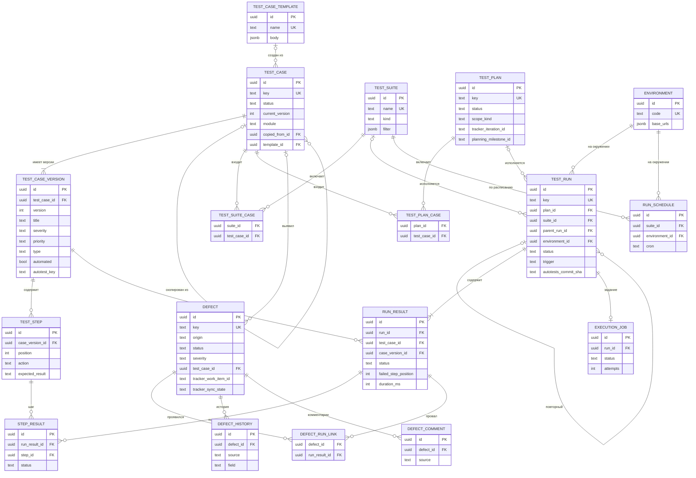

# 120 — Data Model

> Формат — см. [состав документов](documents-composition.md), документ 120.
> Согласовано с сущностями из [050](050.entities.md). СУБД — PostgreSQL, отдельная база QA System (FR-DAT-01). Решения — [ADR-003, ADR-004, ADR-006, ADR-007, ADR-010](145.architecture-decisions.md).

Общие правила: первичные ключи — `uuid`; время — `timestamptz` в UTC; перечисления хранятся как `text` с ограничением `CHECK`; идентификаторы чужих объектов — `text` без внешнего ключа; пользователи — значение `sub` из токена Keycloak.

## 1. ER-диаграмма

На диаграмме нет таблиц без связей по внешнему ключу: `attachment` (владелец задаётся парой вид + идентификатор), `classifier_value`, `employee_cache`, `outbox_message`, `inbox_event`, `import_job`. Они описаны ниже.

## 2. Тест-кейсы

### `test_case`

| Столбец | Тип | Ограничения | Описание |
| --- | --- | --- | --- |
| `id` | uuid | PK | Идентификатор |
| `key` | text | NOT NULL, UNIQUE | Читаемый ключ `TC-RM-03`; неизменяем |
| `status` | text | NOT NULL, CHECK в (`DRAFT`, `ACTUAL`, `NEEDS_UPDATE`, `ARCHIVED`) | Статус кейса |
| `current_version` | int | NOT NULL, > 0 | Номер последней версии |
| `module` | text | NOT NULL | Модуль, по которому строится префикс ключа |
| `feature_ref`, `epic_ref`, `requirement_ref` | text | NULL | Внешние ссылки на фичу и эпик Planning System, на требование |
| `copied_from_id` | uuid | NULL, FK → `test_case.id` | Исходный кейс копии |
| `template_id` | uuid | NULL, FK → `test_case_template.id` | Шаблон-источник |
| `created_by` | text | NOT NULL | Автор |
| `created_at`, `updated_at` | timestamptz | NOT NULL | Время создания и последнего изменения |

### `test_case_version`

Строки не изменяются и не удаляются после вставки.

| Столбец | Тип | Ограничения | Описание |
| --- | --- | --- | --- |
| `id` | uuid | PK | Идентификатор версии |
| `test_case_id` | uuid | NOT NULL, FK → `test_case.id` | Кейс |
| `version` | int | NOT NULL, > 0; UNIQUE (`test_case_id`, `version`) | Номер версии |
| `title` | text | NOT NULL, не пусто | Название |
| `description`, `preconditions` | text | NULL | Описание и предусловия |
| `priority`, `severity`, `type` | text | NOT NULL | Коды из `classifier_value` |
| `automated` | bool | NOT NULL, по умолчанию `false` | Признак автоматизации |
| `autotest_key` | text | NULL; CHECK: не пуст при `automated = true` | Ключ автотеста |
| `changed_fields` | jsonb | NOT NULL | Перечень полей, изменённых относительно прошлой версии |
| `author` | text | NOT NULL | Кто сохранил |
| `created_at` | timestamptz | NOT NULL | Когда |

### `test_step`

| Столбец | Тип | Ограничения | Описание |
| --- | --- | --- | --- |
| `id` | uuid | PK | Идентификатор шага |
| `case_version_id` | uuid | NOT NULL, FK → `test_case_version.id` | Версия кейса |
| `position` | int | NOT NULL, > 0; UNIQUE (`case_version_id`, `position`) | Порядок |
| `action` | text | NOT NULL | Действие |
| `expected_result` | text | NOT NULL | Ожидаемый результат |

### `test_case_template`

| Столбец | Тип | Ограничения | Описание |
| --- | --- | --- | --- |
| `id` | uuid | PK | Идентификатор |
| `name` | text | NOT NULL, UNIQUE | Название |
| `description` | text | NULL | Описание |
| `body` | jsonb | NOT NULL | Поля и шаги по умолчанию |
| `is_active` | bool | NOT NULL | Доступен ли для новых кейсов |

## 3. Планы и наборы

### `test_suite`, `test_suite_case`

| Столбец | Тип | Ограничения | Описание |
| --- | --- | --- | --- |
| `test_suite.id` | uuid | PK | Идентификатор |
| `test_suite.name` | text | NOT NULL, UNIQUE | Название, например «Smoke Reference Manager» |
| `test_suite.kind` | text | NOT NULL, CHECK в (`MANUAL`, `FILTER`) | Способ формирования |
| `test_suite.filter` | jsonb | NULL; CHECK: задан при `kind = FILTER` | Условие отбора кейсов |
| `test_suite.owner` | text | NOT NULL | Владелец |
| `test_suite_case.suite_id`, `.test_case_id` | uuid | PK (пара), FK | Состав ручного набора |

### `test_plan`, `test_plan_case`

| Столбец | Тип | Ограничения | Описание |
| --- | --- | --- | --- |
| `id` | uuid | PK | Идентификатор |
| `key` | text | NOT NULL, UNIQUE | `TP-12` |
| `name` | text | NOT NULL | Название |
| `scope_kind` | text | NOT NULL, CHECK в (`RELEASE`, `ITERATION`, `PROJECT`, `MODULE`) | На что составлен план |
| `scope_ref` | text | NULL | Значение области: номер релиза, модуль |
| `status` | text | NOT NULL, CHECK в (`DRAFT`, `ACTIVE`, `COMPLETED`, `CANCELLED`) | Статус |
| `owner` | text | NOT NULL | Ответственный |
| `team_ref` | text | NULL | Команда: имя записи `org_units/…` |
| `start_date`, `end_date` | date | NOT NULL; CHECK `start_date <= end_date` | Сроки |
| `tracker_iteration_id` | text | NULL | Итерация Task Tracker |
| `planning_milestone_id`, `planning_project_id` | text | NULL | Веха и проект Planning System |
| `refs_verified` | bool | NOT NULL, по умолчанию `false` | Проверены ли внешние ссылки по источнику |
| `test_plan_case.plan_id`, `.test_case_id` | uuid | PK (пара), FK | Состав плана |
| `test_plan_case.added_by`, `.added_at` | text, timestamptz | NOT NULL | Кто и когда добавил |

## 4. Прогоны

### `test_run`

| Столбец | Тип | Ограничения | Описание |
| --- | --- | --- | --- |
| `id` | uuid | PK | Идентификатор |
| `key` | text | NOT NULL, UNIQUE | `RUN-87` |
| `plan_id` | uuid | NULL, FK → `test_plan.id` | План-источник |
| `suite_id` | uuid | NULL, FK → `test_suite.id` | Набор-источник |
| — | — | CHECK: задано ровно одно из `plan_id`, `suite_id` | — |
| `parent_run_id` | uuid | NULL, FK → `test_run.id` | Исходный прогон для повторного |
| `environment_id` | uuid | NOT NULL, FK → `environment.id` | Окружение |
| `status` | text | NOT NULL, CHECK в (`CREATED`, `IN_PROGRESS`, `COMPLETED`, `ABORTED`) | Статус |
| `trigger` | text | NOT NULL, CHECK в (`MANUAL`, `SCHEDULE`, `CI`) | Источник запуска |
| `started_by` | text | NOT NULL | Пользователь или служебный клиент |
| `autotests_commit_sha` | text | NULL | Коммит автотестов (NFR-07) |
| `sut_versions` | jsonb | NULL | Версии тестируемых подсистем |
| `created_at`, `started_at`, `finished_at` | timestamptz | `created_at` NOT NULL | Времена |
| `duration_ms` | bigint | NULL, ≥ 0 | Длительность |

### `run_result`

| Столбец | Тип | Ограничения | Описание |
| --- | --- | --- | --- |
| `id` | uuid | PK | Идентификатор |
| `run_id` | uuid | NOT NULL, FK → `test_run.id` | Прогон |
| `test_case_id` | uuid | NOT NULL, FK; UNIQUE (`run_id`, `test_case_id`) | Кейс |
| `case_version_id` | uuid | NOT NULL, FK → `test_case_version.id` | Зафиксированная версия |
| `assignee` | text | NULL | Назначенный тестировщик |
| `status` | text | NOT NULL, CHECK в (`NOT_RUN`, `PASSED`, `FAILED`, `BLOCKED`, `SKIPPED`) | Результат |
| `failed_step_position` | int | NULL | Номер упавшего шага |
| `actual_result`, `comment`, `failure_reason` | text | NULL | Фактический результат, комментарий, причина |
| `log_text` | text | NULL | Журнал автотеста до подключения S3 |
| `executed_by` | text | NULL | Кто выполнил: пользователь или `qa-executor` |
| `started_at`, `finished_at` | timestamptz | NULL | Времена |
| `duration_ms` | bigint | NULL, ≥ 0 | Длительность |

### `step_result`

| Столбец | Тип | Ограничения | Описание |
| --- | --- | --- | --- |
| `id` | uuid | PK | Идентификатор |
| `run_result_id` | uuid | NOT NULL, FK → `run_result.id` | Результат кейса |
| `step_id` | uuid | NOT NULL, FK → `test_step.id`; UNIQUE (`run_result_id`, `step_id`) | Шаг |
| `status` | text | NOT NULL, те же значения | Результат шага |
| `actual_result`, `comment` | text | NULL | Фактический результат и комментарий |

### `execution_job`, `run_schedule`, `environment`

| Столбец | Тип | Ограничения | Описание |
| --- | --- | --- | --- |
| `execution_job.id` | uuid | PK | Идентификатор задания |
| `execution_job.run_id` | uuid | NOT NULL, UNIQUE, FK → `test_run.id` | Прогон |
| `execution_job.suite_id`, `.environment_id` | uuid | NULL / NOT NULL | Копии для ограничения уникальности |
| `execution_job.status` | text | NOT NULL, CHECK в (`QUEUED`, `RUNNING`, `DONE`, `FAILED`, `TIMED_OUT`) | Статус |
| `execution_job.timeout_s` | int | NOT NULL, > 0 | Тайм-аут задания |
| `execution_job.attempts` | int | NOT NULL, ≥ 0 | Число попыток |
| `execution_job.claimed_by`, `.claimed_at`, `.finished_at`, `.error` | text, timestamptz, timestamptz, text | NULL | Кто взял, когда, чем закончилось |
| `run_schedule.id` | uuid | PK | Идентификатор расписания |
| `run_schedule.suite_id`, `.environment_id` | uuid | NOT NULL, FK | Что и где запускать |
| `run_schedule.cron` | text | NOT NULL | Выражение расписания |
| `run_schedule.is_active` | bool | NOT NULL | Включено ли |
| `environment.id` | uuid | PK | Идентификатор |
| `environment.code` | text | NOT NULL, UNIQUE | Код, например `dev` |
| `environment.name` | text | NOT NULL | Название |
| `environment.base_urls` | jsonb | NOT NULL | Адреса подсистем: `{"reference-manager": "http://…"}` |
| `environment.is_active` | bool | NOT NULL | Доступно ли для новых прогонов |

## 5. Дефекты

### `defect`

| Столбец | Тип | Ограничения | Описание |
| --- | --- | --- | --- |
| `id` | uuid | PK | Идентификатор |
| `key` | text | NOT NULL, UNIQUE | `DEF-45`; передаётся в Task Tracker как `externalDefectId` |
| `origin` | text | NOT NULL, CHECK в (`AUTO`, `MANUAL`) | Способ создания |
| `title` | text | NOT NULL | Заголовок |
| `description`, `repro_steps`, `expected_result` | text | NULL | Описание, шаги, ожидаемый результат |
| `actual_result` | text | NOT NULL | Фактический результат |
| `severity`, `priority` | text | NOT NULL | Коды классификаторов |
| `status` | text | NOT NULL, CHECK в (`NEW`, `OPEN`, `IN_PROGRESS`, `FIXED`, `READY_FOR_TEST`, `CLOSED`, `REOPENED`) | Статус |
| `environment_id` | uuid | NULL, FK → `environment.id` | Окружение |
| `build_version` | text | NULL | Версия сборки и коммит автотестов |
| `author` | text | NOT NULL | Автор |
| `test_case_id` | uuid | NULL, FK → `test_case.id` | Кейс |
| `case_version_id` | uuid | NULL, FK → `test_case_version.id` | Версия кейса |
| `failed_step_id` | uuid | NULL, FK → `test_step.id` | Упавший шаг |
| `plan_id` | uuid | NULL, FK → `test_plan.id` | План, через который видна итерация |
| `requirement_ref`, `epic_ref` | text | NULL | Внешние ссылки |
| `tracker_work_item_id`, `tracker_work_item_url` | text | NULL | Задача «Ошибка» в Task Tracker |
| `tracker_sync_state` | text | NOT NULL, CHECK в (`PENDING`, `SYNCED`, `FAILED`) | Состояние синхронизации |
| `reopen_count` | int | NOT NULL, ≥ 0 | Число переоткрытий |
| `created_at`, `updated_at`, `closed_at` | timestamptz | `closed_at` NULL | Времена |

### `defect_run_link`, `defect_history`, `defect_comment`

| Столбец | Тип | Ограничения | Описание |
| --- | --- | --- | --- |
| `defect_run_link.defect_id` | uuid | PK (пара), FK → `defect.id` | Дефект |
| `defect_run_link.run_result_id` | uuid | PK (пара), FK → `run_result.id` | Провал, в котором дефект проявился |
| `defect_run_link.created_at` | timestamptz | NOT NULL | Когда связан |
| `defect_history.id` | uuid | PK | Запись; не изменяется |
| `defect_history.defect_id` | uuid | NOT NULL, FK | Дефект |
| `defect_history.author` | text | NOT NULL | Пользователь или служебный источник |
| `defect_history.source` | text | NOT NULL, CHECK в (`QA`, `TRACKER`, `SYSTEM`) | Откуда пришло изменение |
| `defect_history.field`, `.old_value`, `.new_value` | text | `field` NOT NULL | Что изменилось |
| `defect_history.occurred_at` | timestamptz | NOT NULL | Когда |
| `defect_comment.id` | uuid | PK | Комментарий |
| `defect_comment.defect_id` | uuid | NOT NULL, FK | Дефект |
| `defect_comment.author`, `.source`, `.body` | text | NOT NULL | Автор, источник, текст |
| `defect_comment.external_comment_id` | text | NULL, UNIQUE | Идентификатор в Task Tracker для дедупликации |
| `defect_comment.created_at` | timestamptz | NOT NULL | Когда |

## 6. Служебные таблицы

| Таблица | Ключевые столбцы | Назначение |
| --- | --- | --- |
| `attachment` | `id` PK; `owner_kind` CHECK в (`CASE`, `STEP`, `RUN_RESULT`, `DEFECT`); `owner_id` uuid; `file_name`; `content_type`; `size_bytes` > 0; `object_key` UNIQUE; `checksum`; `uploaded_by`; `uploaded_at`; `deleted_at` NULL | Метаданные файла в бакете |
| `classifier_value` | `kind` CHECK в (`SEVERITY`, `PRIORITY`, `CASE_TYPE`); `code`; PK (`kind`, `code`); `name`; `sort_order`; `is_active` | Локальные классификаторы (ADR-009) |
| `employee_cache` | `external_name` PK (`employees/1024`); `display_name`; `org_unit`; `account_user_id` UNIQUE NULL; `is_active`; `synced_at` | Кэш Reference Manager (ADR-010) |
| `outbox_message` | `id` PK — он же `eventId`; `kind` CHECK в (`KAFKA_EVENT`, `TRACKER_BUG`); `destination`; `partition_key`; `payload` jsonb; `attempts`; `created_at`; `sent_at` NULL; `last_error` | Исходящие события и запросы к Task Tracker (ADR-007) |
| `inbox_event` | `event_id` PK; `source`; `received_at` | Дедупликация входящих событий (NFR-04) |
| `import_job` | `id` PK; `file_name`; `status` CHECK в (`VALIDATED`, `APPLIED`, `REJECTED`); `report` jsonb; `created_by`; `created_at` | Отчёт импорта |

## 7. Индексы

| Индекс | Столбцы | Назначение |
| --- | --- | --- |
| `test_case_active_idx` | (`module`, `status`) WHERE `status <> 'ARCHIVED'` | Списки и фильтры без архивных кейсов |
| `test_case_version_key_idx` | (`autotest_key`) WHERE `automated` | Поиск кейса по ключу автотеста |
| `test_plan_iteration_idx` | (`tracker_iteration_id`) WHERE `tracker_iteration_id IS NOT NULL` | Состояние тестирования итерации |
| `run_result_status_idx` | (`run_id`, `status`) | Сводка прогона |
| `run_result_assignee_idx` | (`assignee`, `status`) WHERE `status = 'NOT_RUN'` | Список тестировщика |
| `execution_job_queue_idx` | (`status`, `id`) WHERE `status = 'QUEUED'` | Выборка задания исполнителем |
| `execution_job_suite_env_uq` | UNIQUE (`suite_id`, `environment_id`) WHERE `status IN ('QUEUED', 'RUNNING')` | FR-RUN-10: один набор на окружении одновременно |
| `defect_open_auto_uq` | UNIQUE (`test_case_id`) WHERE `origin = 'AUTO' AND status <> 'CLOSED'` | FR-DEF-03: один незакрытый автодефект на кейс |
| `defect_filter_idx` | (`status`, `severity`) | Список дефектов |
| `defect_history_idx` | (`defect_id`, `occurred_at` DESC) | История дефекта |
| `outbox_pending_idx` | (`created_at`) WHERE `sent_at IS NULL` | Выборка неотправленных сообщений |
| `attachment_owner_idx` | (`owner_kind`, `owner_id`) WHERE `deleted_at IS NULL` | Вложения объекта без удалённых |

## 8. Примечания

- **Удаление.** Каскадов нет. Физически удаляется только черновик кейса без прогонов — вместе с версиями и шагами, одной транзакцией. Всё остальное архивируется статусом. Вложения удаляются логически через `deleted_at`.
- **Неизменяемость.** Запрет `UPDATE` и `DELETE` для `test_case_version`, `test_step`, `defect_history` обеспечивается на уровне прикладного слоя и правами роли БД приложения. Запрет изменения `run_result` и `step_result` после завершения прогона — проверкой статуса прогона в той же транзакции.
- **Версия при сохранении.** Вставка `test_case_version` и обновление `test_case.current_version` выполняются в одной транзакции; параллельное сохранение разрешается уникальным ограничением (`test_case_id`, `version`) — проигравший запрос получает ошибку конфликта.
- **Автодефект.** Создание дефекта и связи с результатом идёт в транзакции записи результата. При срабатывании `defect_open_auto_uq` система находит существующий дефект и добавляет связь.
- **Исходящие сообщения.** Строка `outbox_message` вставляется в той же транзакции, что и изменение, по которому она создана.
- **Внешние ссылки.** `tracker_iteration_id`, `planning_*`, `epic_ref`, `team_ref`, `assignee` не имеют внешних ключей: владельцы — другие подсистемы (FR-DAT-02).
