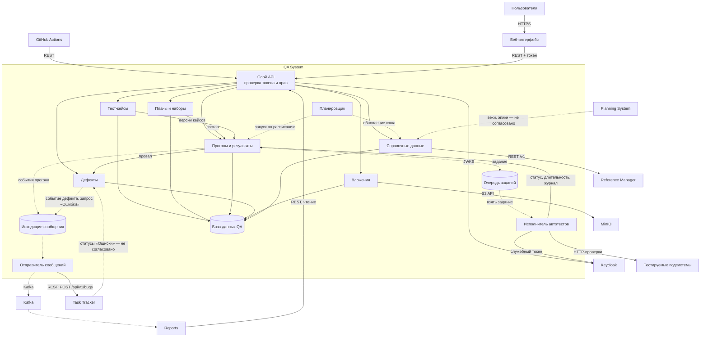

# 146 — Logic Scheme

> Формат — см. [состав документов](documents-composition.md), документ 146.
> Решения — [145](145.architecture-decisions.md), детализация компонентов — [150](150.component-diagram.md), развёртывание — [165](165.deployment-diagram.md).

## 1. Логическая схема

Сплошная стрелка — синхронное взаимодействие, пунктирная — асинхронное. Рамка «QA System» — граница модуля.

## 2. Потоки данных

| № | Поток | Откуда → куда | Данные | Режим |
| --- | --- | --- | --- | --- |
| 1 | Работа пользователя | Интерфейс → API → модули → БД | Кейсы, планы, результаты, дефекты | Синхронно, REST |
| 2 | Формирование прогона | Планы и кейсы → прогоны | Состав и зафиксированные версии | Синхронно, в одной транзакции |
| 3 | Постановка задания | Прогоны → очередь | Идентификатор прогона, окружение, тайм-аут | Асинхронно, таблица БД |
| 4 | Исполнение | Очередь → исполнитель → подсистемы | HTTP-запросы автотестов | Асинхронно относительно запроса; сами проверки синхронны |
| 5 | Запись результата | Исполнитель → прогоны | Статус, длительность, журнал | Синхронно, вызов в процессе |
| 6 | Автодефект | Прогоны → дефекты | Версия кейса, упавший шаг, фактический результат | Синхронно, в транзакции результата |
| 7 | События для Reports | Прогоны и дефекты → исходящие → Kafka → Reports | Четыре события из [135](135.event-catalog.md) | Асинхронно, at-least-once |
| 8 | «Ошибка» в Task Tracker | Дефекты → исходящие → Task Tracker | Запрос `POST /api/v1/bugs` | Асинхронно для пользователя; сам вызов — синхронный REST с повторами |
| 9 | Сверка Reports | Reports → API | Планы, прогоны, результаты, дефекты | Синхронно, REST, только чтение |
| 10 | Справочные данные | Планировщик → Reference Manager → кэш | Сотрудники, подразделения | Синхронно, REST, по расписанию |
| 11 | Вложения | Интерфейс → API → MinIO | Файлы и журналы | Синхронно, S3 API |
| 12 | Запуск из CI и по расписанию | CI → API; планировщик → прогоны | Набор, окружение | Синхронный запрос, асинхронное исполнение |

## 3. Синхронное и асинхронное

| Взаимодействие | Режим | Почему |
| --- | --- | --- |
| Запросы интерфейса, CI и Reports к API | Синхронно | Пользователь и вызывающий сервис ждут ответ |
| Создание дефекта при провале | Синхронно | Результат и дефект должны появиться вместе (ADR-006) |
| Исполнение автотестов | Асинхронно, очередь в БД | Длится минуты; запрос возвращает идентификатор прогона (ADR-004) |
| Публикация событий | Асинхронно, Kafka | Потребителю не нужен немедленный ответ; брокер может быть недоступен (ADR-007) |
| Создание «Ошибки» | Асинхронно через таблицу исходящих, вызов REST | Недоступность Task Tracker не должна мешать записи результата (NFR-11) |
| Чтение справочных данных | Синхронно, по расписанию, с кэшем | Данные меняются редко (ADR-010) |

## 4. Границы и внешние зависимости

| Зависимость | Нужна для | Что происходит при недоступности |
| --- | --- | --- |
| База данных QA | Всего | `/readyz` отвечает 503, запросы отклоняются |
| Keycloak | Проверки новых ключей, служебного токена исполнителя | Запросы с уже известными ключами проходят; автопрогон даёт «Заблокирован» с причиной |
| Тестируемые подсистемы | Автотестов | Кейсы подсистемы — «Заблокирован» или «Провален» с причиной |
| Task Tracker | Создания «Ошибки» | Дефект сохранён, запрос ждёт в исходящих |
| Kafka | Событий для Reports | События ждут в исходящих; Reports может сверяться по REST |
| Reference Manager | Списков сотрудников | Используется кэш с датой актуальности |
| MinIO | Вложений | Загрузка и скачивание отклоняются, остальная работа продолжается |
| Planning System | Проверки ссылок на вехи и эпики | Ссылки вводятся вручную |

QA System не обращается к базам других подсистем и не принимает от них запросов на запись.
