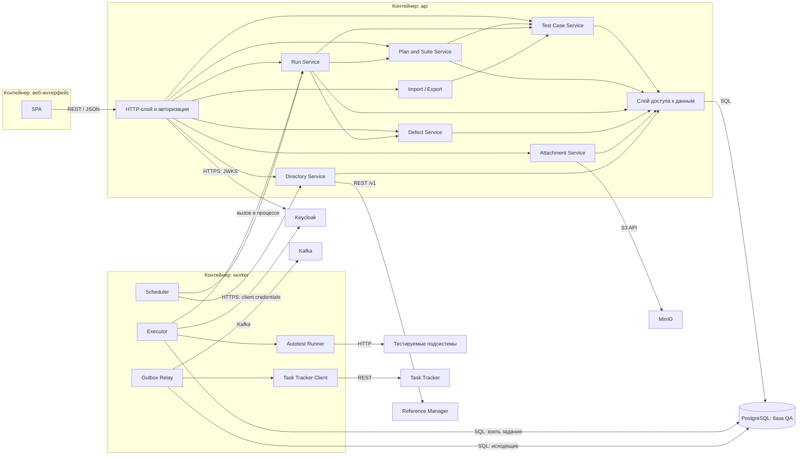

# 150 — Component Diagram

> Формат — см. [состав документов](documents-composition.md), документ 150.
> Расширяет [146 Logic Scheme](146.logic-scheme.md); решения — [145 ADR](145.architecture-decisions.md); узлы развёртывания — [165](165.deployment-diagram.md).

Технологии — по предложению [ADR-001](145.architecture-decisions.md); при другом решении команды меняется колонка «Технология», а состав и ответственность компонентов сохраняются.

## 1. Диаграмма

Модули `Run Service`, `Defect Service` и `Directory Service` входят в оба контейнера: это один код, подключённый к двум точкам входа (ADR-002).

## 2. Компоненты

| Компонент | Технология | Ответственность |
| --- | --- | --- |
| SPA | React, TypeScript | Экраны из [110](110.ui-ux.md): кейсы, планы, прогоны, дефекты, сводка, администрирование; вход через Keycloak |
| HTTP-слой и авторизация | FastAPI | Маршруты по [спецификации](../api/openapi/v1/openapi.yaml), проверка токена и ролей, формат ошибок, идентификатор запроса, `/livez` и `/readyz` |
| Test Case Service | Python | Кейсы, версии, шаги, шаблоны, копирование, статусы, проверка ключей автотестов |
| Plan and Suite Service | Python | Планы, наборы, вычисление состава по фильтру, статусы плана, внешние ссылки |
| Run Service | Python | Создание прогона с заморозкой версий, назначения, запись результатов, массовое изменение, повторный прогон, сводка, постановка задания |
| Defect Service | Python | Автоматическое и ручное создание, дедупликация, автомат статусов, история, комментарии, запись исходящих сообщений |
| Attachment Service | Python, клиент S3 | Проверка и загрузка файла, метаданные, подписанные ссылки, очистка «осиротевших» объектов |
| Import / Export | Python, библиотека `.xlsx` | Формирование файла, проверка до записи, отчёт импорта |
| Directory Service | Python, HTTP-клиент | Кэш сотрудников и подразделений, классификаторы, окружения |
| Слой доступа к данным | SQLAlchemy, Alembic | Запросы, транзакции, миграции схемы |
| Executor | Python | Выборка задания, отметки активности, контроль тайм-аута, повтор при сбое, фиксация commit SHA и версий подсистем |
| Autotest Runner | pytest, HTTP-клиент | Запуск автотестов по ключам, отчёт JUnit XML, журнал; маскирование секретов |
| Outbox Relay | Python, клиент Kafka | Отправка исходящих сообщений с повторами; учёт попыток и ошибок |
| Task Tracker Client | Python, HTTP-клиент | Вызов `POST /api/v1/bugs`, преобразование серьёзности, разбор ответа |
| Scheduler | Python | Запуск наборов по расписанию, обновление кэша справочных данных |
| PostgreSQL | PostgreSQL 18 | Данные QA System, очередь заданий, исходящие сообщения |

## 3. Интерфейсы

| Откуда | Куда | Интерфейс | Данные |
| --- | --- | --- | --- |
| SPA, CI, Reports | HTTP-слой | REST / JSON по HTTPS, токен Keycloak | [130](130.api-contracts.md) |
| HTTP-слой | Сервисы модулей | Вызов в процессе | Команды и запросы |
| Сервисы | PostgreSQL | SQL через слой доступа | [120](120.data-model.md) |
| Run Service | Executor | Таблица `execution_job` | Задание на запуск |
| Executor | Run Service | Вызов в процессе | Результаты кейсов |
| Run Service, Defect Service | Outbox Relay | Таблица `outbox_message` | События и запросы «Ошибки» |
| Outbox Relay | Kafka | Kafka protocol, `SASL_SSL` | [140](140.event-schema.md) |
| Task Tracker Client | Task Tracker | REST / JSON | `POST /api/v1/bugs` |
| Directory Service | Reference Manager | REST `/v1` | `employees`, `org_units` |
| Attachment Service | MinIO | S3 API | Объекты бакета `arch-dev-qa` |
| HTTP-слой, Executor | Keycloak | OIDC | JWKS, служебные токены |
| Autotest Runner | Тестируемые подсистемы | REST / JSON | Шаги автотестов |

## 4. Связь с ADR и логической схемой

| Элемент [146](146.logic-scheme.md) | Компоненты | ADR |
| --- | --- | --- |
| Слой API | HTTP-слой и авторизация | ADR-001, ADR-011 |
| Тест-кейсы | Test Case Service, Import / Export | ADR-003 |
| Планы и наборы | Plan and Suite Service | ADR-010 |
| Прогоны и результаты | Run Service | ADR-003, ADR-004 |
| Дефекты | Defect Service | ADR-006, ADR-008 |
| Вложения | Attachment Service | ADR-012 |
| Справочные данные | Directory Service | ADR-009, ADR-010 |
| Очередь заданий, исполнитель | Executor, Autotest Runner | ADR-002, ADR-004, ADR-005, ADR-013 |
| Исходящие сообщения, отправитель | Outbox Relay, Task Tracker Client | ADR-007 |
| Планировщик | Scheduler | ADR-002 |
