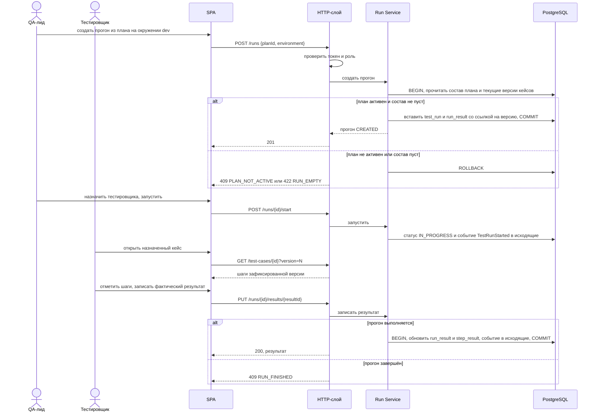
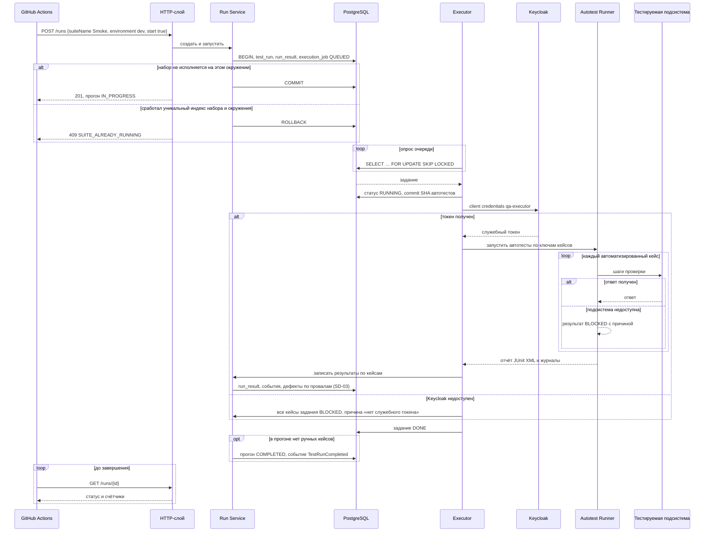
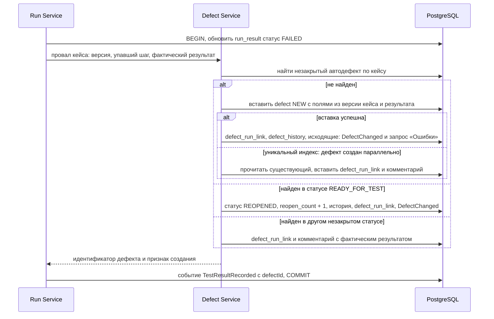
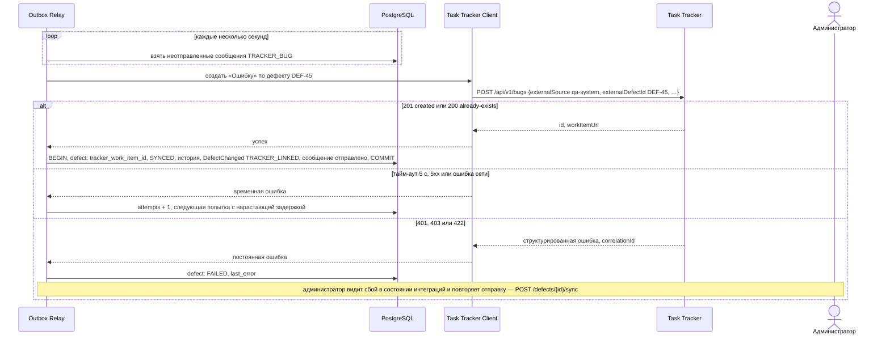
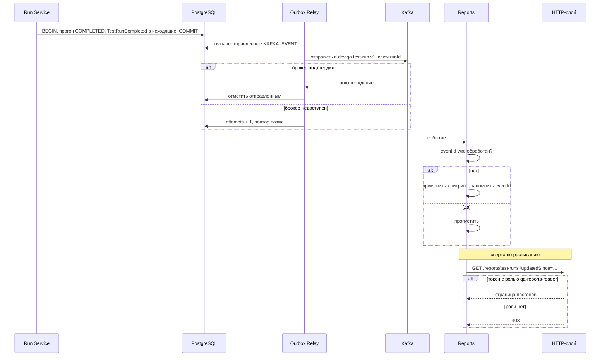
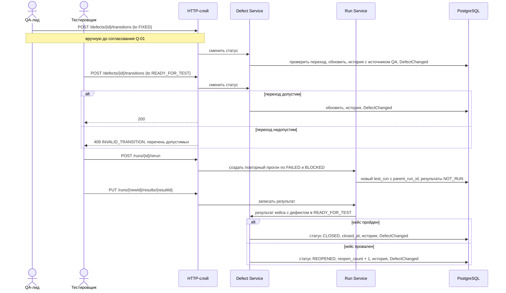

# 155 — Sequence-диаграммы

> Формат — см. [состав документов](documents-composition.md), документ 155.
> Привязаны к [use cases](060.use-cases.md), [историям](080.tester-user-stories.md) и [контрактам](130.api-contracts.md). Участники — компоненты из [150](150.component-diagram.md).

| ID | Сценарий | Use cases | Контракт |
| --- | --- | --- | --- |
| SD-01 | Создание прогона и ручное выполнение кейса | UC-09, UC-10 | `POST /runs`, `PUT /runs/{id}/results/{resultId}` |
| SD-02 | Автоматический прогон по запросу CI | UC-12, UC-13 | `POST /runs`, `GET /runs/{id}` |
| SD-03 | Автоматическое создание дефекта и дедупликация | UC-15 | Внутренний вызов; `PUT /runs/{id}/results/{resultId}` |
| SD-04 | Создание «Ошибки» в Task Tracker | UC-18 | `POST /api/v1/bugs` Task Tracker |
| SD-05 | Передача данных в Reports | UC-20 | Топики Kafka, `GET /reports/*` |
| SD-06 | Перепроверка и закрытие дефекта | UC-14, UC-17 | `POST /defects/{id}/transitions`, `POST /runs/{id}/rerun` |

## SD-01. Создание прогона и ручное выполнение кейса

Связи: UC-09, UC-10; US-QL-04, US-TS-07; FR-RUN-01, FR-RUN-03, NFR-05.

Тайм-аут запросов интерфейса — 10 секунд. При ошибке записи транзакция откатывается целиком: результата без события и события без результата не бывает.

## SD-02. Автоматический прогон по запросу CI

Связи: UC-12, UC-13; US-CI-01, US-AU-03, US-AU-04, US-EX-01; FR-RUN-08, FR-RUN-09, FR-RUN-10, NFR-03.

Тайм-ауты: один HTTP-запрос автотеста — 10 секунд; задание — 10 минут (настройка окружения). Задание без отметки активности дольше тайм-аута переводится в `TIMED_OUT`, невыполненные кейсы — в «Провален» с причиной «тайм-аут». При сбое исполнителя задание возвращается в очередь не более двух раз; уже записанные результаты не перезаписываются.

## SD-03. Автоматическое создание дефекта и дедупликация

Связи: UC-15; US-TS-09; FR-DEF-02, FR-DEF-03, FR-DEF-04; ADR-006.

Весь сценарий — одна транзакция БД без сетевых вызовов: запрос в Task Tracker только ставится в исходящие. Ошибка на любом шаге откатывает и результат, и дефект.

## SD-04. Создание «Ошибки» в Task Tracker

Связи: UC-18; US-DV-01, US-TT-01, US-AD-03; FR-DEF-06, NFR-11; ADR-007.

Повтор безопасен: Task Tracker не создаёт дубликат для той же пары (`externalSource`, `externalDefectId`). Задержка повторов растёт от 5 секунд до 10 минут; после 20 попыток состояние становится `FAILED`. Обратный поток статусов из Task Tracker на диаграмме отсутствует: контракта нет (Q-01).

## SD-05. Передача данных в Reports

Связи: UC-20; US-RP-01; vision 8.3; ADR-007.

Если отметка «отправлено» не записалась после успешной отправки, событие уйдёт повторно с тем же `eventId` — потребитель его отбросит.

## SD-06. Перепроверка и закрытие дефекта

Связи: UC-14, UC-17; US-TS-11, US-QL-05; FR-DEF-05, FR-RUN-07.

