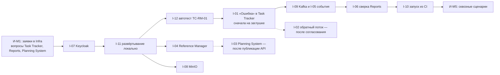

# 160 — Integration Plan

> Формат — см. [состав документов](documents-composition.md), документ 160.
> Сценарии — [155](155.sequence-diagrams.md), контракты — [130](130.api-contracts.md) и [135](135.event-catalog.md), открытые договорённости — [020, раздел 5](020.system-context.md#5-открытые-договорённости).

## 1. Вехи интеграций

Вехи задают обязательную последовательность; календарные даты зависят от общего графика курса.

| Веха | Содержание | Связь с вехами разработки |
| --- | --- | --- |
| И-M1 | Заявки и вопросы соседям отправлены: Q-01…Q-08 | до M4 |
| И-M2 | Контракты согласованы или зафиксировано временное решение; получены доступы Infra | M4 |
| И-M3 | Контрактный стенд: каждая интеграция проверена на заглушке или на реальном соседе | M5 |
| И-M4 | Устойчивость: тайм-ауты, повторы, работа при недоступном соседе | M5 |
| И-M5 | Сквозные сценарии на общем стенде, стартовый набор запущен из CI | M5, приёмка |

## 2. Интеграции

| ID | С кем | Тип и протокол | Направление | Веха | Ответственный от QA | Ответственный с той стороны | Критерии готовности |
| --- | --- | --- | --- | --- | --- | --- | --- |
| I-01 | Task Tracker: создание «Ошибки» | REST, `POST /api/v1/bugs` | QA → Task Tracker | И-M2 согласование; И-M3 стенд; И-M4 повторы | Defect Service, Task Tracker Client | Команда Task Tracker | `201` и повтор `200` без дубликата; `422` переводит синхронизацию в `FAILED`; при недоступном Task Tracker дефект сохранён и досылается; преобразование серьёзности согласовано (Q-02) |
| I-02 | Task Tracker: статусы, комментарии, итерации | Kafka или REST — не выбрано | Task Tracker → QA | И-M1 запрос; дальше — по ответу | Defect Service | Команда Task Tracker | Контракт опубликован; повторная доставка не меняет дефект второй раз; ручной ввод статусов отключён (Q-01, Q-03) |
| I-03 | Planning System: проекты, вехи, эпики, фичи | REST, чтение | QA → Planning System | И-M1 запрос; И-M3 после публикации API | Directory Service | Команда Planning System | Список вех и эпиков доступен для выбора; недоступность не блокирует сохранение плана (Q-04) |
| I-04 | Reference Manager: сотрудники и подразделения | REST `/v1`, роль `reference-reader` | QA → Reference Manager | И-M2 доступ; И-M3 стенд; И-M4 кэш | Directory Service | Команда справочников (их I-12) | Постраничное чтение `employees` и `org_units`; сотрудник находится по `account_user_id`; при недоступности работает кэш |
| I-05 | Reports: события | Kafka, топики `dev.qa.test-run.v1`, `dev.qa.defect.v1` | QA → Reports | И-M2 согласование схем; И-M3 стенд | Outbox Relay | Команда Reports | Четыре события проходят проверку по схемам [140](140.event-schema.md); дубль отбрасывается по `eventId`; порядок в пределах прогона сохранён (Q-05) |
| I-06 | Reports: сверка | REST, чтение, роль `qa-reports-reader` | Reports → QA | И-M3 | HTTP-слой | Команда Reports | Четыре ресурса `/reports/*` с `updatedSince` и пагинацией; без роли — `403` |
| I-07 | Keycloak | OIDC, JWKS, client credentials | QA → Keycloak | И-M1 заявка; И-M2 доступ | HTTP-слой, Executor | Команда Infra | Клиенты `qa-system`, `qa-executor`, `qa-ci` и роли R-01…R-07 созданы, роль `qa-reports-reader` выдана клиенту Reports; недействительный токен и недостаточная роль отклоняются |
| I-08 | MinIO | S3 API, бакет `arch-dev-qa` | QA ↔ MinIO | И-M1 заявка; И-M3 | Attachment Service | Команда Infra | Свой объект пишется и читается; чужой бакет недоступен; бакет не публичный |
| I-09 | Kafka | Kafka, `SASL_SSL`, ACL | QA → Kafka | И-M1 заявка; И-M2 топики | Outbox Relay | Команда Infra | Топики созданы; `qa-system` пишет, `reports-qa-ingest` читает, чужой сервис получает отказ |
| I-10 | GitHub Actions | REST, клиент `qa-ci` | CI → QA | И-M3 workflow; И-M5 запуск после развёртывания | Run Service | Команда Infra | Workflow запускает набор «Smoke», получает итог; повторный запуск идущего набора — `409` (Q-08) |
| I-11 | Развёртывание | Docker Compose, GitHub Actions, GHCR | Infra → QA | И-M2 локально; И-M4 общий стенд | Вся команда QA | Команда Infra | Образы собираются по commit SHA; миграции выполняются до запуска; `/readyz` участвует в проверке готовности |
| I-12 | Тестируемые подсистемы | REST под `qa-executor` | QA → подсистемы | По мере появления API | Autotest Runner | Команды подсистем, Infra | Служебная запись имеет минимальные права; автотесты создают данные с префиксом и убирают их (Q-07) |

## 3. Порядок реализации

1. Отправить заявки и вопросы (И-M1): без клиентов Keycloak не работает ничего, остальное можно начинать на заглушках.
2. Подключить Keycloak и поднять систему локально вместе с каркасом Reference Manager.
3. Автоматизировать TC-RM-01 — единственный кейс, для которого API уже есть.
4. Реализовать создание «Ошибки» против заглушки по `openapi.yaml` Task Tracker, затем против его стенда.
5. Подключить Kafka и события, затем API сверки.
6. Параллельно — кэш Reference Manager и вложения.
7. Включить запуск из CI и провести сквозные сценарии.

## 4. Автоматизация стартового набора

Автотест пишется, когда у подсистемы появляется API. Состояние на 2026-10-05:

| Кейсы | Подсистема | От чего зависит | Состояние |
| --- | --- | --- | --- |
| TC-RM-01 | Reference Manager | Служебные точки есть в коде | Можно автоматизировать; пути — по K-01 |
| TC-RM-02…05 | Reference Manager | Коллекции справочников и проверка токена не реализованы | Ждут реализации; формулировки сверить по K-02 |
| TC-TT-01, 03, 04, 05 | Task Tracker | Реализация в ветке, не слита в `main` | Ждут публикации API |
| TC-TT-02 | Task Tracker | Проверка интерфейса | Ручной |
| TC-PS-01…03 | Planning System | API не опубликован | Ждут |
| TC-PS-04, TC-PS-05 | Planning System ↔ Task Tracker | Их обмен не согласован (K-06) | Ручные до согласования |
| TC-REP-01, 03, 04, 05 | Reports | API не опубликован | Ждут |
| TC-REP-02 | Task Tracker → Reports | Межсистемный (K-06) | Ручной до согласования |
| TC-INF-01, 03, 04, 05 | Infra | Стенд не развёрнут | Ждут |
| TC-INF-02 | Infra | Пересоздание контейнера | Ручной |

## 5. Открытые вопросы и ответственные

| ID | Вопрос | Кому | Блокирует |
| --- | --- | --- | --- |
| Q-01 | Обратный поток статусов и комментариев «Ошибки»; обновление «Ошибки» | Task Tracker | I-02, FR-DEF-06 |
| Q-02 | Преобразование пяти значений серьёзности в четыре; отдельный атрибут серьёзности | Task Tracker, Reports | I-01 |
| Q-03 | Чтение итераций для QA System | Task Tracker | I-02, FR-TP-05 |
| Q-04 | API проектов, вех, эпиков и фич | Planning System | I-03 |
| Q-05 | Согласие с событиями и API сверки | Reports | I-05, I-06 |
| Q-06 | Бакет, топики, клиенты Keycloak, БД, пространство имён | Infra | I-07, I-08, I-09, I-11 |
| Q-07 | Отдельное окружение для автотестов | Infra, команды подсистем | I-12 |
| Q-08 | Набор для CI и блокировка выпуска | Infra | I-10 |
