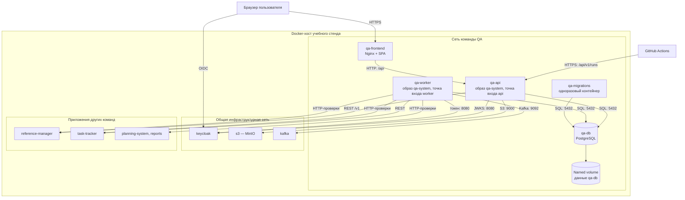
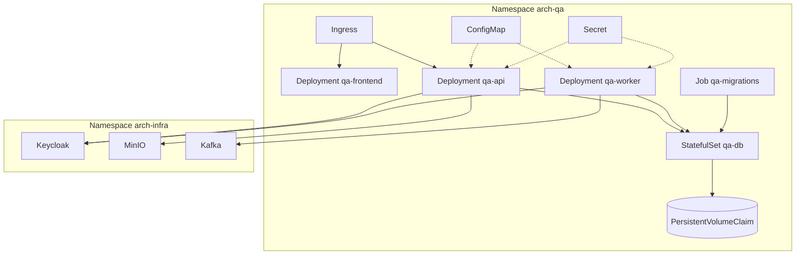

# 165 — Deployment Diagram

> Формат — см. [состав документов](documents-composition.md), документ 165.
> Компоненты — [150](150.component-diagram.md). Правила окружения — [vision Infra](../../infra/vision.md): основной способ запуска — Docker Compose, Kubernetes — упрощённое представление.

Диаграммы описывают целевое размещение. В репозитории общий `compose.yaml` пуст, а ресурсы QA в Infra не заявлены (Q-06 в [020](020.system-context.md#5-открытые-договорённости)).

## 1. Docker Compose: локальное окружение и общий стенд

## 2. Узлы

| Узел | Вид | Образ | Что размещает | Проверка и порядок запуска |
| --- | --- | --- | --- | --- |
| `qa-frontend` | Контейнер | Собственный: Nginx со статикой SPA | SPA; проксирует `/api` на `qa-api` | Запускается после готовности `qa-api` |
| `qa-api` | Контейнер, без состояния | `qa-system`, выпуск по commit SHA | HTTP-слой и все сервисы модулей | `/livez`, `/readyz`; запускается после успешного `qa-migrations` |
| `qa-worker` | Контейнер, без состояния; число экземпляров ≥ 1 | Тот же `qa-system` с автотестами из `qa/autotests` | Executor, Autotest Runner, Outbox Relay, Task Tracker Client, Scheduler | Отметка активности в БД; запускается после успешного `qa-migrations` |
| `qa-migrations` | Одноразовый контейнер | Тот же `qa-system` | Миграции схемы | `service_completed_successfully`; запускается после готовности `qa-db` |
| `qa-db` | Контейнер с постоянным томом | `postgres` той же мажорной версии, что у Infra | База QA System: данные, очередь заданий, исходящие сообщения | `pg_isready`; порт на хост не публикуется на общем стенде |
| Named volume | Том Docker | — | Файлы `qa-db` | Обновление не выполняет `down -v` |
| `keycloak`, `s3`, `kafka` | Контейнеры Infra | По матрице версий Infra | Вход, бакет `arch-dev-qa`, топики QA | Поднимает и настраивает Infra |

При нескольких экземплярах `qa-worker` расписания и отправку сообщений выполняет один: остальные получают отказ при попытке взять блокировку в БД и продолжают исполнять задания.

## 3. Соответствие компонентов и узлов

| Компонент из [150](150.component-diagram.md) | Узел |
| --- | --- |
| SPA | `qa-frontend` |
| HTTP-слой и авторизация, Test Case Service, Plan and Suite Service, Attachment Service, Import / Export | `qa-api` |
| Run Service, Defect Service, Directory Service | `qa-api` и `qa-worker` |
| Executor, Autotest Runner, Outbox Relay, Task Tracker Client, Scheduler | `qa-worker` |
| Слой доступа к данным (миграции) | `qa-migrations` |
| PostgreSQL | `qa-db` |

## 4. Окружения

| Окружение | Где | Состав | Данные и доступы | Назначение |
| --- | --- | --- | --- | --- |
| dev (локальное) | Компьютер разработчика, `compose.yaml` + `compose.dev.yaml` | Все узлы QA; Keycloak и каркас Reference Manager; Task Tracker и Kafka — заглушки, пока соседи не готовы | Тестовые данные; секреты в локальном `.env`, не в репозитории; порты на `127.0.0.1` | Разработка, контрактные тесты, отладка автотестов |
| staging (общий стенд) | Docker-хост учебного стенда, развёртывание через GitHub Actions | Все узлы QA и реальные сервисы соседей и Infra | Секреты из хранилища GitHub Actions; TLS на входе; своя БД и бакет с префиксом окружения | Интеграционные и сквозные проверки, прогон стартового набора, демонстрация |
| production | В учебном объёме не разворачивается | Целевая схема — раздел 5 | — | Описано для полноты: показывает, как узлы переносятся в Kubernetes |

Конфигурация одинакова во всех окружениях и задаётся переменными: адреса Keycloak, Kafka, MinIO, Task Tracker и Reference Manager, имена бакета и топиков, секреты клиентов, флаг приёма изменений из Task Tracker, тайм-ауты. Адреса тестируемых подсистем хранятся не в конфигурации, а в сущности «Окружение».

## 5. Kubernetes: упрощённое представление

| Ресурс | Что размещается |
| --- | --- |
| `Namespace arch-qa` | Все ресурсы команды; в перечне Infra пространства имён для QA пока нет (Q-06) |
| `Deployment` | `qa-frontend`, `qa-api`, `qa-worker` — по одной реплике, readiness и liveness, requests и limits |
| `StatefulSet` + `PersistentVolumeClaim` | `qa-db`, одна реплика; удаление пода не удаляет данные |
| `Job` | Миграции перед обновлением `Deployment` |
| `ConfigMap` | Несекретные адреса, имена бакета и топиков, тайм-ауты |
| `Secret` | Пароль БД, секреты клиентов `qa-executor` и справочников, ключи S3, учётные данные Kafka; не коммитятся |
| `Service` | ClusterIP для `qa-api`, `qa-frontend`, `qa-db` |
| `NetworkPolicy` | Доступ к `qa-db` только из `qa-api`, `qa-worker`, `qa-migrations`; исходящие — в Keycloak, Kafka, MinIO и к сервисам подсистем |

## 6. Выпуск и откат

1. Pull request запускает проверки и сборку образов QA.
2. После слияния в `main` образ `qa-system` и образ интерфейса публикуются в GHCR с тегом commit SHA.
3. Развёртывание выполняет миграции, затем обновляет `qa-api` и `qa-worker` и ждёт `/readyz`.
4. После успешного развёртывания стенда CI запускает набор «Smoke» (I-10 в [160](160.integration-plan.md)).

Возврат к прошлому образу возможен только при совместимой схеме: миграции пишутся в два шага — сначала добавление, удаление старого — следующим выпуском. Автоматического отката БД нет.
