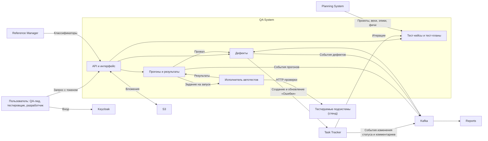
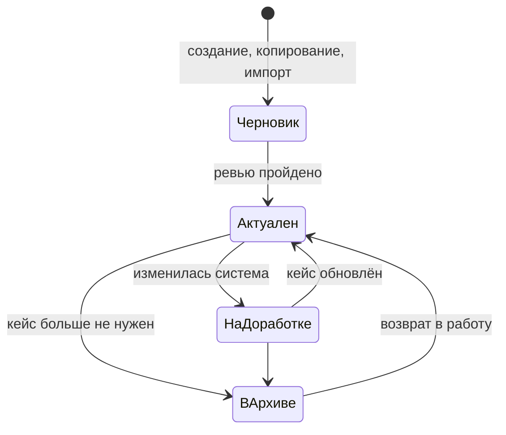
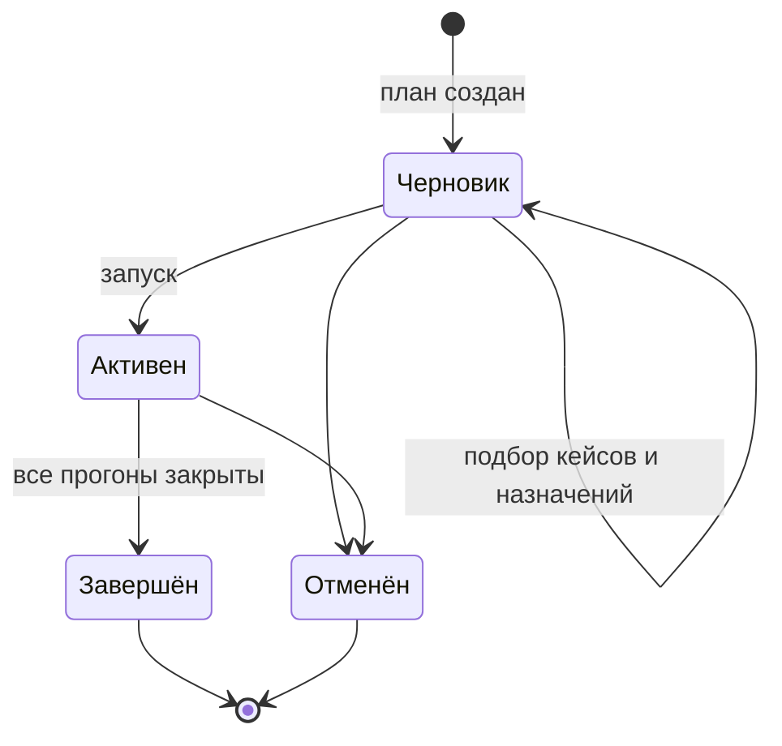
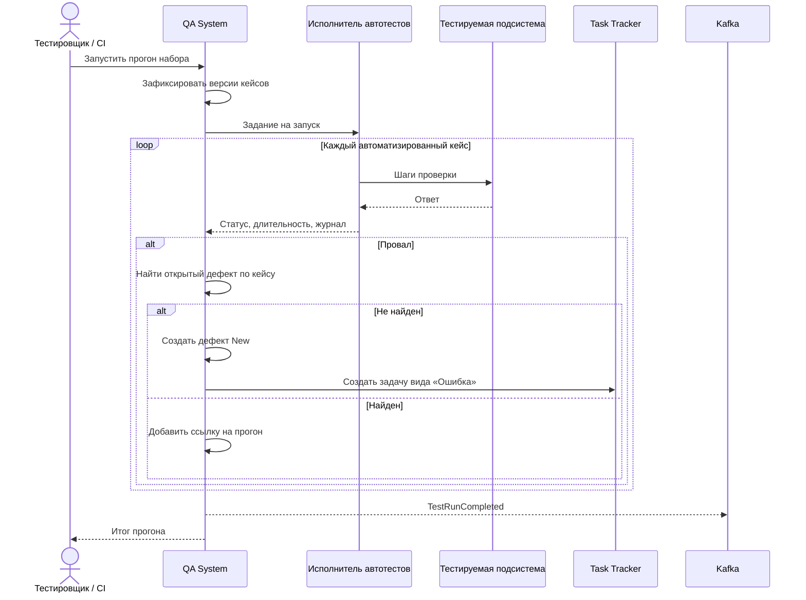
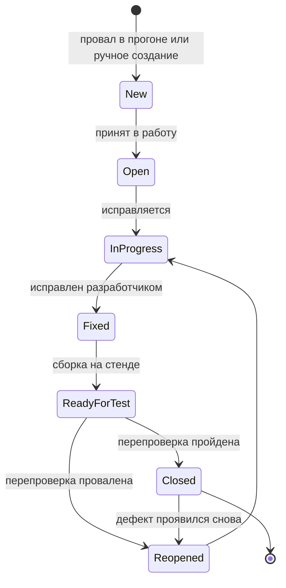

# QA System — система управления тестированием

| Поле | Значение |
| --- | --- |
| Проект | Трекер задач (arch-info-system-monorepo) |
| Подсистема | QA System (система управления тестированием) |
| Команда | команда QA |
| Версия документа | 0.1 (черновик) |
| Дата | 2026-09-23 |
| Статус | на согласование |

## 1. Общее описание

### 1.1. Назначение

QA System хранит тест-кейсы, собирает их в тест-планы, проводит прогоны и заводит дефекты по упавшим проверкам. Автотесты запускаются из самой системы: пользователь нажимает «Запустить», исполнитель прогоняет привязанные к тест-кейсам автотесты против развёрнутых подсистем, результаты записываются в прогон, а на каждый провал открывается баг.

Тест-кейс здесь — постоянно проверяемый путь пользователя или сервиса. Часть кейсов гоняется на каждом выпуске (регрессия и smoke), часть — по плану к конкретной итерации или релизу. Поэтому кейс живёт дольше любого плана и прогона: его копируют, версионируют и архивируют, но не удаляют.

У системы две задачи. Первая — продукт для QA-команды в составе общего трекера, по требованиям заказчика. Вторая — реальная проверка соседних подсистем: мы пишем и прогоняем по пять тест-кейсов на каждую из них (раздел 7), и именно QA System показывает, работает ли собранный стенд.

### 1.2. Место в системе

Пользователь входит через [Keycloak](../../keycloak/README.md). Итерации берутся из [Task Tracker](../../task-tracker/README.md), релизные рамки и вехи — из [Planning System](../../planning-system/README.md), классификаторы — из [Reference Manager](../../reference-manager/README.md). Дефекты публикуются в Task Tracker как задачи вида «Ошибка»: в требованиях заказчика эта роль отведена TFS, в нашем ландшафте её выполняет Task Tracker. Результаты тестирования забирает [Reports](../../reports/docs/vision.md) для отчётов R-07 и R-09. Вложения лежат в S3, события идут через Kafka, развёртывание обеспечивает [Infra](../../infra/vision.md).

### 1.3. Границы подсистемы

Входит в состав:

- тест-кейсы, шаблоны, версии и история изменений, импорт и экспорт;
- тест-планы и их связь с итерациями и релизами;
- прогоны: ручное выполнение, запуск автотестов, повторный прогон упавших;
- дефекты с жизненным циклом и синхронизацией с Task Tracker;
- исполнитель автотестов и стартовый набор автотестов для подсистем проекта.

Не входит:

- ведение задач, итераций и проектов: они принадлежат Task Tracker и Planning System, QA System ссылается на них по идентификаторам;
- отчётность по качеству: показатели считает Reports по нашим данным, внутри QA System остаются только сводки плана и прогона;
- нагрузочное тестирование и тестирование интерфейса через браузер в первой версии;
- управление пользователями и ролями: это Keycloak.

### 1.4. Термины

| Термин | Определение |
| --- | --- |
| Тест-кейс | Описание проверки: предусловия, шаги, ожидаемый результат. Может быть ручным или иметь привязанный автотест. |
| Шаг | Отдельное действие тест-кейса со своим ожидаемым результатом. Провал фиксируется с точностью до шага. |
| Шаблон | Заготовка тест-кейса с предзаполненными полями и шагами, например «Проверка CRUD справочника». |
| Автотест | Исполняемый сценарий в репозитории, связанный с тест-кейсом по ключу. Его запускает исполнитель. |
| Набор | Сохранённая выборка тест-кейсов по фильтру или вручную, например «Smoke Reference Manager». |
| Тест-план | Перечень тест-кейсов, которые нужно пройти к итерации, релизу, проекту или модулю, с ответственным и сроками. |
| Прогон | Одно выполнение тест-плана или набора. Хранит результат каждого кейса на момент запуска. |
| Результат | Статус тест-кейса в прогоне: «Пройден», «Провален», «Заблокирован», «Не выполнен», «Пропущен». |
| Дефект (баг) | Зафиксированное расхождение фактического результата с ожидаемым. Связан с кейсом, шагом и прогоном. |
| Серьёзность | Влияние дефекта на систему (Blocker, Critical, Major, Minor, Trivial). Отличается от приоритета — очерёдности исправления. |

## 2. Ключевые возможности

- **Тест-кейс как постоянный актив.** Кейс копируется, версионируется и архивируется; прогон ссылается на конкретную версию, поэтому старые результаты не «переписываются» после правки кейса.
- **Одна кнопка для автотестов.** Прогон набора запускается из интерфейса, по расписанию или из GitHub Actions после развёртывания. Ручные и автоматические кейсы живут в одном плане.
- **Баг без ручного переноса.** Провал шага или кейса создаёт дефект с уже заполненными шагами воспроизведения, ожидаемым и фактическим результатом, окружением и ссылкой на прогон.
- **Сквозная связь.** Из дефекта видно кейс, прогон, итерацию и задачу в Task Tracker; из итерации — какой план её проверял и что в нём упало.
- **Повторный прогон упавших.** После исправления из прогона создаётся новый только по провалившимся и заблокированным кейсам.

## 3. Пользователи

| Роль | Что делает в подсистеме |
| --- | --- |
| QA-лид | Ведёт тест-планы, назначает тестировщиков и сроки, смотрит итог прогона и решает, готова ли итерация |
| Тестировщик | Пишет тест-кейсы, выполняет ручные кейсы, запускает автотесты, заводит и перепроверяет дефекты |
| Автоматизатор | Пишет автотесты и связывает их с тест-кейсами |
| Разработчик | Получает дефекты через Task Tracker, переводит их в работу и в «Fixed» |
| Руководитель проекта | Смотрит состояние тестирования по итерации или релизу |
| Сервис CI | Запускает прогон набора после развёртывания и получает итоговый статус |
| Администратор | Настраивает поля, шаблоны, справочники значений и права |

## 4. Основные процессы

### 4.1. Работа с тест-кейсами

Тестировщик создаёт кейс с нуля, из шаблона или копированием существующего. Копия получает новый ID, статус «Черновик» и ссылку на исходный кейс. Кейс группируется по модулю, фиче, эпику и требованию; эпики и фичи берутся из Planning System. Каждое сохранение создаёт новую версию, история показывает, кто и что поменял. Кейс, который больше не нужен, архивируется: в новые планы он не попадает, но остаётся в старых прогонах.

Поля тест-кейса: ID, название, описание, предусловия, шаги с ожидаемым результатом каждого, приоритет, серьёзность, тип (функциональный, регрессионный, smoke, интеграционный, негативный), статус (черновик, актуален, на доработке, в архиве), признак автоматизации и ключ автотеста, автор, дата изменения, вложения. Фактический результат в кейсе не хранится: он относится к конкретному прогону.

### 4.2. Тест-план

QA-лид создаёт план на итерацию, релиз, проект или модуль. Кейсы добавляются вручную или фильтром, например «все актуальные smoke-кейсы модуля Reference Manager». Фильтр можно сохранить как набор. У плана есть ответственный, команда тестировщиков, даты начала и окончания и привязка к итерации Task Tracker или вехе Planning System.

### 4.3. Прогон и автоматический запуск

Прогон создаётся из плана или набора и замораживает версии кейсов на момент создания. Ручные кейсы распределяются между тестировщиками. Для автоматизированных исполнитель ставит задание в очередь, запускает автотесты против выбранного окружения и записывает по каждому кейсу статус, длительность, журнал и вложения. Тестировщик может массово сменить статус группы кейсов, например отметить «Заблокирован» всё, что зависит от недоступного Keycloak.

При провале система создаёт дефект. Если по этому же кейсу уже есть открытый дефект, новый не создаётся: к существующему добавляется ссылка на прогон и комментарий. Иначе после первого же красного прогона стенда в Task Tracker появится двадцать одинаковых багов.

После исправлений из прогона создаётся повторный, в который попадают только кейсы со статусами «Провален» и «Заблокирован». Исходный прогон не меняется.

### 4.4. Жизненный цикл дефекта

Дефект создаётся автоматически из прогона или вручную из кейса, шага или прогона. Поля: ID, заголовок, описание, шаги воспроизведения, ожидаемый и фактический результат, серьёзность, приоритет, статус, окружение, версия сборки, автор, исполнитель, связи с кейсом, прогоном, требованием, задачей и эпиком.

Статусы делятся между системами по тому, кто ими управляет. «Open», «In Progress» и «Fixed» ставит разработчик в Task Tracker, и они приходят в QA System событием. «Ready for Test» появляется, когда исправление попало на стенд. «Closed» и «Reopened» ставит тестировщик после перепроверки: повторный прогон кейса проходит — дефект закрывается, падает — открывается заново. Комментарии синхронизируются в обе стороны.

## 5. Функциональные требования

### 5.1. Тест-кейсы

- **FR-TC-01.** Система должна поддерживать создание, просмотр, изменение, копирование и архивирование тест-кейсов. Физическое удаление кейса, участвовавшего в прогоне, не допускается.
- **FR-TC-02.** Тест-кейс должен содержать поля из раздела 4.1; название и хотя бы один шаг с ожидаемым результатом обязательны для перевода в статус «Актуален».
- **FR-TC-03.** Копия кейса должна получать новый ID, статус «Черновик» и ссылку на исходный кейс; поддерживается массовое копирование.
- **FR-TC-04.** Каждое сохранение кейса должно создавать новую версию; история должна показывать автора, время и изменённые поля.
- **FR-TC-05.** К кейсу и к отдельному шагу должны прикрепляться файлы: скриншоты, журналы, документы.
- **FR-TC-06.** Администратор должен иметь возможность вести шаблоны тест-кейсов; пользователь — создавать кейс из шаблона.
- **FR-TC-07.** Кейсы должны группироваться по модулю, фиче, эпику и требованию и фильтроваться по любому из полей.
- **FR-TC-08.** Система должна импортировать и экспортировать кейсы в `.csv` и `.xlsx`; неизменённый экспорт импортируется обратно без потери данных, импорт проверяет файл до записи и выдаёт отчёт.
- **FR-TC-09.** Автоматизированный кейс должен ссылаться на автотест по ключу; система должна показывать кейсы, у которых ключ не найден среди автотестов.

### 5.2. Тест-планы и наборы

- **FR-TP-01.** Тест-план создаётся на релиз, итерацию, проект или модуль.
- **FR-TP-02.** Кейсы добавляются в план вручную или по фильтру; фильтр можно сохранить как набор.
- **FR-TP-03.** План назначается на ответственного и команду, имеет даты начала и окончания.
- **FR-TP-04.** Статусы плана: черновик, активен, завершён, отменён.
- **FR-TP-05.** План связывается с итерацией Task Tracker и (или) вехой Planning System по их идентификаторам.

### 5.3. Прогоны

- **FR-RUN-01.** Прогон создаётся на основе тест-плана или набора и фиксирует версии кейсов на момент создания.
- **FR-RUN-02.** На прогон и на отдельные кейсы прогона назначаются тестировщики.
- **FR-RUN-03.** Результат кейса: «Пройден», «Провален», «Заблокирован», «Не выполнен», «Пропущен»; результат можно указать для каждого шага.
- **FR-RUN-04.** К результату добавляются комментарий, фактический результат и вложения.
- **FR-RUN-05.** Система должна поддерживать массовое изменение статусов выбранных кейсов прогона.
- **FR-RUN-06.** Система должна фиксировать время начала, окончания и длительность выполнения каждого кейса и прогона.
- **FR-RUN-07.** Из прогона создаётся повторный прогон по провалившимся и заблокированным кейсам.
- **FR-RUN-08.** Автоматизированные кейсы запускаются кнопкой из интерфейса, по расписанию и вызовом API из CI; выбирается целевое окружение.
- **FR-RUN-09.** Исполнитель должен записывать журнал выполнения автотеста и прикладывать его к результату; превышение тайм-аута фиксируется как «Провален» с указанием причины.
- **FR-RUN-10.** Один и тот же набор не должен запускаться повторно на том же окружении, пока предыдущий запуск не завершён.

### 5.4. Дефекты

- **FR-DEF-01.** Дефект создаётся вручную из тест-кейса, шага или прогона.
- **FR-DEF-02.** При провале шага или кейса система создаёт дефект автоматически, заполняя шаги воспроизведения, ожидаемый и фактический результат, окружение и версию из прогона.
- **FR-DEF-03.** Если по кейсу уже есть незакрытый дефект, новый не создаётся; к существующему добавляется ссылка на прогон.
- **FR-DEF-04.** Дефект связывается с тест-кейсом, прогоном, требованием, задачей и эпиком.
- **FR-DEF-05.** Жизненный цикл дефекта соответствует разделу 4.4; недопустимые переходы отклоняются.
- **FR-DEF-06.** Дефект создаётся в Task Tracker как задача вида «Ошибка»; изменения статуса и комментарии синхронизируются в обе стороны.
- **FR-DEF-07.** История изменений дефекта хранит автора, время, поле, старое и новое значение, включая изменения, пришедшие из Task Tracker.
- **FR-DEF-08.** Дефекты ищутся и фильтруются по проекту, итерации, тестировщику, статусу и серьёзности.

### 5.5. Доступ и данные

- **FR-SEC-01.** Все обращения выполняются с действительным токеном Keycloak; права проверяются на сервере.
- **FR-SEC-02.** Исполнитель автотестов обращается к тестируемым подсистемам под отдельной служебной учётной записью с минимальными правами.
- **FR-DAT-01.** QA System хранит данные в собственной БД и не обращается к базам других подсистем.
- **FR-DAT-02.** Идентификаторы итераций, проектов, эпиков и задач хранятся как внешние ссылки; их владельцы — Task Tracker и Planning System.

## 6. Нефункциональные требования

Значения ниже — предложение команды QA; их нужно подтвердить после первых замеров на стенде.

| ID | Характеристика | Требование |
| --- | --- | --- |
| NFR-01 | Скорость прогона | Стартовый набор из раздела 7 (25 кейсов) проходит на стенде не дольше 5 минут |
| NFR-02 | Изоляция | Автотесты создают свои данные с уникальным префиксом и не зависят от порядка запуска; упавший автотест не ломает соседние |
| NFR-03 | Устойчивость | Недоступность тестируемой подсистемы даёт результат «Провален» или «Заблокирован» с причиной, а не зависший прогон |
| NFR-04 | Идемпотентность | Повторная доставка события из Task Tracker не меняет состояние дефекта второй раз |
| NFR-05 | Неизменность истории | Результаты завершённого прогона не редактируются; правка кейса не меняет уже сохранённые результаты |
| NFR-06 | Безопасность | Секреты служебных учётных записей не хранятся в репозитории и не попадают в журналы автотестов |
| NFR-07 | Воспроизводимость | Автотесты лежат в репозитории, прогон хранит commit SHA автотестов и версию окружения |
| NFR-08 | Развёртывание | Подсистема и исполнитель разворачиваются средствами Infra, с проверками работоспособности и готовности |

## 7. Стартовый набор тест-кейсов

По заданию команда QA пишет по пять тест-кейсов на каждую подсистему. Кейсы собраны из требований и vision соседних команд; к моменту реализации их формулировки сверяются с API, которые команды опубликуют. «Авто» — кейс проверяется автотестом, как только у подсистемы появится API; «Ручной» — пока проверяется вручную.

### 7.1. Reference Manager

| ID | Проверка | Ожидаемый результат | Вид |
| --- | --- | --- | --- |
| TC-RM-01 | Запрос `/livez` и `/readyz` к запущенному сервису с доступной БД | Оба отвечают успехом; при остановленной БД `/readyz` сообщает о неготовности | Авто, API уже есть |
| TC-RM-02 | Создать запись справочника и прочитать её по ID | Запись в состоянии ACTIVE, версия 1, поля совпадают с отправленными | Авто |
| TC-RM-03 | Удалить запись, прочитать список и запись по ID, создать новую с тем же кодом | Запись в DELETED, в списке по умолчанию отсутствует, по ID доступна; создание с тем же кодом отклонено | Авто |
| TC-RM-04 | Вернуть удалённую запись в работу | Запись снова ACTIVE, версия увеличена | Авто |
| TC-RM-05 | Запрос без токена; запрос списка с `Accept` для `.xlsx` | Без токена — отказ в доступе; с токеном — файл с заголовками и строками по фильтру | Авто |

### 7.2. Task Tracker

| ID | Проверка | Ожидаемый результат | Вид |
| --- | --- | --- | --- |
| TC-TT-01 | Создать задачу без наименования, затем со сроком раньше даты начала | Оба запроса отклонены с указанием поля | Авто |
| TC-TT-02 | Переместить задачу в другую колонку канбан-доски и открыть карточку | Новый статус сохранён и совпадает с колонкой | Ручной |
| TC-TT-03 | Задать план 10 ч, зарегистрировать 4 ч и 8 ч | Факт 12 ч, остаток −2 ч отображается как перерасход | Авто |
| TC-TT-04 | Включить задачу во вторую незавершённую итерацию | Операция отклонена | Авто |
| TC-TT-05 | Экспортировать задачи в `.xlsx` и импортировать файл без изменений | Импорт без ошибок, 0 созданных, данные задач не изменились | Авто |

### 7.3. Planning System

| ID | Проверка | Ожидаемый результат | Вид |
| --- | --- | --- | --- |
| TC-PS-01 | Создать проект и декомпозировать его на этап, веху, эпик и фичу | Структура сохранена и отображается в иерархии | Авто |
| TC-PS-02 | Назначить сотрудника на объём сверх его доступности в календаре | Система показывает конфликт загрузки | Авто |
| TC-PS-03 | Создать сценарий «что если» и изменить в нём сроки | Утверждённая базовая линия не изменилась | Авто |
| TC-PS-04 | Утвердить базовую линию | Проект с внешним идентификатором появляется в Task Tracker | Авто, межсистемный |
| TC-PS-05 | Зарегистрировать время по задаче проекта в Task Tracker | Planning System обновляет факт и прогноз остатка | Авто, межсистемный |

### 7.4. Reports

| ID | Проверка | Ожидаемый результат | Вид |
| --- | --- | --- | --- |
| TC-REP-01 | Запросить отчёт без токена и с токеном без прав на проект | Отказ в доступе в обоих случаях | Авто |
| TC-REP-02 | Зарегистрировать в Task Tracker 3 записи времени и сформировать R-01 за период | Сумма часов в отчёте равна сумме записей после истечения лага витрины | Авто, межсистемный |
| TC-REP-03 | Сформировать отчёт по параметрам, для которых нет данных | Явное сообщение об отсутствии данных | Авто |
| TC-REP-04 | Доставить одно событие трудозатрат дважды | Часы в отчёте учтены один раз | Авто |
| TC-REP-05 | Выгрузить отчёт в `.xlsx` | Файл содержит параметры формирования, дату и автора | Авто |

### 7.5. Infra (Keycloak, MinIO, Kafka)

| ID | Проверка | Ожидаемый результат | Вид |
| --- | --- | --- | --- |
| TC-INF-01 | Получить служебный токен по client credentials в realm `arch-info-system` | Токен выдан, подпись проверяется по JWKS | Авто |
| TC-INF-02 | Создать пользователя, пересоздать контейнер Keycloak, войти | Пользователь сохранился, вход успешен | Ручной |
| TC-INF-03 | Записать и прочитать объект в своём бакете, прочитать объект чужого бакета | Свой объект доступен, чужой — отказ | Авто |
| TC-INF-04 | Отправить событие разрешённым producer и прочитать consumer; отправить от чужого principal | Событие получено; чужой principal получает отказ | Авто |
| TC-INF-05 | Повторно выполнить инициализацию realm, бакетов и топиков | Ресурсы не задублированы, данные не удалены | Авто |

Межсистемные кейсы (TC-PS-04, TC-PS-05, TC-REP-02) заодно проверяют интеграции, то есть то, что каждая команда по отдельности у себя не увидит.

## 8. Требования к интеграциям

### 8.1. Общие принципы

- QA System не пишет в чужие данные, кроме одного согласованного исключения: создание и обновление задач вида «Ошибка» в Task Tracker через его API.
- Прямой доступ к БД других подсистем не используется ни QA System, ни автотестами: автотесты проверяют систему так же, как её видит клиент.
- События публикуются с `event_id`; обработка входящих событий идемпотентна, как требует контракт Kafka в [vision Infra](../../infra/vision.md).
- Контракты версионируются, изменения согласуются с потребителями заранее.

### 8.2. Состав интеграций

| Смежная система | Что получаем или передаём | Способ обмена | Режим | Критичность |
| --- | --- | --- | --- | --- |
| Task Tracker | Передаём: создание и обновление «Ошибки», комментарии. Получаем: изменение статуса и комментарии дефектов, итерации | REST для записи; события через Kafka — после согласования | Запись дефектов, чтение итераций | Критичная для раздела 4.4 |
| Planning System | Проекты, вехи, эпики и фичи для группировки кейсов и привязки планов | REST | Чтение | Средняя: без неё группировка по эпикам вводится вручную |
| Reference Manager | Классификаторы: приоритет, серьёзность, окружения, типы тест-кейсов — по заявке | REST с кэшем | Чтение | Средняя |
| Reports | Тест-планы, прогоны, результаты, дефекты со статусами, серьёзностью и историей | События через Kafka и REST для сверки | Чтение со стороны Reports | Критичная для R-07 и R-09 |
| Keycloak | Проверка токенов пользователей; служебная учётная запись исполнителя автотестов | OIDC | Чтение | Критичная |
| Infra — S3 | Вложения тест-кейсов, результатов и дефектов, журналы автотестов | S3, бакет `arch-dev-qa` — нужна заявка, в перечне Infra его пока нет | Запись и чтение своих объектов | Высокая |
| Infra — Kafka | Топики событий QA и подписка на события дефектов Task Tracker | Kafka, заявка по правилам Infra | Запись и чтение | Высокая |
| Infra — CI/CD | Вызов прогона smoke-набора после развёртывания стенда | GitHub Actions → REST QA System | Запуск | Средняя |
| Тестируемые подсистемы | HTTP-проверки публичных API | REST под служебной учётной записью | Чтение и запись тестовых данных | Критичная для автотестов |

### 8.3. События QA System

| Событие | Когда публикуется | Основные поля |
| --- | --- | --- |
| `TestRunStarted` | Прогон запущен | ID прогона, план или набор, окружение, время |
| `TestResultRecorded` | Кейс в прогоне получил результат | ID прогона, ID и версия кейса, статус, длительность |
| `TestRunCompleted` | Прогон завершён | ID прогона, число кейсов по статусам, итерация или веха |
| `DefectChanged` | Дефект создан или изменён | ID дефекта, статус, серьёзность, приоритет, ID задачи в Task Tracker, связи |

Этого достаточно, чтобы Reports считал pass rate и reopened rate без собственных догадок: признак повторного открытия — это переход в «Reopened», серьёзность ведёт QA System. Два открытых вопроса Reports (№ 4 и 6) закрываются этим контрактом, если команда отчётов согласится.

## 9. Предположения, зависимости и ограничения

**Предположения**

- Соседние команды публикуют OpenAPI своих сервисов; автотесты пишутся по ним.
- Task Tracker допускает создание «Ошибки» внешней системой и хранит её внешний идентификатор.
- На стенде есть отдельное тестовое окружение или договорённость, что автотесты создают данные с префиксом и убирают их за собой.

**Зависимости**

- Автотесты для подсистемы появляются не раньше её API. Сейчас реализованы только проверки работоспособности Reference Manager, поэтому первым автоматизируется TC-RM-01.
- Синхронизация дефектов зависит от API и событий Task Tracker, которых в его требованиях пока нет.
- Межсистемные кейсы зависят от интеграций Planning System ↔ Task Tracker и Task Tracker → Reports.

**Ограничения**

- Исполнитель в первой версии запускает только API-автотесты; проверки через браузер не поддерживаются.
- Одно окружение стенда: параллельные прогоны разных наборов возможны, но могут мешать друг другу через общие данные.

## 10. Открытые вопросы

1. Под «SBS» в требованиях заказчика подразумевается Planning System? Сейчас мы связываем план с итерацией Task Tracker и вехой Planning System; нужно ли отдельное понятие «релиз» и у кого оно живёт?
2. Кто мастер дефекта? Предложение: QA System владеет QA-полями и статусами «New», «Ready for Test», «Closed», «Reopened», Task Tracker — задачей «Ошибка» и статусами разработки. Нужно согласие команды Task Tracker, и ей нужно добавить статусы или маппинг на свои.
3. Даёт ли Task Tracker API для создания задач внешней системой и публикует ли события об изменении статуса и комментариев?
4. Ведёт ли Reference Manager справочники серьёзности, окружений и типов тест-кейсов, или они остаются внутри QA System?
5. В каком формате писать автотесты? Предложение: код в `qa/autotests` на одном стеке с QA System, связь с кейсом по ключу, результаты исполнитель читает в формате JUnit XML.
6. Выделяется ли для автотестов отдельное окружение, или они работают на общем dev-стенде?
7. Какой набор запускается из GitHub Actions после развёртывания и должен ли красный smoke-прогон останавливать выпуск?
8. Нужна ли в первой версии интеграция с настоящим TFS/Azure DevOps, или роль TFS полностью закрывает Task Tracker?
