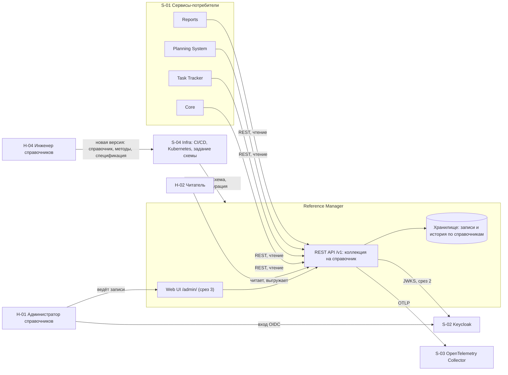

# 020 - System Context

> Формат - см. [состав документов](documents-composition.md), документ 020.
> Источник - [системные требования, разделы 1.2 и 5](system-requirements.md), [видение](vision.md).

## 1. Границы системы

Внутри границы: справочники первой версии и их записи; для каждого справочника пять стандартных методов, восстановление и история изменений; выгрузка `.xlsx`; проверка токена и прав; интерфейс администрирования внутри сервиса; служебные точки и телеметрия.

За границей: бизнес-сущности любой подсистемы (сотрудники, проекты, задачи, календари), мультиарендность, обмен событиями, загрузка записей из файла, предзаполнение стандартными данными, создание справочников потребителями или через API, процесс заявок.

Правило направления вызовов: сервис принимает только входящие запросы. Исходящие соединения - собственное хранилище, коллектор OpenTelemetry, Keycloak за ключами проверки токенов (INT-RM-04, BR-RM-09).

## 2. Контекстная диаграмма

Стрелки от потребителей направлены в сервис: обратных вызовов, подписок и событий нет.

## 3. Внешние системы

| Система | Роль для сервиса | Тип интеграции | Направление | Критичность | Степень согласованности |
| --- | --- | --- | --- | --- | --- |
| Хранилище (PostgreSQL) | Записи и история справочников, отдельная база сервиса | Соединение с базой | Сервис -> хранилище | Критичная: без него `/ready` отвечает 503 | Согласовано, работает на стенде |
| Keycloak | Выдача токенов пользователям и сервисам, роли | OIDC, JWT, JWKS | Сервис -> Keycloak (ключи); пользователи -> Keycloak (вход) | Критичная со среза защиты API | Состав ролей и источник ключей не согласованы (вопросы 6, 7 требований) |
| OpenTelemetry Collector | Приём трасс, метрик и журналов | OTLP | Сервис -> коллектор | Средняя: недоступность не влияет на запросы | Транспорт и адрес не согласованы (вопрос 8) |
| Infra: CI/CD и Kubernetes | Сборка образа, задание изменений схемы, развёртывание, проверки готовности | Конфигурация, GitHub Actions, Job, Deployment | Infra -> сервис | Критичная для развёртывания | Целевые показатели не согласованы (вопрос 9) |
| Core | Потребитель справочников для форм и проверок | REST с токеном | Core -> сервис | Высокая | Потребности не заявлены |
| Task Tracker | Потребитель справочников для полей задач | REST с токеном | Task Tracker -> сервис | Средняя | Владелец статусов и приоритетов задач не согласован (вопрос 1) |
| Planning System | Потребитель валют, единиц, типов финансирования, статей затрат, ролей, грейдов, языков, налоговых категорий | REST с токеном | Planning System -> сервис | Высокая | Перечень подтверждён; ожидание событий не согласовано |
| Reports | Потребитель классификаторов для разрезов отчётов | REST с токеном, кэш на стороне Reports | Reports -> сервис | Высокая | Компетенции и три справочника задач требуют согласования |

## 4. Акторы

| ID | Актор | Тип | Кратко |
| --- | --- | --- | --- |
| H-01 | Администратор справочников | Человек | Участник команды справочников, ведёт записи всех справочников |
| H-02 | Читатель | Человек | Пользователь любой подсистемы: выбирает значения, смотрит историю, выгружает |
| H-04 | Инженер справочников | Человек | Реализует справочники из состава первой версии новыми версиями сервиса |
| S-01 | Сервисы-потребители | Внешние системы | Core, Task Tracker, Planning System, Reports читают справочники по REST |
| S-02 | Keycloak | Внешняя система | Провайдер идентификации |
| S-03 | OpenTelemetry Collector | Внешняя система | Приёмник телеметрии |
| S-04 | Infra | Внешняя система и команда | CI/CD, Kubernetes, задание изменений схемы |

H-03 (команда-заказчик) отозван 2026-09-27: процесса заявок нет, потребности команд собраны один раз. Подробно акторы описаны в [030](030.actors.md).

## 5. Владение данными

| Данные | Владелец | Примечание |
| --- | --- | --- |
| Справочники, записи, история | Reference Manager | Единственный источник; потребители хранят только кэш |
| Состав справочников и их полей | Reference Manager | Определяется версией сервиса и спецификацией OpenAPI, не хранится как данные |
| Пользователи, роли | Keycloak | Сервис не хранит пользователей |
| Статусы, приоритеты, виды задач | Не согласовано между Task Tracker и Reports | Справочники не реализуются до решения (вопрос 1) |
| Сотрудники, проекты, календари, ёмкость | Другие подсистемы | Не хранятся по BR-RM-08 |

## 6. Расхождения между документами и текущим кодом

Зафиксированы при сверке с `main`; требуют решения, документы их не подменяют.

| № | Расхождение | Где | Предлагаемое действие |
| --- | --- | --- | --- |
| K-01 | Закрыто 2026-09-27: префикс `/v1` в коде совпадает с требованием NFR-RM-09 после перехода на AIP. | `internal/transport/http/router.go` | - |
| K-02 | Служебные точки в коде и OpenAPI называются `/livez` и `/readyz`, в требованиях `/health` и `/ready` (FR-RM-30, FR-RM-31); проверки схемы в readiness нет. | `api/openapi/v1/paths/`, `health/handler.go` | Согласовать имена; добавить проверку схемы |
| K-03 | Спецификация лежит в `api/openapi/v1/openapi.yaml`; требования не задают путь, но 130 и конституция ссылаются на `api/`. | `api/openapi/v1/` | Считать путь принятым |
| K-04 | Изменения схемы в Docker Compose выполняет сервис `reference-manager-migrations`; NFR-RM-21 предписывает отдельное задание. | `deployments/docker-compose.yaml` | Цель Taskfile, удалить сервис из Compose |
| K-05 | Закрыто поправкой конституции 2.0.0 (2026-09-26). | `.specify/memory/constitution.md` | - |
| K-06 | README сервиса называет пользователей справочными данными. | `README.md` | Правка README (вопрос 17) |
| K-07 | Ограничения частоты и таймаут заданы в коде константами, конфигурации для них нет. | `router.go` | Вынести в `transport.yaml` |
| K-08 | Приложение и задание изменений схемы подключаются одной учётной записью; разделения прав (NFR-RM-16) нет. | `deployments/docker-compose.yaml`, `databases.yaml` | Завести две учётные записи |
| K-09 | Схема `readiness.yaml` в OpenAPI не подключена к ответам `/readyz` и описывает поля в camelCase, а код отвечает snake_case. | `api/openapi/v1/paths/readyz.yaml`, `health/handler.go` | Сослаться на схему из ответов, привести имена полей |
| K-10 | Спецификация и сгенерированный код не следуют AIP (нет коллекций справочников, `filter`, `page_token`, ошибок `google.rpc.Status`); формат ответов readiness тоже вне AIP. | `api/openapi/v1/`, `pkg/api/v1/` | Переписать спецификацию по 130 до реализации среза 1 |
