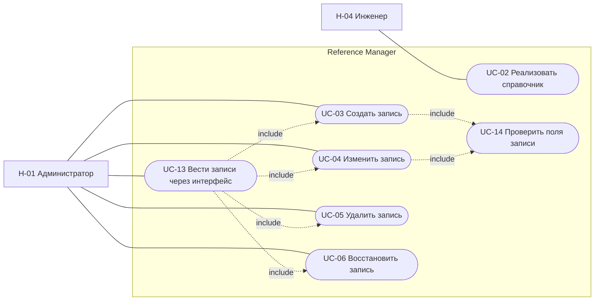
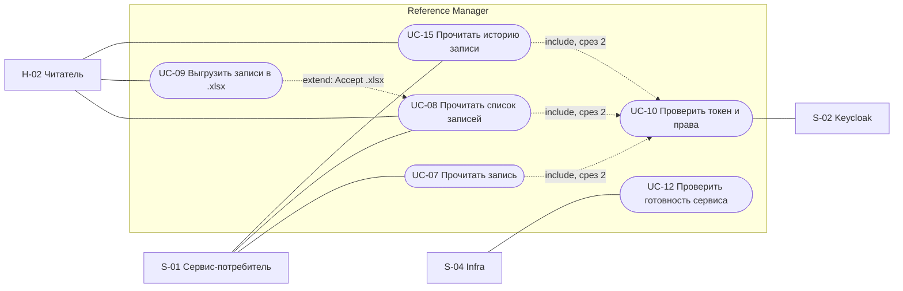

# 060 - Use Cases

> Формат - см. [состав документов](documents-composition.md), документ 060.
> Источник - [системные требования, разделы 4 и 7](system-requirements.md), [акторы](030.actors.md), [сущности](050.entities.md), [Event Storming](040.event-storming.md).

## 1. Общие условия

Со среза защиты API каждый вызов несёт токен Keycloak; отказ в доступе завершает сценарий до изменения данных (FR-RM-21, FR-RM-23). Все операции записи выполняются в одной транзакции вместе с ревизией (BR-RM-10). Ошибки возвращаются в формате AIP-193 (INT-RM-06).

Диаграммы вариантов использования выполнены Mermaid `flowchart` с овальными узлами и связями include и extend, как в комплекте Task Tracker.

## 2. Диаграммы

### 2.1. Ведение справочников и записей

### 2.2. Чтение, история, выгрузка, защита, эксплуатация

## 3. Перечень

| UC | Название | Актор | Срез | Требования |
| --- | --- | --- | --- | --- |
| UC-01 | Отозван 2026-09-27: заявка на справочник | - | - | INT-RM-07..10 отозваны |
| UC-02 | Реализовать справочник | H-04 | 1 | FR-RM-33..38, BR-RM-01, 06, 07, 14 |
| UC-03 | Создать запись | H-01 | 1 | FR-RM-05, FR-RM-14, BR-RM-03 |
| UC-04 | Изменить запись | H-01 | 1 | FR-RM-07, FR-RM-11, FR-RM-14, FR-RM-24 |
| UC-05 | Удалить запись | H-01 | 1 | FR-RM-10, FR-RM-14, BR-RM-04, BR-RM-05 |
| UC-06 | Восстановить запись | H-01 | 1 | FR-RM-12, FR-RM-14 |
| UC-07 | Прочитать запись | S-01, H-02 | 1 | FR-RM-06 |
| UC-08 | Прочитать список записей | S-01, H-02 | 1 | FR-RM-08, NFR-RM-20 |
| UC-09 | Выгрузить записи в `.xlsx` | H-02 | 1 | FR-RM-40..43, NFR-RM-42..45 |
| UC-10 | Проверить токен и права | система, S-02 | 2 | FR-RM-21..24 |
| UC-11 | Отозван 2026-09-26: арендаторские справочники | - | - | FR-RM-25, 26 отозваны |
| UC-12 | Проверить готовность сервиса | S-04 | 1 | FR-RM-30, FR-RM-31, NFR-RM-21 |
| UC-13 | Вести записи через интерфейс администрирования | H-01 | 3 | FR-RM-28, FR-RM-29 |
| UC-14 | Проверить поля записи | система | 1 | FR-RM-35 |
| UC-15 | Прочитать историю записи | S-01, H-02 | 1 | FR-RM-46, FR-RM-47 |

## 4. Спецификации ключевых сценариев

### UC-02 Реализовать справочник

- **Актор:** H-04 Инженер справочников.
- **Предусловия:** справочник входит в состав первой версии (раздел 9.2 требований), поля и начальные данные согласованы с командой-потребителем.
- **Постусловия:** коллекция и методы справочника доступны, схема записи опубликована в спецификации, справочник подключён к общему набору тестов.
- **Основной поток:**
  1. Инженер описывает схему записи справочника в спецификации OpenAPI: общие поля, поля справочника, фильтры.
  2. Инженер добавляет хранилище записей и истории справочника и подключает методы List, Get, Create, Update, Delete, Undelete, ListRevisions.
  3. Инженер подключает справочник к общему набору тестов (NFR-RM-41).
  4. Изменение проходит проверки CI и ревью CODEOWNERS.
  5. Новая версия развёртывается: задание изменений схемы, затем приложение проходит `/ready`.
- **Альтернативные потоки:**
  - 1a. Запрошенные данные - бизнес-сущность: справочник не реализуется, запись в раздел 9.3 требований (BR-RM-08).
  - 4a. CI не прошёл: исправление в той же ветке.
  - 5a. Изменение схемы не применилось: развёртывание останавливается, приложение не запускается.

### UC-03 Создать запись

- **Актор:** H-01 Администратор.
- **Предусловия:** справочник существует; роль R-02 (срез 2).
- **Постусловия:** запись сохранена в ACTIVE, создана ревизия CREATED.
- **Основной поток:**
  1. Администратор вызывает `Create` с идентификатором записи, `display_name` и полями справочника.
  2. Система выполняет UC-14.
  3. Система сохраняет запись и ревизию в одной транзакции и возвращает запись с `name` и `etag`.
- **Альтернативные потоки:**
  - 2a. Нарушены ограничения полей: INVALID_ARGUMENT со списком полей, ничего не сохранено.
  - 3a. Идентификатор занят, в том числе удалённой записью: ALREADY_EXISTS с подсказкой восстановить запись.

### UC-04 Изменить запись

- **Актор:** H-01.
- **Предусловия:** запись в ACTIVE; роль R-02 (срез 2).
- **Постусловия:** изменены только поля из `update_mask`, `etag` новый, создана ревизия UPDATED с различиями.
- **Основной поток:** `Update` с `update_mask` и полями -> UC-14 -> сохранение записи и ревизии -> ответ с записью.
- **Альтернативные потоки:** поле только для чтения в маске - INVALID_ARGUMENT; запись DELETED - FAILED_PRECONDITION; `etag` не совпал (срез 2) - ABORTED.

### UC-05 Удалить запись и UC-06 Восстановить запись

- **Актор:** H-01.
- **Предусловия:** запись существует; для UC-05 состояние ACTIVE, для UC-06 состояние DELETED.
- **Постусловия:** состояние изменено, `delete_time` заполнен или очищен, `etag` новый, создана ревизия DELETED или UNDELETED.
- **Основной поток UC-05:** `Delete` -> проверка состояния -> состояние DELETED -> ответ с записью.
- **Основной поток UC-06:** `Undelete` -> проверка состояния -> состояние ACTIVE -> ответ с записью.
- **Альтернативные потоки:** повторное удаление или восстановление неудалённой записи - FAILED_PRECONDITION; `etag` не совпал (срез 2) - ABORTED.

### UC-08 Прочитать список записей

- **Актор:** S-01 или H-02.
- **Предусловия:** справочник существует; роль R-01 (срез 2).
- **Постусловия:** данные не изменены.
- **Основной поток:**
  1. Вызывающий вызывает `List` с `filter`, `order_by`, `page_size`, `page_token`, `show_deleted`.
  2. Система применяет фильтр состояния: по умолчанию только ACTIVE.
  3. Система возвращает страницу записей, `next_page_token` и `total_size`.
- **Альтернативные потоки:**
  - 1a. Фильтр или сортировка ссылаются на неизвестное поле, `page_size` вне диапазона: INVALID_ARGUMENT.
  - 1b. `Accept` запрашивает `.xlsx`: выполняется UC-09.

### UC-09 Выгрузить записи в `.xlsx`

- **Актор:** H-02 или H-01.
- **Предусловия:** те же параметры, что в UC-08.
- **Постусловия:** файл передан, данные не изменены.
- **Основной поток:** `List` с `Accept` `.xlsx` и параметрами отбора -> проверка объёма -> файл: строка заголовков, по строке на запись, общие поля и поля справочника, идентификаторы как текст.
- **Альтернативные потоки:** отбор превышает предел - FAILED_PRECONDITION с указанием предела; формирование дольше допустимого - UNAVAILABLE.

### UC-10 Проверить токен и права (срез 2)

- **Актор:** система от имени любого вызывающего; S-02 как источник ключей.
- **Основной поток:** извлечь Bearer-токен -> проверить подпись по ключам Keycloak, издателя, получателя, срок -> извлечь актора и роли -> сопоставить роль с уровнем доступа операции: read и execute для reader, все пять для admin.
- **Альтернативные потоки:** нет токена или он недействителен - UNAUTHENTICATED; роль не даёт уровня - PERMISSION_DENIED; ключи Keycloak недоступны и кэш пуст - UNAVAILABLE.

### UC-12 Проверить готовность сервиса

- **Актор:** S-04 Infra.
- **Основной поток:** `GET /ready` -> проверка хранилища и версии схемы -> 200.
- **Альтернативный поток:** хранилище недоступно или схема отстаёт -> 503 с перечнем неуспешных проверок; трафик на экземпляр не подаётся.

### UC-15 Прочитать историю записи

- **Актор:** S-01 или H-02.
- **Предусловия:** запись существует; роль R-01 (срез 2).
- **Основной поток:**
  1. Вызывающий запрашивает `revisions` записи с `page_size` и `page_token`.
  2. Система возвращает ревизии от новой к старой: `action`, `author`, `create_time`, `request_id`, `changes`.
- **Альтернативные потоки:**
  - 1a. Записи нет: NOT_FOUND.
  - 1b. Запрошена запись в состоянии на ревизию: система восстанавливает состояние по цепочке ревизий; ревизии нет - NOT_FOUND.

Остальные сценарии (UC-07, UC-13, UC-14) следуют из требований и раскрыты в пользовательских историях [080]() и sequence-диаграммах [155](155.sequence-diagrams.md).

## 5. Покрытие функциональных требований

| Требование | UC |
| --- | --- |
| FR-RM-05..08 | UC-03, UC-04, UC-07, UC-08 |
| FR-RM-09..12, 14 | UC-04, UC-05, UC-06 |
| FR-RM-21..24 | UC-10, UC-04, UC-05, UC-06 |
| FR-RM-28, 29 | UC-13 |
| FR-RM-30..32 | UC-12 |
| FR-RM-33..38 | UC-02 |
| FR-RM-40..43 | UC-09 |
| FR-RM-44 | UC-03..06 |
| FR-RM-45 | правило хранения, сценария нет |
| FR-RM-46, 47 | UC-15 |
