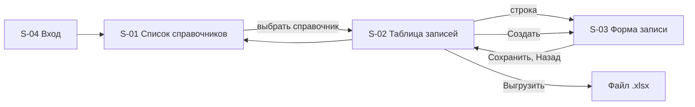

# 110 - UI/UX прототип

> Формат - см. [состав документов](documents-composition.md), документ 110.
> Источник - [системные требования, разделы 4.7 и 8](system-requirements.md#8-требования-к-интерфейсу), [RBAC](070.role-matrix.md), [US-AD-07](080.admin-user-stories.md), [UC-13](060.use-cases.md).

Интерфейс относится к срезу 3 (веха M5). Пользователь - администратор справочников; читатели работают в интерфейсах своих подсистем. Стек фронтенда выбирается ADR до начала среза; здесь описаны экраны и поведение, независимые от стека.

## 1. Принципы

- **Форма из контракта.** Список справочников, столбцы таблицы, поля формы и фильтры строятся по спецификации OpenAPI: новый справочник появляется в интерфейсе без изменения кода интерфейса (FR-RM-29, FR-RM-38).
- **Консистентность.** Все справочники выглядят и ведут себя одинаково; различаются только поля (NFR-RM-40).
- **Обратная связь.** Каждое действие даёт результат на экране: сохранено, удалено, восстановлено, отклонено с указанием полей. Ошибки API показываются у полей, к которым относятся.
- **Предсказуемость и защита от ошибок.** Удаление и восстановление требуют подтверждения; поля только для чтения показаны как таковые; удалённые записи видны только по явному флагу.
- **Минимум когнитивной нагрузки.** Один справочник - одна таблица - одна форма. Нет вложенных мастеров и модальных цепочек.
- **Доступность.** Навигация с клавиатуры, подписи у всех полей, контраст текста, состояния ошибок не только цветом.
- **Права на сервере.** Интерфейс скрывает действия по ролям, но ответы UNAUTHENTICATED и PERMISSION_DENIED обрабатываются как штатные состояния (FR-RM-28).

## 2. Экраны

### S-01 Список справочников

- **Структура:** шапка с названием сервиса, именем пользователя и выходом; таблица справочников: коллекция, название, число активных записей; переход к S-02.
- **Функциональные элементы:** строка поиска по названию справочника.
- **Источник:** коллекции и описания из спецификации OpenAPI.
- **Состояния:** loading; empty (спецификация без справочников - только на пустом стенде); error (спецификация недоступна).
- **Истории:** US-AD-07 AC-1.

### S-02 Таблица записей справочника

- **Структура:** заголовок с названием справочника; панель отбора: строка фильтра в синтаксисе AIP-160 с подсказками по полям, флаг "показывать удалённые", выбор сортировки; таблица с общими полями (`name`, `display_name`, `state`) и полями справочника; постраничный вывод с `page_size` 50 по умолчанию и `total_size`; действия "Создать запись" и "Выгрузить в Excel" (с текущим отбором); переход к S-03 по строке.
- **Состояния:** loading; empty с подсказкой "записей нет, создайте первую"; error с идентификатором запроса; неверный фильтр - подсветка строки фильтра и текст причины из INVALID_ARGUMENT; отказ выгрузки сверх предела - сообщение "сузьте отбор" без перехода.
- **Контекстное управление:** для роли reader кнопка "Создать" скрыта, строки только для чтения; удалённые записи выделены и помечены DELETED.
- **Истории:** US-AD-07, US-RD-01..04 (через выгрузку).

### S-03 Форма записи

- **Структура:** две зоны. Слева поля: идентификатор (только при создании), `display_name`, затем поля справочника по схеме (число, дата, ссылка на другой справочник с выбором по имени и наименованию, логическое). Справа сведения: `name`, `state`, `delete_time`, `etag`. Ниже панель истории: ревизии от новой к старой с действием, автором, временем и списком изменений; выбор ревизии показывает запись в состоянии на неё в режиме чтения. Внизу действия: "Сохранить", "Удалить" (для ACTIVE), "Восстановить" (для DELETED), "Назад".
- **Поведение:** сохранение вызывает `Create` или `Update` только с изменёнными полями в `update_mask`; INVALID_ARGUMENT раскладывается по полям, ALREADY_EXISTS и FAILED_PRECONDITION показываются баннером с пояснением; удаление и восстановление требуют подтверждения; после действия форма перечитывает запись и историю; со среза 2 операции записи несут `etag`, ABORTED предлагает перечитать.
- **Состояния:** loading; saving с блокировкой кнопок; error; read-only для роли reader и для DELETED (кроме восстановления).
- **Истории:** US-AD-01..05, US-AD-07 AC-2, AC-3, US-AD-08.

### S-04 Вход и отказ в доступе

- **Структура:** перенаправление в Keycloak (Authorization Code с PKCE); после возврата - S-01. Экран отказа при отсутствии ролей `reference-reader` и `reference-admin` с указанием, к кому обратиться.
- **Состояния:** сессия истекла - повторный вход с возвратом на прежний экран.

## 3. Навигация

Адреса экранов: `/admin/`, `/admin/{коллекция}`, `/admin/{коллекция}/{идентификатор}`, `/admin/{коллекция}/new`. Фильтр, сортировка и страница хранятся в строке запроса, чтобы ссылку можно было передать коллеге.

## 4. Видимость по ролям

| Элемент | reader | admin |
| --- | --- | --- |
| Список справочников, таблица, форма в режиме чтения | да | да |
| Флаг "показывать удалённые" | да | да |
| Панель истории записи | да | да |
| Выгрузка | да | да |
| Создать, Сохранить, Удалить, Восстановить | скрыто | да |

## 5. UX-особенности

- Автосохранения нет: справочные данные меняются осознанно, каждое сохранение - отдельная ревизия.
- Черновик формы сохраняется в браузере до ухода со страницы, чтобы отказ по полям не стирал введённое.
- Выгрузка запускается в фоне с индикатором; при отказе сверх предела предлагается уменьшить отбор, при недоступности - повторить позже.
- Подтверждение удаления показывает имя и наименование записи и напоминает, что идентификатор останется занятым.
- Ссылочные поля предлагают выбор из целевого справочника с поиском; в форме показывается имя и наименование, сохраняется имя.
- Даты и время показываются в местной зоне пользователя с подсказкой UTC-значения.

## 6. Привязка экранов к требованиям и историям

| Экран | Требования | Use Case | Истории |
| --- | --- | --- | --- |
| S-01 | FR-RM-29, раздел 8.1 | UC-13 | US-AD-07 AC-1 |
| S-02 | FR-RM-08, FR-RM-29, FR-RM-40, раздел 8.2 | UC-08, UC-09, UC-13 | US-AD-07, US-RD-01..04 |
| S-03 | FR-RM-05, 07, 10, 12, 35, 46, 47, раздел 8.3 | UC-03..06, UC-14, UC-15 | US-AD-01..05, US-AD-07, US-AD-08, US-RD-05 |
| S-04 | FR-RM-28, FR-RM-21..23 | UC-10 | US-AD-07 |
