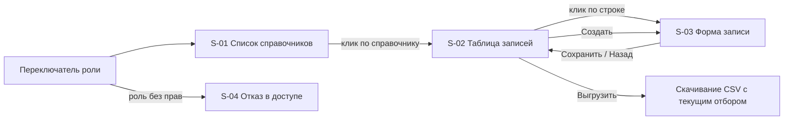

# 115 - Live-прототип

> Формат - см. [состав документов](documents-composition.md), документ 115.
> См. также [110 - UI/UX прототип](110.ui-ux.md).

Интерактивный прототип - один файл [`../../ui/prototype/index.html`](../ui/prototype/index.html) с навигацией между экранами, без сборки и внешних зависимостей, открывается в браузере. Данные - образцовые справочники `currencies` и `countries` в памяти страницы; API не вызывается, ответы имитируются по контракту [130](130.api-contracts.md).

## Экраны и связки между ними

Экраны соответствуют [110](110.ui-ux.md): S-01 список справочников, S-02 таблица записей, S-03 форма записи с панелью истории, S-04 отказ в доступе. Переключатель роли в шапке (reader / admin) сразу меняет доступные действия: создание, сохранение, удаление и восстановление видны только admin. Это демонстрация контекстных ограничений из [070](070.role-matrix.md), без проверки на сервере.

## Сценарии для проверки на прототипе

| № | Сценарий | Проверяемое | Истории |
| --- | --- | --- | --- |
| P-01 | Открыть список, перейти в `countries`, отобрать фильтром `state = ACTIVE AND display_name:"Р"`, отсортировать по наименованию | Понятность фильтра AIP-160 и таблицы | US-RD-01, US-RD-02 |
| P-02 | Создать запись с ошибкой в ссылочном поле `currency`, исправить, сохранить | Ошибки у полей, выбор из другого справочника | US-AD-01, US-AD-02 |
| P-03 | Удалить запись, включить показ удалённых, восстановить | Подтверждения, состояние, новая ревизия | US-AD-04, US-AD-05 |
| P-04 | Выгрузить отбор; выгрузить сверх предела и получить отказ | Понятность отказа | US-RD-03, US-RD-04 |
| P-05 | Переключить роль на reader | Скрытие действий записи | US-AD-07, 070 |
| P-06 | Открыть панель истории, выбрать ревизию, увидеть различия и состояние на ревизию | Понятность истории | US-AD-08, US-RD-05 |

## Сознательные упрощения

- Выгрузка отдаёт CSV, а не `.xlsx`: демонстрируется поток и отказ сверх предела, не формат файла.
- Фильтр поддерживает подмножество AIP-160: `=`, `:`, `AND`, поля записи; сложные выражения не разбираются.
- Проверка `etag` (срез 2) не имитируется; вход через Keycloak заменён переключателем роли.
- Состояние на ревизию восстанавливается из различий в памяти страницы, как это будет делать сервер.

## Критерий готовности

Прототип принят, когда администратор из команды справочников проходит сценарии P-01..P-06 без подсказок, а замечания перенесены в [110](110.ui-ux.md). Только после этого выбирается стек и начинается срез 3.
