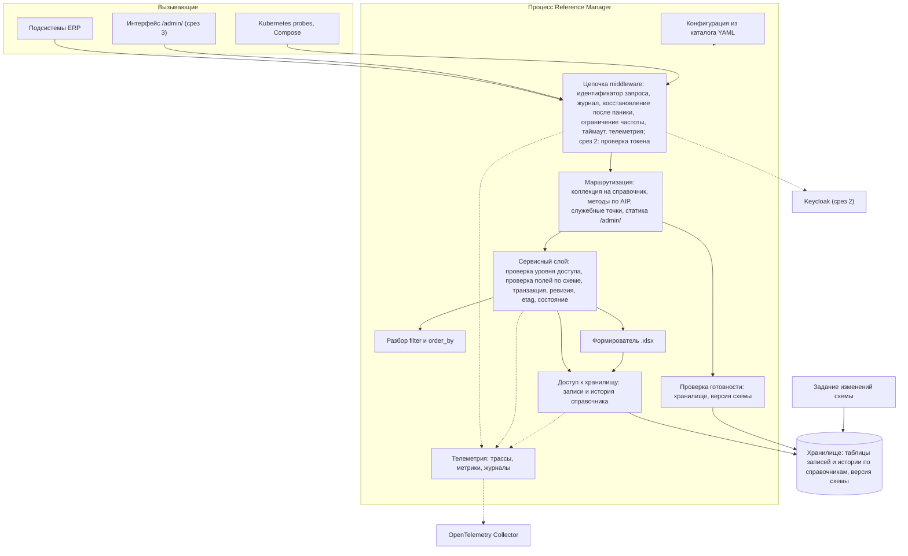

# 146 - Logic Scheme

> Формат - см. [состав документов](documents-composition.md), документ 146.
> Источник - [ADR](145.architecture-decisions.md), [системные требования, разделы 4, 5, 10](system-requirements.md), код `main`.

## 1. Границы и зависимости

Модуль - один процесс с одним хранилищем. Все взаимодействия синхронные: HTTP-запрос, запрос к хранилищу, отправка телеметрии в фоне. Асинхронных потоков и шины сообщений нет (ADR-003). Внешние зависимости: хранилище (критичная), коллектор OpenTelemetry (некритичная), Keycloak со среза 2 (критичная для защищённых путей).

## 2. Диаграмма

## 3. Потоки данных

| Поток | От | К | Содержимое | Режим |
| --- | --- | --- | --- | --- |
| Чтение | Подсистема или интерфейс | Маршрутизация -> сервис -> хранилище | `List` с `filter`, `order_by`, страницей; `Get` по имени; страница записей или запись | Синхронный, только чтение |
| Запись | Администратор | Маршрутизация -> сервис -> хранилище | Create, Update с `update_mask`, Delete, Undelete; проверка полей до хранилища; одна транзакция: запись, новый `etag`, ревизия с различиями | Синхронный (BR-RM-10) |
| История | Подсистема или интерфейс | Сервис -> хранилище истории справочника | Ревизии записи от новой к старой; состояние на ревизию восстанавливается из различий | Синхронный |
| Выгрузка | Читатель | Сервис -> формирователь -> хранилище | Отбор по `filter`, чтение порциями, файл `.xlsx` | Синхронный ответ; соединение не удерживается на всё время (NFR-RM-43) |
| Готовность | Kubernetes, Compose | Проверка готовности -> хранилище | Доступность и версия схемы | Синхронный |
| Проверка токена (срез 2) | Любой вызывающий | Middleware -> кэш ключей -> Keycloak при отсутствии ключа | Подпись, издатель, получатель, срок, роли | Синхронный, ключи кэшируются |
| Телеметрия | Все компоненты | Экспортёры OTLP -> коллектор | Спаны, метрики, журналы с `trace_id`, `request_id` | Фоновый, без влияния на запросы (NFR-RM-29) |
| Изменения схемы | Задание | Хранилище | Схема таблиц записей и истории | До запуска приложения (NFR-RM-21) |

## 4. Правила слоёв

- Маршрутизация разбирает запрос, вызывает сервисный слой и отображает результат или доменную ошибку в `google.rpc.Status`. К хранилищу не обращается (NFR-RM-07).
- Сервисный слой владеет транзакцией и инвариантами: уникальность идентификатора, поля только для чтения, состояния, `etag`, ревизия, уровень доступа (срез 2).
- Доступ к хранилищу параметризован описанием справочника: таблицы, столбцы, фильтруемые и сортируемые поля; все запросы параметризованы (NFR-RM-31). Способ переиспользования - ADR-011.
- Разбор `filter` и `order_by` - общий для всех справочников; допустимые поля берутся из описания справочника.

## 5. Соответствие текущему коду

| Элемент схемы | Состояние в `main` |
| --- | --- |
| Middleware журнала, восстановления, ограничения частоты, таймаута | Есть; ограничения заданы константами (K-07) |
| Маршрутизация и генерация из спецификации | Есть; спецификация не по AIP и монтируется на `/v1` (K-10) |
| Служебные точки | Есть `/livez`, `/readyz` с проверкой хранилища; проверки версии схемы нет (K-02) |
| Конфигурация, журналирование, клиент хранилища, повторы подключения | Есть |
| Телеметрия | Есть журналирование в stdout с атрибутами ресурса; экспорт OTLP, трассы и метрики - срез 1 |
| Сервисный слой, доступ к хранилищу, методы справочников, история, фильтр, выгрузка | Нет, срез 1 |
| Проверка токена, статика интерфейса | Нет, срезы 2 и 3 |
