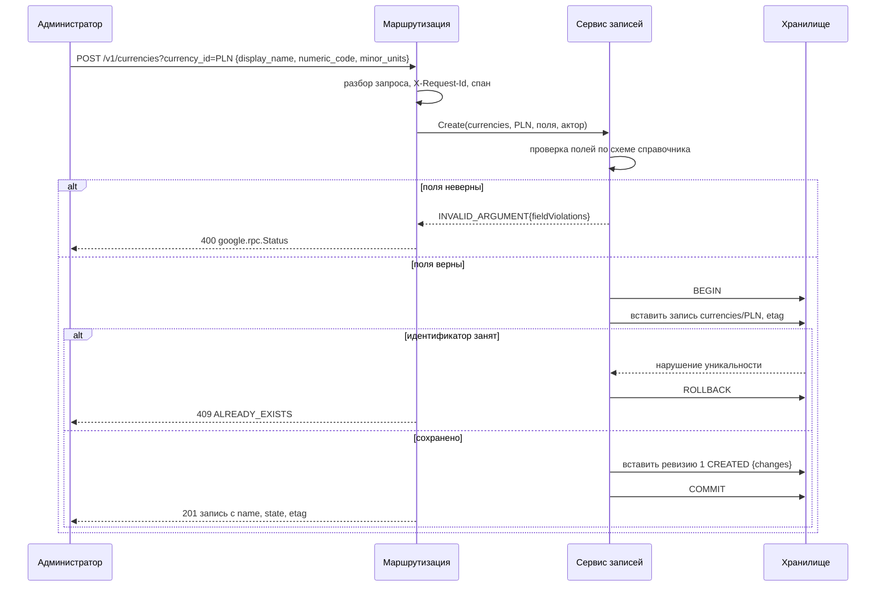
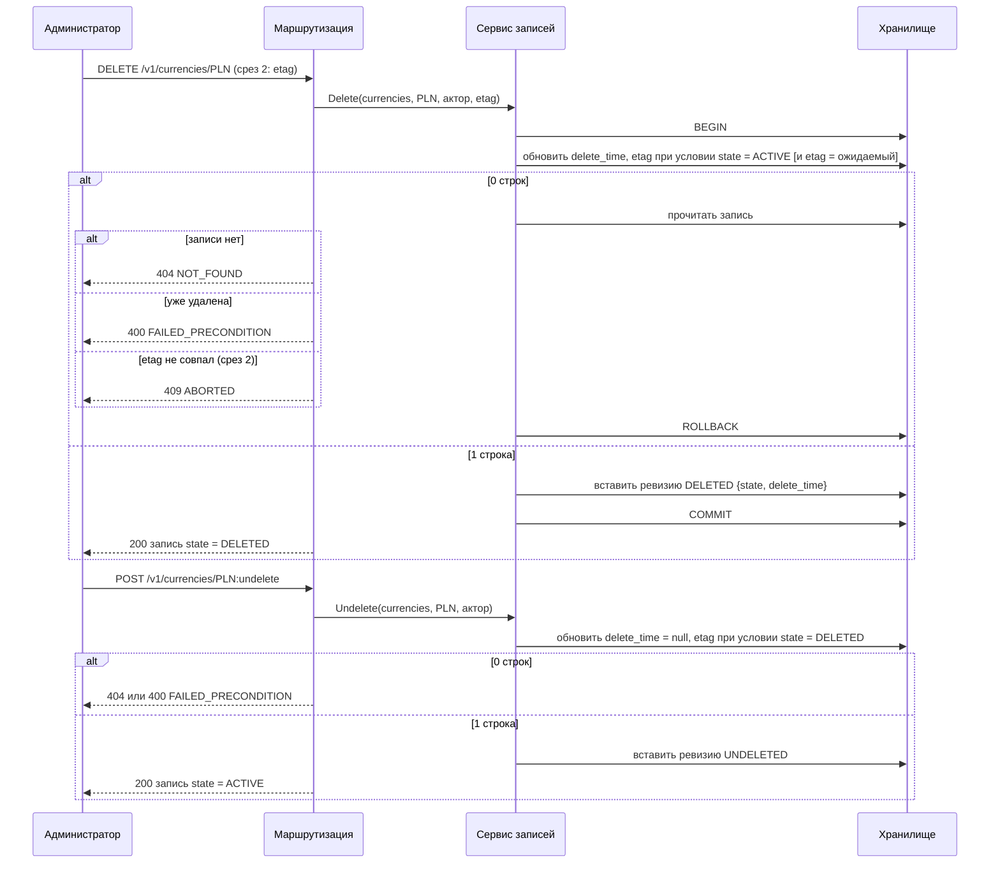
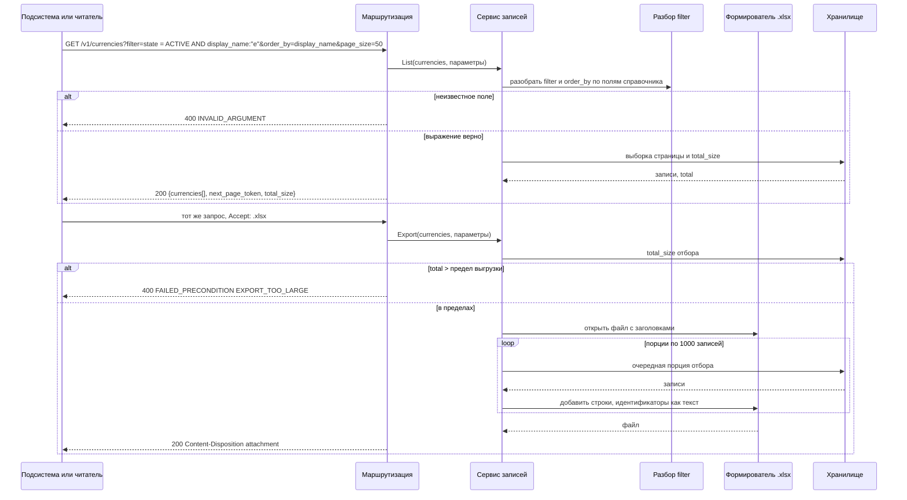
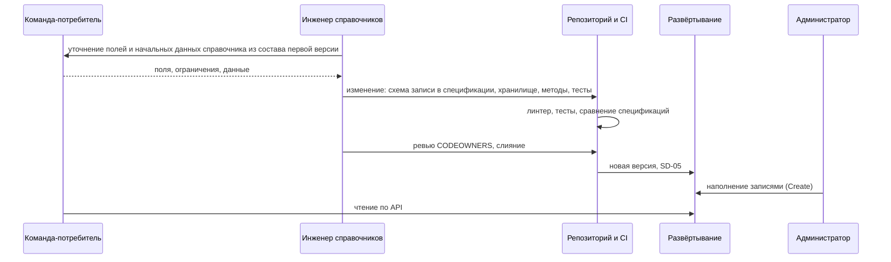
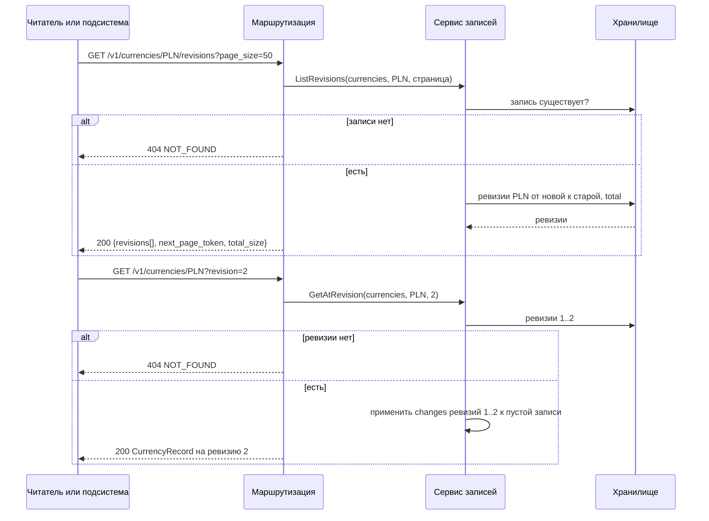

# 155 - Sequence-диаграммы

> Формат - см. [состав документов](documents-composition.md), документ 155.
> Источник - [Use Cases](060.use-cases.md), [контракты API](130.api-contracts.md), [логическая схема](146.logic-scheme.md).

Тайм-ауты: запрос ограничен таймаутом middleware (сейчас константа, K-07; для выгрузки требуется отдельный предел до 60 с по NFR-RM-43); запрос к хранилищу ограничен контекстом запроса; экспорт телеметрии не блокирует ответ.

## SD-01 Создание записи с проверкой полей

Use Case UC-03, UC-14; истории US-AD-01, US-AD-02.



## SD-02 Удаление и восстановление

Use Case UC-05, UC-06; истории US-AD-04, US-AD-05.



## SD-03 Список с фильтром и выгрузка

Use Case UC-08, UC-09; истории US-RD-01..04.



Соединение с хранилищем возвращается в пул между порциями; при превышении предела времени формирование прерывается ответом UNAVAILABLE (NFR-RM-43).

## SD-04 Запрос с токеном Keycloak (срез 2)

Use Case UC-10; история US-CS-02.

```mermaid
sequenceDiagram
    participant C as Сервис-потребитель
    participant KC as Keycloak
    participant M as Проверка токена
    participant J as Кэш ключей
    participant S as Сервис записей
    C->>KC: client credentials
    KC-->>C: access token (роль reference-reader)
    C->>M: GET /v1/currencies/EUR Authorization: Bearer
    M->>J: ключ по kid
    alt ключ в кэше
        J-->>M: ключ
    else нет ключа
        J->>KC: JWKS
        KC-->>J: ключи
        J-->>M: ключ
    end
    M->>M: подпись, издатель, получатель, срок
    alt токен недействителен
        M-->>C: 401 UNAUTHENTICATED
    else действителен
        M->>S: запрос с актором и ролями
        S->>S: роль имеет уровень операции? (reader: R X; admin: C R U X D)
        alt нет
            S-->>C: 403 PERMISSION_DENIED
        else да
            S-->>C: 200 запись
        end
    end
```

Ошибка загрузки ключей при пустом кэше даёт UNAVAILABLE на защищённых путях; ключи обновляются не чаще раза в минуту. Источник ключей может быть заменён конфигурацией (вопрос 7).

## SD-05 Развёртывание: задание изменений схемы и готовность

Use Case UC-12, UC-02; требования NFR-RM-21, FR-RM-31.

```mermaid
sequenceDiagram
    participant CI as CI/CD
    participant K as Kubernetes
    participant J as Задание изменений схемы
    participant DB as Хранилище
    participant P as Экземпляр reference-manager
    CI->>K: новый образ, манифесты
    K->>J: запустить задание
    J->>DB: применить изменения схемы, версия = N
    alt не применилось
        J-->>K: ошибка
        K-->>CI: развёртывание остановлено
    else применено
        J-->>K: успех
        K->>P: запустить Deployment
        K->>P: GET /ready
        P->>DB: доступность; версия схемы
        alt недоступно или версия < N
            P-->>K: 503 с перечнем проверок
            K->>K: трафик не подаётся, повтор
        else готов
            P-->>K: 200
            K->>K: трафик на экземпляр, старые экземпляры останавливаются
        end
    end
```

## SD-06 Реализация справочника

Use Case UC-02; история US-AD-06. Взаимодействие людей и репозитория, не сетевых компонентов.



## SD-07 Чтение истории записи

Use Case UC-15; истории US-AD-08, US-RD-05, US-CS-06.


