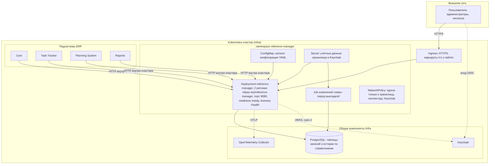
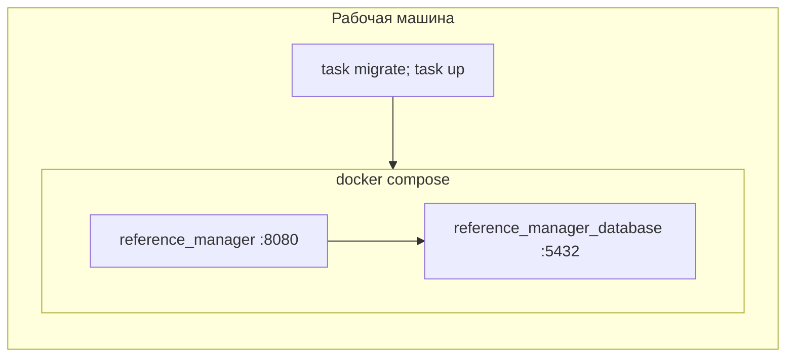

# 165 - Deployment Diagram

> Формат - см. [состав документов](documents-composition.md), документ 165.
> Источник - [системные требования, разделы 10.6, 10.8](system-requirements.md), [компоненты](150.component-diagram.md), `deployments/` в `main`, infra/README, core/README.

## 1. Окружения

| Окружение | Способ запуска | Хранилище | Телеметрия | Доступ | Назначение |
| --- | --- | --- | --- | --- | --- |
| dev, локально | `task up`: Docker Compose из `deployments/docker-compose.yaml`, образ собирается из Dockerfile; конфигурация `deployments/configs/reference-manager/local` | контейнер PostgreSQL, том данных | коллектор из общего стенда Infra или отключена | порт из `.env`, только localhost | Разработка и сквозные тесты |
| stage, стенд | Compose общей конфигурации монорепозитория или namespace стенда в Kubernetes | PostgreSQL Infra | коллектор Infra | внутренняя сеть, без публикации наружу до среза 2 | Приёмка срезов, интеграция с потребителями |
| prod, целевое | Kubernetes силами Infra | PostgreSQL Infra с резервным копированием по регламенту Core | коллектор Infra | ingress с HTTPS, NetworkPolicy | Эксплуатация |

Сейчас в Compose изменения схемы выполняет одноразовый сервис; по NFR-RM-21 он заменяется целью Taskfile (K-04).

## 2. Диаграмма целевого окружения

## 3. Узлы

| Узел | Тип | Содержимое | Ресурсы и параметры |
| --- | --- | --- | --- |
| Pod reference-manager | Контейнер из образа `erp/reference-manager` (двухстадийная сборка, distroless, non-root, журналы в stdout) | REST API, статика `/admin/`, служебные точки | 2 реплики; readiness `/ready`, liveness `/health`; период корректной остановки не меньше таймаута завершения; конфигурация через `--configs` |
| Job изменений схемы | Контейнер инструмента изменений схемы | Изменения схемы хранилища | Запускается перед обновлением Deployment; успех обязателен для выкладки |
| PostgreSQL | Общий сервис Infra | База сервиса | Две учётные записи: задание изменений схемы и сервис; резервное копирование по регламенту Core |
| OpenTelemetry Collector | Общий сервис Infra | Приём OTLP | Транспорт и адрес - вопрос 8 |
| Keycloak | Общий сервис Infra | Realm ERP, клиенты подсистем | Роли `reference-reader`, `reference-admin` |
| Ingress | Общий шлюз | Терминация HTTPS | Маршруты `/v1/*`, `/admin/*`; служебные точки наружу не публикуются |

## 4. Соответствие компонентов узлам

| Компонент из 150 | Узел |
| --- | --- |
| Все компоненты приложения | Pod reference-manager |
| Статика интерфейса (срез 3) | Pod reference-manager, тот же образ (ADR-006) |
| Изменения схемы | Job (ADR-007) |
| Конфигурация | ConfigMap; секреты в Secret |
| Данные | PostgreSQL Infra |

## 5. Порядок выкладки

1. CI по изменению `reference-manager/**`: линтер, тесты, проверка изменений схемы, сравнение спецификаций, сборка образа с версией.
2. Job применяет изменения схемы; при ошибке выкладка останавливается.
3. Deployment обновляется; новый экземпляр принимает трафик только после `/ready` 200, что требует версии схемы не ниже ожидаемой.
4. Откат образа допустим без отката схемы: изменения схемы совместимы с предыдущей версией (NFR-RM-17).

## 6. Локальный стенд

`task up` собирает образ и поднимает хранилище и приложение; конфигурация монтируется из `deployments/configs/reference-manager/local`; переменные из `deployments/.env`. Целевая схема (после K-04): изменения схемы применяются одноразовым запуском перед `task up`.
