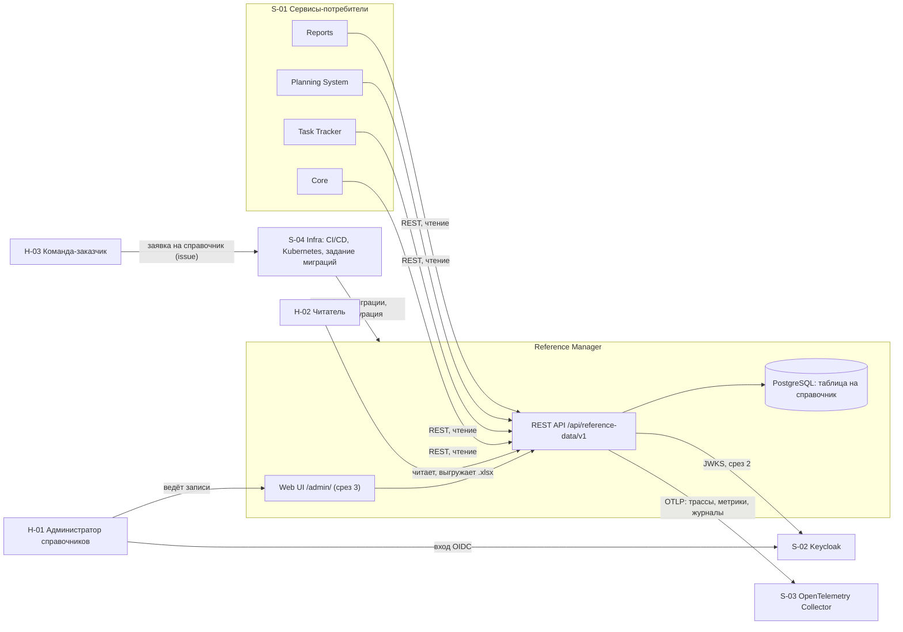

# 020 - Контекст системы Reference Manager

**Блок A.** Редакция 1.0 от 2026-09-25, к ревью команды.
Основания: [Видение, раздел "Требования к интеграциям"](../vision.md), [Системные требования, разделы 1.2 и 5](../system-requirements.md), [конституция, принцип I](../../.specify/memory/constitution.md).

## 1. Границы системы

Внутри границы: справочники и их записи, пять операций API на справочник, выгрузка `.xlsx`, порядок добавления справочника по заявке, проверка токена и прав, разделение записей по арендаторам, интерфейс администрирования внутри сервиса, служебные точки и телеметрия.

За границей: бизнес-сущности любой подсистемы (сотрудники, проекты, задачи, календари), журнал изменений с историей значений, обмен событиями, загрузка записей из файла, предзаполнение стандартными данными, самостоятельное создание справочников потребителями.

Правило направления вызовов: сервис принимает только входящие запросы. Исходящие соединения ограничены собственной базой данных, коллектором OpenTelemetry и Keycloak за ключами проверки токенов (INT-RM-04, BR-RM-09).

## 2. Контекстная диаграмма

Стрелки от потребителей направлены в сервис: обратных вызовов, подписок и событий нет.

## 3. Внешние системы

| Система | Роль для сервиса | Тип интеграции | Направление | Критичность | Степень согласованности |
| --- | --- | --- | --- | --- | --- |
| PostgreSQL | Хранилище справочников, отдельная база сервиса | Драйвер pgx, TCP | Сервис -> БД | Критичная: без базы `/ready` отвечает 503 | Согласовано, работает на стенде |
| Keycloak | Выдача токенов пользователям и сервисам, роли, признак арендатора | OIDC, JWT, JWKS | Сервис -> Keycloak (ключи); пользователи -> Keycloak (вход) | Критичная со среза защиты API | Состав ролей, имя claim арендатора и источник ключей не согласованы (вопросы 5-7 требований) |
| OpenTelemetry Collector | Приём трасс, метрик и журналов | OTLP gRPC или HTTP | Сервис -> коллектор | Средняя: недоступность не влияет на запросы | Транспорт и адрес не согласованы (вопрос 8) |
| Infra: CI/CD и Kubernetes | Сборка образа, задание миграций, развёртывание, проверки готовности | Конфигурация, GitHub Actions, Job, Deployment | Infra -> сервис | Критичная для развёртывания | Порядок запуска согласован с core/README; целевые показатели не согласованы (вопрос 9) |
| Core | Потребитель справочников для форм и проверок | REST с токеном | Core -> сервис | Высокая | Заявок пока нет |
| Task Tracker | Потребитель справочников для полей задач | REST с токеном | Task Tracker -> сервис | Средняя | Владелец статусов и приоритетов задач не согласован (вопрос 1) |
| Planning System | Потребитель валют, единиц, типов финансирования, статей затрат, ролей, грейдов, языков, налоговых категорий | REST с токеном | Planning System -> сервис | Высокая | Перечень подтверждён; ожидание событий не согласовано |
| Reports | Потребитель классификаторов для разрезов отчётов | REST с токеном, кэш на стороне Reports | Reports -> сервис | Высокая | Компетенции и три справочника задач требуют согласования |

## 4. Акторы

| ID | Актор | Тип | Кратко |
| --- | --- | --- | --- |
| H-01 | Администратор справочников | Человек | Участник команды справочников, ведёт записи всех справочников |
| H-02 | Читатель | Человек | Пользователь любой подсистемы, выбирает значения и выгружает справочники |
| H-03 | Команда-заказчик | Люди | Подаёт заявку на справочник, затем читает данные по API |
| S-01 | Сервисы-потребители | Внешние системы | Core, Task Tracker, Planning System, Reports читают справочники по REST |
| S-02 | Keycloak | Внешняя система | Провайдер идентификации |
| S-03 | OpenTelemetry Collector | Внешняя система | Приёмник телеметрии |
| S-04 | Infra | Внешняя система и команда | CI/CD, Kubernetes, задание миграций, GitHub issues для заявок |

Подробно акторы описаны в [030](030.actors.md).

## 5. Владение данными

| Данные | Владелец | Примечание |
| --- | --- | --- |
| Справочники и записи | Reference Manager | Единственный источник; потребители хранят только кэш |
| Состав справочников и столбцов | Reference Manager по заявкам команд | Определяется схемой базы данных и спецификацией OpenAPI, не хранится в таблицах |
| Пользователи, роли, арендаторы | Keycloak | Сервис не хранит пользователей |
| Статусы, приоритеты, виды задач | Не согласовано между Task Tracker и Reports | Таблицы не создаются до решения (вопрос 1) |
| Сотрудники, проекты, календари, ёмкость | Другие подсистемы | Отклонено по BR-RM-08 |

## 6. Расхождения между документами и текущим кодом

Зафиксированы 2026-09-25 при сверке с `main`; требуют решения, документы их не подменяют.

| № | Расхождение | Где | Предлагаемое действие |
| --- | --- | --- | --- |
| K-01 | Маршрутизатор монтирует API на `/v1`, требования задают базовый путь `/api/reference-data/v1` (NFR-RM-09). | `internal/transport/http/router.go` | Согласовать префикс и исправить одну из сторон |
| K-02 | Служебные точки в коде и OpenAPI называются `/livez` и `/readyz`, в требованиях `/health` и `/ready` (FR-RM-30, FR-RM-31). | `api/openapi/v1/paths/`, `health/handler.go` | Переименовать в требованиях или в коде; для Kubernetes допустимы оба варианта |
| K-03 | Спецификация лежит в `api/openapi/v1/openapi.yaml`, требования ссылаются на `api/openapi.yaml` (NFR-RM-12, INT-RM-02). | `api/openapi/v1/` | Обновить путь в требованиях |
| K-04 | Миграции в Docker Compose пока выполняются сервисом `reference-manager-migrations`; требование NFR-RM-21 предписывает отдельное задание. | `deployments/docker-compose.yaml` | Добавить цель Taskfile `migrate`, убрать сервис из Compose |
| K-05 | Конституция, принцип IV, всё ещё требует JSON Schema атрибутов из отклонённой модели. | `.specify/memory/constitution.md` | Поправка конституции |
| K-06 | README сервиса называет пользователей справочными данными. | `README.md` | Правка README (вопрос 17) |
| K-07 | Ограничения rate limit и таймаут заданы в коде константами с пометкой TODO, конфигурации для них нет. | `router.go` | Вынести в `transport.yaml` |
