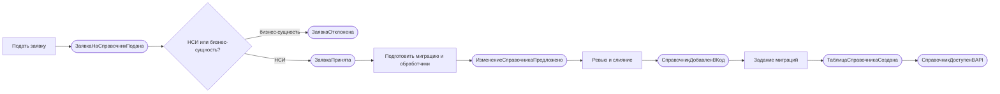
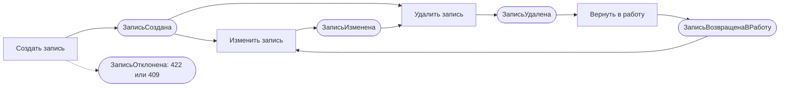

# 040 - Event Storming Reference Manager

**Блок B.** Редакция 1.0 от 2026-09-25, к ревью команды.
Основания: [Системные требования, разделы 4-7](../system-requirements.md), [акторы](../block-a-context-and-scope/030.actors.md), [сущности](050.entities.md).

## 1. Обозначения и оговорка

События записаны в прошедшем времени и означают факты внутри сервиса. Сервис не публикует события наружу (INT-RM-05): карта нужна, чтобы выделить агрегаты, команды и правила, а не чтобы описать шину сообщений. Каталог внешних событий пуст, см. [135](../block-g-api-and-events/135.event-catalog.md).

Агрегатов два: **Справочник** (таблица и её схема, меняется только миграцией) и **Запись справочника** (строка таблицы, меняется через API).

## 2. Процесс "Добавление справочника по заявке"

| № | Команда | Актор | Агрегат | Событие | Политика или реакция |
| --- | --- | --- | --- | --- | --- |
| 1 | Подать заявку на справочник | H-03 Команда-заказчик | - | ЗаявкаНаСправочникПодана | Команда справочников проверяет заявку (INT-RM-08) |
| 2 | Отклонить заявку | H-04 Инженер | - | ЗаявкаОтклонена | Заказчик получает обоснование, запрос попадает в перечень отклонённых (раздел 9.3 требований) |
| 3 | Принять заявку и уточнить столбцы | H-04 Инженер | Справочник | ЗаявкаПринята | Согласованы код, столбцы, ограничения, признак арендаторского справочника |
| 4 | Подготовить миграцию и обработчики | H-04 Инженер | Справочник | ИзменениеСправочникаПредложено | Pull request с миграцией, обработчиками, OpenAPI и тестами (INT-RM-09) |
| 5 | Влить изменение | H-04 Инженер, ревьюер CODEOWNERS | Справочник | СправочникДобавленВКод | CI: lint, тесты, up-down-up миграций |
| 6 | Применить миграции | S-04 Infra, задание миграций | Справочник | ТаблицаСправочникаСоздана | `/ready` начинает отвечать 200 для новой версии схемы |
| 7 | Запустить новую версию | S-04 Infra | Справочник | СправочникДоступенВAPI | Заказчик узнаёт о готовности из закрытой заявки (INT-RM-10) |
| 8 | Добавить столбец | H-04 Инженер | Справочник | СтолбецДобавлен | Только необязательный или со значением по умолчанию (FR-RM-36, BR-RM-06) |

## 3. Процесс "Ведение записи"

| № | Команда | Актор | Агрегат | Событие | Политика или реакция |
| --- | --- | --- | --- | --- | --- |
| 1 | Создать запись | H-01 Администратор | Запись | ЗаписьСоздана | Состояние ACTIVE, версия 1; `code` уникален, включая удалённые (FR-RM-05) |
| 1a | Создать запись с недопустимыми полями | H-01 | Запись | ЗаписьОтклонена | Ответ 422 со списком полей; ничего не сохранено (FR-RM-35) |
| 1b | Создать запись с занятым кодом | H-01 | Запись | ЗаписьОтклонена | Ответ 409; подсказка вернуть удалённую запись в работу (BR-RM-03) |
| 2 | Изменить запись | H-01 | Запись | ЗаписьИзменена | Версия увеличена, `updated_at` и `updated_by` обновлены (FR-RM-14) |
| 2a | Изменить неизменяемое поле | H-01 | Запись | ИзменениеОтклонено | Ответ 422 для `id`, `code`, `status`, `version`, `created_*`, `updated_*` (FR-RM-07) |
| 3 | Удалить запись | H-01 | Запись | ЗаписьУдалена | Состояние DELETED, `deleted_at` заполнен, ответ 204; запись пропадает из списков по умолчанию (FR-RM-10) |
| 3a | Удалить уже удалённую | H-01 | Запись | УдалениеОтклонено | Ответ 409 |
| 4 | Вернуть запись в работу | H-01 | Запись | ЗаписьВозвращенаВРаботу | `PATCH {"deleted_at": null}`, состояние ACTIVE, версия увеличена (FR-RM-12) |
| 4a | Вернуть неудалённую | H-01 | Запись | ВозвратОтклонён | Ответ 409 |
| 5 | Изменить удалённую запись | H-01 | Запись | ИзменениеОтклонено | Ответ 409 до возврата в работу (FR-RM-11) |
| 6 | Изменить с устаревшей версией (срез 2) | H-01 | Запись | ИзменениеОтклонено | Ответ 412 при несовпадении `If-Match`, 428 без заголовка (FR-RM-24) |

## 4. Процесс "Чтение и выгрузка"

| № | Команда | Актор | Агрегат | Событие | Политика или реакция |
| --- | --- | --- | --- | --- | --- |
| 1 | Прочитать запись по `id` | H-02, S-01 | Запись | ЗаписьПрочитана | Удалённые записи тоже возвращаются (FR-RM-06) |
| 2 | Прочитать страницу | H-02, S-01 | Справочник | СтраницаПрочитана | По умолчанию только ACTIVE; `code=` даёт точное совпадение; `total` в ответе (FR-RM-08, NFR-RM-20) |
| 3 | Запросить выгрузку `.xlsx` | H-02 | Справочник | ВыгрузкаСформирована | Те же фильтры, весь отбор, коды как текст (FR-RM-40..42) |
| 3a | Запросить выгрузку сверх предела | H-02 | Справочник | ВыгрузкаОтклонена | Ответ 413, предложение сузить отбор (FR-RM-43) |
| 4 | Обратиться к чужому арендаторскому справочнику (срез 2) | H-02, S-01 | Запись | ДоступОтклонён | Ответ 404 (FR-RM-26) |

## 5. Процесс "Защита и эксплуатация"

| № | Команда | Актор | Событие | Политика или реакция |
| --- | --- | --- | --- | --- |
| 1 | Запрос без токена или с недействительным токеном (срез 2) | любой | ЗапросОтклонён | Ответ 401 (FR-RM-21) |
| 2 | Запрос без нужной роли (срез 2) | любой | ЗапросОтклонён | Ответ 403 (FR-RM-23) |
| 3 | Проверить готовность | S-04 Infra | ГотовностьПодтверждена или ГотовностьОтклонена | 200 при живой базе и актуальной схеме, иначе 503 (FR-RM-31) |
| 4 | Применить миграции при развёртывании | S-04 Infra | СхемаОбновлена | Задание завершается до запуска приложения (NFR-RM-21) |

## 6. Итоги для модели

- Запись справочника - единственный агрегат, изменяемый в рантайме; все её команды проходят через сервисный слой в одной транзакции (BR-RM-10).
- Справочник как агрегат меняется только миграцией и кодом; в рантайме он неизменяем и не имеет команд API (FR-RM-38).
- Событий, интересных другим модулям, нет по решению; потребители перечитывают данные по API. Инкрементальная выдача остаётся вопросом 3 требований.
