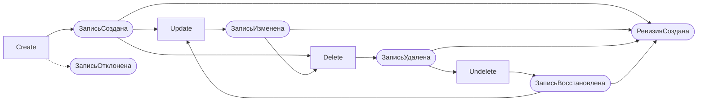

# 040 - Event Storming

> Формат - см. [состав документов](../../../task-tracker/docs/documents-composition.md), документ 040.
> Источник - [системные требования, разделы 4 и 7](../system-requirements.md), [акторы](../block-a-context-and-scope/030.actors.md), [сущности](050.entities.md).

## 1. Обозначения

События записаны в прошедшем времени и означают факты внутри сервиса. Наружу события не публикуются (INT-RM-05); карта нужна, чтобы выделить агрегаты, команды и правила. Каталог внешних событий пуст, см. [135](../block-g-api-and-events/135.event-catalog.md).

Агрегатов два: **Справочник** (коллекция со схемой записи, меняется только новой версией сервиса) и **Запись справочника** (ресурс, меняется через API). **Ревизия** - след команды над записью, не агрегат.

## 2. Процесс "Реализация справочника"

| № | Команда | Актор | Агрегат | Событие | Политика или реакция |
| --- | --- | --- | --- | --- | --- |
| 1 | Зафиксировать состав справочников | Команда справочников | - | СоставСправочниковЗафиксирован | Один раз перед реализацией; перечень в разделе 9.2 требований |
| 2 | Уточнить поля и начальные данные справочника | H-04 Инженер | Справочник | СхемаСправочникаСогласована | С командой-потребителем, по BR-RM-08 |
| 3 | Реализовать справочник | H-04 Инженер | Справочник | СправочникДобавленВКод | Хранилище, коллекция и методы, схема в спецификации, тесты; ревью CODEOWNERS |
| 4 | Развернуть новую версию | S-04 Infra | Справочник | СправочникДоступенВAPI | Задание схемы до запуска; `/ready` 200 |
| 5 | Добавить поле | H-04 Инженер | Справочник | ПолеДобавлено | Только необязательное или со значением по умолчанию (FR-RM-36, BR-RM-06) |

```mermaid
flowchart LR
    C1["Зафиксировать состав"] --> E1(["СоставСправочниковЗафиксирован"])
    E1 --> C2["Уточнить поля и данные"]
    C2 --> E2(["СхемаСправочникаСогласована"])
    E2 --> C3["Реализовать справочник"]
    C3 --> E3(["СправочникДобавленВКод"])
    E3 --> C4["Развернуть"]
    C4 --> E4(["СправочникДоступенВAPI"])
```

## 3. Процесс "Ведение записи"

| № | Команда | Актор | Агрегат | Событие | Политика или реакция |
| --- | --- | --- | --- | --- | --- |
| 1 | Create | H-01 Администратор | Запись | ЗаписьСоздана | Состояние ACTIVE; идентификатор уникален, включая удалённые (FR-RM-05); ревизия "создание" |
| 1a | Create с недопустимыми полями | H-01 | Запись | ЗаписьОтклонена | INVALID_ARGUMENT с перечнем полей; ничего не сохранено (FR-RM-35) |
| 1b | Create с занятым идентификатором | H-01 | Запись | ЗаписьОтклонена | ALREADY_EXISTS; подсказка восстановить удалённую (BR-RM-03) |
| 2 | Update | H-01 | Запись | ЗаписьИзменена | Только поля из `update_mask`; `etag` меняется; ревизия "изменение" (FR-RM-07, FR-RM-14) |
| 2a | Update поля только для чтения | H-01 | Запись | ИзменениеОтклонено | INVALID_ARGUMENT для `name`, `state`, `etag`, `delete_time` |
| 2b | Update с устаревшим `etag` (срез 2) | H-01 | Запись | ИзменениеОтклонено | ABORTED (FR-RM-24) |
| 3 | Delete | H-01 | Запись | ЗаписьУдалена | Состояние DELETED, `delete_time`, запись возвращается в ответе; ревизия "удаление" (FR-RM-10) |
| 3a | Delete уже удалённой | H-01 | Запись | УдалениеОтклонено | FAILED_PRECONDITION |
| 4 | Undelete | H-01 | Запись | ЗаписьВосстановлена | Состояние ACTIVE, `delete_time` очищен; ревизия "восстановление" (FR-RM-12) |
| 4a | Undelete неудалённой | H-01 | Запись | ВосстановлениеОтклонено | FAILED_PRECONDITION |
| 5 | Update удалённой записи | H-01 | Запись | ИзменениеОтклонено | FAILED_PRECONDITION до восстановления (FR-RM-11) |

Каждое из событий ЗаписьСоздана, ЗаписьИзменена, ЗаписьУдалена, ЗаписьВосстановлена в той же транзакции порождает ревизию в истории справочника (FR-RM-44, BR-RM-12); отклонённые команды следа не оставляют.

```mermaid
flowchart LR
    C1["Create"] --> E1(["ЗаписьСоздана"])
    C1 -.-> X1(["ЗаписьОтклонена"])
    E1 --> C2["Update"]
    C2 --> E2(["ЗаписьИзменена"])
    E1 --> C3["Delete"]
    E2 --> C3
    C3 --> E3(["ЗаписьУдалена"])
    E3 --> C4["Undelete"]
    C4 --> E4(["ЗаписьВосстановлена"])
    E4 --> C2
    E1 & E2 & E3 & E4 --> R(["РевизияСоздана"])
```

## 4. Процесс "Чтение, история, выгрузка"

| № | Команда | Актор | Агрегат | Событие | Политика или реакция |
| --- | --- | --- | --- | --- | --- |
| 1 | Get | H-02, S-01 | Запись | ЗаписьПрочитана | Удалённые тоже возвращаются (FR-RM-06) |
| 2 | List | H-02, S-01 | Справочник | СписокПрочитан | По умолчанию только ACTIVE; `filter`, `order_by`, страницы, `total_size` (FR-RM-08) |
| 3 | ListRevisions | H-02, S-01 | Запись | ИсторияПрочитана | Ревизии от новой к старой (FR-RM-46) |
| 4 | Get на ревизию | H-02, S-01 | Запись | СостояниеНаРевизиюПрочитано | Восстановлено по цепочке ревизий (FR-RM-47) |
| 5 | List с `Accept` `.xlsx` | H-02 | Справочник | ВыгрузкаСформирована | Те же параметры, весь отбор (FR-RM-40..42) |
| 5a | Выгрузка сверх предела | H-02 | Справочник | ВыгрузкаОтклонена | FAILED_PRECONDITION с указанием предела (FR-RM-43) |

## 5. Процесс "Защита и эксплуатация"

| № | Команда | Актор | Событие | Политика или реакция |
| --- | --- | --- | --- | --- |
| 1 | Запрос без токена или с недействительным (срез 2) | любой | ЗапросОтклонён | UNAUTHENTICATED (FR-RM-21) |
| 2 | Запрос без нужного уровня доступа (срез 2) | любой | ЗапросОтклонён | PERMISSION_DENIED (FR-RM-23) |
| 3 | Проверить готовность | S-04 Infra | ГотовностьПодтверждена или ГотовностьОтклонена | 200 при доступном хранилище и актуальной схеме, иначе 503 (FR-RM-31) |
| 4 | Применить изменения схемы | S-04 Infra | СхемаОбновлена | Задание завершается до запуска приложения (NFR-RM-21) |

## 6. Итоги для модели

- Запись справочника - единственный агрегат, изменяемый в рантайме; все её команды проходят через сервисный слой в одной транзакции вместе с ревизией (BR-RM-10).
- Справочник меняется только новой версией сервиса; в рантайме он неизменяем и не имеет команд API (FR-RM-38).
- Ревизия - след команды, только добавляется, хранится в истории своего справочника.
- Внешних событий нет по решению; потребители перечитывают данные по API.
